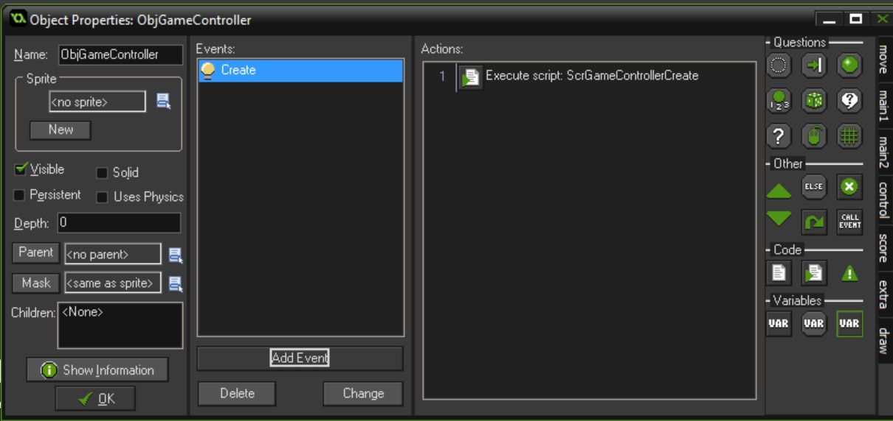

# Frogger
We will be making the classic arcade game **Frogger**


## Index
1. [Get Frog Appearing](#get_frog_appearing)
2. [Move Frog Up and Down](Frogger_2.html#move_frog_up_and_down)
3. [Restrict Movement to Screen](Frogger_3.html#restrict_movement_to_screen)
4. [First Background Layer](Frogger_3.html#first_background_layer)
5. [First Row of Enemy Obstacles](Frogger_4.html#first_row_of_enemy_obstacles)
6. [Lives](Frogger_5.html#lives)
7. [Second Row of Cars](Frogger_6.html#second_row_of_cars)

### Get Frog Appearing

1. We are going to start by loading the frog animations from a sprite sheet.  To do this we need to create a new **Sprite** and call it **SprPlayerUpDown**.  Press the **Edit Sprite** button and click on the **File Menu** then select the **Create from Strip** drop down menu item.


<br />

{:start="2"}
2.  Find the Sprite Sheet you downloaded that I provded called **Frogger** and we don't want to import the purple background.  Make sure you click the **Remove Background** checkbox then press the **Open** button.


<br />

{:start="3"}
3. This brings up the **Loading Strip Image** menu.  This allows us to select multiple frames. Set **image_width** and **image_height** to `64` x `64`.  Set the **number_of_images** and **images_per_row** to `3`.  You should now see the three frames of the frog moving up selected.  Once they are press the **OK** button. 


<br />

<br />


<br />

{:start="4"}
4. Create a new **sprite** and call it `SprPlayerLeftRight` and repeat the same step except change the settings on the **loading strip** menu except move the sprite starting point over by 3 by adjusting the **horizontal cell offset** to `3`.


<br />


<br />

{:start="5"}
5.  Lets create a new **Room** and call it **RmLvl1** and on the **settings** tab set the **Width** to `960` and the **Height** to `1024`.


<br />

{:start="6"}
6.  Now go to the **background** tab and select black as the color.


<br />

{:start="7"}
7.  Let's create a new **Game Object** to control the game flow.  We will call it `ObjGameController'.  


<br />

{:start="8"}
8.  Create a new **Script** called `ScrGameControllerCreate` and add a player to the room on the bottom center 64 x 64 square space:

```c
instance_create(448, 992, ObjPlayer);
```

<br />

{:start="9"}
9.  Bind it to a **Create** event on **ObjGameControlle**.

<br />

{:start="10"}
10.  Double click **RmLvl1** to open it and go to the **Objects** tab.  Select the **ObjGameController** and put one instance in the room.


<br />

{:start="11"}
11.  Now run the game and the player frog should appear in the bottom center and animate like crazy.


<br />

{:start="12"}
12.  Create an **ObjPlayerCreate** script and add the following code. Bind the script to a **Create** event on **ObjPlayer**:

``` c
//start player on the last frame (remember starts counting at 0)
image_index = 2;

//turn off animation
image_speed = 0;
```  


<br />
&nbsp;&nbsp;&nbsp;[Home](../../index.html)&nbsp;&nbsp;&nbsp; [Continue ->](Frogger_2.html)
<br />  
<br />  
<br />  
<br />  