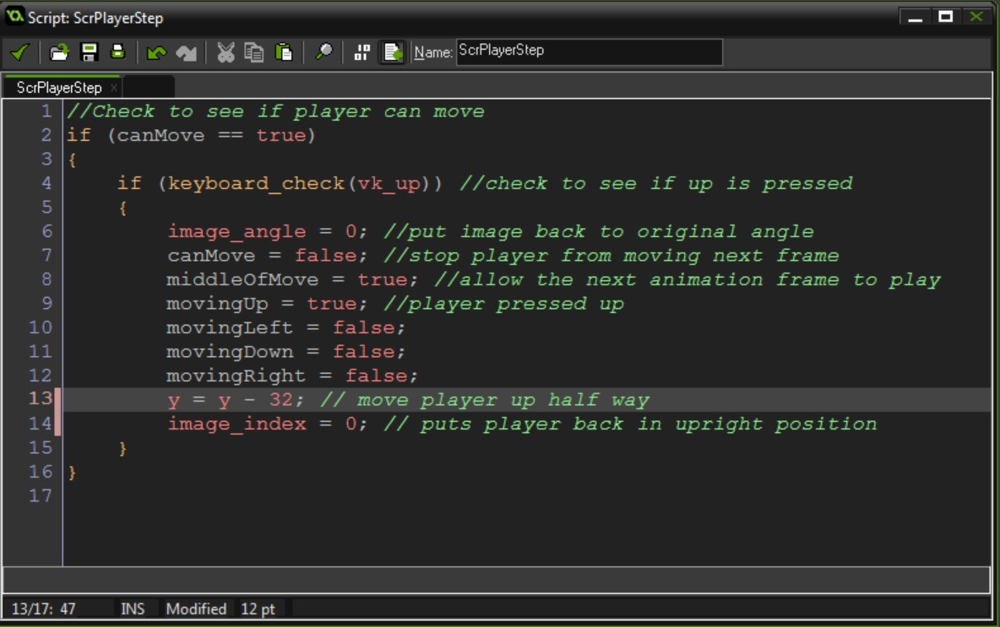
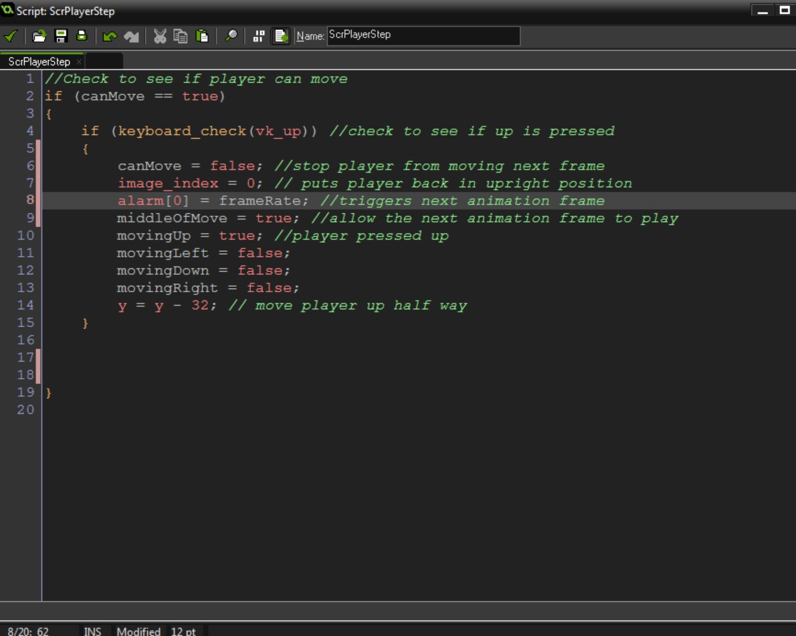
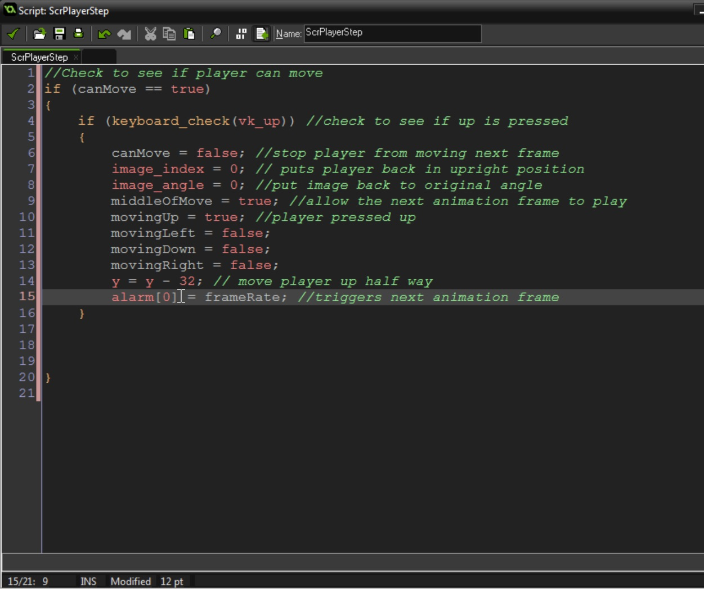
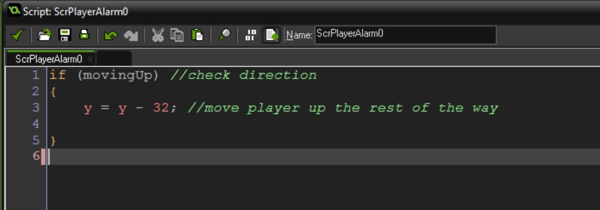
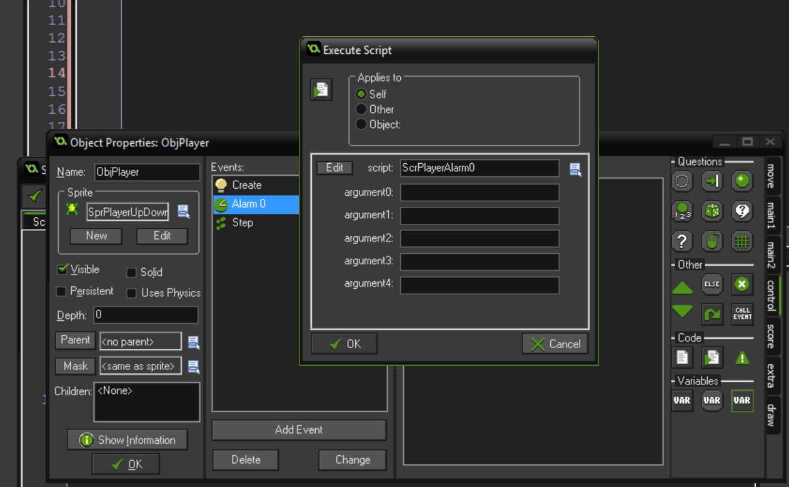
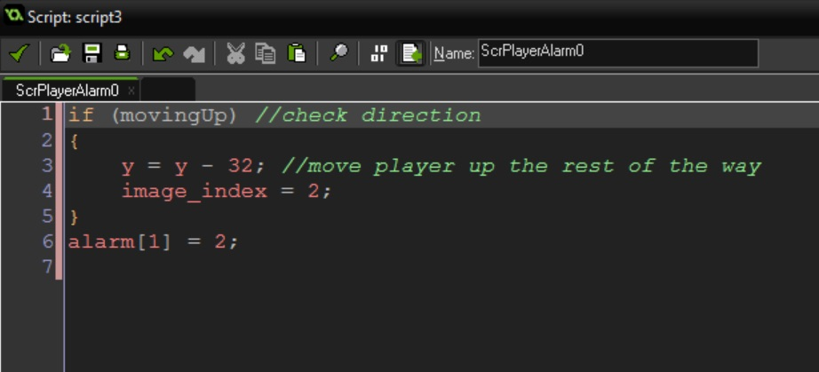
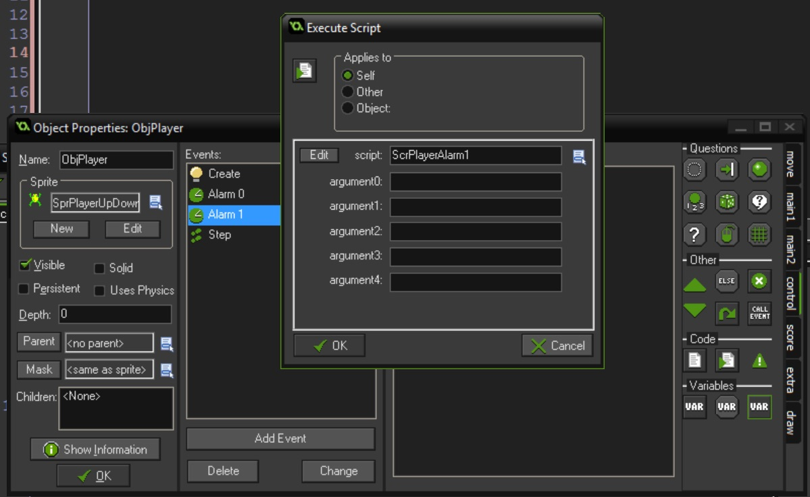
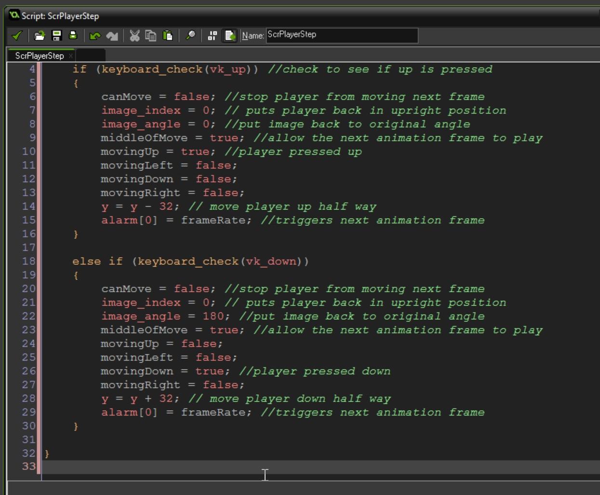
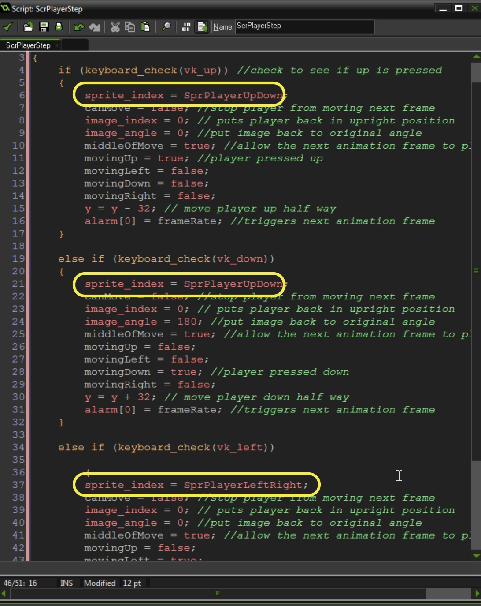
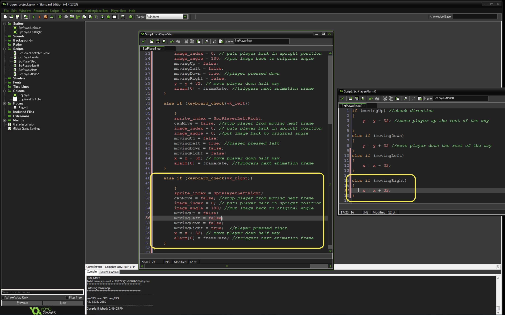

### Move Frog Up and Down

1.  So the in the arcade game we will move up 32 pixels, play an animation then move 32 pixels then go back to our first frame.  We cannot change our mind and move again in the middle.  So we can only move 15 blocks along the `x` axis and 16 blocks along the `y` axis.  Lets adde a switch for player control called `canMove`.  

We also want to know whether a player is moving up, down, left or right so we will add 4 variables for that.  Finally, we want to adjust the framerate of the player to adjust its speed and we will create a `frameRate` variable and set it to `3`.

Open **ScrPlayerCreate** and add to bottom:

``` c
//boolean to determine if player can be moved
canMove = true;

//booleans to determine direction moving
movingUp = false;
movingDown = false;
movingLeft = false;
movingRight = false;

//number of frames animation holds
frameRate = 3;
```


<br />

{:start="2"}
2. We need check to see if the **up arrow** is pressed.  If it is, set image_angle to 0 (base position), then set `canMove` to false. We set the correct `true` and `falses` based on the direction, then we move the player along the `y` axis.  Then we switch to the image index of hte frog animation frame.

After this we deal with the middle of the move.

``` c
//Check to see if player can move
if (canMove == true)
{
    if (keyboard_check(vk_up)) //check to see if up is pressed
    {
        canMove = false; //stop player from moving next frame
        image_index = 0; // puts player back in upright position
        image_angle = 0; //put image back to original angle
        middleOfMove = true; //allow the next animation frame to play
        movingUp = true; //player pressed up
        movingLeft = false;
        movingDown = false;
        movingRight = false;
        y = y - 32; // move player up half way
    }
}


```



<br />

{:start="3"}
3.  Now this doesn't do to much.  The player moves up half a step and is stuck.  Let's trigger the next state of animation with an **Alarm**.

``` c
//Check to see if player can move
if (canMove == true)
{
    if (keyboard_check(vk_up)) //check to see if up is pressed
    {
        canMove = false; //stop player from moving next frame
        image_index = 0; // puts player back in upright position
        image_angle = 0; //put image back to original angle
        middleOfMove = true; //allow the next animation frame to play
        movingUp = true; //player pressed up
        movingLeft = false;
        movingDown = false;
        movingRight = false;
        y = y - 32; // move player up half way
        alarm[0] = frameRate; //triggers next animation frame
    }
}


```


<br />

{:start="4"}
4. Create a new **Script** called `ScrPlayerAlarm0` and add:

``` c
if (movingUp) //check direction
{
    y = y - 32; //move player up the rest of the way

}
```

<br />

{:start="5"}
5.  Bind this to an **Alarm 0** event on `ObjPlayer`.


<br />

{:start="6"}
6.  Again this moves it up a bit more and doesn't do much on it's own.  Add `alarm[1] = framerate` to the bottom of `ScrPlayerAlarm01.  Then Add a new **Script** called `ScrPlayerAlarm1` with:

```c
image_index = 2;
alarm[2]= frameRate;
```

<br />

{:start="7"}
7. Bind this to `ObjPlayer` to a **Alarm1** event.


<br />

{:start="2"}
8. Now create a new **Script** called `ScrPlayerAlarm2` and add then bind to an **alarm2** event:

``` c
canMove = true; //player can move again next frame
```

9.  Now the player can move up.  Lets repeat this for the other three directions.  Edit `ScrPlayerStep` and add:

``` c
//Check to see if player can move
if (canMove == true)
{
    if (keyboard_check(vk_up)) //check to see if up is pressed
    {
        canMove = false; //stop player from moving next frame
        image_index = 0; // puts player back in upright position
        image_angle = 0; //put image back to original angle
        middleOfMove = true; //allow the next animation frame to play
        movingUp = true; //player pressed up
        movingLeft = false;
        movingDown = false;
        movingRight = false;
        y = y - 32; // move player up half way
        alarm[0] = frameRate; //triggers next animation frame
    }
    
    else if (keyboard_check(vk_down))
    {
        canMove = false; //stop player from moving next frame
        image_index = 0; // puts player back in upright position
        image_angle = 180; //put image back to original angle
        middleOfMove = true; //allow the next animation frame to play
        movingUp = false; 
        movingLeft = false;
        movingDown = true; //player pressed down
        movingRight = false;
        y = y + 32; // move player down half way
        alarm[0] = frameRate; //triggers next animation frame
    }

}
```

<br />


10.  Edit 'ScrPlayerAlarm0' and add:

``` c
if (movingUp) //check direction
{
    y = y - 32; //move player up the rest of the way

}
else if (movingDown)
{
    y = y + 32 //move player down the rest of the way
}

alarm[1] = frameRate;
```

{:start="11"}
11.  Now lets move left.  Woops this is on a different sprite.  OK, lets add a sprite change to both scripts and add a left check at the bottom that has:

``` c
    else if (keyboard_check(vk_left))
    
        {
        sprite_index = SprPlayerLeftRight;
        canMove = false; //stop player from moving next frame
        image_index = 0; // puts player back in upright position
        image_angle = 0; //put image back to original angle
        middleOfMove = true; //allow the next animation frame to play
        movingUp = false; 
        movingLeft = true;
        movingDown = false; //player pressed down
        movingRight = false;
        x = x - 32; // move player down half way
        alarm[0] = frameRate; //triggers next animation frame
    }
```

<br />

{:start="12"}
12.  Then add to `ScrPlayerAlarm0`
``` c
else if (movingLeft)
{
    x = x - 32;
}
```

{:start="13"}
13.  Lets add moving right:


<br />

Next up, we will restrict movement to on screen.

<br />

[<- Previous](Frogger_1.html) &nbsp;&nbsp;&nbsp;[Home](../../index.html)&nbsp;&nbsp;&nbsp;  [Continue ->](Frogger_3.html)
<br />  
<br />  
<br />  

