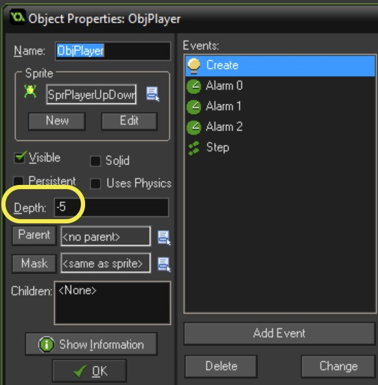

### Restrict Movement to Screen

1.  We need to make sure the frog does not leave the screen.  We will add checks for the four boundaries when checking the controller.  Remember since the sprite is centered we need to adjust the position by 32 pixels to account for the center.


<br />

{:start="2"}
2.  Test the game. All should be good.  Now lets do the same thing for the bottom of the screen. We are going to use the size of room variable `room_height` and subtract `32`.


<br />

{:start="3"}
3.  Do the same for left and right along the x axis.  


<br />
 
 {:start="4"}
 4.  On mine it doesn't work.  I calculated the center without taking into account the centering of the sprite.  Open `ScrPlayerCreate` and change the `x` position to `416`.


<br />

### First Background Layer

1.  Lets create our first layer of background at the bottom where the player starts.  Lets create a new sprite called `SprStartingGround`.  Hit the **Edit Sprite** button then press **File | Create From Script**.  Then adjust the settings:


<br />

{:start="2"}
2. Create a new **Object** and call it `ObjStartingGround` and attach the above **Sprte** to it.


<br />

{:start="3"}
3.  Now open up the room and select the **Object** tab and add the `ObjStartingGround` to the third from bottom row (adjust the **SnapX** and **SnapY** to `64`.  It should look like:


<br />

{:start="4"}
4.  Run the game.  Does your frog show up on top of the ground?  If it doesn't then adjust it's depth.  Open `ObjPlayer` and adjust the **Depth** to `-5`.


<br />

### First Row of Enemy Obstacles

1.  Lets create a new **Sprite** and call it `SprEnemyCar1`.  Hit the **Edit Sprite** button and download a new sprite cel.  


<br />

{:start="2"}
2. Lets make an **Object** for it called `ObjEnemyCar1`

{:start="3"}
3.  Lets now edit the `ScrGameManagerCreate` script and spawn three cars along that first row:

``` c
instance_create(416, 992, ObjPlayer);

//Create first row of enemies
instance_create(288, 896, ObjEnemyCar1);
instance_create(608, 896, ObjEnemyCar1);
instance_create(924, 896, ObjEnemyCar1);
```

<br />

{:start="4"}
4.  OK that spawns them but they don't move.  Create a new script called `ScrEnemyCar1Create` and add:

``` c
hspeed = -1;
```

{:start="5"}
5.  Bind it to the **Create Event** of `ObjEnemyCar1`.

{:start="6"}
6.  OK the car moves but they never repeat as in the original game.  Create a new script and call it `ScrEnemyCar1Step` and add and bind to a **step event** on `ObjEnemyCar1`:

```c
//When off screen move back to the right hand side and loop
if (x < -64)
{
    x = room_width + 96;
}   
```

{:start="7"}
7.  OK, test it and it should work nicely.  OK, now what about the car colliding with the frog and killing it?  That's next...

<br />

[<- Previous](Frogger_2.html) &nbsp;&nbsp;&nbsp;[Home](../../index.html)&nbsp;&nbsp;&nbsp;  [Continue ->](Frogger_4.html)
<br />  
<br />  
<br />  


