### First Row of Enemy Obstacles

1.  Now we all collisions have the same result, the poor frog dies.  So we want to check collisions with all objects that are enemies regardless of the specific type.  So we need to parent an enemy type so we can simplyfy things.  Create a new Object and call it `ObjEnemyParent`.

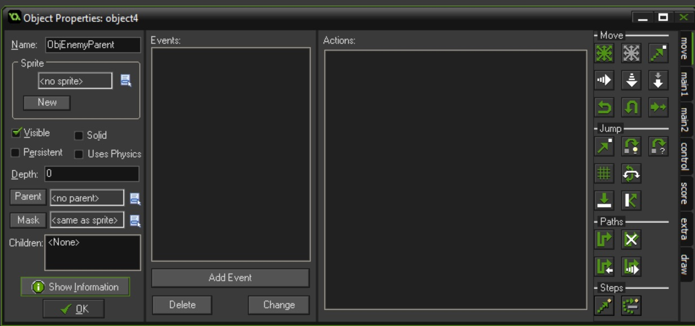
<br />

{:start="2"}
2.  Now lets double click `ObjEnemyCar1` and make its parent `ObjEnemyParent`

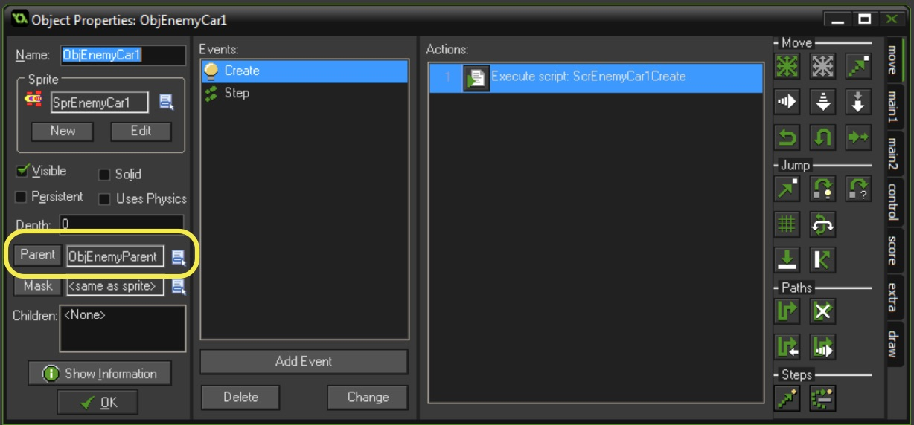
<br />

{:start="2"}
2. OK, now we don't want to kill the player when it is in animation state and not in user control, so we will create a collision script and check to make sure the player is in active state, then print a message saying player should die. Create a new **Script** called `ScrPlayerEnemyCollision` and add:

``` c
if (canMove == true)
{
    show_debug_message("Player Shoudl Die");
}
```

{:start="3"}
3.  Now bind this script to a **Collision** event colliding with `ObjCollisionParent`:

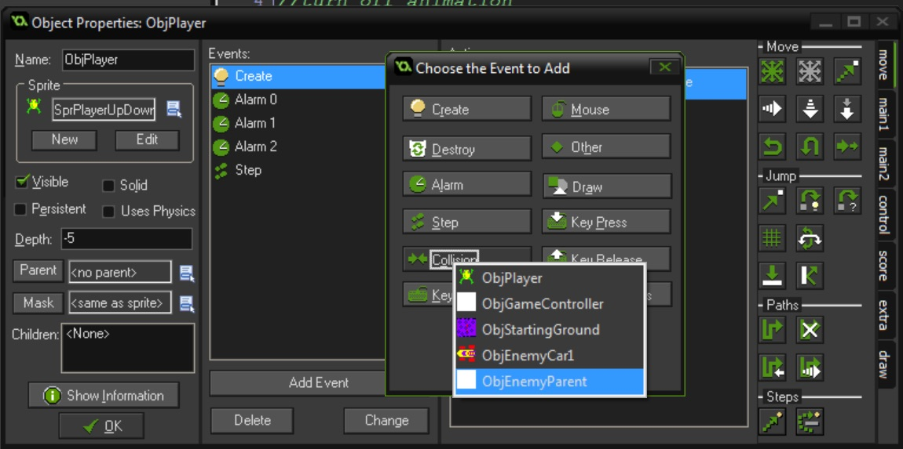
<br />

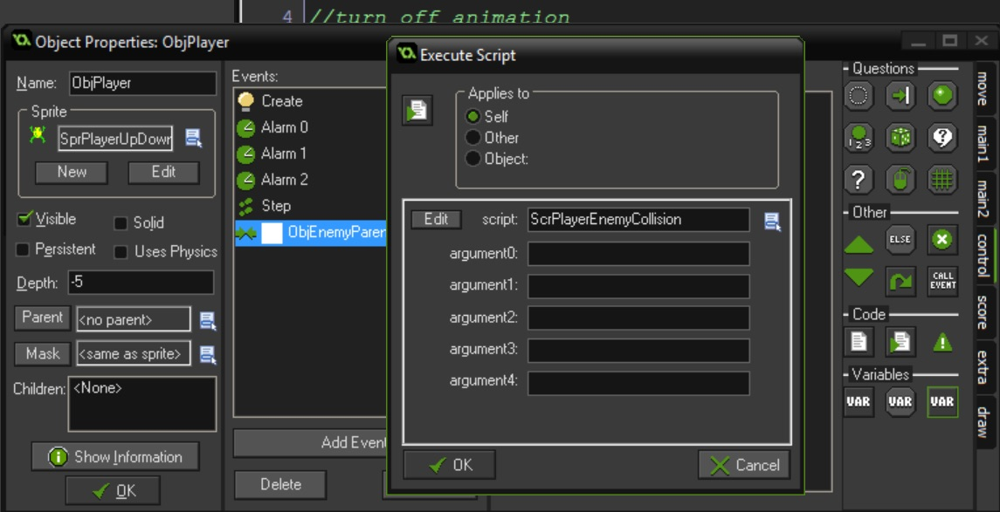
<br />

{:start="4"}
4.  Play the game and run into the first row of cars. You should see a message in the debug window:

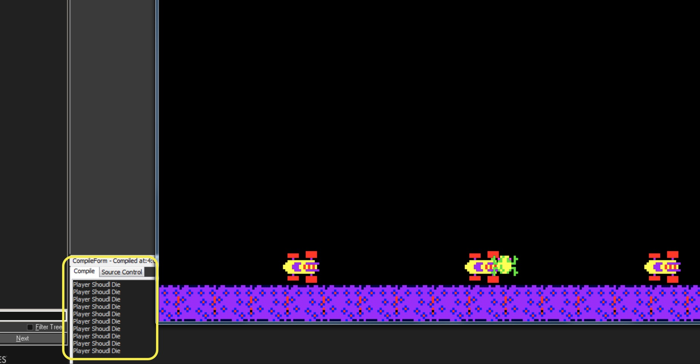
<br />

{:start="5"}
5.  OK, lets send the player into a death state.  Create a new **Sprite** and call it `SprPlayerDeathLand` and import the 7 frames of both water and death animation.  Delete the water animations and only have the land blow up ending with the skeleton. Don't forget to center the sprite.

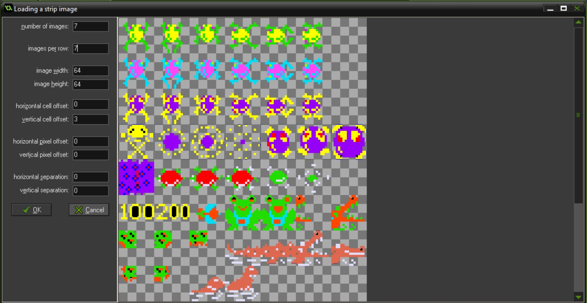
<br />

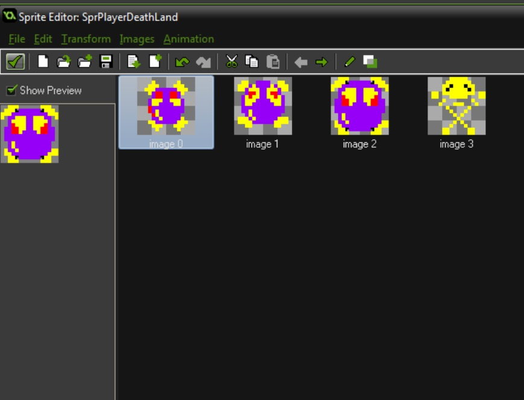
<br />

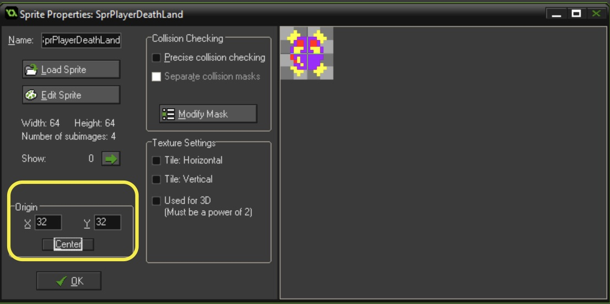
<br />


{:start="6"}
6. Create an **Object** and call it `ObjPlayerDeathLand` and attach the above **Sprite** to it:

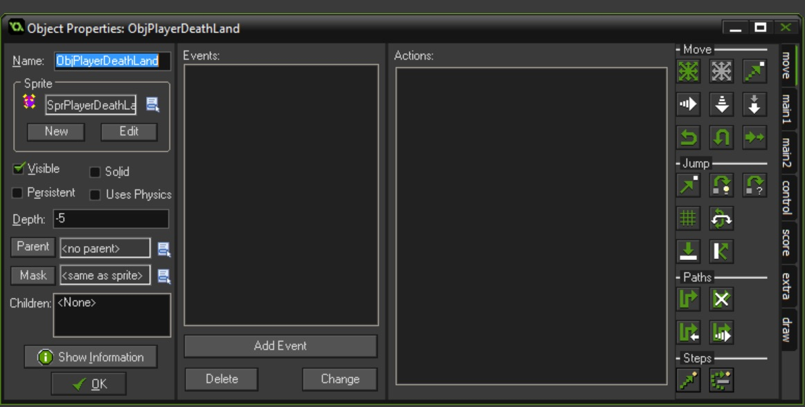
<br />

{:start="6"}
6. Now we need to trigger the logic to change to the death object.  Open the `ScrPlayerEnemyCollision` and change it to:

```c
if (canMove == true)
{
   // show_debug_message("Player Shoudl Die");
   instance_change(ObjPlayerDeath, true);
}
```

{:start="7"}
7.  Now play it but the animation is frozen.  The `image_speed = 0` is remembered.  Make a `ScrPlayerDeathCreate` and :

```c
if (canMove == true)
{
   // show_debug_message("Player Shoudl Die");
   instance_change(ObjPlayerDeath, true);
}
```

{:start="8"}
8.  Bind it to `ObjPlayerDeathLand` to a **create event** and change the **depth** to -5.

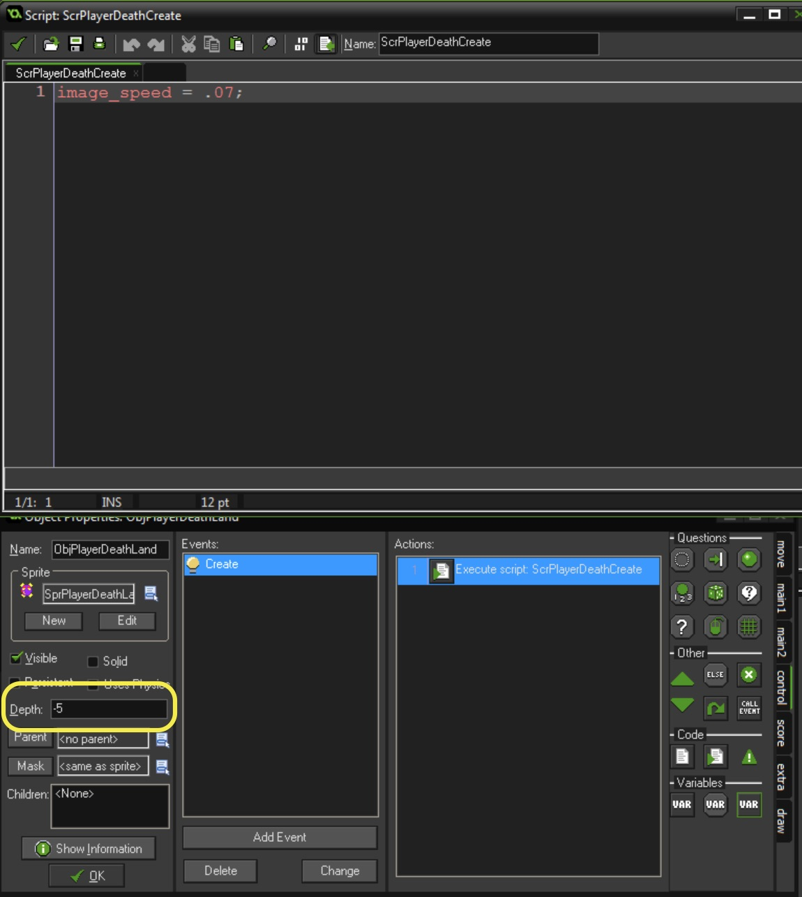
<br />

{:start="9"}
9.  Now it plays over and over again.  We need to play it only once.  This time we will look at a new event type called **Animation End**.  Create a new **Script** called `ScrPlayerDeathAnimationEnd` and add:

```c
instance_destroy();
```

{:start="10"}
10. Bind this to **Event | Other | Animation End**.


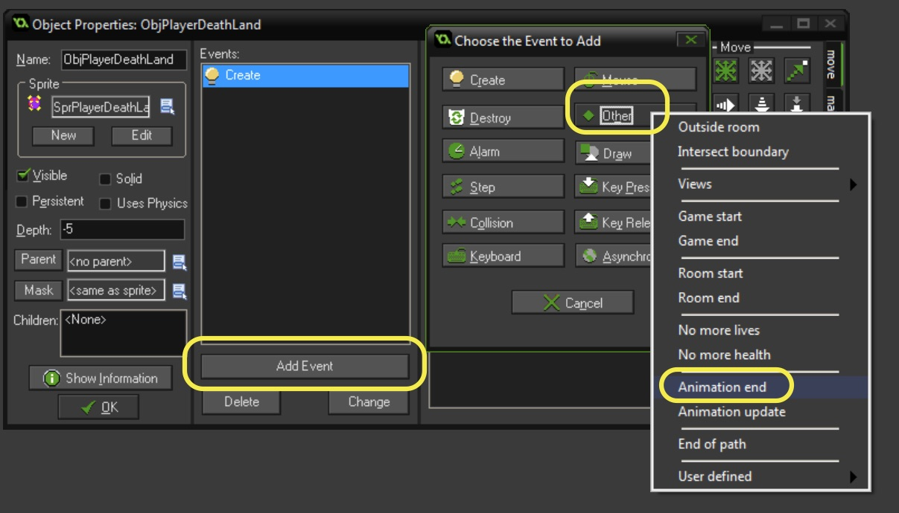
<br />

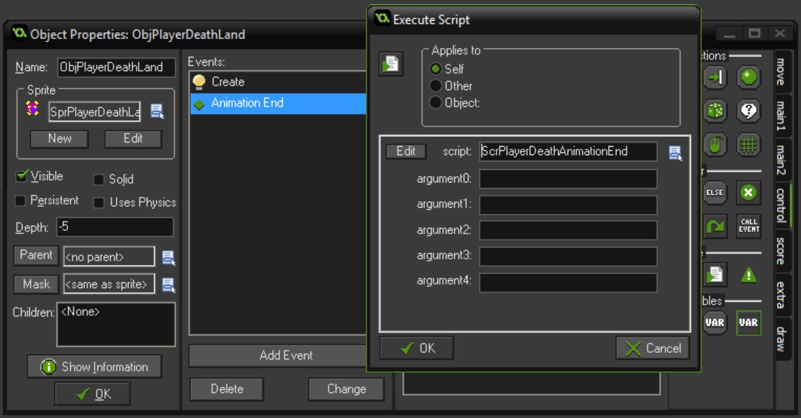
<br />

<br />


[<- Previous](Frogger_3.html) &nbsp;&nbsp;&nbsp;[Home](../../index.html)&nbsp;&nbsp;&nbsp;  [Continue ->](Frogger_5.html)
<br />  
<br />  
<br />  