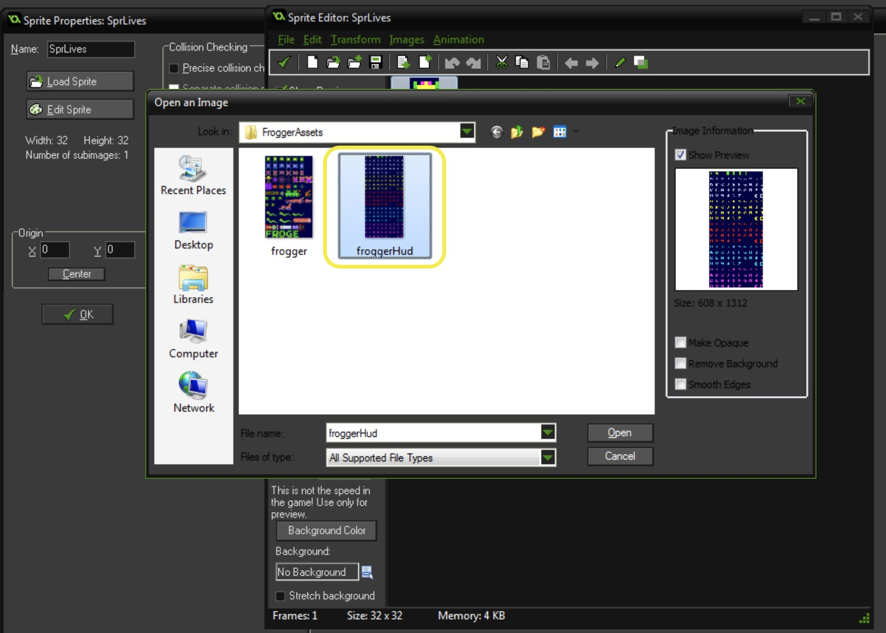

### Lives

1.  Now that we have players dying, we need to keep track of lives.  Lets first set our lives.  Open `ScrGameControllerCreate` and add to the bottom:

``` C
//Set lives to full
lives = 3;
```

{:start="2"}
2. Now we want to draw these on the Hud.  Create a new **Sprite** called `SprLives`.  Press **Edit Sprite** then **File | Create from Strip**.


<br />


<br />

{:start="3"}
3.  You should end up with:


<br />

{:start="4"}
4.  Lets draw the lives on the HUD.  Create a new **Script** called `ScrGameControllerDrawGui` and add:

``` c
//Draw Lives
offset = 32;//disesance between sprit

repeat (lives) //repeat the number of lives
{
    draw_sprite(SprLives, 0, 16 + offset, 912);
    offset = offset + 32;
}
```

{:start="5"}
5.  Add it to a **Draw | DrawGUI** event on `ObjGameController`.  Now we are drawing 3 lives:


<br />

{:start="6"}
6.  Cool now it draws 3 lives.  We need to count down the lives when we die.  Go to `SprPlayerAnimationEnd` and add:

``` c
instance_destroy();

with (ObjGameController)
{
    alarm[0] = 10;
}
```


<br />

{:start="7"}
7.  Create a new **Script** called `ScrGameControllerAlarm0` and bind it to `ObjGameController` as an **Alarm 0** event.

``` c
if (lives > 0)
{
    instance_create(416, 864, ObjPlayer);
}
```

{:start="8"}
8. Ok, you now have lives counting down and respawning the game.  But nothing happens at the end.  Lets take the end game screen from the previous project:


<br />


<br />


<br />


<br />


<br />
[<- Previous](Frogger_4.html) &nbsp;&nbsp;&nbsp;[Home](../../index.html)&nbsp;&nbsp;&nbsp;  [Continue ->](Frogger_6.html)
<br />  
<br />  
<br />  

