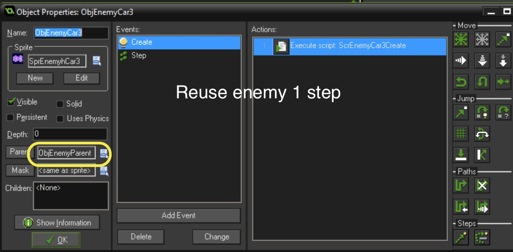

### Second Row of Cars

 

 

 

 

 

 

### Third Row of Cars

 

 

 

 

### Fourth Row of Cars

 

 

 

 

 

 

### Fifth Row of Cars

 

 

 

 

 

### Add Floor to Room as Break Between Land and Water

 

### Add Water Background

 

 

### Add Water Background Death

 

 

 

 

### Change Death Animation For Water

 

 

 

 

 

### First Lilly Pad

 

{:start="2"}
2. Moves at the same speed as the truck so we can reuse the scripts.

 

 

 

 

 

 
[<- Previous](Frogger_5.html) &nbsp;&nbsp;&nbsp;[Home](../../index.html)&nbsp;&nbsp;&nbsp;  [Continue ->](Frogger_7.html)
   
   
   
