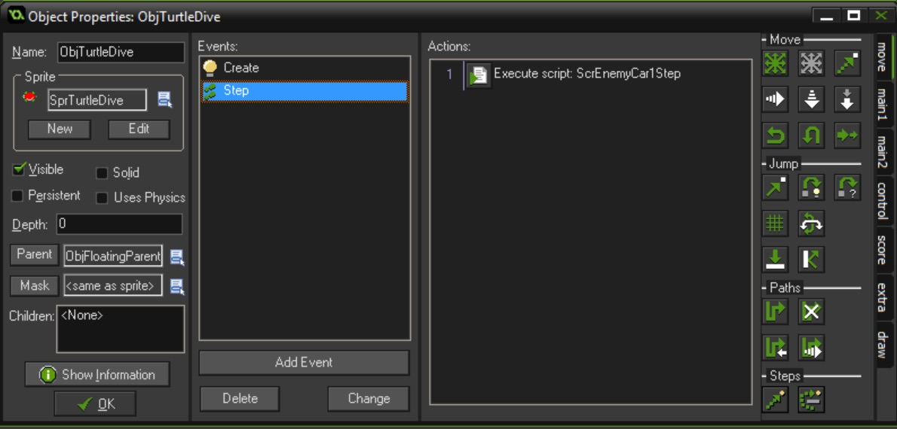

### Making Player Float on Turtles

1.  Right now the player dies instead of animating when on top of the turtles. What we need to do is add a check when colliding to see if the player is floating ona log or turtle.

  

  

  

  

  

  

  

  

  

  

  

  

  

  

  

  

### Kill player going off screen on turtle

  

  

### 3 Log Sprites

  

  

  

  

  

  

  

  

  

  

  

 
[<- Previous](Frogger_5.html) &nbsp;&nbsp;&nbsp;[Home](../../index.html)&nbsp;&nbsp;&nbsp;  [Continue ->](Frogger_7.html)
   
   
   