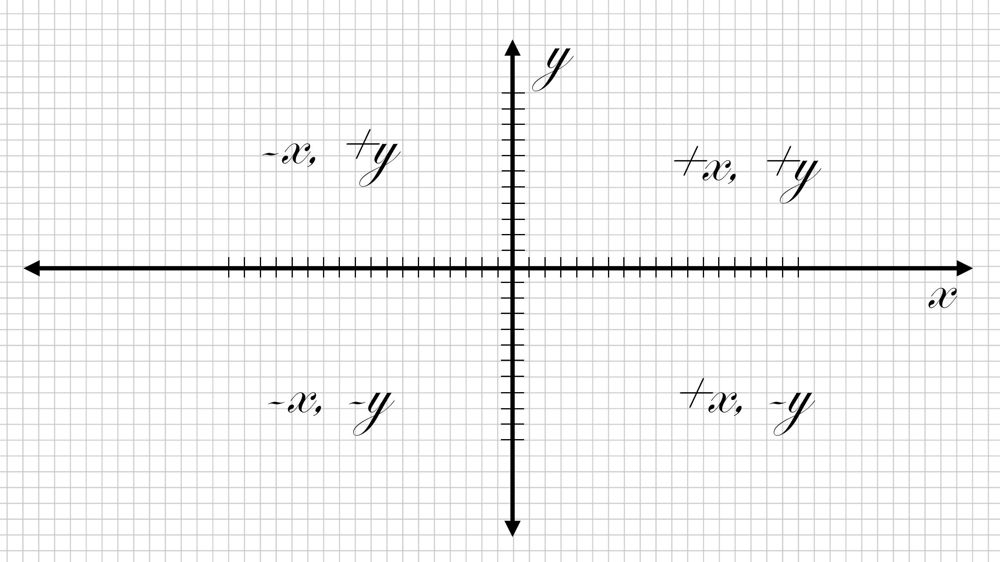
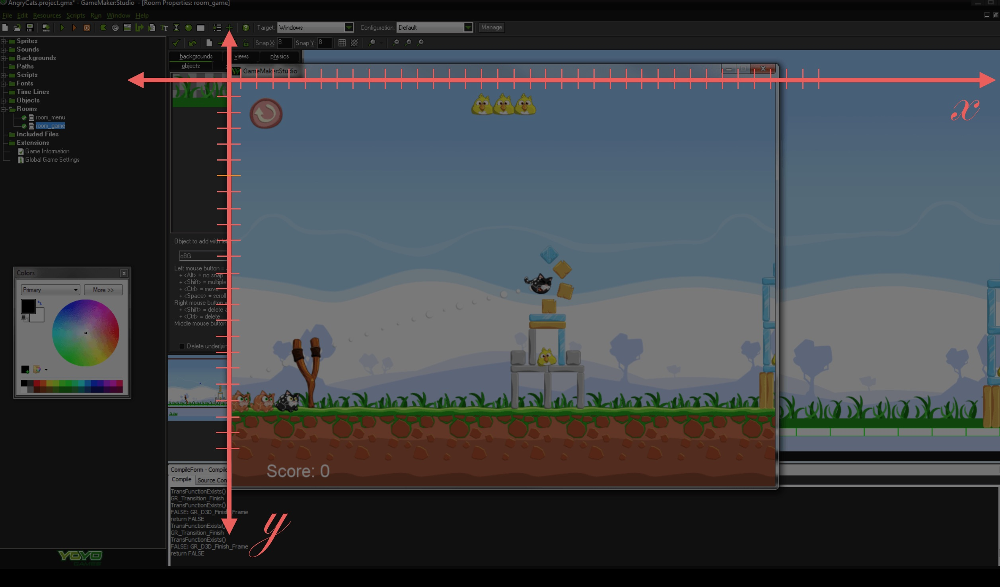
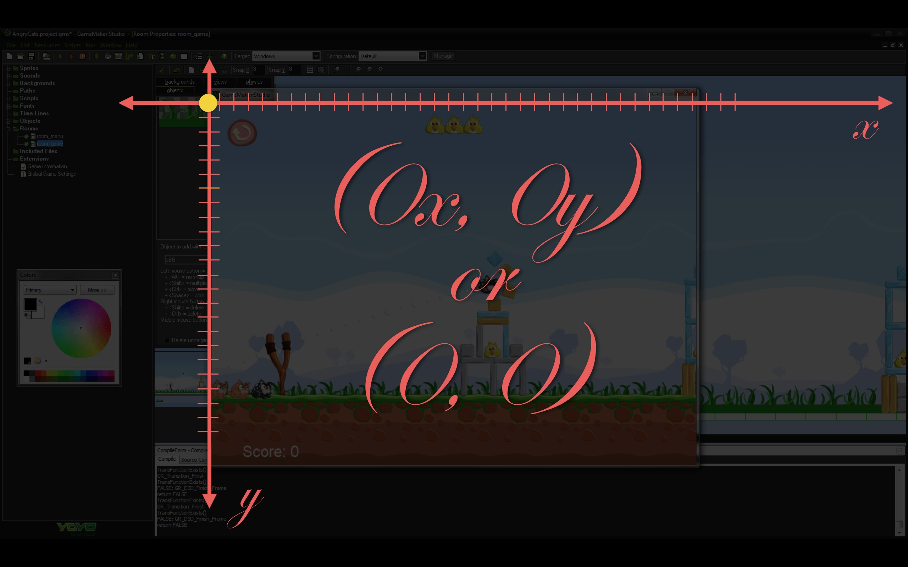
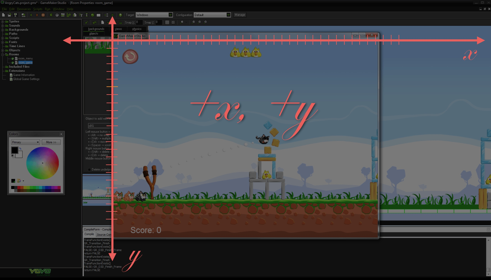

# Cartesian Coordinate System
In **GameMaker**, we move our game objects using mostly two coordinate systems.  The cartesian coordinate system and polar coordinate system.  For more information read the [wikipedia entry on 2 dimensions](https://en.wikipedia.org/wiki/Cartesian_coordinate_system#Two_dimensions).  This is what you probably saw in geometry class:
  
<small>_Showing four quadrants with normal representation of the cartesian coordinate system_</small>  
<br />  
In **GameMaker** the center (0, 0) is at the top left corner of the playing screen:  
  
<br />  
  
<br />  
Also, the Y axis is positive going down and negative going up.  This way an object falling has a positive ``` y ``` value and an object rising has a negative ``` y ``` value.  The game screen is restricted to a single quadrant of ``` x ``` positive, ``` y ``` positive.
 
