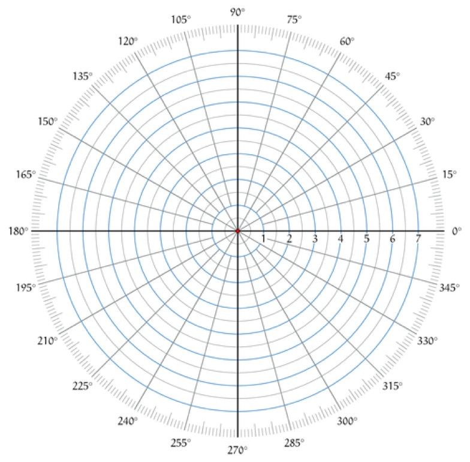

### Moving with the Polar Coordinate System
If we want to move at a specific angle (let's say 10°), it is trickier to figure out how much to move on the x and the y axis of the [cartesian coordinate system](CartesianCoordinateSystem.html) to achieve this exact result.  In Gamemaker you can also use the polar coordinate system  

* The polar coordinate system is like a compas for navigation.  You use it for moving at an angle.  The polar coordinate system uses degrees (it converts to [radians](https://en.wikipedia.org/wiki/Radian) automatically for you), and looks like a compass:    

 

* 0&deg; is towards the right, 90&deg; is towards the top, 180&deg; is towards the left, 270&deg; is towards the bottom.  

* Gamemaker defaults its orientation to 0° so if you do use this system, make sure that the sprite is pointing to the right in its initial orientation.