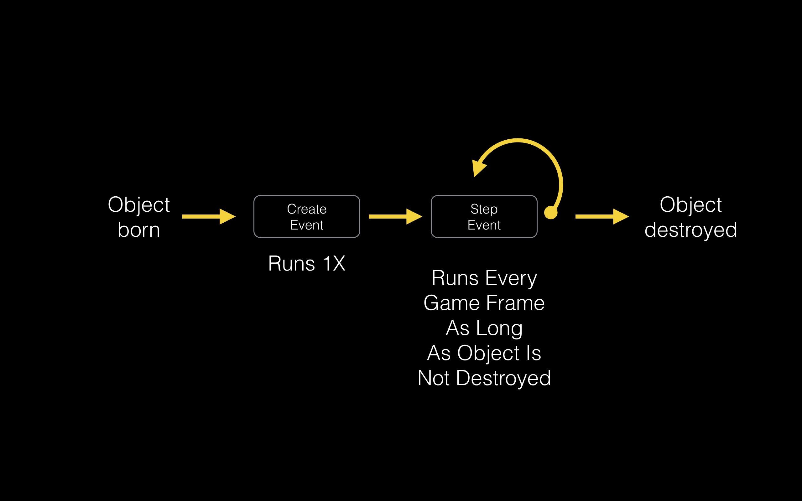

# Create and Step Events

**GameMaker** uses an [event system](https://docs2.yoyogames.com/source/_build/2_interface/1_editors/events/index.html) to run its scripts.  We will take a look at two event types:  
* Create Event
* Step Event  

The _Create Event_ runs only one time when the object is [instantiated](https://en.wikipedia.org/wiki/Instance_(computer_science)) (when it appears in the room).  This could be at the game start if the object is placed in the **Room**; or it could be run once when it is instantiated through code.  

The _Step Event_ is the main game loop.  It runs every frame when the game is running.  The code attached to this event runs **every** frame.  Typically we instantiate [variables](../ProgrammingConcepts/Variables.html) in the Create event and run ai and gameplay in the step event.
     
  