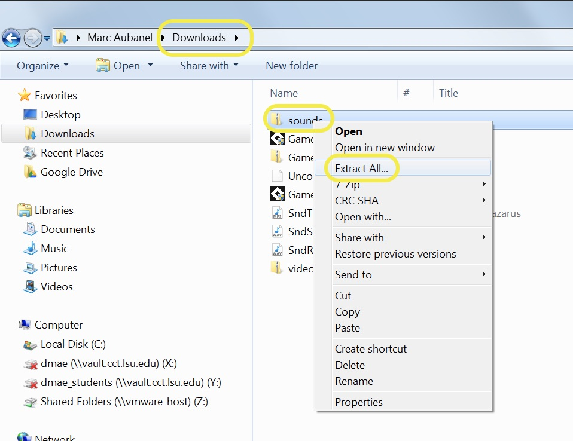
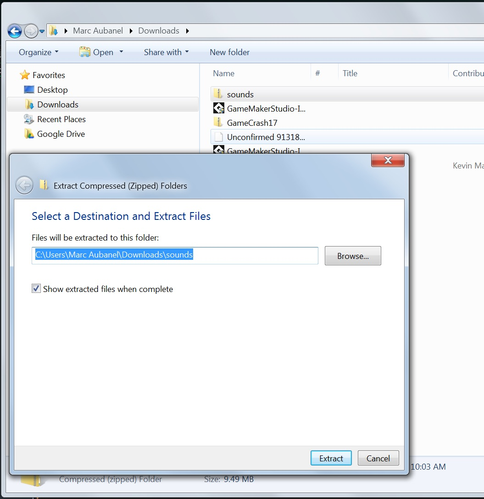
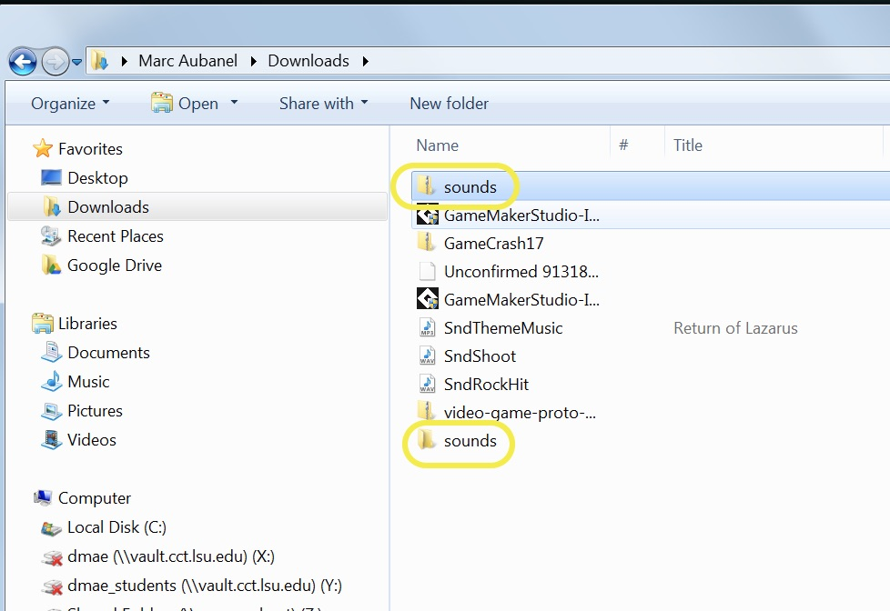
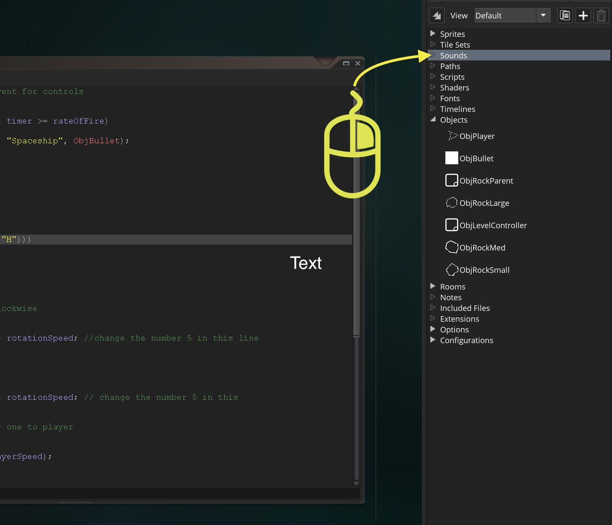
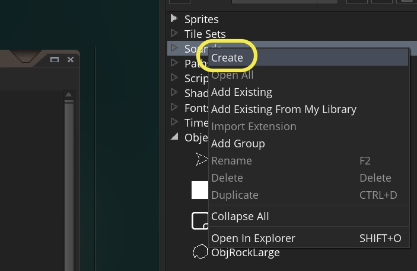
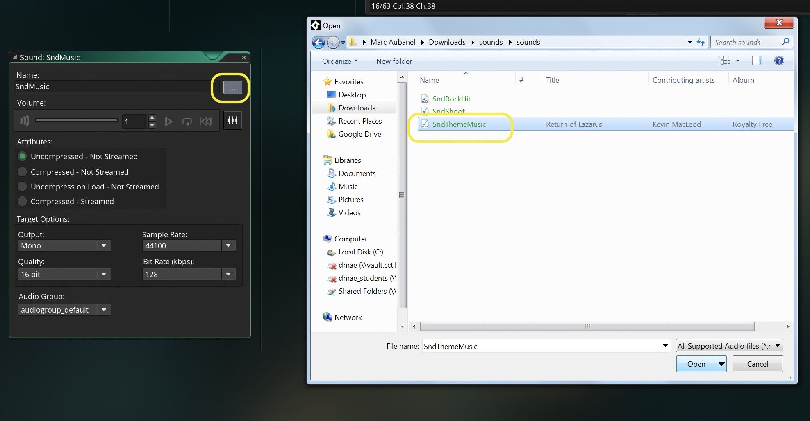
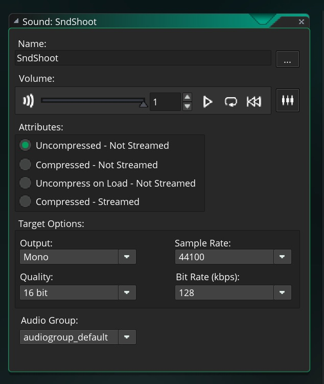
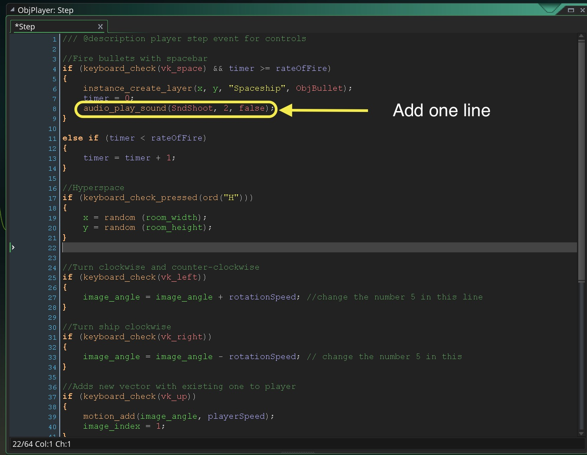
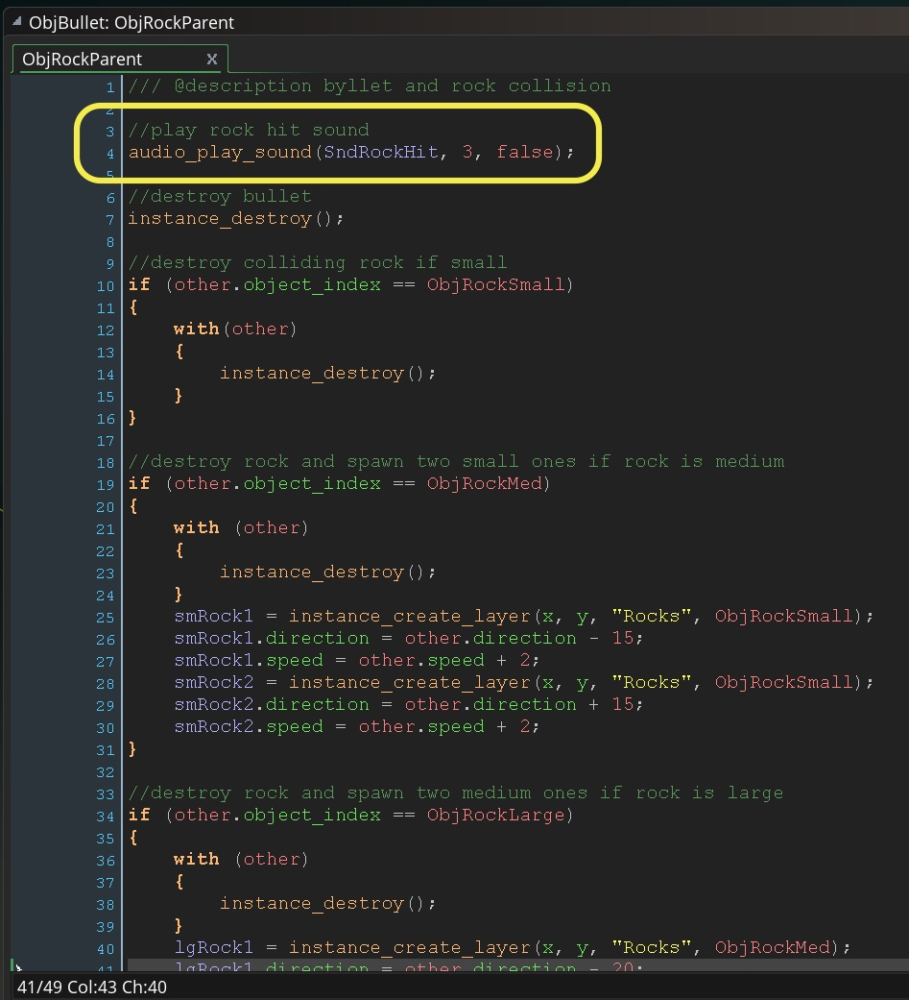

# Extending Space Rocks

## Index  

1. [Add Hyperspace](#add-hyperspace)
2. [Add Audio](#add-audio)
3. [Add Lives](SpaceRocksExtended_2.html#add-lives)
4. [Add Timelines](SpaceRocksExtended_2.html#timelines)

___ 
## Introduction

Ok, we had a good start but it doesn't resemble a level yet.  We should be adding sound, lives and more waves to the game.  We will keep adding to our game:

&#9633;  Add hyperspace feature <br />
&#9633;  Add sounds to the game <br />
&#9633;  Add lives <br />
&#9633;  Level design, escalate difficulty by launching various waves of rocks

___ 
## Add Hyperspace
1.  Open your GameMaker project from SpaceRocks.  If you have not completed this return to [SpaceRocks](../FirstGame/SpaceRocks_1.html) game and finish it.   We want to add a hyperspace button press where the player is respawned in the room.  Let's use the 'H' key for hyperspace.  We need to look at a new function **_random(n)_**:

> random(n);<br>
> **Argument**:  _n_ is the upper range from which the random number will be selected. <br>
> **Returns**: Real number<br><br>
> **Description**: This function is good for probabilities where returning an integer (whole number) is not necessary. For example, random(100) will return a value from 0 to 99, but that value can be 22.56473! You can also use real numbers and not integers in this function like this - random(0.5), which will return a value between 0 and 0.4999999. <br><br>
> NOTE: This function will return the same value every time the game is run afresh due to the fact that GameMaker: Studio generates the same initial random seed every time to make debugging code a far easier task. To avoid this behaviour use randomize() at the start of your game.  - [GameMaker Manual](https://docs2.yoyogames.com/source/_build/3_scripting/4_gml_reference/maths/real%20valued%20functions/random.html)

___ 
<div class = "row">
<div class="col-12 col-lg-4 col align-self-center">
<div markdown = "1"> 
{:start="2"}
2. So we want to randomize the position in the room when you press hyperspace.  We want it to be within the limits of the room.  Open `ObjPlayer` and select the **Step Event** and add after shooting:
</div>
</div>
<div class="col-12 col-lg-8">
<div markdown = "1"> 
```c
//Hyperspace
if (keyboard_check_pressed(ord("H")))
{
	x = random (room_width);
	y = random (room_height);
}
```
</div>
</div>
</div>

___ 
<div class = "row">
<div class="col-12 col-lg-4 col align-self-center">
<div markdown = "1"> 
{:start="3"}
3.  Your game should look like:
</div>
</div>
<div class="col-12 col-lg-8">
<div class="embed-responsive embed-responsive-16by9">
<iframe class = "embed-responsive-item" src="https://www.youtube.com/embed/wMIfvSLzNkI?rel=0&amp;controls=0&amp&showinfo=0&autoplay=1&version=3&loop=1&playlist=wMIfvSLzNkI" frameborder="0" allowfullscreen></iframe>
</div>
</div>
</div>

___ 
## Add Audio
&#9635;  ~~Add hyperspace feature~~ <br />
&#9633;  Add sounds to the game <br />
1. We will add three sounds to the game:  Music, Shooting Sound, and a Rock Hit sound.  Lets start with Music.  Now since our game restarts we have to be careful.  We want to make sure that the music is not starting again having multiple versions of the same song playing at the same time.  So we first need to check if the music is playing, then if it isn't start the music.   

___ 
<div markdown = "1"> 
{:start="2"}
2. Lets start by downloading the audio files.  They can be found on the [here](sounds.zip).  This should put it in your downloads folder as a zipped file (a zipper on the folder).  Right click and select **Extract All** and select where you want to save it.  Now you should have a compressed and uncompressed folder:
</div>

<div class = "row">
<div class="col-lg-4">

</div>
<div class="col-lg-4">

</div>
<div class="col-lg-4">

</div>
</div>

___ 
<div class = "row">
<div class="col-12 col-lg-4 col align-self-center">
<div markdown = "1"> 
{:start="3"}
3. Create a new **sound** file by right clicking on **Sounds** in **Resources** menu on the right and selecting **Create**.
</div>
</div>
<div class="col-12 col-lg-4">
  
</div>
<div class="col-12 col-lg-4">

</div>
</div>

___ 
<div class = "row">
<div class="col-12 col-lg-4 col align-self-center">
<div markdown = "1"> 
{:start="4"}
4.  Call the sound file `SndMusic`.  Press the three dots next to the name and load **SndThemeMusic**:  
</div>
</div>
<div class="col-12 col-lg-8">

</div>
</div>

___ 
<div class = "row">
<div class="col-12 col-lg-4 col align-self-center">
<div markdown = "1"> 
{:start="5"}
5. Hit the play button and you should here this (Thanks to Kevin MacLeod for his royalty free song "Return of Lazarus"):
</div>
</div>
<div class="col-12 col-lg-8">
<div class="embed-responsive embed-responsive-16by9">
<iframe class = "embed-responsive-item" src="https://www.youtube.com/embed/C8KXTVctE60?rel=0&amp;controls=0&amp&showinfo=0&version=3" frameborder="0" allowfullscreen></iframe>
</div>
</div>
</div>

___ 
<div markdown = "1"> 
{:start="6"}
 6. We can't just play the music every time the level restarts or we risk having the song play multiple times.  It is always good practice on a sound that loops endlessly to first check to see if it is playing.  There is a function that is provided to us that does the trick.

> audio_is_playing(index)<br>
> **Returns**: Boolean <br>
> "**Description**: This function will check the given sound to see if it is currently playing. The sound can either be a single instance of a sound (the index for individual sounds being played can be stored in a variable when using the audio_play_sound or audio_play_sound_at functions) or a sound asset, in which case all instances of the given sound will be checked and if any of them are playing the function will return true otherwise it will return false. Note that this function will still return true if the sound being checked has previously been paused using the audio_pause_sound function." - [GameMaker Manual](https://docs2.yoyogames.com/source/_build/3_scripting/4_gml_reference/audio/audio_is_playing.html)
</div>

___ 
<div markdown = "1"> 
{:start="7"}
7. This is perfect, we can use the boolean return (true or false) in an if (true) conditional statement.  To play sounds we will use the following function:<br>

> **audio_play_sound(index, priority, loop)**
> <div class="table table-striped">
> <div markdown = "1">
> | Arguments | Description |
| -------- | -------- |
| index  | The index of the sound to play. | 
|priority | Set the channel priority for the sound. |
| loop | Sets the sound to loop or not. | </div></div>

> <br>**Returns**: Index <br>
> **Description**: "With this function you can play any sound resource in your game. You provide the sound index and assign it a priority, which is then used to determine how sounds are dealt with when the number of sounds playing is over the limit set by the function audio_channel_num. Lower priority sounds will be stopped in favour of higher priority sounds, and the priority value can be any real number (the actual value is arbitrary, and can be from 0 to 1 or 0 to 100, as GameMaker: Studio will prioritize them the same). The final argument is for making the sound loop and setting it to true will make the sound loop until it is stopped and setting it to false will play the sound once only. <br><br>
> This function will also return a unique index number for the sound being played which can then be stored in a variable so that you can then pause it or stop it with the appropriate functions. This means that if you have multiple instances of the same sound playing at any one time you can target just one instance of that sound to deal with using the audio functions." - [GameMaker Manual](https://docs2.yoyogames.com/source/_build/3_scripting/4_gml_reference/audio/audio_play_sound.html) 
</div>

___ 
<div class = "row">
<div class="col-12 col-lg-4 col align-self-center">
<div markdown = "1"> 
{:start="8"}
8. Ok now we will double click `ObjLevelController` and open it **Create Event Script** and add to the bottom:
</div>
</div>
<div class="col-12 col-lg-8">
<div markdown = "1"> 
```c
//Check if music is playing, if not play music
if (not audio_is_playing(SndMusic))
{
	audio_play_sound(SndMusic, 1, true);
}
```
</div>
</div>
</div>

___ 
<div markdown = "1"> 
{:start="9"}
9. Play the game and see if the music starts.  Isn't that cool, gives the game an instant mood.  Enjoy!
</div>

___ 
<div class = "row">
<div class="col-12 col-lg-4 col align-self-center">
<div markdown = "1"> 
{:start="10"}
10. Lets create a new **_sound_** asset and call it SndShoot.  Load the audio file SndShoot (as per step 2. above).
</div>
</div>
<div class="col-12 col-lg-8">

</div>
</div>

___ 
<div class = "row">
<div class="col-12 col-lg-4 col align-self-center">
<div markdown = "1"> 
{:start="11"}
11. Open **_ScrPlayerStep_** and add `audio_play_sound` into the Shooting If condition.  We will set the priority lower than music and make it non-looping (we don't want the shooting sound to loop and just play once):  
</div>
</div>
<div class="col-12 col-lg-8">
<div markdown = "1"> 
```
//Fire bullets with spacebar
if (keyboard_check(vk_space) && timer >= rateOfFire)
{
    instance_create_layer(x, y, "Spaceship", ObjBullet);  
	timer = 0;  
	audio_play_sound(SndShoot, 2, false); 
}
```
</div>
</div>
</div>

<br />  

___ 
<div markdown = "1"> 
{:start="12"}
12. Run the game and test the shooting sound.  You should hear a sound every time you press the Space Bar.
</div>

___ 
<div class = "row">
<div class="col-12 col-lg-4 col align-self-center">
<div markdown = "1"> 
{:start="13"}
13. Do the same thing and create a third sound called SndRockHit and edit the `ObjBullet` **Collision Event Script** and add to the top:
</div>
</div>
<div class="col-12 col-lg-8">
<div markdown = "1"> 
```c
//play rock hit sound
audio_play_sound(SndRockHit, 3, false);
```
</div>
</div>
</div>


<br />   

___ 
<div class = "row">
<div class="col-12 col-lg-4 col align-self-center">
<div markdown = "1"> 
{:start="14"}
14. Add the same sound to the bottom of `ObjPlayer` **Collision Event Script**  
</div>
</div>
<div class="col-12 col-lg-8">
<div markdown = "1"> 
```c
//play rock hit sound
audio_play_sound(SndRockHit, 3, false);
```
</div>
</div>
</div>

<div class="embed-responsive embed-responsive-16by9">
<iframe class = "embed-responsive-item" src="https://www.youtube.com/embed/cPnV9nFyzQA?rel=0&amp;controls=0&amp&showinfo=0&version=3" frameborder="0" allowfullscreen></iframe>
</div>
<br />

___ 
<div markdown = "1"> 
{:start="15"}
15. Lets move onto adding lives to the game.

___
<br>
<br>

[Home](../../index.html)&nbsp;&nbsp;&nbsp; [Continue ->](SpaceRocksExtended_2.html)
<br />  
<br />  
<br />  
<br /> 