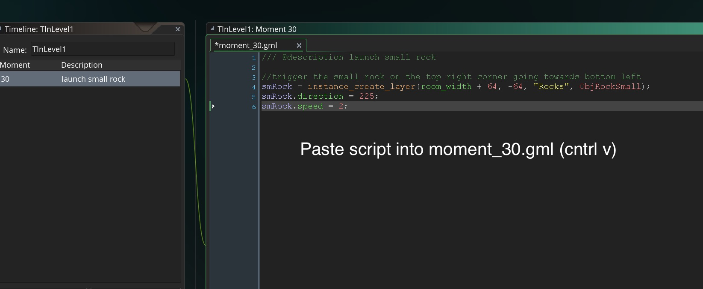

## Add Lives
<div class = "row">
<div class="col-12 col-lg-4 col align-self-center">
<div markdown = "1"> 
1. OK, when we run out of lives we will go to a Game Over screen.  Lets put a Game Over title in a blank room.  Create a new **_sprite_** called `SprGameOver`.  
</div>
</div>
<div class="col-12 col-lg-8">

</div>
</div>

___ 
<div class = "row">
<div class="col-12 col-lg-4 col align-self-center">
<div markdown = "1"> 
{:start="2"}
2. Change the size to 500 x 200 pixels. 
</div>
</div>
<div class="col-12 col-lg-8">

</div>
</div>

___ 
<div class = "row">
<div class="col-12 col-lg-4 col align-self-center">
<div markdown = "1"> 
{:start="3"}
3. Press the **Edit Image** button to bring up the image editor. Select the font tool and type "Game Over!".  Pick the best font size to fill the space.  
</div>
</div>
<div class="col-12 col-lg-8">

</div>
</div>

___ 
<div class = "row">
<div class="col-12 col-lg-4 col align-self-center">
<div markdown = "1"> 
{:start="4"}
4. Create a new **_Object_** and call it `ObjGameOver` and bind the `SprGameOver` sprite to it.
</div>
</div>
<div class="col-12 col-lg-8">

</div>
</div>

___ 
<div class = "row">
<div class="col-12 col-lg-4 col align-self-center">
<div markdown = "1"> 
{:start="5"}
5. Add a new **_room_** and call it `Lvl_GameOver`. Drag and drop the `ObjGameOver` Object to the center of the room.  
</div>
</div>
<div class="col-12 col-lg-8">

</div>
</div>

___ 
<div markdown = "1"> 
{:start="6"}
6. OK, the game over room is now done.  Lets draw the number of lives as a HUD on screen. We are going to introduce two new functions:
</div>
> draw_set_colour(col)<br>
> **Returns**: N/A<br>
> **Description**: "With this function you can set the base draw colour for the game. This value will affect all further drawing where appropriate, including fonts, forms, primitives and 3D. If any of those assets are drawn with their own colour value changed, this value will be ignored." - [GameMaker Manual](https://docs2.yoyogames.com/source/_build/3_scripting/4_gml_reference/drawing/colour/draw_set_colour.html)

and 

> draw_text(x, y, string)
> <div class="table table-striped">
> <div markdown = "1">
> | Arguments | Description |
| -------- | -------- |
| x  | The x coordinate of the drawn string. | 
|y | The y coordinate of the drawn string.  |
| string | The string to draw. | 

> **Returns**: N/A <br><br>
> **Description**: "With this function you can draw any string at any position within the room (for drawing real numbers you should use the string function to convert them into text). To combine strings you can use + (see example below), you can also use # to add a line break to the string (should you need to display the # symbol, then you should precede it with a backslash like this "this will draw a \#") and you can also draw quotations by using inverted commas (for example 'I said "Hello"...'). The colour of the text and the alpha are governed by the current base alpha and colour values as set by draw_set_alpha and draw_set_colour <br><br>
> NOTE: The actual position of the text will be influenced by the alignment values set by draw_set_halign and draw_set_valign." - [GameMaker Manual](https://docs2.yoyogames.com/source/_build/3_scripting/4_gml_reference/drawing/text/draw_text.html)

___ 
<div class = "row">
<div class="col-12 col-lg-4 col align-self-center">
<div markdown = "1"> 
{:start="7"}
7. Double click `ObjLevelController` and add press the **Add Event** button then add a **Draw -> DrawGUI** event.  Add to the script:
</div>
</div>
<div class="col-12 col-lg-8">
<div markdown = "1"> 
```c
/// @description Draw lives

draw_set_color(c_white);
draw_text(10, 10, "Lives: " + string (lives) );
```
</div>
</div>
</div>


<br />

___ 
<div markdown = "1"> 
{:start="8"}
8. Note there is a new function I didn't discuss with string (number).  We needed to do this becasue we can't concatonate a string with a number.  We can only concatonate strings.  So both varibales have to be strings.  "Lives: " is a string but the global variable Lives is a number.  There is a function though that casts a number to a string:

> string(val)<br>
> **Returns**: String<br><br>
> **Description**: "With this function you can turn any real number into a string. If the real number is an integer, it will be saved with no decimal places, otherwise, it will be saved with two decimal places." - [GameMaker Manual](https://docs2.yoyogames.com/source/_build/3_scripting/4_gml_reference/strings/string.html)
</div>

___ 
<div markdown = "1"> 
{:start="9"}
9. Now this has to go into a new event type **Draw GUI**.  This is a draw event specifically written for graphical user interfaces (GUIs).  

> "The Draw Gui event type falls under the Draw Event category and are specifically designed for drawing GUI (Graphical User Interface) elements that are not affected by the view scale or rotation. This means that you can have an instance draw all the elements for your HUD without having to base all the positioning on the position within the room of the instance and the position of the current view either.<br><br>
> When drawing in these event it is important that you understand that the draw coordinates do not change even when views are active and 0,0 is always the top left hand corner of either the application surface or the display (see the note at the bottom of this section), and the default width and height are 1:1 with the application surface. Depth ordering is still maintained between different instances (so an instance at a low depth will draw over one at a higher depth) and also within the events themselves, as the Draw GUI Begin event will draw for all instances first, then the standard Draw GUI will draw for all instances over that, and finally the Draw Gui End event is triggered." - [GameMaker Manual](https://docs2.yoyogames.com/source/_build/2_interface/1_editors/events/draw_events.html)
</div>

___ 
<div class = "row">
<div class="col-12 col-lg-4 col align-self-center">
<div markdown = "1"> 
{:start="10"}
10. Play the game and make sure you see the gui text on the top left corner of the screen.
</div>
</div>
<div class="col-12 col-lg-8">

</div>
</div>

___ 
<div class = "row">
<div class="col-12 col-lg-4 col align-self-center">
<div markdown = "1"> 
{:start="11"}
11. Now GameMaker provides a global variable (global means we can access it from any object in any namespace) lives.  They set it by default to `-1`.  We will need to set it to three lives.  Open the `ObjLevelController` and select the **Create Event Script** and add to the bottom.  Run the game and make sure you now have three lives:
</div>
</div>
<div class="col-12 col-lg-8">
<div markdown = "1"> 
```c
//three lives in the game
lives = 3;
```
</div>
</div>
</div>


<br />


<br />

___ 
<div class = "row">
<div class="col-12 col-lg-4 col align-self-center">
<div markdown = "1"> 
{:start="12"}
12. Now that we have 3 lives, we need to subtract one when we die.  Open `ObjPlayer` and its **Collision Event Script** and add to the top:  
</div>
</div>
<div class="col-12 col-lg-8">
<div markdown = "1"> 
```c
//subtract life for dying
lives = lives - 1;
```  
</div>
</div>
</div>

<br />

___ 
<div markdown = "1"> 
{:start="13"}
13. Run the game and see if it counts down, but it doesn't.  It goes back to 3 lives.  This is because we are restarting the entire game every time you die.  Lets change one function in `ObjLevelController` **Alarm 3 Script** we should change from `game_restart();` to `room_restart();` 

> room_restart()<br>
> **Returns**: N/A <br><br>
> **Description**: "With this function you can restart the current room. Note that the room will not be restarted until the end of the event where the function was called, so any code after this has been called will still run." - [GameMaker Manual](https://docs2.yoyogames.com/source/_build/3_scripting/4_gml_reference/rooms/general/room_restart.html)
</div>


<br />

___ 
<div class = "row">
<div class="col-12 col-lg-4 col align-self-center">
<div markdown = "1"> 
{:start="14"}
14. Any ideas of why the lives are not counting down. The issue is that when the room restarts it runs the `ObjLevelController` again and it resets the lives to 3.  So there is a room setting that we can change so that it persists and doesn't reload from scratch. Load `Lvl_1` and in the settings tab click on **persistent**:  
</div>
</div>
<div class="col-12 col-lg-8">

</div>
</div>

___ 
<div class = "row">
<div class="col-12 col-lg-4 col align-self-center">
<div markdown = "1"> 
{:start="15"}
15.  Now when the room restarts the player is no longer in the room as it remembers it's last state that had no player when it was killed.  We need to add to `ObjLevelController` **Alarm 3 Script** at the bottom:
</div>
</div>
<div class="col-12 col-lg-8">
<div markdown = "1"> 
```c
//Spawn player again
player = instance_create_layer(room_width/2, room_height/2, "Spaceship", ObjPlayer);
player.image_angle = 90;
```
</div>
</div>
</div>

<br />

___ 
<div class = "row">
<div class="col-12 col-lg-4 col align-self-center">
<div markdown = "1"> 
{:start="16"}
16. Play the game and run into three or four rocks.  You can get to 0 or even negative lives.  So we only subtract if lives are greater than zero.  Reopen `ObjLevelController` **Alarm 3 Script**and replace `room_restart();` with:  
</div>
</div>
<div class="col-12 col-lg-8">
<div markdown = "1"> 
```c
if (lives > 0)
{
    room_restart();
}
else
{
    room_goto(Lvl_GameOver);
}
```  
</div>
</div>
</div>

<br />

___ 
<div class = "row">
<div class="col-12 col-lg-4 col align-self-center">
<div markdown = "1"> 
{:start="17"}
17. Run the game and fly into a rock.  What happens?  Why is the ship not respawning?  Oh right, we set the room to **_persistent_** so it will not reload the elements that were there the first time. We will have to create a new instance of the player in the alarm.  Replace the entire **Alarm 3 Event** script in `ObjLevelController` with:  
</div>
</div>
<div class="col-12 col-lg-8">
<div markdown = "1"> 
```c
/// @description Restart game when player collides with rock

if (lives > 0)
{
    room_restart();
    //Spawn player again
    player = instance_create_layer(room_width/2, room_height/2, "Spaceship", ObjPlayer);
    player.image_angle = 90;
}
else
{
    room_goto(RmGameOver);
}
``` 
</div>
</div>
</div>

___ 
<div class = "row">
<div class="col-12 col-lg-4 col align-self-center">
<div markdown = "1"> 
{:start="18"}
18. Run the game and test it.  Shoot a few bullets to create more rocks and fly into four rocks.  Lives should go from 3, 2, 1  then Game Over!  It should look like:
</div>
</div>
<div class="col-12 col-lg-8">
<div class="embed-responsive embed-responsive-16by9">
<iframe class = "embed-responsive-item" src="https://www.youtube.com/embed/uheoEuDRzQY?rel=0&amp;controls=0&amp&showinfo=0&version=3" frameborder="0" allowfullscreen></iframe>
</div>
</div>
</div>

___ 
<div markdown = "1"> 
{:start="19"}
19. The only thing I don't like is that the rocks don't restart when the room resets.  We will be changing away from alarms so we will fix this later.
</div>

___ 
## Timelines

&#9635;  ~~Add lives~~ <br />
&#9633;  Level design, escalate difficulty by launching various waves of rocks

1. Now comes the fun part.  We have all the code we need to start level design.  We will not use the alarms to trigger the space rocks as we are limited to only 12; so we will be using a **Timeline**. With a timeline we can generate as many waves as we need.  


> **Timelines**
> "Timelines offer you a way to create and control instances and actions over a set time period.
In most games you will want certain things to happen at certain moments in time. Now, you can try to achieve this by using the alarm events but when things get too complicated this won't work any more, especially as you are limited to only twelve alarms. That's why we have the time line resource.<br>
> In a time line you specify which actions must happen at certain moments in game time, and you can use all the actions that are also available for an object in its different events. Once you create a time line you can then assign it to an object, and the instance of that object will then execute the actions at the indicated moments of time when placed or created within a room. Let us explain this with an example:<br>
> You can also use a time line to control your game more globally. Create an invisible controller object, create a time line that at certain moments creates enemies, and then assign it to the controller object. Once you start to work with it you will find out it is a very powerful tool indeed!" - [GameMaker Manual](https://docs2.yoyogames.com/source/_build/2_interface/1_editors/timelines.html)

___ 
<div markdown = "1"> 
{:start="2"}
2. To do this first we need to remove the alarms and change the way they trigger.
</div>

___ 
<div class = "row">
<div class="col-12 col-lg-4 col align-self-center">
<div markdown = "1"> 
{:start="3"}
3. Lets remove the alarm calls and start over.  Open `ObjLevelController`, select its **Create Event Script** and delete or comment out `Alarm 0`, `Alarm 1` and `Alarm 2`.
</div>
</div>
<div class="col-12 col-lg-8">

</div>
</div>

___ 
<div class = "row">
<div class="col-12 col-lg-4 col align-self-center">
<div markdown = "1"> 
{:start="4"}
4. Play the game, the rocks should no longer spawn.  Lets fix that.  Create a new Timeline by right clicking on **Timeline** in the **Resources** menu on the right and call it `TmlLevel1`. Press the **_Add_** button and set the new moment to step `30`, as it defaults to `0`.  
</div>
</div>
<div class="col-12 col-lg-8">

</div>
</div>
<div class = "row">
<div class = "col">

</div>
<div class = "col">

</div>
</div>

___ 
<div markdown = "1"> 
{:start="5"}
5. Cut and paste the script from `Alarm 0` from the `ObjLevelController` **Alarm 0 Event Script** to this newly created timeline script.  Right click on the **Alarm 0 Script Event** and select **Delete** as it is no longer needed.


<br />

<br />

<br />
</div>

___ 
<div markdown = "1"> 
{:start="6"}
6. Run the game.  Nothing happens.  Why?  Timelines do not start by default, they need to be triggered.  
</div>

___ 
<div markdown = "1"> 
{:start="7"}
7. Lets look at two new variables we need to load and run the timeline:  
</div>
> **timeline_index**  <br>
> **Holds**: Real number<br>
> **Description**: "This variable holds the index of the time line currently associated with the instance. You can set this to a particular time line to use that one, or set it to -1 to stop using a time line for the instance (if no time line is defined for the instance, -1 is returned too). Note that this does not start the time line - for that use the variable timeline_running." - [GameMaker Manual](https://docs2.yoyogames.com/source/_build/3_scripting/4_gml_reference/instances/instance_variables/timeline_index.html)

and 

> **timeline_running**<br>
> **Holds**: Boolean<br>=
> **Description**: "This variable holds current state of the assigned time line and will return true if it is running and false if it is not. You can also set this variable to either true or false to start and stop the time line at any time. it should be noted that a stopped time line is not reset, and so starting it again at a later time will start it from the exact moment that it was stopped at." - [GameMaker Manual](https://docs2.yoyogames.com/source/_build/3_scripting/4_gml_reference/instances/instance_variables/timeline_running.html)

___ 
<div class = "row">
<div class="col-12 col-lg-4 col align-self-center">
<div markdown = "1"> 
{:start="8"}
8. Since these are variables and only need to be called once, we can place them in the **Create Event Script** of `ObjLevelController`.  Add to where the alarms were previously called:
</div>
</div>
<div class="col-12 col-lg-8">
<div markdown = "1"> 
```c
//Piont to timeline and run it
timeline_index = TlnLevel1;
timeline_running = true;
```
</div>
</div>
</div>


<br />

___ 
<div class = "row">
<div class="col-12 col-lg-4 col align-self-center">
<div markdown = "1"> 
{:start="9"}
9. Run the game and you will see that it triggers the small rock 30 frames in - just like before.
</div>
</div>
<div class="col-12 col-lg-8">

</div>
</div>

___ 
<div markdown = "1"> 
{:start="10"}
10.  Repeat this by copy and pasting the two remaining alarms to two new timeline events and delete the old alarms. Now we have to convert to frames so the medium wave is at 6 seconds or (6 x 30) `180` frames and the large wave is at 10 seconds or (10 x 30) `300` frames in: 
</div>

<br />


<br />

___ 
<div markdown = "1"> 
{:start="11"}
11. Run the game and fly into a rock.  We are back to where we were before.  But now we can fix a major problem.  The rocks still keep going and the timeline doesn't reset.  We need to use the `timeline_position` variable:
</div>
> timeline_position<br>
> **Description**: "This variable holds the current position (moment) a time line is currently at. You can change this value to skip parts of the time line, or to repeat parts or to start the time line again from the beginning." - [GameMaker Manual](https://docs2.yoyogames.com/source/_build/3_scripting/4_gml_reference/instances/instance_variables/timeline_position.html)

{:start="12"}
12. Open up `ObjLevelController` **Alarm 3 Event Script** and add `timeline_position = 0` within the `if (lives > 0)` braces:


<br />

___ 
<div class = "row">
<div class="col-12 col-lg-4 col align-self-center">
<div markdown = "1"> 
{:start="13"}
13. Play the game and try it.  Wow the timeline restarts but there is one remaining problem. The rocks already in the level will stay we want to delete these.  It is good we have a rock parent object because using `with` we can go into all of its children and delete them.  Right after `timeline_position = 0;` add:
</div>
</div>
<div class="col-12 col-lg-8">
<div markdown = "1"> 
```c
//Destroy remaining rocks in room
with (ObjRockParent)
{
    instance_destroy();
}
```
</div>
</div>
</div>


<br />

___ 
<div class = "row">
<div class="col-12 col-lg-4 col align-self-center">
<div markdown = "1"> 
{:start="14"}
14. Run the game and test flying into rocks.  Do you go to the Game Over screen after flying into 3 rocks?  The game hangs in the Game Over screen but I think this is all for this lesson and we have introduced enough new concepts.  Continue to add new waves of rocks from different directions and see what you can do?
</div>
</div>
<div class="col-12 col-lg-8">
<div class="embed-responsive embed-responsive-16by9">
<iframe class = "embed-responsive-item" src="https://www.youtube.com/embed/OSbSVK4-0Vo?rel=0&amp;controls=0&amp&showinfo=0&version=3" frameborder="0" allowfullscreen></iframe>
</div>
</div>
</div>

___ 
&#9635;  Added hyperspace feature <br />
&#9635;  Added sounds to the game <br />
&#9635;  Added lives <br />
&#9635;  Level design, escalate difficulty by launching various waves of rocks

___ 
<br><br>
[<- Previous](SpaceRocksExtended_1.html)&nbsp;&nbsp;&nbsp;[Home](../../index.html)&nbsp;&nbsp;&nbsp;[Continue ->](SpaceRocksExtended_3.html)
<br />  
<br />  
<br />  
<br /> 