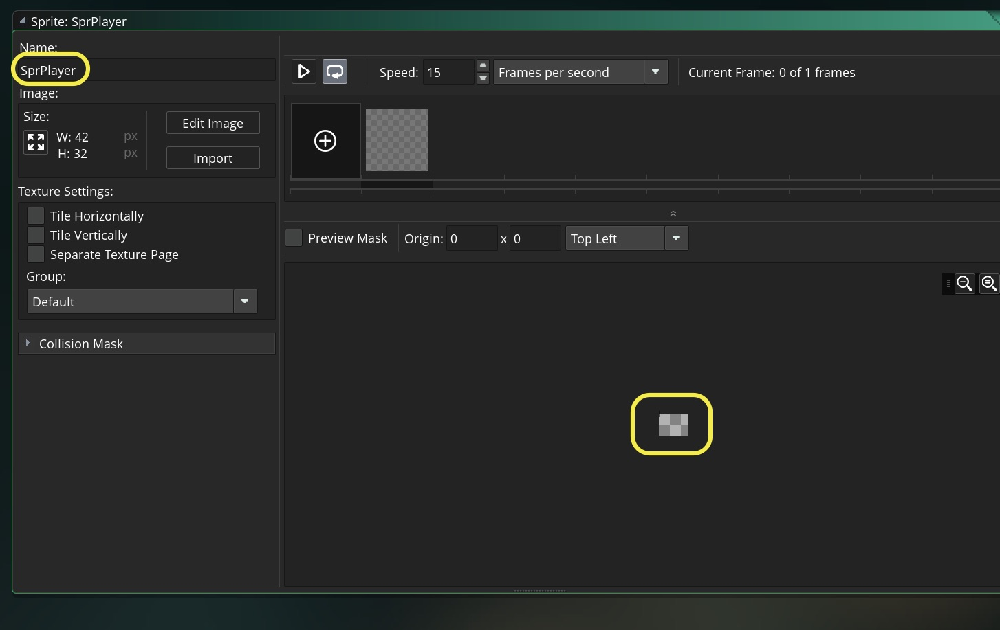
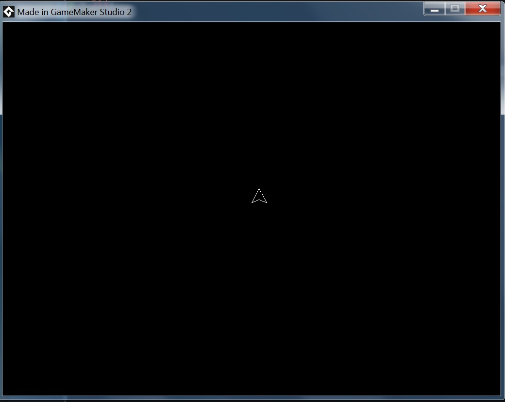

# Space Rocks
___ 
## Index
1. [Introduction](#introduction)
2. Spaceship
	1. [Create Spaceship](#create-spaceship)
	2. [Rotate Spaceship](#rotate-spaceship)
	3. [Add Thrust to Ship](SpaceRocks_2.html#add-thrust-to-ship)
	4.  [Adding Two Vectors](SpaceRocks_2.html#adding-two-vectors) 
3. Bullets 
	1. [Bullets](SpaceRocks_3.html#bullets)  
	2. [Creating a new Object Instance](SpaceRocks_3.html#creating-a-new-object-instance)
	3. [Compound Logical Operators](SpaceRocks_3.html#compound-logical-operators)
4. Rocks
	1. [Rocks](SpaceRocks_4.html#rocks) 
	2. [Parent / Child Hierarchy](SpaceRocks_4.html#parent--child-hierarchy) 
	3. [Collision Event](SpaceRocks_4.html#collision-event)
	4. [With Other](SpaceRocks_5.html#with-other)
	5. [Splitting Rocks in Two](SpaceRocks_5.html#splitting-rocks-in-two)
	6. [Alarms](SpaceRocks_4.html#alarms)

___ 
## Introduction  
1. We will be making our own version of and **Asteroids-like** experience in GameMaker Studio II using GML.  If you are not familiar with the game take a look at this playthrough of the original [Asteroids](https://www.youtube.com/watch?v=tEvtkVHISFU). We will be ignoring the front-end screens and will just build the framework of the game.  We will get to launching 3 sizes of asteroid boulders.  This is not the entire game, just enough to get started so you can continue on and finish the game from where we started.

___ 
<div markdown = "1">
{:start="2"}
2.  What do we need to do?  
	&#9633; Build spaceship sprite & object and place in room <br />
	&#9633; Rotate spaceship clockwise and counter-clockwise <br />
	&#9633; Give spaceship thrust <br />
	&#9633; Implement friction <br />
	&#9633; Create bullet sprite & object <br />
	&#9633; Create firing logic for bullets <br />
	&#9633; Create 3 rock sprites and objects <br />
	&#9633; Create collision for bullets hitting rocks <br />
	&#9633; When small rock gets hit it is destroyed <br />
	&#9633; When mid rock gets hit it splits into two small rocks <br />
	&#9633; When large rock gets hit it splits into  two midsize rocks <br />
	&#9633; Ship gets destroyed when hit by rock <br />
	&#9633; Level design, escalate difficulty by launching various waves of rocks 
</div>

___ 
<div markdown = "1">
{:start="3"}
3. We can use the editor to create the pixel art as we will stay very simple for this project.
</div>
___ 
## Create Spaceship

<div class = "row">
<div class="col-12 col-lg-4 col align-self-center">
<div markdown = "1">
1. Look at the [video](https://www.youtube.com/watch?v=tEvtkVHISFU) again and look at the ship.  It needs two frames of animation; a triangle ship facing up with a flame thrust.  If you didn't notice it take a look:
</div>
</div>
<div class="col-12 col-lg-8">
  
</div>
</div>

___ 
<div markdown = "1">
{:start="2"}
2.  Start a new GameMaker Studio II [project](../StartingProject/StartingProject.html), select a GameMaker Language project and call it `SpaceRocks`.
</div>
<div class = "row">
<div class="col">
  
<br /> 
</div>
<div class="col">
  
</div> 
<div class="col">
  
</div>
</div>

___ 
<div class = "row">
<div class="col-12 col-lg-4 col align-self-center">
<div markdown = "1">
{:start="3"}
3.  Right click on the **Sprite** header in the right side  **Resources** menu and select **Create**


&#9633; Build spaceship sprite & object and place in room <br />
</div>
</div>
<div class="col-12 col-lg-8">
  
</div>
</div>

___ 
<div class = "row">
<div class="col-12 col-lg-4 col align-self-center">
<div markdown = "1">
{:start="4"}
4.  We want to change the size to `42` x `32`.  We need to click on the _icon_ next to the `W` and `H` in the **Sprite** window:
</div>
</div>
<div class="col-12 col-lg-8">
  
</div>
</div>

___ 
<div class = "row">
<div class="col-12 col-lg-4 col align-self-center">
<div markdown = "1">
{:start="5"}
5. Now since we are changing the aspect ratio of the default size we need to click the radio button to _off_ for **Maintain Aspect Ration** and set `Width` to `42`.  If you get `32` x `32` instead of `42` x `32` repeat and make sure you turn **Maintain Aspect Ratio** off.
</div>
</div>
<div class="col-12 col-lg-8">
  
</div>
</div>

___ 
<div class = "row">
<div class="col-12 col-lg-4 col align-self-center">
<div markdown = "1">
{:start="6"}
6. Press the **Apply** button and when the window is closed you should now see the Sprite Object with a blank rectangular shape. Go ahead and name the sprite `SprPlayer`
</div>
</div>
<div class="col-12 col-lg-8">
  
</div>
</div>

___ 
<div markdown = "1">
{:start="7"}
7.  Press **Edit Image** to bring up the image editor.  I selected a white color and picked **polygon stroke** (the triangle icon).  I proceeded to draw a triangle leaving room for a flame facing right as **_direction_** defaults to `0`.
</div>

<div class = "row">
<div class="col-4">
  
</div>
<div class="col-8">
  
</div>
</div>
  
<br /> 

___ 
<div class = "row">
<div class="col-12 col-lg-4 col align-self-center">
<div markdown = "1">
{:start="8"}
8. Now you have a perfect triangle.  Add the last click in the polygon on the inside center on the left to give it a tail.
</div>
</div>
<div class="col-12 col-lg-8">
  
</div>
</div>

___ 
<div class = "row">
<div class="col-12 col-lg-4 col align-self-center">
<div markdown = "1">
{:start="9"}
9. Right click on the thumbnail of the **sprite** you just created and select **copy** and **paste**.  This gives a second frame.
</div>
</div>
<div class="col-12 col-lg-8">
  
</div>
</div>

___ 
<div class = "row">
<div class="col-12 col-lg-2 col align-self-center">
<div markdown = "1">
{:start="10"}
10.  Draw a flame in the color of your choice:
</div>
</div>
<div class="col-12 col-lg-10">
  
</div>
</div>

<div class = "row">
<div class = "col">
  
</div>
<div class = "col">
  
</div>
</div>

___ 
<div markdown = "1">
{:start="11"}
11.  Create an **Object** by right clicking on the **Objects** header in the right side  **Resourcers** menu and select **Create**.  Call the **Object** `ObjPlayer` and bind the `SprPlayer` sprite to it.
</div>
<div class = "row">
<div class = "col">
  
</div>
<div class = "col">
  
</div>
</div>

___ 
<div class = "row">
<div class="col-12 col-lg-4 col align-self-center">
<div markdown = "1">
{:start="12"}
12. Right mouse click on the **Room**, select **Rename** and call it `Lvl_1`.  In settings, leave the room at 1024 x 768 pixels.  Select the background tab and change the background color to black (if it is not black already).  
</div>
</div>
<div class="col-12 col-lg-8">

</div>
</div> 


<br />  

___ 
<div class = "row">
<div class="col-12 col-lg-4 col align-self-center">
<div markdown = "1">
{:start="13"}
13. Click on the **Instance** layer in the room and drag and drop `ObjPlayer` into the middle of the room.  You are not able to drag a **game object** onto the background layer, so an **instance layer** must be selected.
</div>
</div>
<div class="col-12 col-lg-8">

</div>
</div> 


<div class = "row">
<div class="col-12 col-lg-4 col align-self-center">
<div markdown = "1">
{:start="14"}
14. Run the game and you should see the spaceship just sitting in the room doing nothing.  And even worse the flame is flashing on and off.  Not what we wanted.
</div>
</div>
<div class="col-12 col-lg-8">

</div>
</div>

___ 
<div class = "row">
<div class="col-12 col-lg-4 col align-self-center">
<div markdown = "1">
{:start="15"}
15. Now let's center the Spaceship.  Lets create a new **event** for `ObjPlayer` by pressing the **Add Event** _button_ and selecting a **Create** event.  Add to the script and press run the ship should be centered.
</div>
</div>
<div class="col-12 col-lg-8">
<div markdown = "1">
```c
/// @description initialize variables for spaceship

//Center spaceship
x = 512;
y = 384;
```
</div>
</div>
</div>

<br />  

___ 
<div class = "row">
<div class="col-12 col-lg-4 col align-self-center">
<div markdown = "1">
{:start="16"}
16. If we look at the video we notice that the spaceship only shows the flame when the thrusters are on.  We should turn the animation off.  GameMaker has a variable called **_image_speed_** that we can use.  Look at it in the help menu:
</div>
</div>
<div class="col-12 col-lg-8">

</div>
</div>

___ 
<div class = "row">
<div class="col-12 col-lg-4 col align-self-center">
<div markdown = "1">
{:start="17"}
17.  So it is a variable that holds a **real** number that we can change.  setting `image_speed` to `0` is 0% (stopped) and setting it to `1` is 100%.  Add to the **Create Event Script** and run the game, you should now see the ship with no animation (don't worry we will add it back later).  
</div>
</div>
<div class="col-12 col-lg-8">
<div markdown = "1">
```c
//Freeze the animation
image_speed = 0;
```
</div>
</div>
</div>


<br />  

___ 
<div class = "row">
<div class="col-12 col-lg-6 col align-self-center">
<div markdown = "1">
{:start="18"}
18. If we look at the video we also see that the spaceship starts facing upwards. We want the sprite to stay facing right so that we keep Gamemaker's assumption that an `image_angle` of 0 is facing right.  The `image_angle` variable is used to represent the angle that the sprite/object is pointing.  The default value is `0`.  If you want to rotate the sprite `90`&deg; you would need to add `90` to the variable `image_angle` so it starts facing upwards. Add to the **Create Event Script**:
</div>
</div>
<div class="col-12 col-lg-6">
<div markdown = "1">
```c
//Make ship point upwards
image_angle = 90;
```
</div>
</div>
</div>
<div class = "row">
<div class = "col">

</div>
<div class = "col">

</div>
</div> 

___ 
<div class = "row">
<div class="col-12 col-lg-6 col align-self-center">
<div markdown = "1">
{:start="19"}
19. Now we can make an improvement.  We want to avoid **magic numbers** and I might when making the game want to change the size of the room.  This means that the center will change; it may not always be `512` x `384`.  If I change the room size, I would have to remember the `ObjPlayer` **Create Event Script** script where I center the sprite.  I can use another GameMaker variable that gets the room size that is used.  By using this variable we can divide it by half and no matter the room size our ship will always be in the middle. Take a look at 'room_width' and 'room_height' in help -> manual.  Change 512 and 300 in the **_Create Event Script_** script to:
</div>
</div>
<div class="col-12 col-lg-6">
<div markdown = "1">
```c
/// @description initialize variables for spaceship

//Center spaceship
x = room_width /2;
y = room_height/2;
//x = 512; //you can delete these
//y = 384;
```
</div>
</div>
</div>

<br />  

<div markdown = "1">
## Rotate Spaceship

___ 
</div>
<div class = "row">
<div class="col-12 col-lg-6 col align-self-center">
<div markdown = "1">
{:start="1"}
1. Run the game and test it, there should be no perceivable difference, even if you change the room size.  Lets now add rotation.  Create a new **Step Event Script** by pressing the **Add Event** _button_ on `ObjPlayer` then select **step -> step**.  We will use the arrow keys to turn the ship and alter its `image_angle`.  Remember adding to `image_angle` turns the sprite counter-clockwise and subtracting turns it clockwise..

	&#9635; ~~Build spaceship sprite & object and place in room <br />~~
	&#9633; Rotate spaceship clockwise and counter-clockwise <br />
</div>
</div>
<div class="col-12 col-lg-6">
<div markdown = "1">
```c
/// @description player step event for controls

//Turn ship counter-clockwise
if (keyboard_check(vk_left))
{
	image_angle = image_angle + 5;
}
```
</div>
</div>
</div>

___ 
<div class = "row">
<div class="col-12 col-lg-4 col align-self-center">
<div markdown = "1">
{:start="2"}
2. Run the game and press the left key.  I do notice a problem.  The ship seems to rotate around the top left corner of the ship.  
</div>
</div>

<div class="col-12 col-lg-8">
<div class="embed-responsive embed-responsive-16by9">
<iframe class = "embed-responsive-item" src="https://www.youtube.com/embed/z2A9WtAnPRU?rel=0&amp;controls=0&amp&showinfo=0&autoplay=1&version=3&loop=1&playlist=z2A9WtAnPRU" frameborder="0" allowfullscreen></iframe>
</div>
</div>
</div>

___ 
<div class = "row">
<div class="col-12 col-lg-4 col align-self-center">
<div markdown = "1">
{:start="3"}
3. This is a problem.  There are two spaces that GameMaker uses.  Sprite space and Room space.  Both default to (0,0) on the top left corner of the room/sprite.  Rotation happens around this origin point.  Since this is rotating we want it to rotate on the center of the ship. Double click **_SprPlayer_** and click on the **Origin** menu and select **Middle Centre**. A cross hair appears on the sprite. 
</div>
</div>
<div class="col-12 col-lg-8">

</div>
</div> 

___ 
<div class = "row">
<div class="col-12 col-lg-4 col align-self-center">
<div markdown = "1">
{:start="4"}
 4.  This is the middle of the **Sprite** but not the middle of the actual spaceship.  You might want to click on the sprite and adjust to cross hair to be in the center point that makes most sense for the rotation to take place manually by left clicking in the sprite and moving it.  
</div>
</div>

<div class="col-12 col-lg-8">

</div>
</div>

___ 
<div class = "row">
<div class="col-12 col-lg-4 col align-self-center">
<div markdown = "1">
{:start="5"}
5.  Run the game and now the sprite should rotate on the proper center.
</div>
</div>
<div class="col-12 col-lg-8">
<div class="embed-responsive embed-responsive-16by9">
<iframe class = "embed-responsive-item" src="https://www.youtube.com/embed/eI3Z610OGLg?rel=0&amp;controls=0&amp&showinfo=0&autoplay=1&version=3&loop=1&playlist=eI3Z610OGLg" frameborder="0" allowfullscreen></iframe>
</div>
</div>
</div>

___ 
<div class = "row">
<div class="col-12 col-lg-4 col align-self-center">
<div markdown = "1">
{:start="6"}
6.  Open the **Step Event Script** and add to the bottom for clock-wise rotation:  
</div>
</div>
<div class="col-12 col-lg-8">
<div markdown = "1">
```c
//Turn ship clockwise
if (keyboard_check(vk_right))
{
	image_angle =  image_angle - 5;
}
```
</div>
</div>
</div>


<br />  

___ 
<div class = "row">
<div class="col-12 col-lg-4 col align-self-center">
<div markdown = "1">
{:start="7"}
7. Run the game and test your work.  OK, now that we are happy lets change the rotation speed from a **hard coded** number into a variable.  Open **Create Event Script** on `ObjPlayer` and add at the bottom:
</div>
</div>
<div class="col-12 col-lg-8">
<div markdown = "1">
```c
//variable to use for turning speed of ship
rotationSpeed = 5;
```
</div>
</div>
</div>


<br />  

___ 
<div class = "row">
<div class="col-12 col-lg-4 col align-self-center">
<div markdown = "1">
{:start="8"}
8. Replace both instances of `5` in **Step Event Script** in `ObjPlayer` with `rotationSpeed`:   
</div>
</div>
<div class="col-12 col-lg-8">
<div markdown = "1">
```c
//Turn clockwise and counter-clockwise
if (keyboard_check(vk_left))
{
	image_angle = image_angle + rotationSpeed; //change the number 5 in this line
}

//Turn ship clockwise
if (keyboard_check(vk_right))
{
	image_angle = image_angle - rotationSpeed; // change the number 5 in this
}
```
</div>
</div>
</div>


___ 
<div markdown = "1">
{:start="9"}
9. Play the game and test your work.  There should be no difference from before.  Next we will get the accelaration working on the ship.
</div>
<br />  
[Home](../../index.html)&nbsp;&nbsp;&nbsp; [Continue ->](SpaceRocks_2.html)
<br />  
<br />  
<br />  
<br />  
