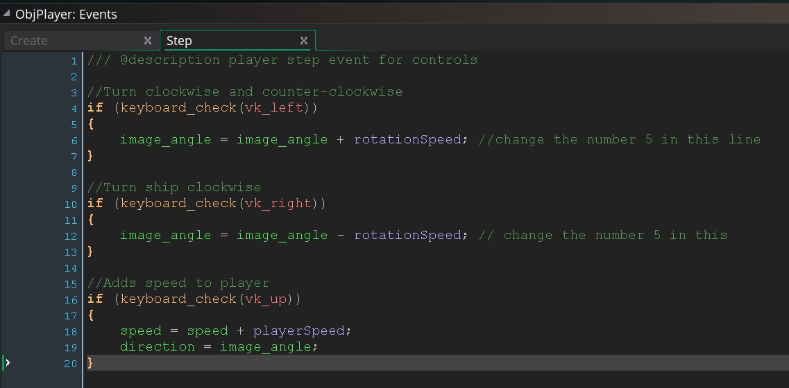
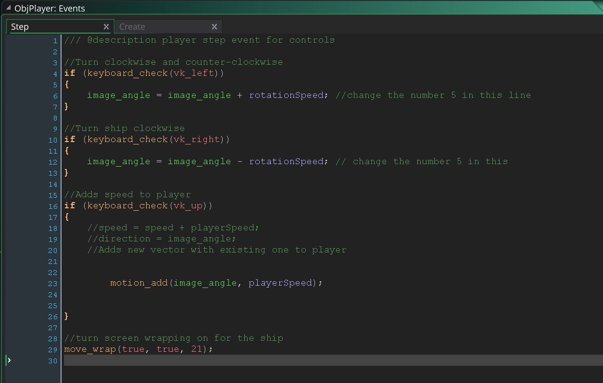
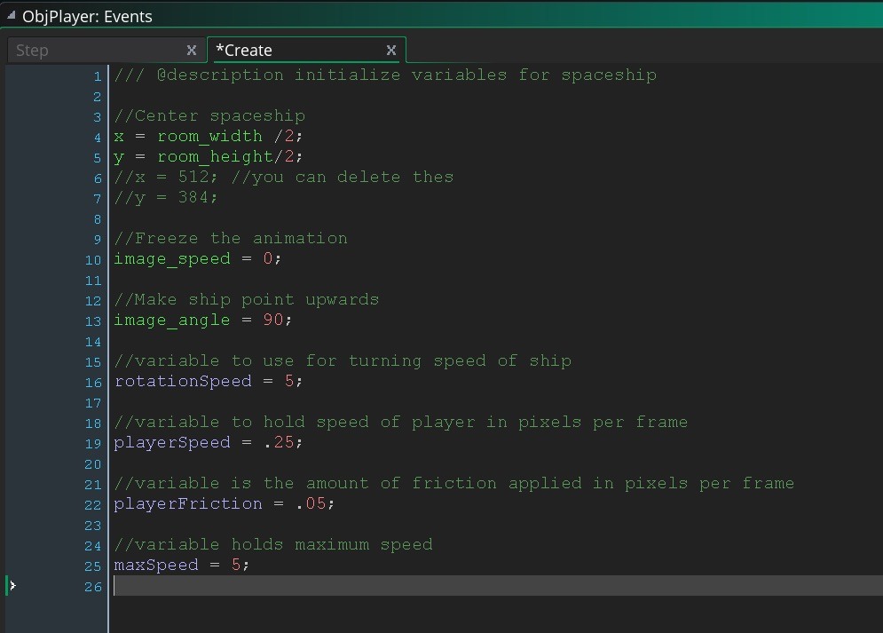
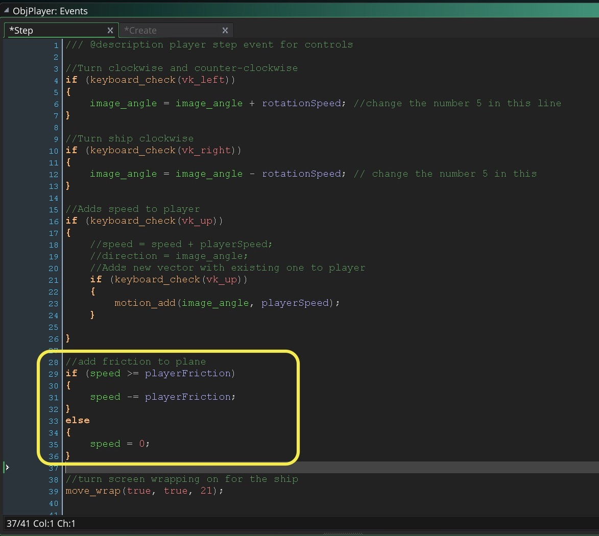
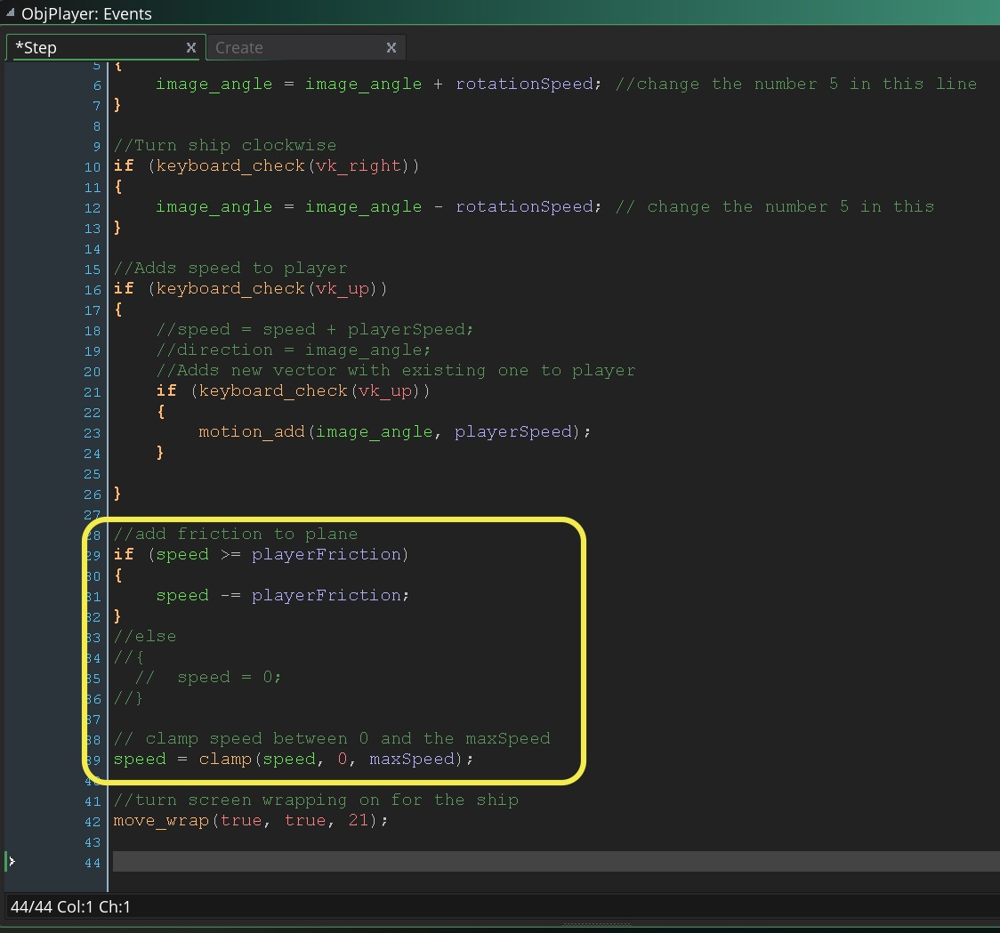
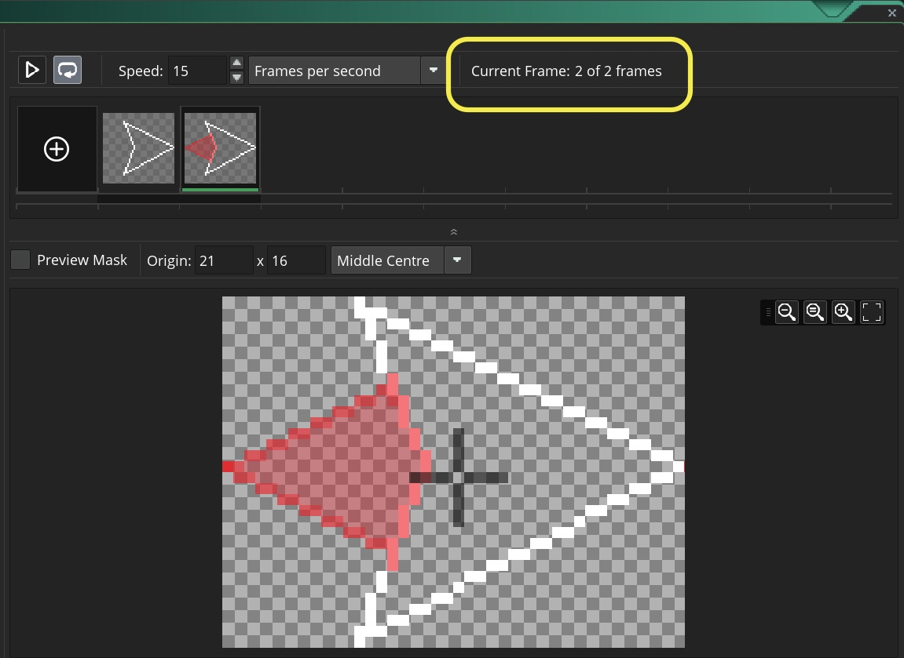
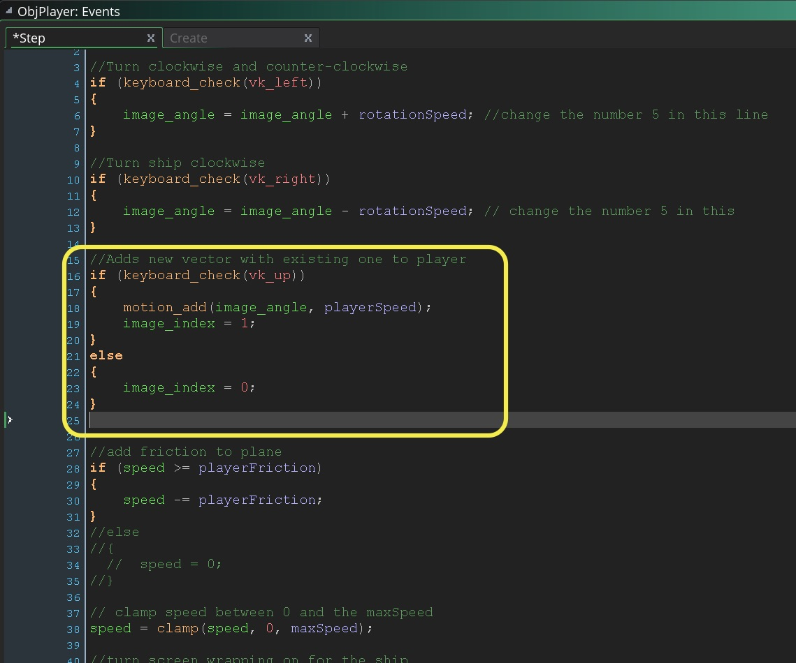

## Add Thrust to Ship
___ 
<div class = "row">
<div class="col-12 col-lg-6 col align-self-center">
<div markdown = "1">
1. OK, now let's add thrust to the ship.  Add to **Create Event Script** in `ObjPlayer` a new variable called `playerSpeed` and set it to `1`: <br />
    &#9635; ~~Build spaceship sprite & object and place in room~~ <br />
    &#9635; ~~Rotate spaceship clockwise and counter-clockwise~~ <br />
    &#9633; Give spaceship thrust <br />
</div>
</div>
<div class="col-12 col-lg-6">
<div markdown = "1">
```c
//variable to hold speed of player in pixels per frame
playerSpeed = 1;
``` 
</div>
</div>
</div>

___ 
<div class = "row">
<div class="col-12 col-lg-6 col align-self-center">
<div markdown = "1">
{:start="2"}
2. Add to bottom of **Step Event Script** for `ObjPlayer`:  
</div>
</div>
<div class="col-12 col-lg-6">
<div markdown = "1">
```c
//Adds speed to player
if (keyboard_check(vk_up))
{
    speed = speed + playerSpeed;
}
```
</div>
</div>
</div>
<div class="embed-responsive embed-responsive-16by9">
<iframe class = "embed-responsive-item" src="https://www.youtube.com/embed/QdowR8TY8co?rel=0&amp;controls=0&amp&showinfo=0&autoplay=1&version=3&loop=1&playlist=QdowR8TY8co" frameborder="0" allowfullscreen></iframe>
</div>
<br />

___ 
<div class = "row">
<div class="col-12 col-lg-6 col align-self-center">
<div markdown = "1">
{:start="3"}
3. Run the game and see what happens.  The problem now is that the player does not thrust in the direction they are facing.  The issue is that the direction of a sprite/object is separate from the `direction` that it is moving in.  Please add to the **Step Event Script** for `ObjPlayer` after you set the `speed`:
</div>
</div>
<div class="col-12 col-lg-6">
<div markdown = "1">
``` c
//Adds speed to player
if (keyboard_check(vk_up))
{
    speed = speed + playerSpeed;
    direction = image_angle;
}
```
</div>
</div>
</div>


<br />  

<div class="embed-responsive embed-responsive-16by9">
<iframe class = "embed-responsive-item" src="https://www.youtube.com/embed/m8Hj2PtnhQs?rel=0&amp;controls=0&amp&showinfo=0&autoplay=1&version=3&loop=1&playlist=m8Hj2PtnhQs" frameborder="0" allowfullscreen></iframe>
</div>
<br />

___ 
<div class = "row">
<div class="col-12 col-lg-6 col align-self-center">
<div markdown = "1">
{:start="4"}
4. Play the game and test your work.  It should look like the above video.  What do you think?  It feels a bit fast, hard to test without screen wrapping.  Let's lower the acceleration and add **move_wrap(hor, vert, margin)**. Change `playerSpeed` to `0.25` in the **Create Event Script**:  
</div>
</div>
<div class="col-12 col-lg-6">
<div markdown = "1">
```c
//variable to hold speed of player in pixels per frame
playerSpeed = .25; //changed from 1 previously
```
</div>
</div>
</div>

___ 
<div class = "row">
<div class="col-12 col-lg-6 col align-self-center">
<div markdown = "1">
{:start="5"}
5. Add **_move_wrap()_** to the end of `ObjPlayer` **Step Event Script**. Why was the above in a create event and the below in step?  

    We need to initialize the `playerSpeed` variable with it's initial speed.  Once it is set we can leave it alone.  The **create event** runs once.  

    We put `move_wrap` in a **step event** as we have to every frame during gameplay check to see if the player has left the screen.  

    The third paramter to the **move_wrap()** function is offset.  We want to account for the longest part of the sprite (42 / 2) to properly screen wrap.  To get a better sense of what I mean you can look at: [Screen Wrap](../FixingMovingThreeWays/FixingMovingThreeWays_2.html#screen-wrap).  So add to the bottom:   
</div>
</div>
<div class="col-12 col-lg-6">
<div markdown = "1">
```c
//turn screen wrapping on for the ship
move_wrap(true, true, 21);
```
</div>
</div>
</div>

___ 
<div class = "row">
<div class="col-12 col-lg-4 col align-self-center">
<div markdown = "1">
{:start="6"}
6. Now run the game and you should be able to move around at a more reasonable speed and the ship wraps the way we wanted to.
</div>
</div>
<div class="col-12 col-lg-8">
<div class="embed-responsive embed-responsive-16by9">
<iframe class = "embed-responsive-item" src="https://www.youtube.com/embed/MACzycV2OPU?rel=0&amp;controls=0&amp&showinfo=0&autoplay=1&version=3&loop=1&playlist=MACzycV2OPU" frameborder="0" allowfullscreen></iframe>
</div>
</div>
</div>
<div markdown = "1">
___ 
</div>

### Adding Two Vectors  

1. Now what do you think?  

    Do you get a better idea of the mechanic?  

    There are a few obvious problems.  First the physics feel more like a car than a spacship.  When the car accelerates it turns when the wheels turn because of friction between the tire and the road.  In space the ship would turn but it would keep going in the direction it was originally flying in.  We need to **add**  the new motion vector to the existing one as opposed to changing it in one go.  So if you were going 5 units per frame north and turned south and went 15 units per frame, you would go 10 units per frame south.  GameMaker gives us a [function](../ProgrammingConcepts/Functions.html) that does this for us:   

> **motion_add(dir, speed)**  
> **Returns**: Nothing (void)  
> **Description**: "This function adds to the direction and a movement speed of an instance, and can be very useful for simple physics." - [GameMaker Manual](https://docs2.yoyogames.com/source/_build/3_scripting/4_gml_reference/movement%20and%20collisions/movement/motion_add.html)  

___ 
<div class = "row">
<div class="col-12 col-lg-4 col align-self-center">
<div markdown = "1">
{:start="2"}
2.  Since `motion_add` sets both the `direction` and `speed`, we can replace `speed = speed + playerSpeed; direction = image_angle;` with `motion_add(image_angle, playerSpeed);`. Remove the old speed and add to **_ScrPlayerStep_** then run the game and test it:  
</div>
</div>
<div class="col-12 col-lg-8">
<div markdown = "1">
```c
//Adds new vector with existing one to player
if (keyboard_check(vk_up))
{
    motion_add(image_angle, playerSpeed);
}
```
</div>
</div>
</div>

<br />  

<div class="embed-responsive embed-responsive-16by9">
<iframe class = "embed-responsive-item" src="https://www.youtube.com/embed/EvOb4olKnyA?rel=0&amp;controls=0&amp&showinfo=0&autoplay=1&version=3&loop=1&playlist=EvOb4olKnyA" frameborder="0" allowfullscreen></iframe>
</div>
<br />

___ 
<div class = "row">
<div class="col-12 col-lg-6 col align-self-center">
<div markdown = "1">
{:start="3"}
3. That works much better but you keep moving forever and you can keep going faster with no maximum speed.  Now we want to add friction and limit the top speed.  Open the **Create Event Script** in `ObjPlayer` and add to the end:

    &#9635; ~~Build spaceship sprite & object and place in room <br />~~
    &#9635; ~~Rotate spaceship clockwise and counter-clockwise <br />~~
    &#9633; Finish give spaceship thrust <br />
    &#9633; Implement friction <br />
</div>
</div>
<div class="col-12 col-lg-6">
<div markdown = "1">
```c
//variable is the amount of friction applied in pixels per frame
playerFriction = .05;

//variable holds maximum speed
maxSpeed = 5;
```
</div>
</div>
</div>

<br />  

___ 
<div class = "row">
<div class="col-12 col-lg-6 col align-self-center">
<div markdown = "1">
{:start="4"}
4. We will be reducing the speed by the amount given in `playerFriction` which is very small.  We need to check that that the speed is equal to or above the amount of friction otherwise it is `0`.  We don't want to keep subtracting so that the ship goes backwards (negative `speed`). We will add friction just before `move_wrap()` of the **Step Event Script** in `ObjPlayer`:  
</div>
</div>
<div class="col-12 col-lg-6">
<div markdown = "1">
```c
//add friction to plane
if (speed >= playerFriction)
{
    speed = speed - playerFriction;
}
else
{
    speed = 0;
}
```
</div>
</div>
</div>

<div class = "row">
<div class = "col">

<br />  
</div>
<div class = "col">
<div class="embed-responsive embed-responsive-16by9">
<iframe class = "embed-responsive-item" src="https://www.youtube.com/embed/BiAwGiIWRTU?rel=0&amp;controls=0&amp&showinfo=0&autoplay=1&version=3&loop=1&playlist=BiAwGiIWRTU" frameborder="0" allowfullscreen></iframe>
</div>
</div>
</div>

___ 
<div class = "row">
<div class="col-12 col-lg-4 col align-self-center">
<div markdown = "1">
{:start="5"}
5.  Play the game, the ship should slow down when you release the thrust.  Now lets Add maximum speed to the game.  A simple way to clamp is to test if a value is over the max value, then set it to the max value.  DO NOT IMPLEMENT THIS.  For example:  
</div>
</div>
<div class="col-12 col-lg-6">
<div markdown = "1">
```c
if (speed > maxSpeed)
{
	speed = maxSpeed;
}
```
</div>
</div>
</div>

___ 
<div markdown = "1">
{:start="6"}
6. But GameMaker provides a clamp function.  
 
> `clamp (val, min, max)`  
> **Returns**: Real Number   
> **Description:**  With this function you can maintain an input value between a specified range.  
> Example:  
> `speed = clamp(speed, 1, 10);`  
> [GameMaker Manual](https://docs2.yoyogames.com/source/_build/3_scripting/4_gml_reference/maths/real%20valued%20functions/clamp.html)
</div>

___ 
<div class = "row">
<div class="col-12 col-lg-4 col align-self-center">
<div markdown = "1">

{:start="7"}
7. We can then clamp the **_speed_** of the player from 0 to **_maxSpeed_**. We can also remove the else condition setting the floor at `0` on friction.  Make the following changes to the **Step Event Script** and alter the friction section and add the clamp function:  
</div>
</div>
<div class="col-12 col-lg-6">
<div markdown = "1">
```c
//add friction to plane
if (speed > 0)
{
    speed -= playerFriction;
}

// clamp speed between 0 and the maxSpeed
speed = clamp(speed, 0, maxSpeed);
```
</div>
</div>
</div>


<br />  

___ 
<div class = "row">
<div markdown = "1">
{:start="8"}
8. Now run the game and test it.  

    Works great, doesn't it?  Woops, we forgot one thing. We didn't change to the flame frame of the sprite when pressing the up button.  How do we do this?  We need to look at another GameMaker variable:

> **image_index**  
> A sprite is made up of one or more sub-images which can make the sprite appear animated as they switch from one to the other, or can they can be switched between in code to give different "states", much like a button has in windows. If the sprite is animated, then you can get the current frame of the animation by checking the image_index variable, or if you want to change the state of a static sprite, you can select a new sub-image by setting this variable to the desired sub-image for the sprite. [GameMaker Manual](https://docs2.yoyogames.com/source/_build/3_scripting/4_gml_reference/instances/instance_variables/image_index.html)
</div>
</div>

___ 
<div class = "row">
<div class="col-12 col-lg-4 col align-self-center">
<div markdown = "1">
{:start="9"}
9. Open `SprPlayer` and click on edit.  Look at the frames:  
</div>
</div>
<div class="col-12 col-lg-8">

<br />  
</div>
</div>

___ 
<div class = "row">
<div markdown = "1">
{:start="10"}
10. We see **Current Frame:** and its count. What might be counter intuitive is that with **image\_index** we refer to the first frame as frame 0 and the second is frame 1.  So when the player is pressing the up button we will set `image_index = 1;` and when it is released, set it back to `image_index = 0;`.   
</div>
</div>

___ 
<div class = "row">
<div class="col-12 col-lg-4 col align-self-center">
<div markdown = "1">
{:start="11"}
11. Open the **Step Event Script** and alter when the `vk_up` key is pressed:
</div>
</div>
<div class="col-12 col-lg-6">
<div markdown = "1">
```c
//Adds new vector with existing one to player
if (keyboard_check(vk_up))
{
    motion_add(image_angle, playerSpeed);
    image_index = 1;
}
else
{
    image_index = 0;
}
```
</div>
</div>

<div class = "row">
<div class = "col">

<br />  
</div>
<div class = "col">
<div class="embed-responsive embed-responsive-16by9">
<iframe class = "embed-responsive-item" src="https://www.youtube.com/embed/b3HYBdX5GFY?rel=0&amp;controls=0&amp&showinfo=0&autoplay=1&version=3&loop=1&playlist=b3HYBdX5GFY" frameborder="0" allowfullscreen></iframe>
</div>
</div>
</div>

<div markdown = "1">
{:start="12"}
12.  Now let's add shooting to the game so we can blow up the rocks when we create them.


<br />  
[<- Previous](SpeceRocks_1.html)&nbsp;&nbsp;&nbsp;[Home](../../index.html)&nbsp;&nbsp;&nbsp; [Continue ->](SpaceRocks_3.html)
<br />  
<br />  
<br />  
<br />  
</div>