## Bullets
___ 
<div class = "row">
<div class="col-12 col-lg-4 col align-self-center">
<div markdown = "1">
1.  Create a new **Sprite** by right clicking **Sprites** in the **Resource** menu on the right and name it `SprBullet`.  Select a 4 by 4 size by clicking on the size button.   

    &#9635; ~~Give spaceship thrust~~ <br />
    &#9635; ~~Implement friction~~ <br />
    &#9633; Create bullet sprite & object <br />
</div>
</div>
<div class="col-12 col-lg-8">
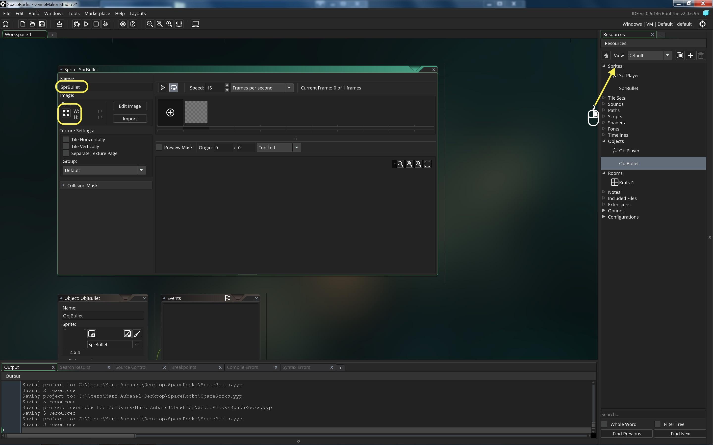  
</div>
</div>

___ 
<div class = "row">
<div class="col-12 col-lg-4 col align-self-center">
<div markdown = "1">
{:start="2"}
2. Click the **Edit Image** _button_ and fill it with a solid white color (don't worry it is so small it won't look square in the game). 
</div>
</div>
<div class="col-12 col-lg-8">
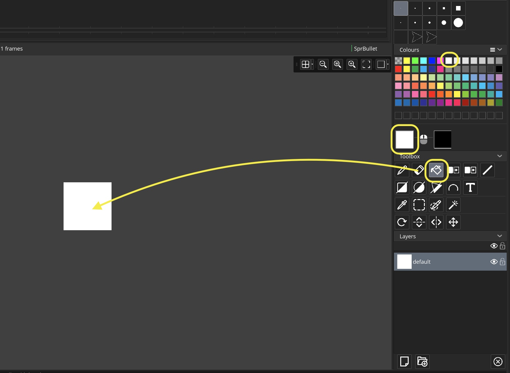  
</div>
</div>

___ 
<div class = "row">
<div class="col-12 col-lg-4 col align-self-center">
<div markdown = "1">
{:start="3"}
3. Create a new **Object** by right clicking on **Objects** in the **Resource** menu on the right and select **Create**.  Name it `ObjBullet` and bind `SprBullet` to it.  Here is a video of the entire bullet process:
</div>
</div>
<div class="col-12 col-lg-8">
<div class="embed-responsive embed-responsive-16by9">
<iframe class = "embed-responsive-item" src="https://www.youtube.com/embed/cAVLZiSyQcw?rel=0&amp;controls=0&amp&showinfo=0&autoplay=1&version=3&loop=1&playlist=cAVLZiSyQcw" frameborder="0" allowfullscreen></iframe>
</div>
</div>
</div>

___ 
<div markdown = "1">
{:start="4"}
4. Algorithm for bullet:

	&#9633; Bullet appears when spacebar is pressed <br/>
	&#9633; Bullet moves in the diretion that the ship is facing <br/>
	&#9633; Bullet has a speed that is faster than the ships <br/>
	&#9633; If it collides it does something <br/>
</div>
___ 

### Creating a new Object Instance

&#9633; Bullet appears when spacebar is pressed <br/>

1. Lets start by spawning a bullet when the spacebar is pressed.  How do we spawn objects that are not already in the game?  We need to look at another function called **_instance_create_layer(x, y, layer_id, obj)_**.  

> **instance_create_layer(x, y, layer_id, obj)**
> **Description**: With this function you can create a new instance of the specified object at any given point within the room and on the layer specified. The layer can be identified using the layer ID value (as returned by the function layer_create()) or by the name of the layer (as a string, for example "instance_layer") as defined in the room editor. This function returns the id of the new instance which can then be stored in a variable or used to access that instance. Note that this function will also call the Create Event of the instance being created before continuing with the code or actions for the event that called the function. - [GameMaker Manual](https://docs2.yoyogames.com/source/_build/3_scripting/4_gml_reference/instances/instance_functions/instance_create_layer.html)

___ 
<div class = "row">
<div class="col-12 col-lg-4 col align-self-center">
<div markdown = "1">   
{:start="2"} 
2. Before we can do this we need to change the name of the instance layer to `spaceship` in the room.  It will determine the sorting order of what is shown (in z or depth). Open by double left-mouse button clicking on `Lvl_1` and open the layer menu:
</div>
</div>
<div class="col-12 col-lg-8">
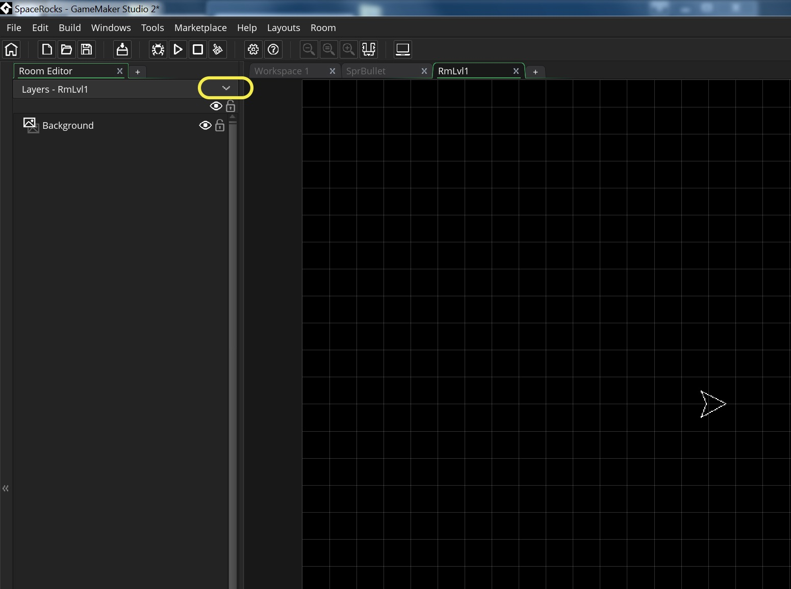  
<br />  
</div>
</div>

___ 
<div class = "row">
<div class="col-12 col-lg-4 col align-self-center">
<div markdown = "1">  
{:start="3"} 
3. Right click on Instance and rename it to `Spaceship`.   
</div>
</div>
<div class="col-12 col-lg-8">
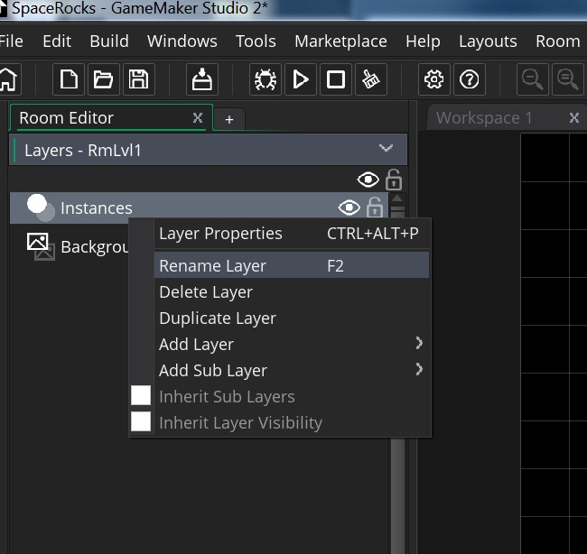  
</div>  
</div>

___ 
<div class = "row">
<div class="col-12 col-lg-4 col align-self-center">
<div markdown = "1">  
{:start="4"} 
4.  The draw order starts at the top and draws to the bottom.  So make sure the **Background** is below all layers you want to see in the game.
</div>
</div>
<div class="col-12 col-lg-8">
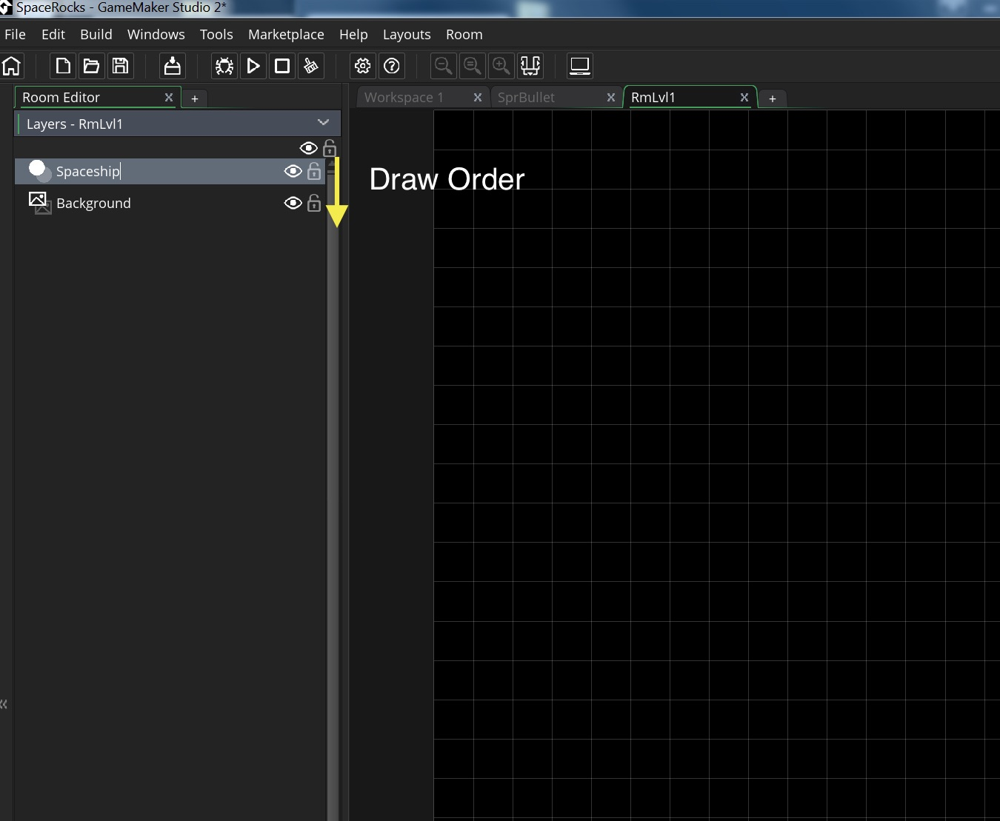  
</div>
</div>

___ 
<div class = "row">
<div class="col-12 col-lg-4 col align-self-center">
<div markdown = "1">  
{:start="5"} 
5.  Now we are ready to use `instance_create_layer(x, y, layer_id, obj)`. Open the **Step Event Script** for `ObjPlayer` and add to the beginning of the script:
</div>
</div>
<div class="col-12 col-lg-8">
<div markdown = "1"> 
```c
//Fire bullets with spacebar
if (keyboard_check(vk_space))
{
    instance_create_layer(x, y, "Spaceship", ObjBullet);    
}
```
</div>
</div>
</div>

___ 
<div class = "row">
<div class="col-12 col-lg-4 col align-self-center">
<div markdown = "1">  
{:start="6"} 
6. Run the game and test it out.  

    The plane does fire bullets but they don't move.  I guess you could say we have created a spaceship that can draw.  

    The bullets need to move at the 'image_angle' the ship is pointing at with a speed greater than the player (you don't want to be running into your own bullets). Your game should look like:
</div>
</div>
<div class="col-12 col-lg-8">
<div class = "embed-responsive embed-responsive-16by9">
<iframe class = "embed-responsive-item" src="https://www.youtube.com/embed/wiNKU_a3pQQ?rel=0&amp;controls=0&amp&showinfo=0&autoplay=1&version=3&loop=1&playlist=wiNKU_a3pQQ" frameborder="0" allowfullscreen></iframe>
</div>
</div>
</div>


___ 
<div markdown = "1">  
{:start="7"} 
7. So we have a problem, we need to set the speed of the bullet in the `ObjBullet` and at the direction of the `image_angle` of `ObjPlayer`.  

    How do we access variables from other **Game Objects**?

    There are a few ways of doing this.  We could use the **return** value of `instance_create_layer(x, y, layer_id, obj)` to set the bullet speed after we create it.  Another way is to access the `ObjPlayer`.  This method only works because the design specifies **one** player in the game.  

    We can access the variable in another object by dot referencing it.  For example to get the `x` value in `ObjPlayer` in another object, you can enter `ObjPlayer.x`.  If there were more than one ObjPlayer it will access all objects and you will get strange results as it will return the last player it looks at (not necessarilly the one you want).  But since there is only one player this should work.

</div>

___ 
<div class = "row">
<div class="col-12 col-lg-4 col align-self-center">
<div markdown = "1">  
{:start="8"} 
8. Create a new **Create Event Script** on `ObjBullet` by pressing **Add Event -> Create** _button_ and add:  
</div>
</div>
<div class="col-12 col-lg-8">
<div markdown = "1"> 
 ```c
/// @description initalize variables for bullet object

//Direction needs to point in the direction the ship is facing
direction = ObjPlayer.image_angle;

//Speed of the bullet
speed = 8;
```
</div>
</div>
</div>
<div class = "row">
<div class = "col">
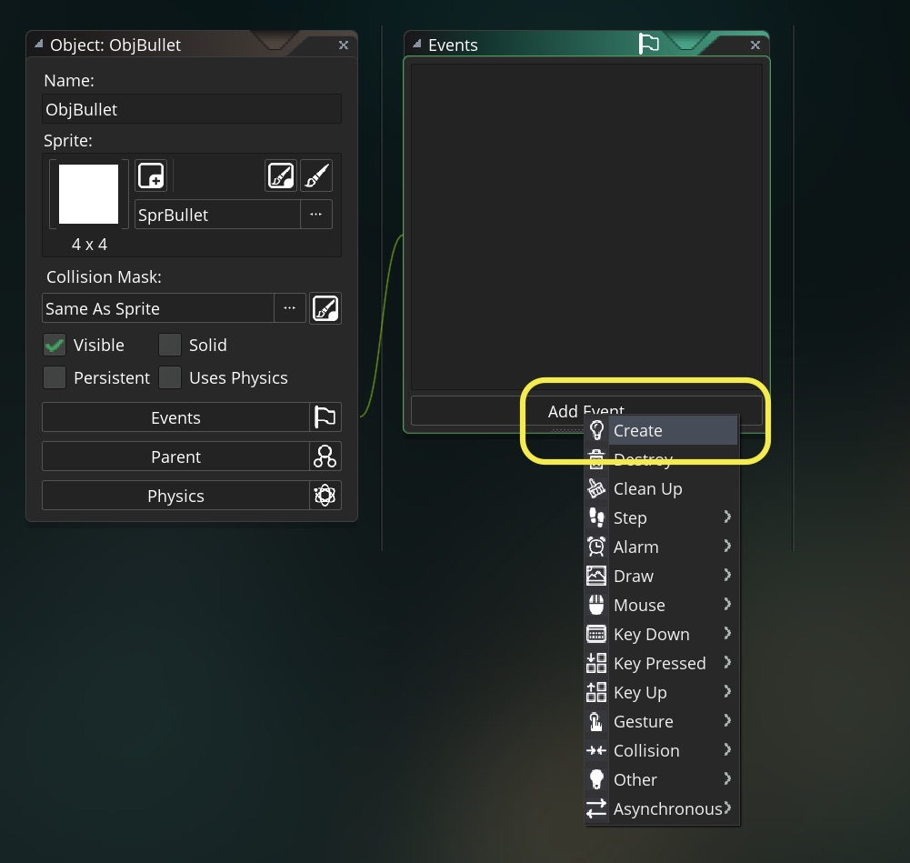  
</div>
<div class = "col">
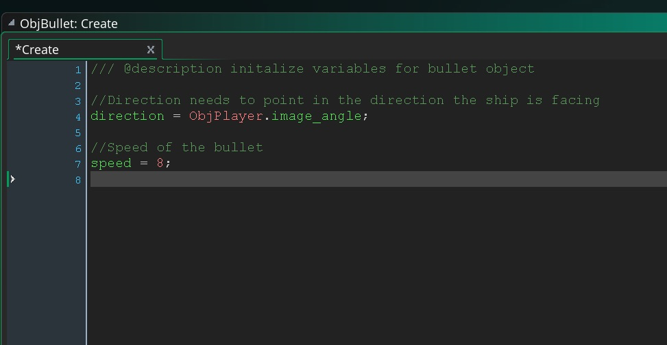  
</div>
</div>

___ 
<div class = "row">
<div class="col-12 col-lg-4 col align-self-center">
<div markdown = "1">  
{:start="9"} 
9. Run the game and test it out.  

    What is the problem?  

    Oh, we have a solid line of bullets, so killing space rocks hurling at us will be way to easy.  We need to limit the rate of fire to 3 shots per second (roughly).  How do we do this?  We need to use a compound if statement.  Not only does the space bar need to be pressed but we also must have had 10 frames pass before a bullet is ready in the chamber.  So we need to introduce the concept of compound logical operators.  
</div>
</div>
<div class="col-12 col-lg-8">
<div class = "embed-responsive embed-responsive-16by9">
<iframe class = "embed-responsive-item" src="https://www.youtube.com/embed/wE2wC_cHXRY?rel=0&amp;controls=0&amp&showinfo=0&autoplay=1&version=3&loop=1&playlist=wE2wC_cHXRY" frameborder="0" allowfullscreen></iframe>
</div>
</div>
</div>

___ 
### Compound Logical Operators 

1. There are two logical operators we will talk about the **_and_** operator ``` &&  ``` and the **_or_** ``` || ``` operator.  So in an **_if (true)_** statement, we can string multiple logical operations together.  

<div class="table table-striped">
<div class = "indent">
<div markdown = "1">


| **Operator** | **Example** | **Description** |
| -------- | -------- | -------- | -------- |
|  **_&&_** (and) | **_A && B_** | Both A and B **both** have to be true for the statement to be true.|
|  **_&#124;&#124;_** (or) | **_A &#124;&#124; B_** | Either A or B have to be true for the statement to be true.|


</div>
</div>
</div>
___ 
<div markdown = "1">  
{:start="2"} 
2. We can have as many chaining compound statements as we need, such as if (true && true && true ).  For the previous if statement to be true, all conditions need to be true.  In an (true \|\| true \|\| true) then only one of the three operations needs to be true for the entire statement to be true.  
</div>

___ 
<div markdown = "1">  
{:start="3"} 
3. In the below table we have two values **P** and **Q**.  The **AND** Column and **OR** column show whether these two values resolve to a true of false.  Here is a truth table:
</div>
<div class="table table-striped">
<div class = "indent">
<div markdown = "1">


| **P** | **Q** | **AND** | **OR** |
| -------- | -------- | -------- | -------- |
| T | T | T | T |
| T | F | F | T |
| F | T | F | T |
| F | F | F | F |


</div>
</div>
</div>

___ 
<div markdown = "1">  
{:start="4"} 
4. So now with this we will have a variable called ``` rateOfFire ```.  This will be used as a counter.  We will also creater a variable called ``` counter ```.  Here is the algorithm:
    1.  When firing, check if ``` counter ``` is at ``` rateOfFire ```
    2.  If it is fire bullet set ``` counter ``` back to ``` 0. ``` 
    3.  Else if the  ``` counter  ``` is less than  ``` rateOfFire  ``` then increment the timer by one each frame
</div>
___ 
<div class = "row">
<div class="col-12 col-lg-4 col align-self-center">
<div markdown = "1">  
{:start="5"} 
5. Open the **Create Event Script** for `ObjPlayer` and add to bottom two new variables.  One storing the rate of fire and the other a timer that will count upwards (so we set it to the rateOfFire so it can fire right away):  
</div>
</div>
<div class="col-12 col-lg-8">
<div markdown = "1"> 
```c
//rate of fire
rateOfFire = 10;

//used to count down rateOfFire
timer = rateOfFire;
```
</div>
</div>
</div>

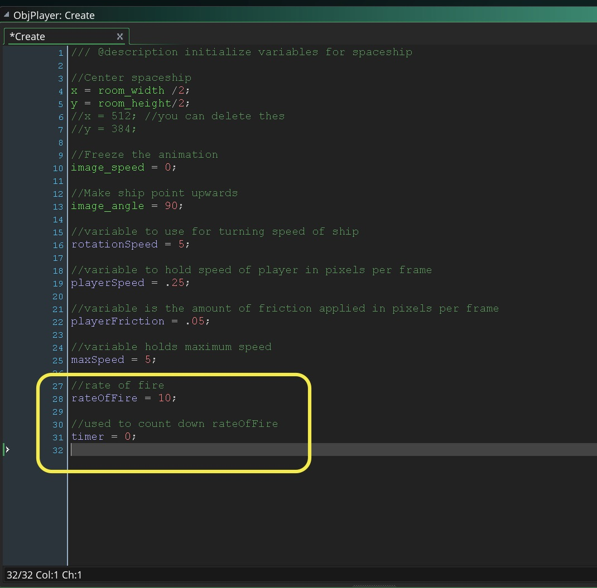  
<br />  


___ 
<div class = "row">
<div class="col-12 col-lg-4 col align-self-center">
<div markdown = "1">  
{:start="6"} 
6. We will check to see if space is pressed and if rateOfFire is at its ending amount. Open the **Step Event Script** for `ObjPlayer`:  
</div>
</div>
<div class="col-12 col-lg-8">
<div markdown = "1"> 
```c
//Fire bullets with spacebar
if (keyboard_check(vk_space) and timer == rateOfFire) //added and timer == rateoffire
{
    instance_create(x, y, ObjBullet);
    timer = 0;    
}
else if (timer < rateOfFire)
    {
        timer = timer + 1;
    }
}
```
</div>
</div>
</div>

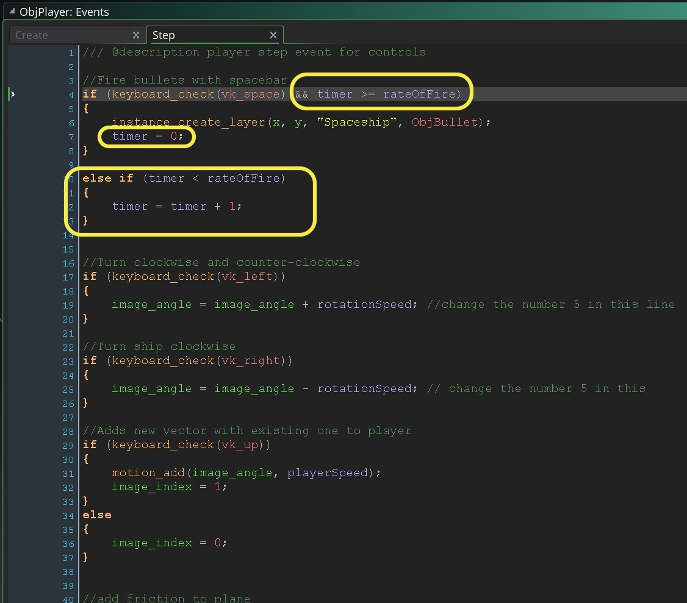 
<br /> 

___ 
<div class = "row">
<div class="col-12 col-lg-2 col align-self-center">
<div markdown = "1">  
{:start="7"} 
7. Play the game and test it.  Now it seems like we are done.  But are we really?
</div>
</div>
<div class="col-12 col-lg-10">
<div class = "embed-responsive embed-responsive-16by9">
<iframe  src="https://www.youtube.com/embed/SpJNyu_QMyw?rel=0&amp;controls=0&amp&showinfo=0&autoplay=1&version=3&loop=1&playlist=SpJNyu_QMyw" frameborder="0" allowfullscreen></iframe>
</div>
</div>
</div>

___ 
<div class = "row">
<div class="col-12 col-lg-4 col align-self-center">
<div markdown = "1">  
{:start="8"} 
8. Sometimes when we are in a hurry we don't think about the entire consequences of our actions.  In this case we spawn bullets and they fire.  What happens when they leave the room?  Lets look at the debugger, run the game in debug mode (**Debug** icon button on the top menu):
</div>
</div>
<div class="col-12 col-lg-8">
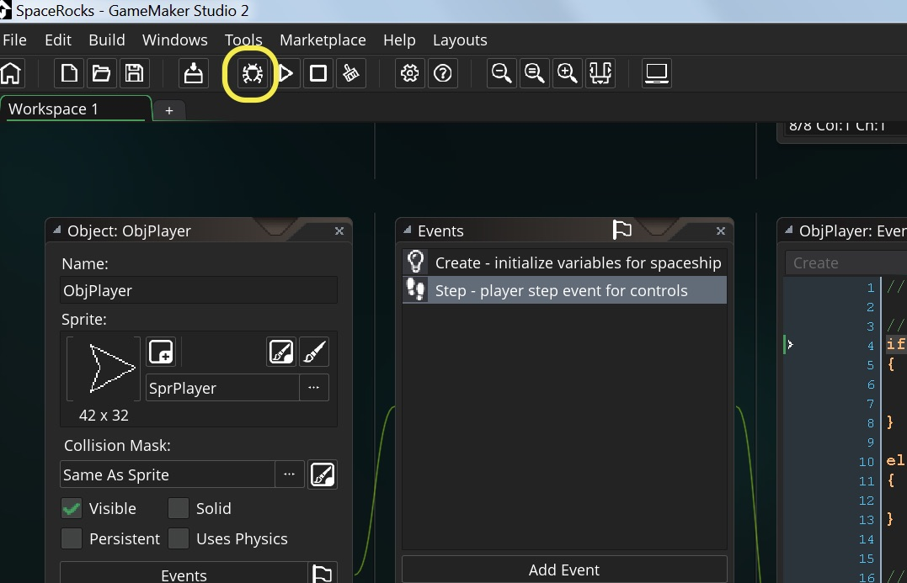  
</div>
</div>

___ 
<div class = "row">
<div class="col-12 col-lg-4 col align-self-center">
<div markdown = "1">  
{:start="9"} 
9. Now right click on top of the right menu and make sure you have in **Type**, **All Instances** set.  The press the **Turn on realtime updates** button on the menu bar.  Now play the game and fire bullets until they leave the screen.  Notice a problem?  
</div>
</div>
<div class="col-12 col-lg-8">
<div class = "embed-responsive embed-responsive-16by9">
<iframe class = "embed-responsive-item" src="https://www.youtube.com/embed/Tjmh-s7vV00?rel=0&amp;controls=0&amp&showinfo=0&autoplay=1&version=3&loop=1&playlist=Tjmh-s7vV00" frameborder="0" allowfullscreen></iframe>
</div>
</div>
</div>

___ 
<div class = "row">
<div class="col-12 col-lg-4 col align-self-center">
<div markdown = "1">  
{:start="10"} 
10. Hmmm, the bullets are still in the game even though they are not on the screen.  Lets look at the ``` x ``` and ``` y ``` coordinate on one of these sprites:  
</div>
</div>
<div class="col-12 col-lg-8">
<div class = "embed-responsive embed-responsive-16by9">
<iframe class = "embed-responsive-item" src="https://www.youtube.com/embed/_t4b8nMsVeY?rel=0&amp;controls=0&amp&showinfo=0&autoplay=1&version=3&loop=1&playlist=_t4b8nMsVeY" frameborder="0" allowfullscreen></iframe>
</div>
</div>
</div>

___ 
<div markdown = "1">  
{:start="11"} 
11. As you can see they keep going and going.  Not a problem in a game this simple and with a few bullets.  But if we kept shooting eventually the framerate would suffer and the game would run out of memory.  Since the bullets provide no gameplay functionality when they leave the room we will destroy them, which leads to another GameMaker function to destroy objects:

> instance_destroy()<br>
> Returns: N/A (void)<br><br>
> **Description**: "You call this event whenever you wish to "destroy" an instance which will remove it from the room, but you should note a couple of things about this however. <br><br>
> First, when you destroy an instance, its destroy event is called immediately after the code or action that calls the destroy. Second, although the destroy event is performed, the instance is not immediately removed from the game, as it will continue to perform the code contained in the current event and only when the current event is over will it be removed from the game. <br><br>
> So, if you have, for example, this code: <br>
> `if hp <=0 instance_destroy();` <br>
 `score += 10`<br><br>
> The variable "score" will be incremented even though the instance_destroy function has been called, and the instance will finally be removed from your game at the end of the event. Be careful of this, as if you have (for example) created a dynamic resource for the instance, like a data structure, then destroyed that resource in the destroy event, if there are any references to it after the destroy function or action has been performed then you will get an "unknown resource" error, as the destroy event removed it from the game." - [GameMaker manual](https://docs2.yoyogames.com/source/_build/3_scripting/4_gml_reference/instances/instance_functions/instance_destroy.html)
</div>

___ 
<div class = "row">
<div class="col-12 col-lg-4 col align-self-center">
<div markdown = "1">  
{:start="12"} 
12. We will also need to use a new **_Event_** type called **_Outside_Room_** to call this script.  This should be self explanatory as this script will only run when an object leaves the room.  Press on `ObjBullet` **Add Event** and select **Other -> Outside Room** and add to the script:
</div>
</div>
<div class="col-12 col-lg-8">
<div markdown = "1"> 
```c
/// @description kill object when out of room

//destroy myself
instance_destroy();
```
</div>
</div>
</div>

<div class = "row">
<div class = "col">
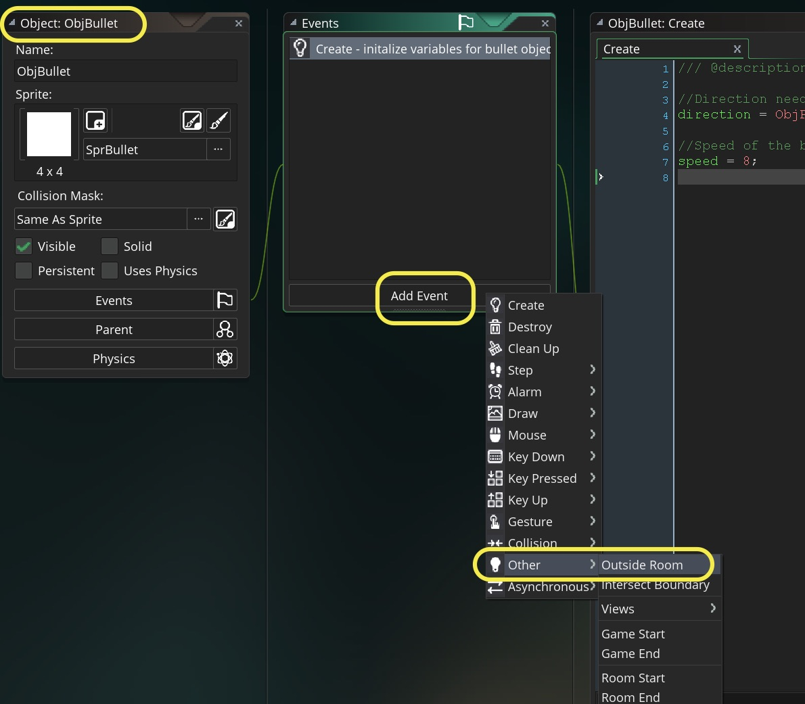  
<br />  
</div>
<div class = "col">
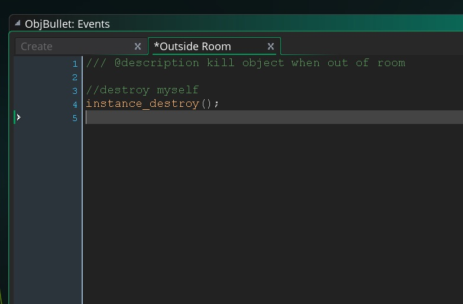  
</div>
</div>

___ 
<div class = "row">
<div class="col-12 col-lg-2 col align-self-center">
<div markdown = "1">  
{:start="13"} 
13. Now you can check the work in your debugger as this is the only way you can see if it is working. You should now see the bullets destroy themselves when they leave the screen:
</div>
</div>
<div class="col-12 col-lg-10">
<div class = "embed-responsive embed-responsive-16by9">
<iframe class = "embed-responsive-item" src="https://www.youtube.com/embed/gO6Hb0LUN9U?rel=0&amp;controls=0&amp&showinfo=0&autoplay=1&version=3&loop=1&playlist=gO6Hb0LUN9U" frameborder="0" allowfullscreen></iframe>
</div>
</div>
</div>

___ 
<div markdown = "1">  
{:start="14"} 
14.  It is not Spacerocks without the rocks. Let's go to the next page to add rocks to the game.

___ 

<br><br>

[<- Previous](SpaceRocks_2.html)&nbsp;&nbsp;&nbsp;[Home](../../index.html)&nbsp;&nbsp;&nbsp; [Continue ->](SpaceRocks_4.html)
</div>
<br />  
<br />  
<br />  
<br /> 