## Rocks  
___ 
1. Now that we have the spaceship and bullets double check that you are happy with all the speed, friction and rotation values.  We want to be 100% happy with our main physics as our tuning of how fast to frequent to launch the rocks depends on the user maneuverability of the ship.  In games we often lock the physics down before we enter level design. Tune these values to your liking as it will affect your game flow going forward.

    &#9635; ~~Create bullet sprite & object~~ <br />
    &#9635; ~~Create firing logic for bullets~~ <br />
    &#9633; Create 3 rock sprites and objects <br />

___ 
<div markdown = "1">  
{:start="2"} 
2.  We need to create 3 rocks of different sizes.  Create 3 rocks of different sizes (I created a 160 x 160, 96 x 96 and 64 x 64).  Call them `SprRockLarge`, `SprRockMed` and `SprRockSmall`. 


<br><br>
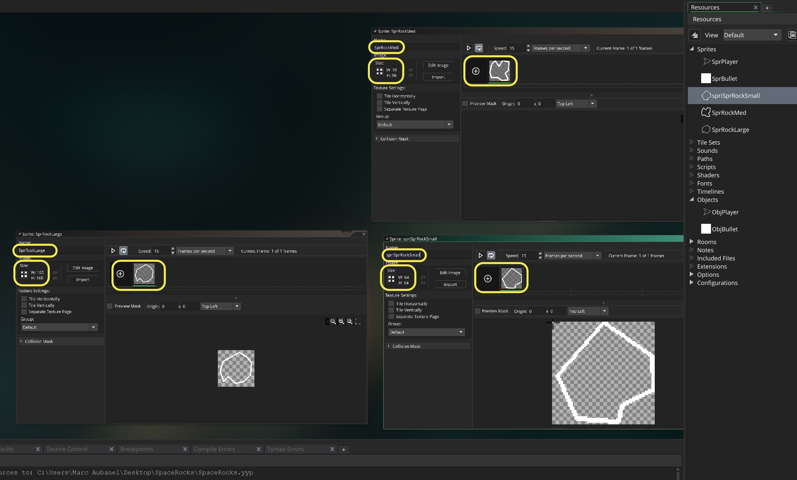 
</div>

___ 
<div class = "row">
<div class="col-12 col-lg-4 col align-self-center">
<div markdown = "1">  
{:start="3"} 
3.  I chose to use a wider line so they would really stand out and there would be less aliasing on the sprite. I used just the outline polygon tool for the job:
</div>
</div>
<div class="col-12 col-lg-8">
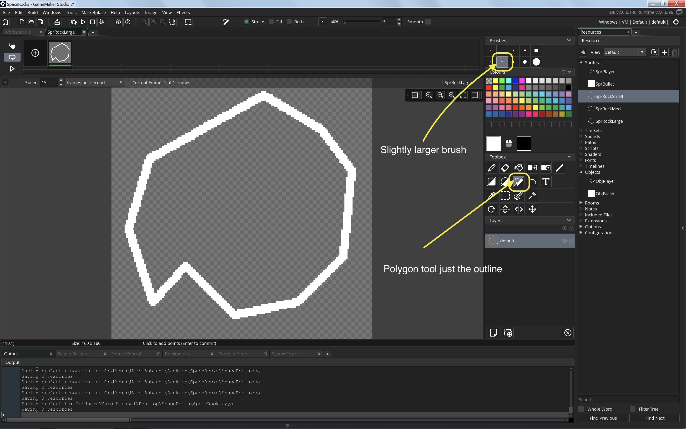 
</div>
</div>

___ 
<div class = "row">
<div class="col-12 col-lg-4 col align-self-center">
<div markdown = "1"> 
{:start="4"} 
4. Center the **origin** all three sprites to **Middle Center** in the true center of the object (not the center of the rock)
</div>
</div>
<div class="col-12 col-lg-8">
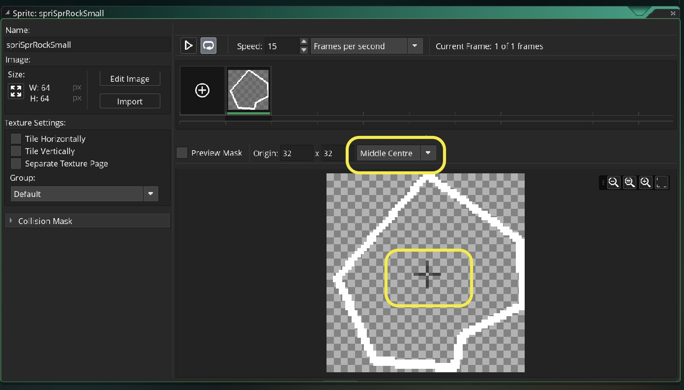 
</div>
</div>

___ 

### Parent / Child Hierarchy

1. Now we can assign each rock to its own object.  But then we will have to check collision with each rock even though they all exhibit a similar behavior.  There is a fascility within GameMaker to handle this scenario.  They have included the ability to have object inherit from other objects.  This is a **parent** - **child** relationship.  So we can create a parent rock that all three other rocks inherit from.  Here is a description of this fascility:

> **Parents are objects that form part of a hierarchy, grouping multiple "child" objects together.**<br><br>  
> "One of the most powerful options within the object properties is the ability to assign a parent. Every object in the game can have a parent object, but what does this mean? Well, when an object has a parent, it can share code, actions and events with that parent. This is called "inheritance" and an object that has a parent is called a "child". But that's not all! You can also do checks and run code on parent objects which automatically include the child objects too which saves a lot of time and energy. Another way to look at a parent object is as a way to "group" objects together under the same umbrella and have them share certain things without loosing their own identity. Now, this may seem a bit complicated to understand so let's give some examples:<br><br>  
> Say you have a player object and four different enemy objects. Now, you want the player to die if he touches any of these four objects and this would normally entail four collision events with four sets of actions or code, one for each of the enemy objects. BUT if we make a parent object for all the enemies, then we can create one collision event with the parent object only and it will trigger no matter which one of the four "child" enemy objects touch the player. Handy stuff!" - [GameMaker Manual](https://docs2.yoyogames.com/source/_build/2_interface/1_editors/objects.html#object_parent)  

___ 
{:start="2"} 
2. Since the child inherits everything from the **parent** including scripts we can reduce the number of reduntant scripts we need.  So we know we need to have bullet collisions with each rock, what other common abilities to the rocks demonstrate?  The one that comes to mind right away is the ability to wrap from one side of the screen to another.  So lets create a new **Object** and call it `ObjRockParent` and **DO NOT BIND ANY SPRITES TO IT**.  

___ 
<div class = "row">
<div class="col-12 col-lg-4 col align-self-center">
<div markdown = "1">  
{:start="3"} 
3. Create a new **Step Event Script** called and add:
</div>
</div>
<div class="col-12 col-lg-8">
<div markdown = "1">  
```c
/// @description shared step code for all space rocks

//wrap rock horizontally and vertically
move_wrap(true, true, 200);
```
</div>
</div>
</div>

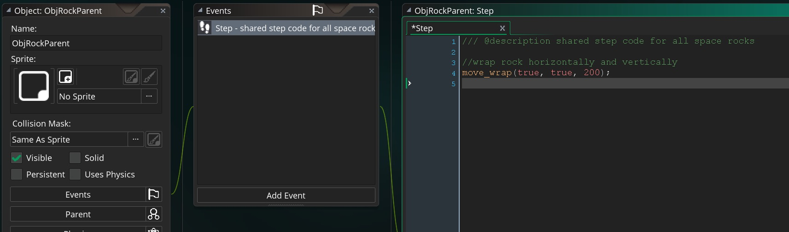 


___ 
<div markdown = "1">  
{:start="4"} 
4. Why did I make the move_wrap() margin parameter equal to `200`? I don't want to rock blipping on or off when the origin leaves the screen as it will blip on and off (try setting it to 0 and see what I mean).  I also want to place the rocks just outside the room when they get spawned and I don't want them wrapping.  There is also a gameplay function.  It allows the player time to get out of the way of an oncoming wrapping rock if they pay attention.
</div>

___ 
<div markdown = "1">  
{:start="5"} 
5. Now lets have a child inherit from the parent.  Let's create a new **_object_** called `ObjRockLarge` and bind the sprite `SprRockLarge` to it.<br><br>Then inherit from the parent by pressing the box next to the **_Parent_** button and select **_ObjRockParent_**:  


</div>

<div class = "row">
<div class = "col">
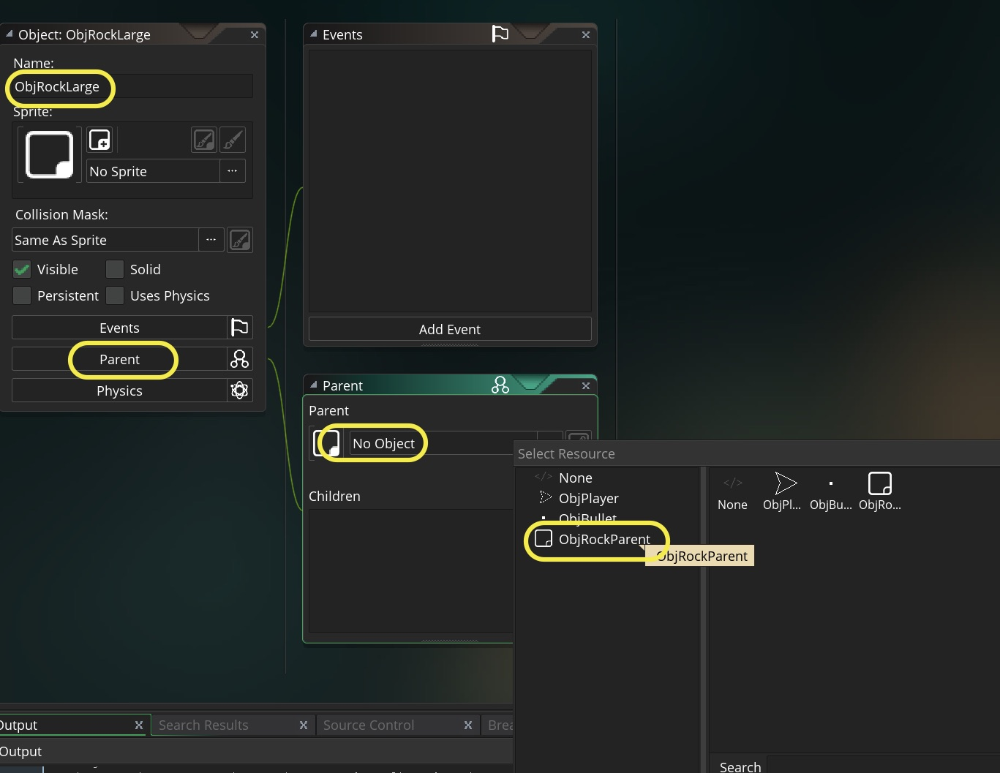 
</div>
<div class = "col">
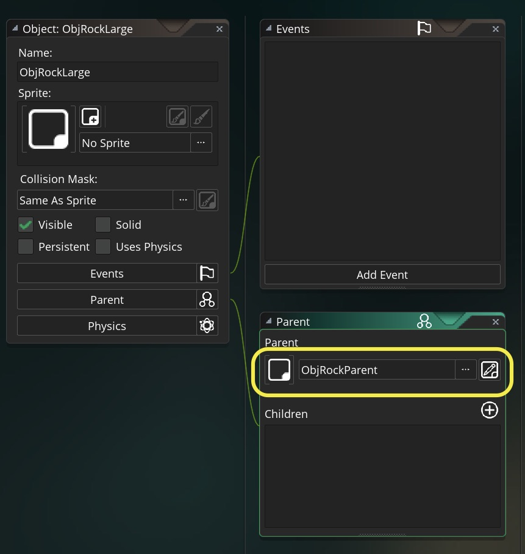 
</div>
</div>

___ 
<div class = "row">
<div class="col-12 col-lg-4 col align-self-center">
<div markdown = "1">  
{:start="6"} 
6. So this large rock should inherit functionality from its parent (`move_wrap()`).  Now lets test it by putting a temporary create script that moves the rock in a `direction` with `speed`.  Create a new **Create Event Script** and enter:  
</div>
</div>
<div class="col-12 col-lg-8">
<div markdown = "1">  
```c
/// @description test create script

//TEMPORARY TEST SCRIPT - REMEMBER TO DELETE
direction = 220;
speed = 2;
```
</div>
</div>
</div>

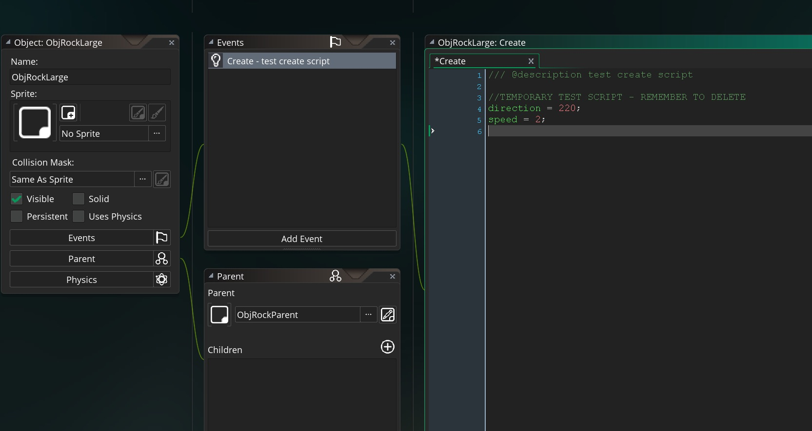 
<br />  

___ 
<div markdown = "1">  
{:start="7"} 
7. See the above only has a create event.  It inherits the **Step Event Script** from it's parent `ObjRockParent`.  Now open our one level `Lvl_1` and add a new **Instance Layer** called `Rocks`. We put it above the Spaceship as we want them to be drawn on top of the space ship as the formost foreground instance.
</div>
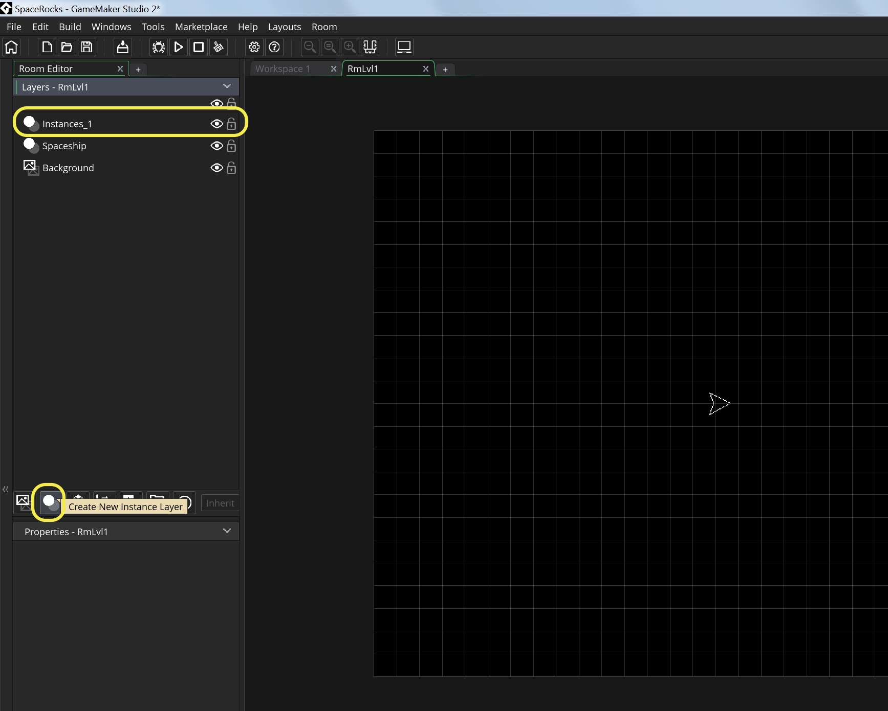 
<br />  
<div class = "row">
<div class = "col-6">
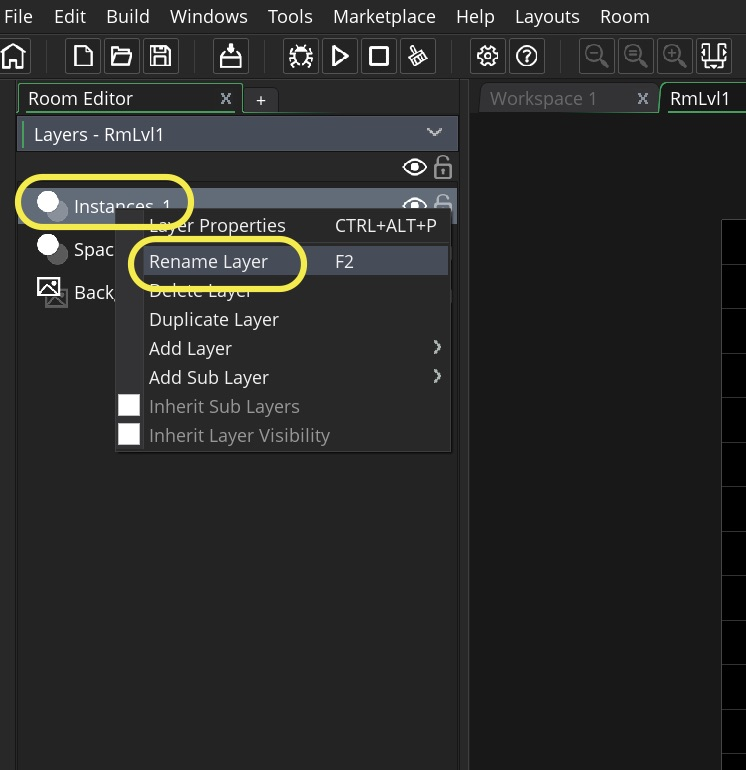 
</div>
<div class = "col-6">
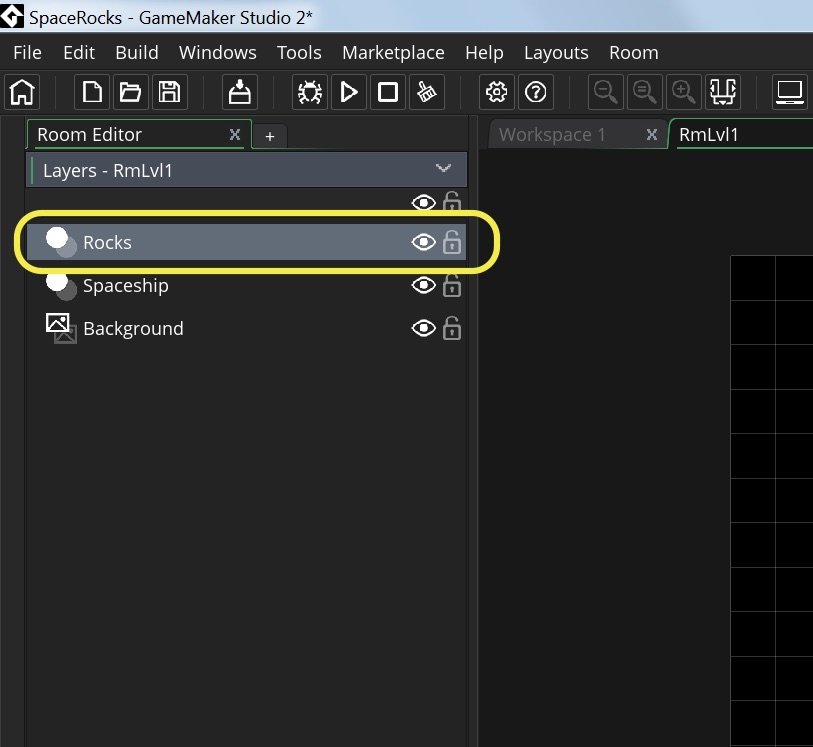 
</div>
</div>

___ 
<div class = "row">
<div class="col-12 col-lg-4 col align-self-center">
<div markdown = "1"> 
{:start="8"} 
8. Drag and drop `ObjRockLarge` from the **Resources** menu to the top right hand corner of the room and lets see if it inherits the step event through the parent.  Run the game and give it a shot.  You should have the rock calling `move_wrap` from the parent object.
</div>
</div>
<div class="col-12 col-lg-4 col align-self-center">
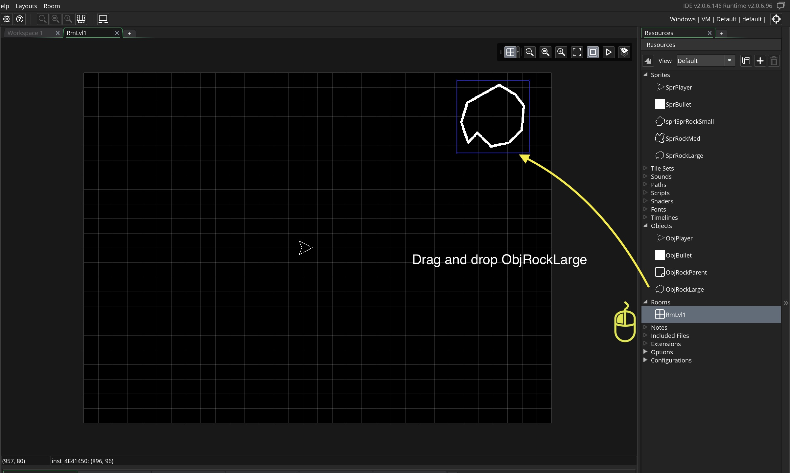 
</div>
</div>  

<div class = "embed-responsive embed-responsive-16by9">
<iframe class = "embed-responsive-item" src="https://www.youtube.com/embed/qrSRxvXQkDg?rel=0&amp;controls=0&amp&showinfo=0&autoplay=1&version=3&loop=1&playlist=qrSRxvXQkDg" frameborder="0" allowfullscreen></iframe>
</div>
<br />

___ 
### Collision Event  

&#9635; ~~Create 3 rock sprites and objects~~ <br />
&#9633; Create collision for bullets hitting rocks <br />

1. Now lets destroy the the bullet when the bullet hits the rock.  We are going to use a **_collision event_** type.  

> **The Collision Event**
> "Obviously when making a game, it is very important that you know when two (or more) instances of an object have collided, and for that we have the collision event. This is an event that you place in an object and then specify against which other object you should be checking for collisions.<br><br>
> When you don't have physics turned on, these collisions will be calculated based on the mask of the two objects (the mask is defined within the sprite properties, or can be assigned independently in the object properties) and whether they overlap or not. Note, that if one or the other instances in the collision does not have a mask assigned (or the sprite mask is set to nothing), even if it is drawing something no collisions will be detected. If you have Physics on, then the collision will be based on the type of collision shape (Fixture) that you have defined for the object in its physics properties, as will its reaction to the collision. This means you may not need any code to deal with the collision, but this event will still need to have at least a comment in it for the collisions to be detected." - [GameMaker Manual](https://docs2.yoyogames.com/source/_build/2_interface/1_editors/events/index.html#object-event-collision)

___ 
<div class = "row">
<div class="col-12 col-lg-4 col align-self-center">
<div markdown = "1"> 
{:start="2"} 
2.  Now you have to be careful with collision events.  You only put it on one of the two objects colliding.  If you have collision events on both objects there could be bugs and issues if they are trying to do the same thing.  We will have the collision on the bullet itself (though we could have decided to put it on the rock parent).  Open `ObjBullet` and press **Add Event** and select **Collision -> ObjRockParent**.  Now why do I pick `ObjParent` instead of `ObjRockLarge`?  This is the beauty of inheritance.  If all the rocks inherit from parent then they will all respond to the same collision event.  This means I only need to set it once and it will work on all rocks who inherit from `ObjRockParent`.  Add to the new collision script:
</div>
</div>
<div class="col-12 col-lg-8">
<div markdown = "1">  
```c
/// @description byllet and rock collision

//destroy bullet
instance_destroy();
```
</div>
</div>
</div>
___ 
<div class = "row">
<div class="col-12 col-lg-4 col align-self-center">
<div markdown = "1"> 
{:start="3"} 
3.  Run the game and shoot the rock.  The bullet should disapear but the rock remains intact.  This is the first step done (notice that the collision is not very accurate, we will address this later).
</div>
</div>
<div class="col-12 col-lg-8">
<div class = "embed-responsive embed-responsive-16by9">
<iframe width="560" height="315" src="https://www.youtube.com/embed/NrREmsQHBCY?rel=0&amp;controls=0&amp&showinfo=0&autoplay=1&version=3&loop=1&playlist=NrREmsQHBCY" frameborder="0" allowfullscreen></iframe>
</div>
</div>
</div>

___ 
### Alarms  
&#9633; Level design, escalate difficulty by launching various waves of rocks 

1.  We are going to jump forward.  Before we can test all of our collisions we need to launch at least one of each rock type in the game.  We will be using **Alarms**.

___ 
<div markdown = "1"> 
{:start="2"} 
2. So how do we trigger future events?  GameMaker gives us an Alarm event that allows us to trigger scripts in the future.  We need it to be on the **_ObjGameController_** as the rock and player involved in the collision will both be destroyed.  So we will access the Alarm from the Game Controller through dot (.) referencing it ``` ObjGameController.alarm[0] ```.  

> **The alarm events are one of the many events that can be triggered in an instance and may contain code**
> "In the Alarm Event menu youger select the alarm that you wish to create and, once that is done, you will see that it has been added to the event window allowing you to add actions to it as normal. But what is an alarm? Well, it is a special event that does nothing unless the alarm has been previously set, and then it will wait until that alarm has counted down to 0 before running the actions or code that you have added into it. So, say you set alarm[0] in the create event of the object to 30, this means that GameMaker: Studio will count down 30 game cycles (steps) before it runs the actions or code that are placed in the alarm[0] event." - [GameMaker Manual](https://docs2.yoyogames.com/source/_build/2_interface/1_editors/events/index.html#object_event_alarm)
</div>

___ 
<div class = "row">
<div class="col-12 col-lg-4 col align-self-center">
<div markdown = "1"> 
{:start="3"} 
3.  Now what **Game Object** should we use to trigger the rocks.  `ObjPlayer` is one option, but when it dies by being hit by a rock then the alarms die with it.  The rocks all can get destroyed so that is not good.  We need a level object that only deals with level design issues and has no sprite.  Create a new **Game Object** called `ObjLevelController` and leave it empty in its default state:
</div>
</div>
<div class="col-12 col-lg-8">
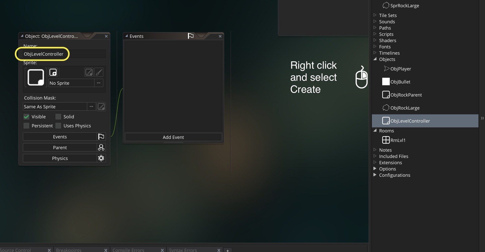 
</div>
</div>

___ 
<div class = "row">
<div class="col-12 col-lg-4 col align-self-center">
<div markdown = "1"> 
{:start="4"} 
4.  Drag this object anywhere into the room and look as it puts a question mark on it.  It doesn't matter what layer it is on as it is not being rendered.  Also delete the `ObjRockLarge` that is in the room as we will script these and not place them in the room.
</div>
</div>
<div class="col-12 col-lg-8">
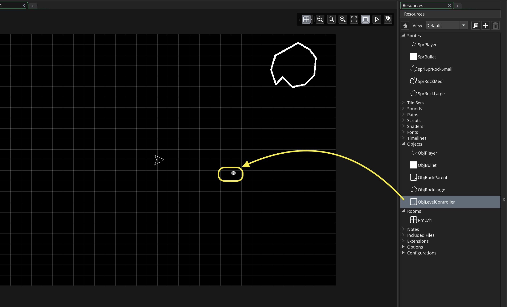 
</div>
</div>  

___ 
<div class = "row">
<div class="col-12 col-lg-4 col align-self-center">
<div markdown = "1"> 
{:start="5"} 
5.  Lets create an alarm to trigger the small rock on the top right corner going towards bottom left at 1 second into the game, the medium rock from the left center moving toward the right at 6 seconds, and the large rock from the bottom right going to the top left at 10 seconds.  We need to create the two missing rock objects. Create a new `ObjRockMed` and `ObjRockSmall` with the sprites assigned and the **Parent** both set to `ObjRockParent`.
</div>
</div>
<div class="col-12 col-lg-8">
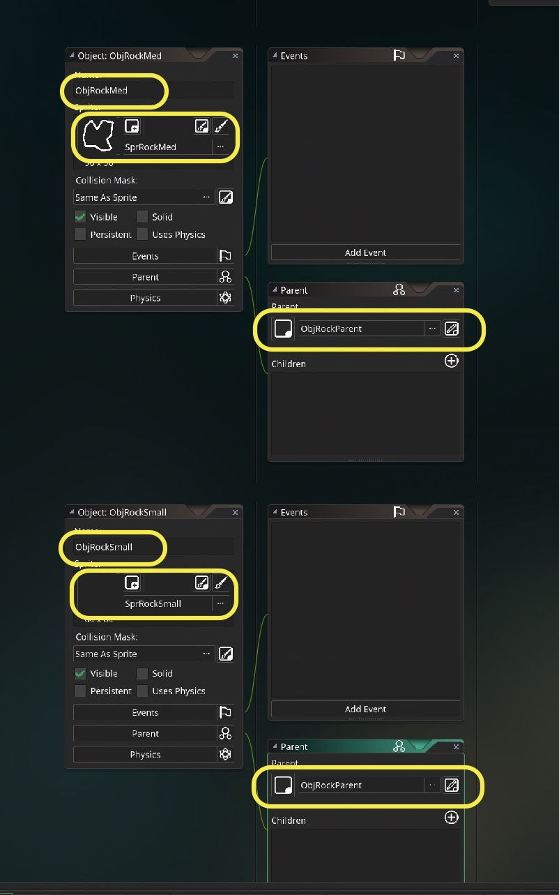 
<br />  
</div>
</div>

___ 
<div class = "row">
<div class="col-12 col-lg-4 col align-self-center">
<div markdown = "1"> 
{:start="6"} 
6. Open a new create event in `ObjLevelController` and add:
</div>
</div>
<div class="col-12 col-lg-8">
<div markdown = "1"> 
```c
/// @description Launch rocks for Asteroids game

// Launch rocks
//room_speed is 1 second in time, and allows us to adjust the framerate without affecting our level flow

alarm[0] = room_speed;
alarm[1] = room_speed * 6;
alarm[2] = room_speed * 10;
```
</div>
</div>
</div>
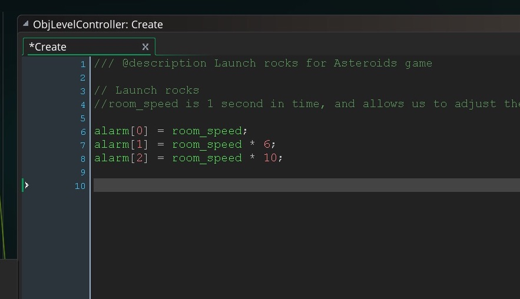 
<br />  

___ 
<div class = "row">
<div class="col-12 col-lg-4 col align-self-center">
<div markdown = "1"> 
{:start="7"} 
7. Now lets create an alarm script.  On`ObjLevelController` click **Add Event** and select an **Alarm -> Alarm 0** event and add this to the script:
</div>
</div>
<div class="col-12 col-lg-8">
<div markdown = "1"> 
``` c
/// @description launch small rock

//trigger the small rock on the top right corner going towards bottom left
instance_create_layer(room_width, 64, "Rocks", ObjRockSmall);
```
</div>
</div>
</div>

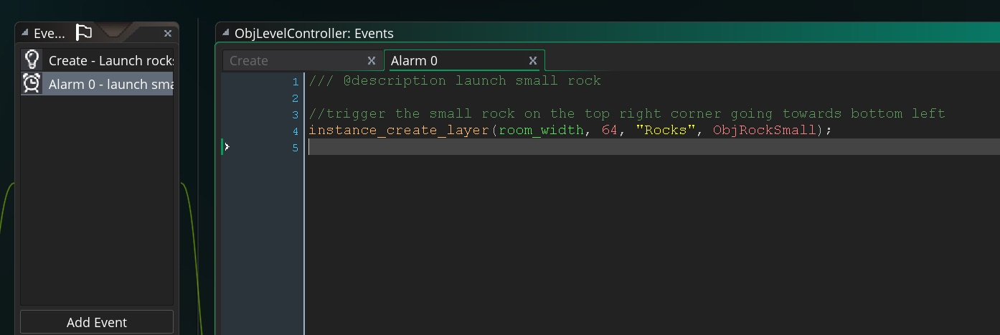 
  
___ 
<div class = "row">
<div class="col-12 col-lg-4 col align-self-center">
<div markdown = "1"> 
{:start="8"} 
8.  Delete the test rock in the room and delete its **Create Event** entirely. Run the game and you should see the rock appear on the top right corner but doesn't move. 
</div>
</div>
<div class="col-12 col-lg-8">
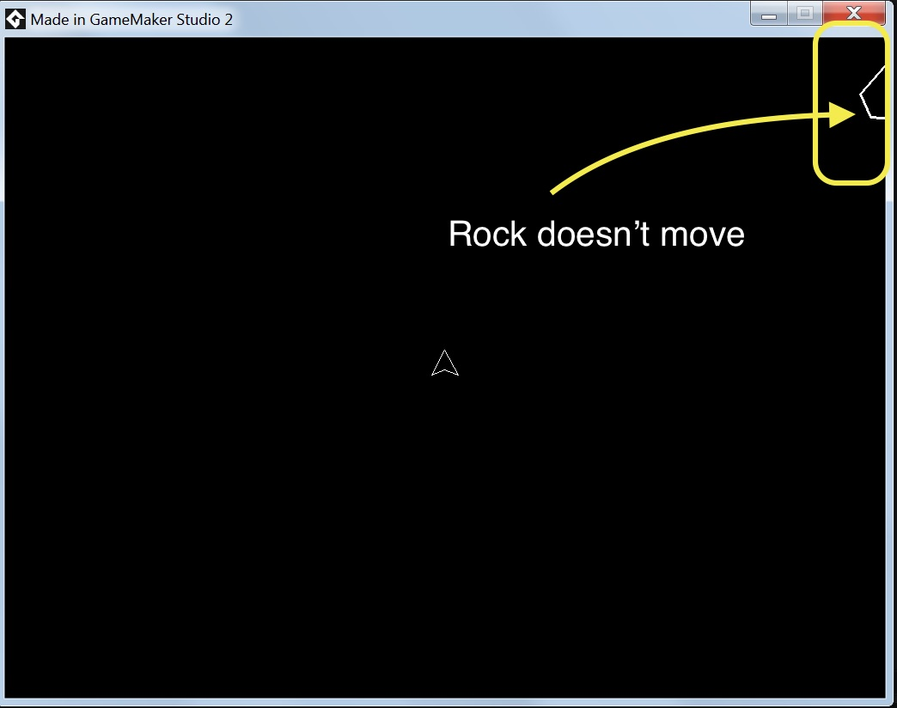 
<br />  
</div>
</div>

___ 
<div class = "row">
<div class="col-12 col-lg-4 col align-self-center">
<div markdown = "1"> 
{:start="9"} 
9. Two problems, it should start on screen and it should be animating towards the bottom left.  We could put it in the **Create Event** on `ObjRock` small but what if we want to launch it multiple times with different settings?  Well `instance_create_layer()` returns a real number with the id of the instance it creates.  So we can dot index into its variables.  Change the Alarm 0 to:
</div>
</div>
<div class="col-12 col-lg-8">
<div markdown = "1"> 
``` c
/// @description launch small rock

//trigger the small rock on the top right corner going towards bottom left
smRock = instance_create_layer(room_width + 64, -64, "Rocks", ObjRockSmall);
smRock.direction = 225;
smRock.speed = 2;
```
</div>
</div>
</div>

___ 
<div class = "row">
<div class="col-12 col-lg-2 col align-self-center">
<div markdown = "1"> 
{:start="10"} 
10. Run the game you should see this:
</div>
</div>
<div class="col-12 col-lg-10">
<div class = "embed-responsive embed-responsive-16by9">
<iframe class = "embed-responsive-item" src="https://www.youtube.com/embed/LH6nBRSp3F0?rel=0&amp;controls=0&amp&showinfo=0&autoplay=1&version=3&loop=1&playlist=LH6nBRSp3F0" frameborder="0" allowfullscreen></iframe>
</div>
</div>
</div>

___ 
<div class = "row">
<div class="col-12 col-lg-4 col align-self-center">
<div markdown = "1"> 
{:start="11"} 
11. OK, lets add the other two rocks.  Create a new **Alarm Event** on `ObjLevelController` and select **Alarm -> Alarm 1** and add:
</div>
</div>
<div class="col-12 col-lg-8">
<div markdown = "1"> 
``` c
/// @description launch medium rock

//trigger the medium rock from the left center moving toward the right
mdRock = instance_create_layer(-64, room_height/2, "Rocks", ObjRockMed);
mdRock.direction = 5;
mdRock.speed = 3;
```
</div>
</div>
</div>

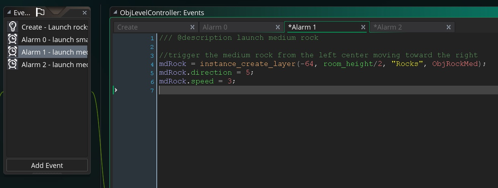 
<br />  

___ 
<div class = "row">
<div class="col-12 col-lg-4 col align-self-center">
<div markdown = "1"> 
{:start="12"} 
12.  Run the game, make sure two rocks launch.  Now lets add the third by triggering **Alarm 2** and add to the script:
</div>
</div>
<div class="col-12 col-lg-8">
<div markdown = "1"> 
```
/// @description Large Rock
// Trigger the large rock form teh bottom right going to top left
mdRock = instance_create_layer(room_width, room_height + 64, "Rocks", ObjRockLarge);
mdRock.direction = 135;
mdRock.speed = 1;
```
</div>
</div>
</div>

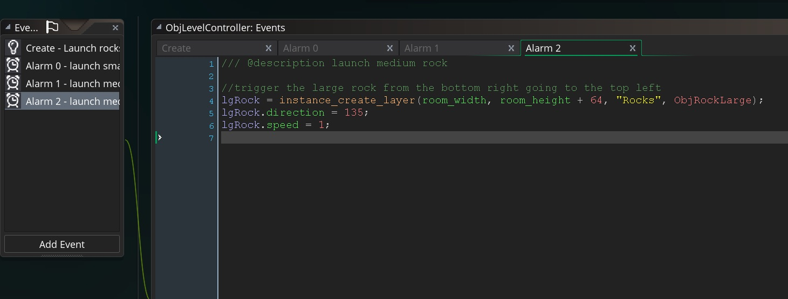 


___ 
<div class = "row">
<div class="col-12 col-lg-2 col align-self-center">
<div markdown = "1"> 
{:start="13"} 
13.  Run the game, it should look like this:
</div>
</div>
<div class="col-12 col-lg-8">
<div class = "embed-responsive embed-responsive-16by9">
<iframe class = "embed-responsive-item" src="https://www.youtube.com/embed/tULmZeiWlm8?rel=0&amp;controls=0&amp&showinfo=0&autoplay=1&version=3&loop=1&playlist=tULmZeiWlm8" frameborder="0" allowfullscreen></iframe>
</div>
</div>
</div>

___ 
<div markdown = "1"> 
{:start="14"} 
14. Now we will go back to the collision events and start by destroying the small rock.

___ 
<br><br>
[<- Previous](SpaceRocks_3.html)&nbsp;&nbsp;&nbsp;[Home](../../index.html)&nbsp;&nbsp;&nbsp; [Continue ->](SpaceRocks_5.html)
</div>
<br />  
<br />  
<br />  
<br /> 