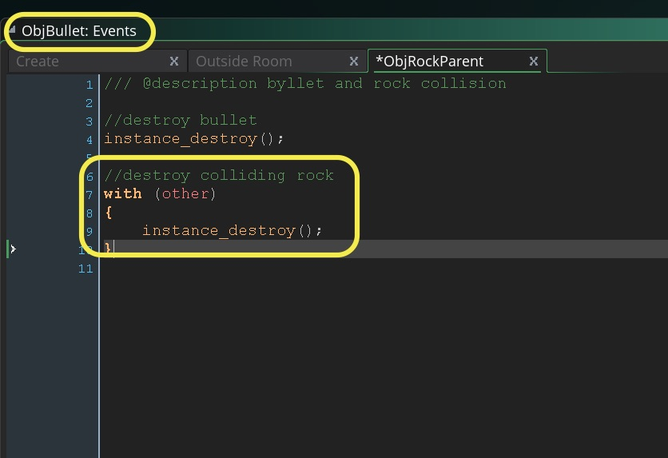
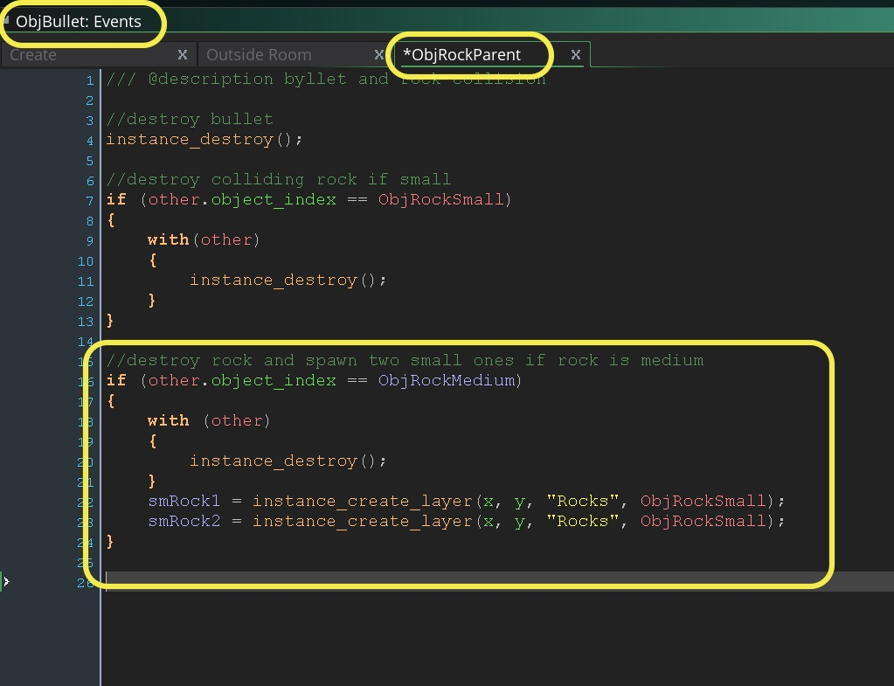
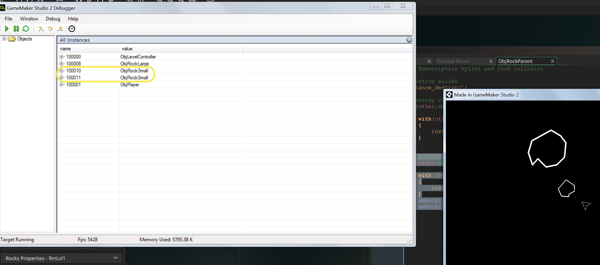
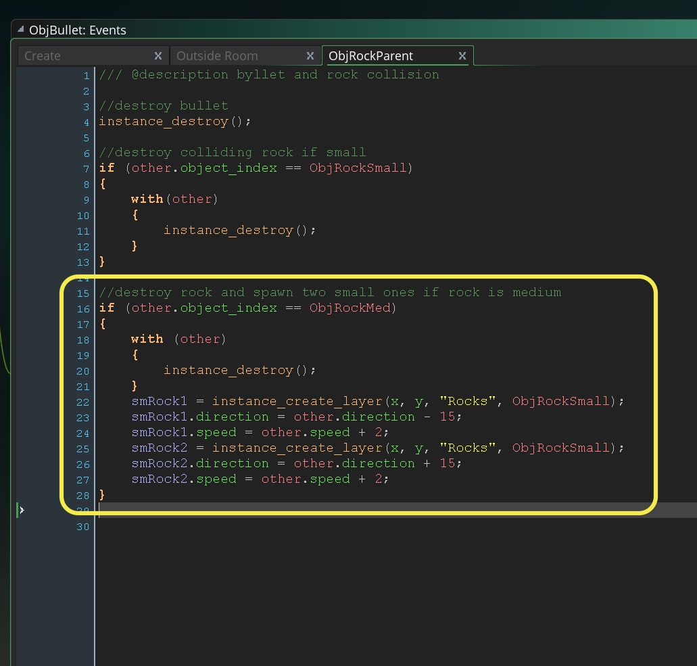
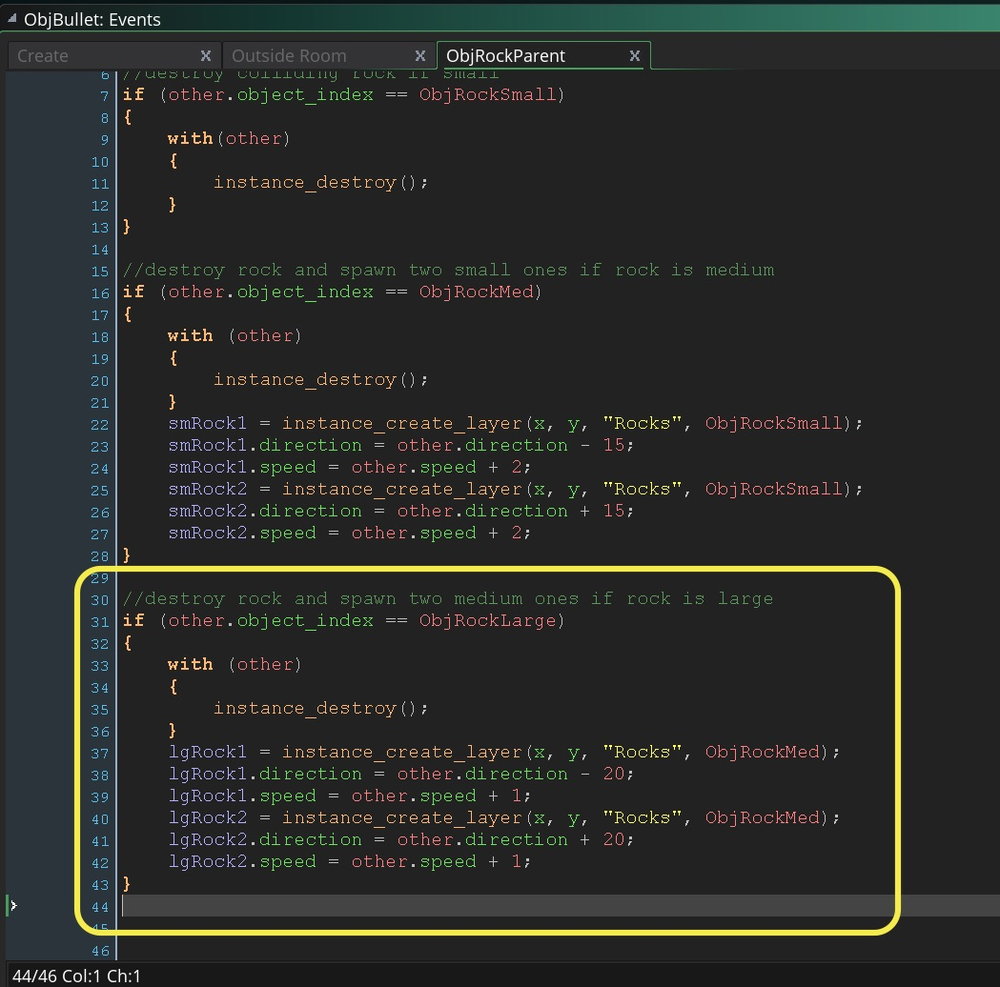
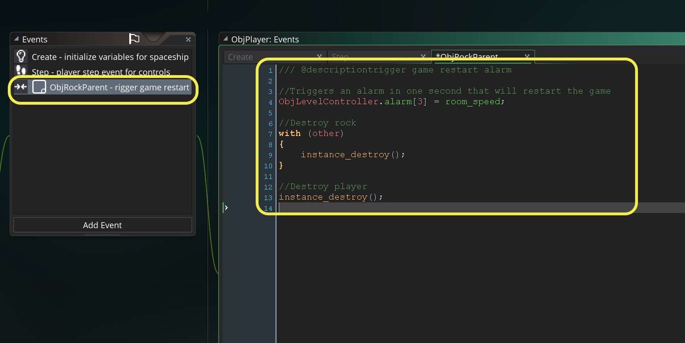

### With Other

1. Using `with (other) { //insert code here }` GameMaker allows us to access the instance of the other object in the collision.  Remember we put the **Collision** event in the bullet, but we want to kill the small rock.  Lets look at other:

> **other** <br>
> _The other instance involved in a collision event, or the other instance from a with function._<br><br>  
>  "A collision event can only happen between two instances. You can have multiple collisions between multiple instances, but they are all resolved by GameMaker: Studio 2 on a 1-on-1 basis, with the instance that has the collision event and the "other" instance that is involved. Imagine you have a player object, multiple enemy objects and multiple bullet objects that the enemy can fire at you. You can assign each enemy a single bullet instance but with a different damage variable randomly assigned to it when created." - [GameMaker Manual](https://docs2.yoyogames.com/index.html?page=source%2F_build%2F3_scripting%2F4_gml_reference%2Fmovement%20and%20collisions%2Fcollisions%2Findex.html)

&#9635; ~~Create collision for bullets hitting rocks~~ <br />
&#9633; When small rock gets hit it is destroyed <br />

___ 
<div class = "row">
<div class="col-12 col-lg-4 col align-self-center">
<div markdown = "1"> 
{:start="2"}
2.  So now we need to destroy the other instance if it is a small rock.  Go to the **Collision Event Script** in `ObjBullet` and add to the bottom
</div>
</div>
<div class="col-12 col-lg-8">
<div markdown = "1">  
``` c
//destroy colliding rock
with (other)
{
	instance_destroy();
}
```
</div>
</div>
</div>
  
<br />  

___ 
<div class = "row">
<div class="col-12 col-lg-4 col align-self-center">
<div markdown = "1"> 
{:start="3"}
3. So `with (other)` enters the namespace of the **Game Object** we have collided with.  We access it through the parent class though otherwise we would need to duplicate this script for all rocks in the game.  Parenting allows us to have one set of collision scripts for a single class of obstacles that behaves consistently.  This will run `instance_destroy()` within this rock child object.  Run it and see what happens?  
</div>
</div>
<div class="col-12 col-lg-8">
<div class="embed-responsive embed-responsive-16by9">
<iframe class = "embed-responsive-item" src="https://www.youtube.com/embed/wjy7_cs3k3k?rel=0&amp;controls=0&amp&showinfo=0&autoplay=1&version=3&loop=1&playlist=wjy7_cs3k3k" frameborder="0" allowfullscreen></iframe>
</div>
</div>
</div>

___ 
<div class = "row">
<div class="col-12 col-lg-5 col align-self-center">
<div markdown = "1"> 
{:start="4"}
4. The problem is that will destory **all** rocks, not just the small one. Since we want the medium rock and the large rock to split apart we need separate logic. 

	Now the rock we are colliding with is triggered by the parent but it is still only either `ObjRockSmall`, `ObjRockMed` or `ObjRockLarge`.  So we can check the `other.object_index` and see which one it is. Alter the `with (other)` section to check to see that the rock is `ObjRockSmall`.
</div>
</div>
<div class="col-12 col-lg-7">
<div markdown = "1">  
``` c
//destroy colliding rock if small
if (other.object_index == ObjRockSmall)
{
	with(other)
	{
		instance_destroy();
	}
}
```
</div>
</div>
</div>

___ 
### Splitting Rocks in Two

&#9635; ~~When small rock gets hit it is destroyed~~ <br />
&#9633; When mid rock gets hit it goes to two small rocks <br />

___ 
<div class = "row">
<div class="col-12 col-lg-4 col align-self-center">
<div markdown = "1"> 
1.  So it the rock the bullet it hits is a `ObjRockMed` the it will not only be destroyed, but spawn two new rocks:  `ObjRockSmall`.  Lets add this to the **Collision Event Script** in `ObjBullet` at the bottom:
</div>
</div>
<div class="col-12 col-lg-8">
<div markdown = "1">  
``` c
//destroy rock and spawn two small ones if rock is medium
if (other.object_index == ObjRockMed)
{
	with (other)
	{
		instance_destroy();
	}
    smRock1 = instance_create_layer(x, y, "Rocks", ObjRockSmall);
    smRock2 = instance_create_layer(x, y, "Rocks", ObjRockSmall);
}
```
</div>
</div>
</div>
  
<br />  

___ 
<div class = "row">
<div class="col-12 col-lg-4 col align-self-center">
<div markdown = "1"> 
{:start="2"}
2. Run the game, what is the problem?  You shoot rock medium and it is replaced with the small rock but doesn't move and hey, it looks like it only spawns one `ObjRockSmall`.  Lets run it in debug mode, shoot the `ObjRockSmall` then shoot the `ObjRockMedium`.  Look at **All Instances** and see if we can see both rocks:
</div>
</div>
<div class="col-12 col-lg-8">
  
</div>
</div> 

___ 
<div class = "row">
<div class="col-12 col-lg-4 col align-self-center">
<div markdown = "1"> 
{:start="3"}
3.  What is happening here?  Oh, when we created them we put them in exactly the same `x` and `y` position (the one of the old medium rock).  What we can do is leave this the same but have the rocks leave at different angles.
</div>
</div>
<div class="col-12 col-lg-8">
<div markdown = "1">  
``` c
//destroy rock and spawn two small ones if rock is medium
if (other.object_index == ObjRockMed)
{
	with (other)
	{
		instance_destroy();
	}
	
	smRock1 = instance_create_layer(x, y, "Rocks", ObjRockSmall);
	smRock2 = instance_create_layer(x, y, "Rocks", ObjRockSmall);

	smRock1.speed = other.speed + 2;
	smRock1.direction = other.direction - 15;
	
	smRock2.speed = other.speed + 2;
	smRock2.direction = other.direction + 15;
}
```
</div>
</div>
</div>

  
<br />  

___ 
<div class = "row">
<div class="col-12 col-lg-4 col align-self-center">
<div markdown = "1"> 
{:start="4"}
4.  Now you should see something like:
</div>
</div>
<div class="col-12 col-lg-8">
<div class="embed-responsive embed-responsive-16by9">
<iframe class = "embed-responsive-item" src="https://www.youtube.com/embed/61_zY5s1lkM?rel=0&amp;controls=0&amp&showinfo=0&autoplay=1&version=3&loop=1&playlist=61_zY5s1lkM" frameborder="0" allowfullscreen></iframe>
</div>
</div>
</div>

___ 
<div class = "row">
<div class="col-12 col-lg-4 col align-self-center">
<div markdown = "1"> 
{:start="5"}
5.  Now if the large rock gets hit it needs to split into two medium size rocks. 
Lets add this to the **Collision Event Script** in `ObjBullet` at the bottom:<br>
&#9635; ~~When mid rock gets hit it goes to two small rocks~~ <br />
&#9633; When large rock gets hit it goes to two midsize rocks<br />
</div>
</div>
<div class="col-12 col-lg-8">
<div markdown = "1">  
``` c
//destroy rock and spawn two medium ones if rock is large
if (other.object_index == ObjRockLarge)
{
	with (other)
	{
		instance_destroy();
	}
	
	mdRock1 = instance_create_layer(x, y, "Rocks", ObjRockMed);
	mdRock2 = instance_create_layer(x, y, "Rocks", ObjRockMed);

	mdRock1.speed = other.speed + 1;
	mdRock1.direction = other.direction - 20;
	
	mdRock2.speed = other.speed + 1;
	mdRock2.direction = other.direction + 20;
}
```
</div>
</div>
</div>
 
<br />  

___ 
<div markdown = "1"> 
{:start="6"}
6. Run the game and we should have the rocks and bullets working properly with each rock type.

&#9635; ~~When large rock gets hit it goes to two midsize rocks~~ <br />
&#9633; Ship gets destroyed when hit by rock <br />
</div>

___ 
<div markdown = "1"> 
{:start="7"}
7. I think we will wrap this up here.  So instead of dealing with lives we will just restart the level if you get hit by a rock.  How do we have the rock kill the player and restart the level?  We need a collision event between the **_ObjPlayer_** and the **_ObjRockParent_** and destroy the rock, destroy the player then restart the level.  We also want to delay the restart so it isn't abrupt.  We will trigger an alarm event that will restart the level 1 second in the future.
</div>

___ 
<div markdown = "1"> 
{:start="8"}
8. So now during the collision we want to:
	1.  Trigger an future event on the gamecontroller
	2.  Destroy the player
	3.  Destroy the rock 
</div>

___ 
<div class = "row">
<div class="col-12 col-lg-4 col align-self-center">
<div markdown = "1"> 
{:start="9"}
9.  Now we can't trigger the alarm in either player or the rock as alarms do not trigger when the Game Object no longer exists.  So we will need to have the alarm inside an object that is not part of the game.  The `ObjLevelController` is perfect for this task.  Since there is only one game instance of it, We can dot reference its alarm.  Open `ObjPlayer` and add a **Collision Event** then select **ObjRockParent** and add: 

</div>
</div>
<div class="col-12 col-lg-8">
<div markdown = "1">  
```c
/// @descriptiontrigger game restart alarm

//Triggers an alarm in one second that will restart the game
ObjLevelController.alarm[3] = room_speed;

//Destroy rock
with (other)
{
    instance_destroy();
}

//Destroy player
instance_destroy();
```
</div>
</div>
</div>


<br />  

___ 
<div markdown = "1"> 
{:start="10"}
10. We will be using a new function called `game_restart()`.
</div>

> game_restart()<br>
> **Returns**: N/A (void)<br> 
> **Description**: "With this function you can restart the game. This is essentially the same as running the game for the first time and so the Game Start Event will be triggered, as well as the Game End Event." - [GameMaker Manual](https://docs2.yoyogames.com/source/_build/3_scripting/4_gml_reference/miscellaneous/game_restart.html)

___ 
<div class = "row">
<div class="col-12 col-lg-4 col align-self-center">
<div markdown = "1"> 
10. Now before we will notice anything we need the alarm on the level controller to trigger a level restart. Open up `ObjlevelController` and add an **Alarm -> Alarm 3** event
</div>
</div>
<div class="col-12 col-lg-8">
<div markdown = "1">  
```c
game_restart();
```
</div>
</div>
</div>

___ 
<div class = "row">
<div class="col-12 col-lg-4 col align-self-center">
<div markdown = "1"> 
{:start="11"}
11. Now run the game and let the rock run into you.  There should be a one second delay and the game restarts!
</div>
</div>
<div class="col-12 col-lg-8">
<div class="embed-responsive embed-responsive-16by9">
<iframe class = "embed-responsive-item" src="https://www.youtube.com/embed/JW25FCCyS9Q?rel=0&amp;controls=0&amp&showinfo=0&autoplay=1&version=3&loop=1&playlist=JW25FCCyS9Q" frameborder="0" allowfullscreen></iframe>
</div>
</div>
</div>

___ 
<div markdown = "1"> 
{:start="12"}
12. Congratulations you have completed the begining of the game. 

	- [x] Build spaceship sprite & object and place in room
	- [x] Rotate spaceship clockwise and counter-clockwise
	- [x] Give spaceship thrust
	- [x] Implement friction
	- [x] Create bullet sprite & object
	- [x] Create firing logic for bullets
	- [x] Create 3 rock sprites and objects
	- [x] Create collision for bullets hitting rocks
	- [x] When small rock gets hit it is destroyed
	- [x] When large rock gets hit it goes to two midsize rocks
	- [x] When mid rock gets hit it goes to two small rocks
	- [x] Ship gets destroyed when hit by rock


[<- Previous](SpaceRocks_4.html)&nbsp;&nbsp;&nbsp;[Home](../../index.html)&nbsp;&nbsp;&nbsp;
<br />  
<br />  
<br />  
<br /> 
