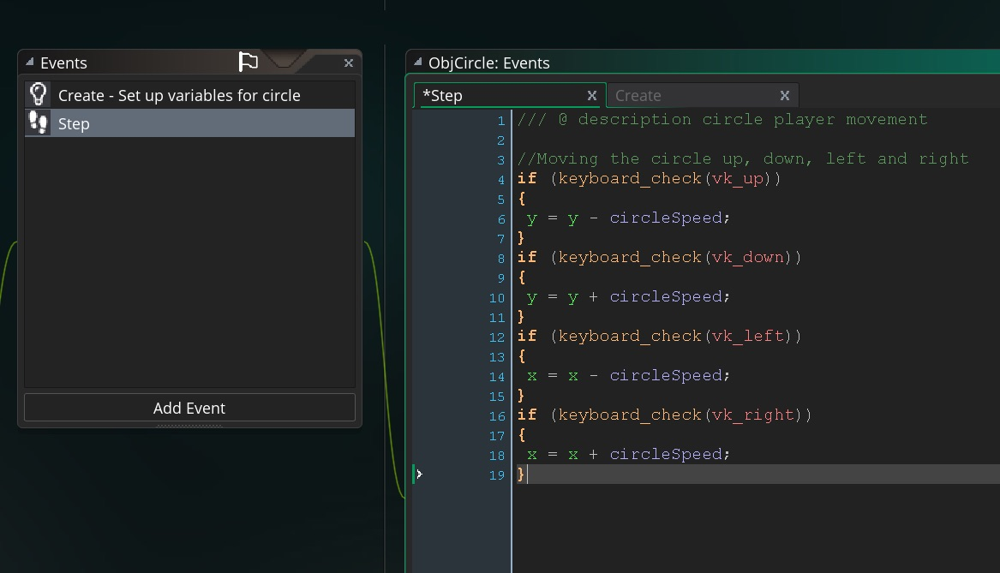

# Cleaning Up and Extending Moving Three Ways 
___ 
## Index  
1. [Magic Numbers](#magic-numbers)
2. [Screen Wrap](FixingMovingThreeWays_2.html#screen-wrap)
3. [Tips and Tricks](FixingMovingThreeWays_2.html#tips-and-tricks)

___ 
## Magic Numbers  
1. For the first class we used _hard coded_ the values for _speed_, _rotation_ and _motion direction_.  The rule of thumb is if in a step event you see a number, it is good if:  
	1. Only used once in the enitre game
	2. Not referenced by another object or script
	3. Is not a constant value that can be used by another part of the game.

    <br />
   It is bad practice to have a value that is used in many places that is not a variable.  Say we take `5` and this is used as `speed` in 15 scripts.  If we want to tune it we would have to hunt down the 15 scripts and change it.  If we change it to a single variable `playerSpd` then we can tune one value and it updates everywhere.
 
___ 
<div class = "row">
<div class="col-12 col-lg-4 col align-self-center">
<div markdown = "1">
{:start="2"}
2. If we look at ObjCircles from Week #1, we see that we have the following script.  Open the **Moving Three Ways** project and double click on `ObjCircle` and you should see in the **Step Event Script**:
</div>
</div>
<div class="col-12 col-lg-8">
<div markdown = "1">
```c
//Moving the circle up, down, left and right
if (keyboard_check(vk_up))
{
    y = y - 5;
}

if (keyboard_check(vk_down))
{
    y = y + 5;
}

if (keyboard_check(vk_left))
{
    x = x - 5;
}

if (keyboard_check(vk_right))
{
    x = x + 5;
}
```
</div>
</div>
</div>
___ 


{:start="3"}
3. Let's look at the number  `5`.  This represents the circle's `speed`.  We use it in multiple places in the script.  It is a variable that is a constant for now but we might want to change that (maybe a speed boost pick-up) and it could be needed by another object.  Maybe an enemy wants to aim in the direction I am moving in.  They will need to know my speed.  We should not be using a _magic number_ or a _hard coded value_ in this instance.  We should turn the number `5` into a [variable](../ProgrammingConcepts/Variables.html).  

___ 


{:start="4"}
4.  Let's pick a name that works well.  The name we pick is so that it clarifies your intentions to yourself and other people on the team.  Picking a name that is too short like ``` cSp ``` will not work,  nor would a long name like ``` circleSpeedInPixelsPerSecond ``` be suitable.  Let's pick a comfortable medium and call it ``` circleSpeed ```.  Note, we can't use `speed` because this is already a pre-assigned variable by GameMaker and will cause bugs (try it and see what I mean).

___


{:start="5"}
5. Why are we using camel case as opposed to how GameMaker declares their variables and functions using all lower case with '_' between words?  We change the naming convention so we can quickly tell which is a variable created by us versus a variable that GameMaker created.

___


{:start="6"}
6.  Where would we declare this variable?  Do we declare it in the **_Create_** Event or the **_Step Event_**?  Does it matter? Even though you could declare a variable in either event type, it would be inneficient to declare it in the **_Step Event_**.  Since the  **_Step Event_** runs every frame, we would be making a new variable every frame allocating memory each time.  Since this value will stay the same for the duration of the program we only need it to be declared once.  This makes the **_Create Event_** the best place to declare all variables.  Also the game runs the **_Create Event_** before it runs the **_Step Event_**, so the variables are initialzed before they are used.

___ 
<div class = "row">
<div class="col-12 col-lg-4 col align-self-center">
<div markdown = "1">
{:start="7"}
7. Double click and open `ObjCircle` and add to its **Create Event Script** at the bottom. It is always good practice when initializing a variable to include a comment on its use and meaning. 
</div>
</div>
<div class="col-12 col-lg-8">
<div markdown = "1">
```c
//tracks circle speed in pixels per second
circleSpeed = 5;
```
</div>
</div>
</div>
 
<br />  

___ 
<div class = "row">
<div class="col-12 col-lg-4 col align-self-center">
<div markdown = "1">
{:start="8"}
8. Open **Step Event Script** _tab_ and replace all instances of `5` with `circleSpeed`:  
</div>
</div>
<div class="col-12 col-lg-8">
<div markdown = "1">
``` c
/// @ description circle player movement

//Moving the circle up, down, left and right
if (keyboard_check(vk_up))
{
 y = y - circleSpeed;
}
if (keyboard_check(vk_down))
{
 y = y + circleSpeed;
}
if (keyboard_check(vk_left))
{
 x = x - circleSpeed;
}
if (keyboard_check(vk_right))
{
 x = x + circleSpeed;
}
```
</div>
</div>
</div>
 
<br />  

<div markdown = "1">
___ 


{:start="9"}
9. When you run the game, there should be no perceived difference.  Let's see what happens if we mispell one of the variables.  Let's change the second instance of ``` circleSpeed ``` to ``` CircleSpeed ```.  You can still load the game, but now when you press the **down arrow** keyboard button, an error message appears:
</div>
<div class = "row">
<div class="col">
 
</div>
<div class="col">
 
</div>
</div> 

___ 

{:start="10"}
10. The error might look different on your system but there is some key information.  We see the script that contained the error and the line number it took place in **_gml_Object_ObjCircle_Step_0(line 12)_**.  It also stated that variable **..._CircleSpeed_... not set before reading it**.  The computer looked for a value that CircleSpeed is pointing to, but this variable was never initialized.  This demonstrates that variable names are CAPS sensitive.  This is probably one of the most common errors in programming.  Spelling has to be perfect for the variable and function names to be located.  Correct the mistake and return `CircleSpeed` back to the correctly spelled `circleSpeed`.  Run and test the fix before moving on.

___ 
<div class = "row">
<div class="col-12 col-lg-4 col align-self-center">
<div markdown = "1">
{:start="11"}
11. OK, lets clean up the **_magic numbers_** in `ObjSquare` **Step Event Script** and `ObjTriangle` **Step Event Script**.  Open `ObjTriagle` **_Create Event Script_** and add the following:  
</div>
</div>
<div class="col-12 col-lg-8">
<div markdown = "1">
```c
/// @description triaangle movement

//variable in degrees change for rotation speed of triangle
triangleRotation = 5;
//variable to track top speed of triangle
triangleSpeed = 5;
//the amount of friction in pixels per frame 
triangleFriction = .2; 
```  
</div>
</div>
</div>
 
<br />  

___ 
<div class = "row">
<div class="col-12 col-lg-4 col align-self-center">
<div markdown = "1">
{:start="12"}
12. Open **Step Event Script** and make the following changes:  
</div>
</div>
<div class="col-12 col-lg-8">
<div markdown = "1">
```c
/// @description movement for triangle spaceship

//Rotate ship clockwise & counterclockwise
if (keyboard_check(ord("K")))
{
image_angle = image_angle - triangleRotation;
}

if (keyboard_check(ord("J")))
{
image_angle = image_angle + triangleRotation;
}

//position ship's thrust in direction that ship is pointing and give it a boost when pressing space
if (keyboard_check(vk_space) )
{
    direction = image_angle;
    speed = triangleSpeed;
}

//friction that shows the ship down
if ( speed > 0 )
{
speed -= triangleFriction;
}
else
{
    speed = 0;
}
```  
</div>
</div>
</div>

___ 
<div markdown = "1">
{:start="13"}
13. Notice that we didn't turn `0` into a variable as it will not be changed (0 is always an object at rest and a constant), is not shared by multiple events and/or objects and it is self-evident.
</div>
<div markdown = "1">
&nbsp;&nbsp;&nbsp;[Home](../../index.html)&nbsp;&nbsp;&nbsp; [Continue ->](FixingMovingThreeWays_2.html)
</div>
<br />  
<br />  
<br />  
<br />  