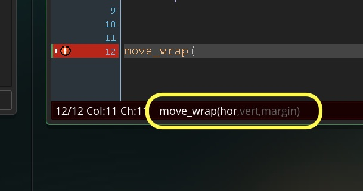

## Screen Wrap  
___ 

1.  Now lets make a change to the movement system so that if any of the objects go off the screen that they wrap on the other side.  We could do this by checking the `x` and `y` positions and check to see if they are out of bounds of the room.  GameMaker has provided many functions to handle common game scenarios.  Object wrapping is no exception. Read about [functions](../ProgrammingConcepts/Functions.html) if you don't know what these do.  Lets look at **_move\_wrap(hor, vert, margin )_**.  Press the **help** _menu item_ on the top menu bar and select  **Open Manual** tab.  Type in **_move_wrap_** and select help for this function.  It should look like:  

<div class = "row">
<div class="col">
 
</div>
<div class="col">
 
</div>  
</div>
___ 
<div class = "row">
<div class="col-12 col-lg-4 col align-self-center">
<div markdown = "1">
{:start="2"}
2.  This gets me to the manual.  I could look up in each section to find it, but I already know the function name I am looking for.  It is called:  `move_wrap`.  Tip - to look for function names describe what you want the function to do and start with the word **gml** (stands for GameMaker language).  Look at the top left hand side of the manaul and you see three tabs.  Click the middle **Index** tab and type in `move_wrap`:
</div>
</div>
<div class="col-12 col-lg-8">
 
</div>
</div>

___ 
<div markdown = "1">
{:start="3"}
3. When you search for `move_wrap` it will give you a whole bunch of guesses.  Look for the correct one and press the **Display** button:
</div>
<div class = "row">
<div class="col">
 
</div>
<div class="col">
 
</div>
</div>

___ 
<div markdown = "1">
{:start="4"}
4. This information tells us that the function does not return anything to us (a void function() ).  Under **return** it lists N/A (not applicable).  Therefore you **can't** do: `foo = move_wrap();` as the function returns nothing.
</div>
___ 
<div class = "row">
<div class="col-12 col-lg-4 col align-self-center">
<div markdown = "1">
{:start="5"}
5.  It also describes the three parameters and gives us an example.  We should set both the `Hor` and `Ver` parameters to true.  The `margin` parameter can be tricky.  The object wraps as soon as the origin leaves the room, so:
</div>
</div>
<div class="col-12 col-lg-8">
 
</div>
</div>

___ 
<div class = "row">
<div class="col-12 col-lg-3 col align-self-center">
<div markdown = "1">
{:start="6"}
6. Even worse the object will wrap back half way on the left as opposed to completely off screen.  Take a look of what happens if we set a `margin` of `0`:
</div>
</div>
<div class="col-12 col-lg-9">
<div class="embed-responsive embed-responsive-16by9">
<iframe width="560" height="315" src="https://www.youtube.com/embed/s8jxdUmJpqU?rel=0&amp&controls=0&amp&showinfo=0&autoplay=1&version=3&loop=1&playlist=s8jxdUmJpqU" frameborder="0" allowfullscreen></iframe>
</div>
</div>
</div>

___ 
<div markdown = "1">
{:start="7"}
7.  This would be easy to miss playing a game with a fast sprite.  I slowed it down to make the issue more apparent.  So if we want our sprite to wrap when it is completely off screen and enter completely off screen the number will have to be greater or equal to half of its sprite width or length (whichever is longest).  In our case it is the radius of the circle which is `32`.
</div>
___ 
<div class = "row">
<div class="col-12 col-lg-4 col align-self-center">
<div markdown = "1">
{:start="8"}
8.  Try incorporating this to the bottom of the three step functions for circle, square and triangle and get the move_wrap function to work.
</div>
</div>
<div class="col-12 col-lg-8">
<div markdown = "1">
```c
//screen wraps object
move_wrap(true, true, 32);
```
</div>
</div>
</div>

<div class="embed-responsive embed-responsive-16by9">
<iframe width="560" height="315" src="https://www.youtube.com/embed/_Y7kzqHcYEY?rel=0&amp&controls=0&amp&showinfo=0&autoplay=1&version=3&loop=1&playlist=_Y7kzqHcYEY" frameborder="0" allowfullscreen></iframe>
</div>
<br />

___ 
## Tips and Tricks  
___ 
<div class = "row">
<div class="col-12 col-lg-4 col align-self-center">
<div markdown = "1">
1. You can easily tell GameMaker variables from user created ones in the default editor settings in GameMaker.  Look at two variables, `x = 5;` (GameMaker variable) and `playerSpeed = 5;` a user created variable.  The color of the default font should be different: 
</div>
</div>
<div class="col-12 col-lg-8">

</div>
</div>

___ 
<div markdown = "1">
{:start="2"}
2. Look at the color of the variable.  Do you notice anything different?  GameMaker will color variables it recognizes with green (default, can be changed).  So you want a user created variable and it turns green, you will need to rename it otherwise you will get unpredictable behavior in the game. User created variables are purple.
</div>
___ 
<div class = "row">
<div class="col-12 col-lg-4 col align-self-center">
<div markdown = "1">
{:start="3"}
3. If you forget what parameters a function needs, there is an indicator for GameMaker functions in the bottom of the script window.  
</div>
</div>
<div class="col-12 col-lg-8">
  
</div>
</div> 

___ 
<div markdown = "1">
{:start="4"}
4. This reminds you of how many parameters the function expects.  If you need any more information you will need to access the help menu.
</div>
___ 
<div class = "row">
<div class="col-12 col-lg-4 col align-self-center">
<div markdown = "1">
{:start="5"}
5. There are two main types of errors, compile errors and run-time errors.  Complie errors won't run the game and a message will appear with each problem.  Run time errors happen when playing the game.  Replace what is in your `ObjTriangle` **Step Event Script** with:
</div>
</div>
<div class="col-12 col-lg-8">
<div markdown = "1">
```c  
if (keyboard_check(ord("K")))
{
image_angle = image_angle - triangleRotation;
//image_angle -= triangleRotation is the same as above
}

if (keyboard_check(ord("J")))
{
image_angle = image_angle + triangleRotation;
//image_angle += triangleRotation is the same as above
}

if (keyboard_check(vk_space) )
{
    direction = image_angle;
    speed = triangleSpeed;
}

if ( speed < 0 )
{
speed -= triangleFriction;
}
else
{
    speed = 0;
}

move_wrap(true, true, 32);
```  
</div>
</div>
</div>

___ 
<div class = "row">
<div class="col-12 col-lg-5 col align-self-center">
<div markdown = "1">
{:start="6"}
6. Play the game and you can turn the triangle but it no longer accelerates. This is a run time error, but the game does not stop or give us a clue to what is wrong. What is the problem?  Is our accelerate button being selected properly?  To track down the problem lets follow the logical chain and look for an error.  We will use **_show_debug_message(str)_**.  This function takes a string or a number and prints it to the debug menu in the main display.  Lets type a message when the user is pressing space to see if the space button is being pressed.  
</div>
</div>
<div class="col-12 col-lg-7">
<div markdown = "1">
```c  
if (keyboard_check(vk_space) )
{
    direction = image_angle;
    speed = triangleSpeed;
    show_debug_message("Space button is being pressed");
}
```  
</div>
</div>
</div>

  
<br />  


___ 
<div class = "row">
<div class="col-12 col-lg-4 col align-self-center">
<div markdown = "1">
{:start="7"}
7. So the program is not failing with the `if (keyboard_check(vk_space) )`, it is succesfully running the code within those brackets as we see it in the debug window.  Remove the **_show_debug_message_** from the keyboard_check if statement.  Maybe it is something with friction. Move the debug message to the speed check:   
</div>
</div>
<div class="col-12 col-lg-8">
<div markdown = "1">
```c
if ( speed < 0 )
{
    speed -= triangleFriction;
    show_debug_message(speed);
}
```  
</div>
</div>
</div>

___ 
<div class = "row">
<div class="col-12 col-lg-4 col align-self-center">
<div markdown = "1">
{:start="8"}
8. Run the game and we see that nothing prints. Shouldn't it be trying to remove friction eveny frame?  Why is this not happening?: 
</div>
</div>
<div class="col-12 col-lg-8">
  
</div>
</div>

___ 
<div class = "row">
<div class="col-12 col-lg-4 col align-self-center">
<div markdown = "1">
{:start="9"}
9. Lets move the show_debug_message to the else { } condition and look for the speed variable.  
</div>
</div>
<div class="col-12 col-lg-8">
<div markdown = "1">
```c

if ( speed < 0 )
{
    speed -= triangleFriction;
}

else
{
    show_debug_message(speed);
    speed = 0;
}
``` 
</div>
</div>
</div>

  
<br />  


___ 
<div class = "row">
<div class="col-12 col-lg-6 col align-self-center">
<div markdown = "1">
{:start="10"}
10.  So instead of removing friction from a positive `speed` that condition is failing and we are always setting the speed to 0 so it is never going to ``` 5 ``` when the **space** key is pressed as it should. Lets look at our first if statement, why is it failing.  We are asking whether `speed < 0` or speed is less than zero.  Oh wait, the speed starts at 5.  I want to see that speed is above zero.  Let's reverse the sign on the speed condition and move the debug message back ininto the `if (speed>0)` condition:
</div>
</div>
<div class="col-12 col-lg-6">
<div markdown = "1">
``` c
if ( speed > 0 ) //changed from speed < 0
{
    speed -= triangleFriction;
    show_debug_message(speed);

}
```
</div>
</div>
</div>

___ 
<div markdown = "1">
{:start="11"}
11.  Play the game, it is working again.  Don't forget to remove all of your show_debug_message() functions after you fix the bug.  

</div>


[<- Previous](FixingMovingThreeWays_1.html)&nbsp;&nbsp;&nbsp;[Home](../../index.html)

<br />
<br />
<br />
<br />

