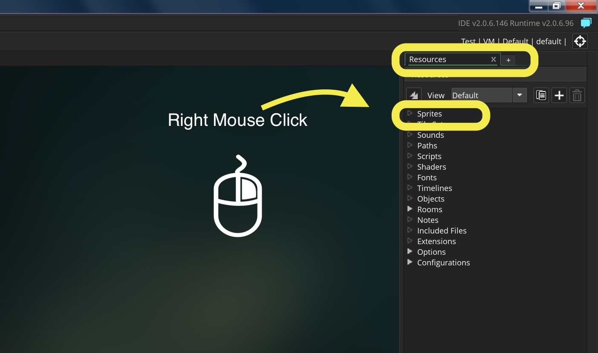
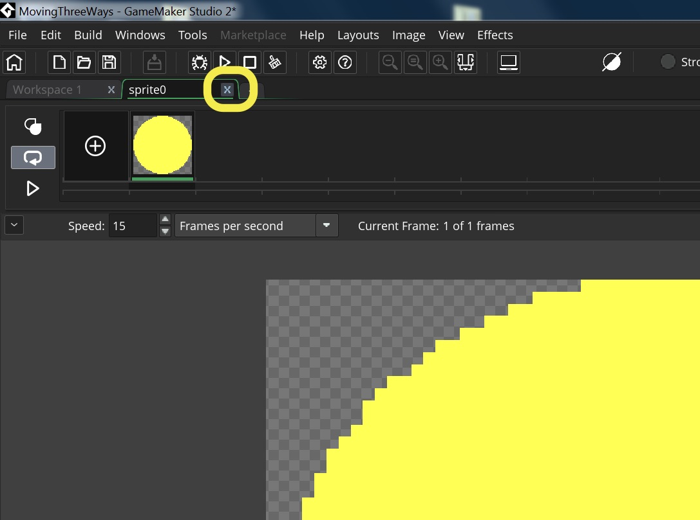

# Week #1 - Moving Sprite 3 Ways

## Index
* [Walk Through](#walk-through)
    *  Part 1 - Moving Pixel by Pixel
        1. [Creating a Sprite](#creating-a-sprite)  
        2. [Creating an Object](#creating-an-object)
        3. [Creating a Room](#creating-a-room)
        4. [Running the Game](#running-the-game)
        5. [Creating our First Event and Script](MovingThreeWays_2.html#creating-our-first-script)
        6. [Positioning Objects in Different Parts of Screen](MovingThreeWays_2.html#positioning-objects-in-different-parts-of-screen)
        8. [Variables](MovingThreeWays_2.html#variables)
        . [Step Event Movement](MovingThreeWays_3.html#step-event-movement)
        9. [Conditional If Statements](MovingThreeWays_3.html#conditional-if-statements)
        10. [Keyboard Check Function](MovingThreeWays_4.html#keyboard-check)
        11. [Add Controls to Circle](MovingThreeWays_4.html#add-controls-to-circle)
        12. [Debug Menu](MovingThreeWays_4.html#debug-menu)
    * Part II - Moving With Physics
        1. [Create Square Sprite and Object](MovingThreeWays_5.html#create-square-sprite-and-object)
        2. [Moving with Physics](MovingThreeWays_5.html#moving-with-physics)

    * Part III - Moving with Polar Coordinates & Physics
        1. [Moving with the Polar Coordinate System](MovingThreeWays_6.html#moving-with-the-polar-coordinate-system)
        2. [Putting Movement all in a Step Event Script](MovingThreeWays_7.html#putting-movement-all-in-a-step-event-script)
* [Syntax Used](MovingThreeWays_8.html#syntax-used)  

_____ 

## Walk Through

We will introduce you to the Gamemaker 2 IDE and introduce you to creating a sprite, an object, some movement code and setting up a room.  You will be moving a [sprite](https://en.wikipedia.org/wiki/Sprite_(computer_graphics)) in three different ways.   
* For the first sprite, we will create a circle object and moving it using the [cartesian coordinate system](../CoordinateSystems/CartesianCoordinateSystem.html) with the left, right, up and down button moving it pixel by pixel.  
* For the second sprite, we will create a square object and move it using momentum moving along the [cartesian coordinate system](../CoordinateSystems/CartesianCoordinateSystem.html).  Once the momentum is set, the object will continue moving with that setting until it is changed.
* For the thrid sprite, we will create a triangle object and move it using the [polar coordinate system](../CoordinateSystems/PolarCoordinateSystem.html).  

We will be using both the [Create and Step Events](../Events/CreateStepEvent.html) types.

_____ 

## Start Project
* [Bootup and Login](../StartingProject/StartingProject.html) and [Start a Project](../StartingProject/StartingProject.html) called `Moving3WaysGame`.  Make sure you select the **GameMaker language** _button_.

_____ 

## Part 1 - Moving Pixel by Pixel
### Creating a Sprite

1. A [sprite](https://en.wikipedia.org/wiki/Sprite_(computer_graphics)) contains is just a 2-d pixel graphic representation of an object.  It is always square but can contain a pixel representation inside of that square including transparencies so it can look like any shape. Create a new sprite by _right-clicking_ in the right hand sided **Resource** tab on the **Sprites** pull down menu and selecting **Create**. Call it **SprCircle**.  

  
  
  

_____ 

{:start="2"}
2.  Then the Sprite window appears in the main workspace. Press **_Edit Image_** _button_:

  
 

___ 

{:start="3"}
3.  Pick the color you want to use for the main color of the sprite.  You have two color panes, the on the left is for the main color and the one on the right is for the stroke color.  I am picking yellow for this example as the main color. I will not be using a stroke.  You have to carefully :

___ 

{:start="4"}
4. Pick the **_ellipse_** shape to draw a circle from the tools menu.  Select the bottom right hand portion of the icon to select just the **fill**.  You should then get just a colored circle with no stroke.

  

___ 

{:start="5"}
5. Close the sprite editor menu by pressing the x on the top tab.

  

  

___ 

### Creating an Object

___ 

1.  In Gamemaker, [objects](https://docs2.yoyogames.com/source/_build/2_interface/1_editors/objects.html) are a "resource that controls aspects of a game to do specific things" - GameMaker manual.  Often it is used in conjunction with a sprite so that events with logic can be assigned to it.  Alone, a sprite cannot be used in a room and must be assigned to an object.

___ 

{:start="2"}
2. Create an **_Object_** by _right-clicking_ in the right hand sided **Resource** tab on the **Objects** pull down menu and selecting **Create**.    

  

___ 

{:start="3"}
3. Press the flywheel icon next to the Sprite Box with `<no sprite>`.  This brings up a fly down list with all your sprites. Select the `SprCircle` you just created.   

  

___ 

{:start="4"}
4. Name the object `ObjCircle`. 

 

  

___ 

### Creating a Room
A [room](https://docs2.yoyogames.com/source/_build/2_interface/1_editors/rooms.html) contains all the elements you want in a _level_ of your game (Gamemaker uses the monikor Room opposed to Level).  This is no indication of what type of space you are creating.  In this room you set a frame-rate and can place [objects](https://docs2.yoyogames.com/source/_build/2_interface/1_editors/objects.html).

___ 

1.  A default room is given you in each project.  If you go to the **Resource** tab on the right and press the arrow next to the **Rooms** item to see all rooms.  You should see a `Room0`:

  

___ 

{:start="2"}
2. _Right-click_ on the `Room0` and select **Rename**: 

   

___ 

{:start="3"}
3. Call the room `RmTest`:

  

___ 

{:start="4"}
4. Drag the `ObjCircle` into the top center of the `RmTest` level:

 

___ 

### Running the Game

1. Now we have everything we need to run the game.  Not much will happen as we do not have any game logic to perform any actions.  But we will have our sprite in the room.  Press the **play** triangle button on the top menu bar.    

  

___

{:start="2"}
2. Game window appears but nothing happens as we have not told the `ObjCirle` to do anything yet.    

  

___ 

&nbsp;&nbsp;&nbsp;[Home](../../index.html)&nbsp;&nbsp;&nbsp; [Continue ->](MovingThreeWays_2.html)
   
   
   
   