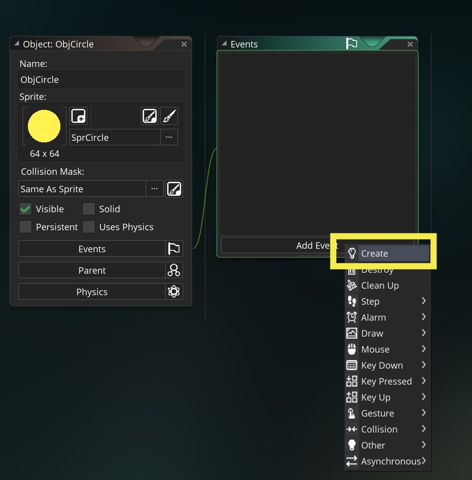

### Creating our First Script
A script is where we put the game logic.  We try to avoid the drag and drop language as it is limits the complexity of what you can do and can be harder to read and debug with more complex games.  The learning curve should be roughly the same if you are planning on using Gamemaker in the long run.

Before we write a script we need to assign a [Create Event](../Events/CreateStepEvent.html).  The event runs the script when its event type is called.  The **Create Event** is called only _once_ when the **object** is instantiated.  
___ 
<div class = "row">
<div class="col-12 col-lg-4 col align-self-center">
<div markdown = "1">
1.  On the `ObjCircle` press the **Add Event** _button_
</div>
</div>
<div class="col-12 col-lg-8">
  
</div>
</div>

___ 
<div class = "row">
<div class="col-12 col-lg-4 col align-self-center">
<div markdown = "1">
{:start="2"}
2. Select from the _drop down menu_ the **Create** _event_. 
</div>
</div>
<div class="col-12 col-lg-8">
 
</div>
</div>

___ 
<div class = "row">
<div class="col-12 col-lg-4 col align-self-center">
<div markdown = "1">
{:start="3"}
3.  We will be centering the sprite.  We set the `x` value of the `ObjCircle` to half the room width and the `y` value to half the room height. In the script area enter the following values that relates to the [cartesian coordinate system](CartesianCoordinateSystem.md) using [variable](Variables.md) names that GameMaker creates with each object.
</div>
</div>

<div class="col-12 col-lg-8">
<div markdown = "1">
``` c
//@description Set up variables for circle

//center object in room
x = 512;
y = 384;
```
</div>
</div>
</div>

___ 
<div class="col-8">
<div markdown = "1">
{:start="4"}
4.  Please note in the above that `//` makes that one line a human readable comment where you can put any text and the game will ignore it.  This is where you should comment the details of your algorithm so that you can come back to it at a later date.  It is important to document as much as you can so that when you come back to edit it later on that you remember what each variable, function and section of code does to your game.
</div>
</div>

___ 
<div class = "row">
<div class="col-12 col-lg-4 col align-self-center">
<div markdown = "1">
{:start="5"}
5. Press **Run** _button_ on top menu and check to see that sprite is centered.  There is nothing that happens in the room except for the sprite being centered.  
</div>
</div>
<div class="col-12 col-lg-8">
  
</div>
</div>

___ 
<div class = "row">
<div class="col-12 col-lg-4 col align-self-center">
<div markdown = "1">
{:start="6"}
6. Look at the circle in the room and it doesn't look like it is in the center.  Why is this?  Take a look at this breakdown:
</div>
</div>
<div class="col-12 col-lg-8">
  
</div>
</div>

___ 
<div class = "row">
<div class="col-12 col-lg-4 col align-self-center">
<div markdown = "1">
{:start="7"}
7. So the computer sees the local space of an object's `0,0` position as the top left corner of the sprite.  
</div>
</div>
<div class="col-12 col-lg-8">
  
</div>
</div>

___ 
<div class = "row">
<div class="col-12 col-lg-4 col align-self-center">
<div markdown = "1">
{:start="8"}
8.  Either we can add half the width and height of the sprite to the `x` and `y` position, instead we can just put the sprite in the **Center Middle**.  Open ``SprCircle`` and select the _menu_ item to the right of **Origin** and select **Middle Center**.
</div>
</div>
<div class="col-12 col-lg-8">
  
</div>
</div>

___ 
<div class = "row">
<div class="col-12 col-lg-4 col align-self-center">
<div markdown = "1">
{:start="9"}
9. Now run the game and look to see if the `ObjCircle` is now centered better than before?
</div>
</div>
<div class="col-12 col-lg-8">
  
</div>
</div>

### Positioning Objects in Different Parts of Screen

Try putting the object in different positions in the room.  Change the `x` and `y` position in the `Create` script for `ObjCircle` and press play to see the changes.  

```c
//Sprite in top left corner
x = 50;
y = 50;
```

```c
//Sprite in top right corner
x = 1017;
y = 50;
```

```c
//Sprite in bottom left corner
x = 50;
y = 550;
```

```c
//Sprite in bottom right corner
x = 1017;
y = 550;
``` 

```c
//Sprite in top left corner
x = 50;
y = 50;
```
<br />

_____ 


### Variables

Read about [variables](../ProgrammingConcepts/Variables.html).  Then download the GameMaker file for [BasicProgrammingDemo.zip](../TestHarnesses/BasicProgrammingDemo.yyp.zip)  

___ 
<div class = "row">
<div class="col-12 col-lg-4 col align-self-center">
<div markdown = "1">
1.  Save your game and quit it, lets load up another GameMaker project.  Go to the folder and double click the **_BasicProgrammingDemoStudioII_** GameMaker project.  The click on the **Scripts** arrow and open the script `ScrGameManagerDraw` and add:  
</div>
</div>

<div class="col-12 col-lg-8">
<div markdown = "1">
```c
//Print text between " " to screen
Print("Hello World");
```
</div>
</div>
</div>

<div class = "row">
<div class = "col-6">
  
</div>

<div class = "col-6">
  
</div>
</div>

___ 
<div class = "row">
<div class="col-12 col-lg-4 col align-self-center">
<div markdown = "1">
{:start="2"}
2. Press the **Play** _button_.  You should see the game print `Hello World`:
</div>
</div>
<div class="col-12 col-lg-8">
  
</div>
</div>

___ 
<div class = "row">
<div class="col-12 col-lg-4 col align-self-center">
<div markdown = "1">
{:start="3"}
3. Now instead of printing a string directly. Assign a string to a variable, then print it.  Change the script in `ScrGameManagerDraw` and replace it with:  
</div>
</div>
<div class="col-12 col-lg-8">
<div markdown = "1">
```c
//Stores string in variable name 'variable'
variable = "Marc is here!";
Print (variable);
```
</div>
</div>
</div>
  

___ 
<div class = "row">
<div class="col-12 col-lg-4 col align-self-center">
<div markdown = "1">
{:start="4"}
4.  Press the **Play** _button_ and see what happens in game:
</div>
</div>
<div class="col-12 col-lg-8">
  
</div>
</div>

___ 
<div class = "row">
<div class="col-12 col-lg-4 col align-self-center">
<div markdown = "1">
{:start="5"}
5. Try putting variable in " " and guess what will happen.  Change it to the below and run the game.  
</div>
</div>
<div class="col-12 col-lg-8">
<div markdown = "1">
```c
//Stores string in variable name 'variable'
variable = "Marc is here!";
Print ("variable");
```
</div>
</div>
</div>
  

___ 
<div class = "row">
<div class="col-12 col-lg-4 col align-self-center">
<div markdown = "1">
{:start="6"}
6. Why did it not print the content of the variables?  The GameMaker IDE knows that a series of characters are a string and not a variable name because it is in quotation marks ("...").  
</div>
</div>
<div class="col-12 col-lg-8">
  
</div>
</div>

___ 
<div class = "row">
<div class="col-12 col-lg-4 col align-self-center">
<div markdown = "1">
{:start="7"}
7. Variables can also store numbers as well as strings:  
</div>
</div>
<div class="col-12 col-lg-8">
<div markdown = "1">
```c
//variables can also be a number
variable = 10;
Print (variable);
```
</div>
</div>
</div>
  
<br />

___ 
<div class = "row">
<div class="col-12 col-lg-4 col align-self-center">
<div markdown = "1">
{:start="8"}
8.  How are strings and numbers different?  One difference is when added numbers are added mathematically.  Like 10 + 10 becomes 20.  When you add two strings they concatonate.  So "Marc " + "is not here" becomes "Marc is not here".  Try both the following scripts and see what they do.
</div>
</div>
<div class="col-12 col-lg-8">
<div markdown = "1">
```c
//adding strings & numbers 
number = 10 + 10;
Print (number);
```


```c
//adding strings & numbers 
str = "Marc has an IQ of " + "10";
Print (str);
```
</div>
</div>
</div>

___ 
<div class="col-8">
<div markdown = "1">
{:start="9"}
9. Close this project and let's go back to our previous game with the circle. Open the `MovingThreeWays` project you were working on earlier. 
</div>
</div>

[<- Previous](MovingThreeWays_1.html)&nbsp;&nbsp;&nbsp;[Home](../../index.html)&nbsp;&nbsp;&nbsp; [Continue ->](MovingThreeWays_3.html)
<br />  
<br />  
<br />  
<br />  


