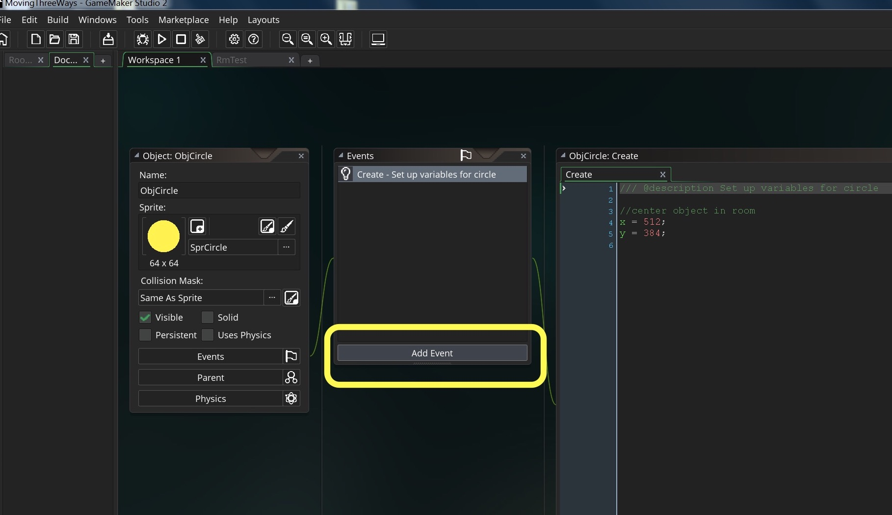
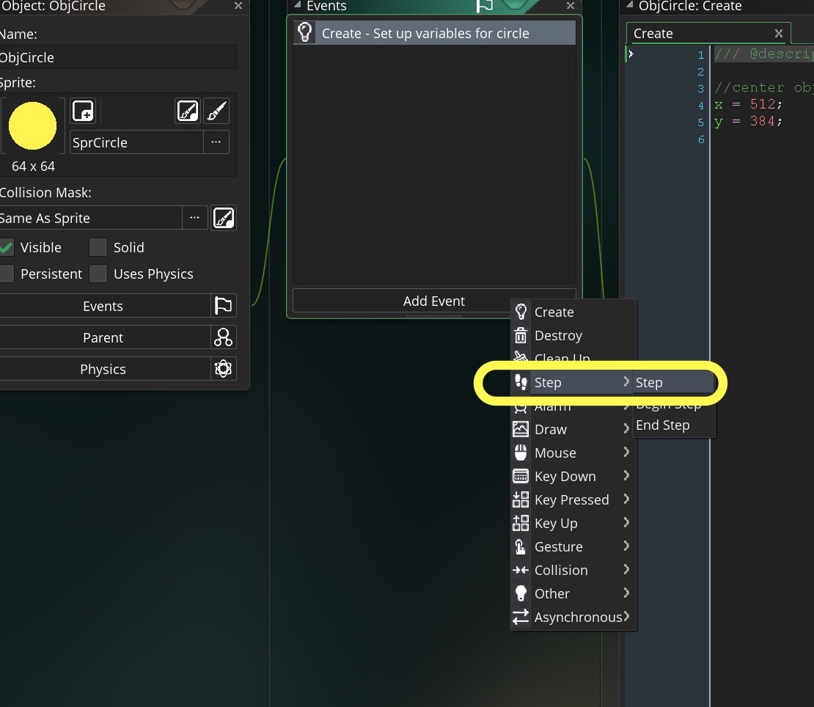
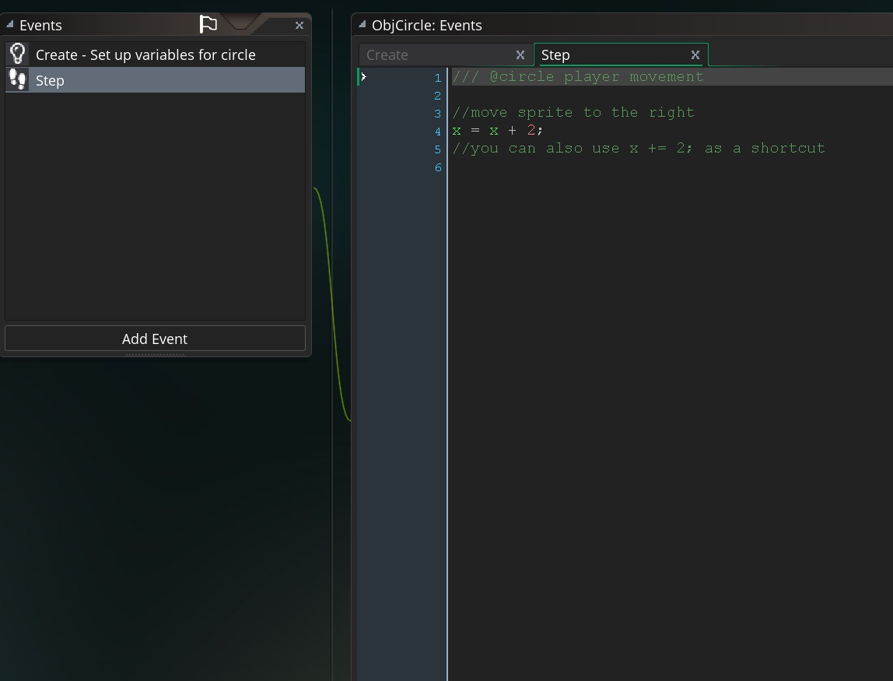

### Step Event Movement
<div class = "row">
<div class="col-12 col-lg-4 col align-self-center">
<div markdown = "1">
{:start="1"}
1.  If it is not open, double click on `ObjCircle` and press the **Add Events** button:
</div>
</div>
<div class="col-12 col-lg-8">
 
</div>
</div>

___ 
<div class = "row">
<div class="col-12 col-lg-4 col align-self-center">
<div markdown = "1">
{:start="2"}
2.  From the drop down menu press **[Step Event](../Events/CreateStepEvent.html)** then **[Step Event](../Events/CreateStepEvent.html)** to select this event type.
</div>
</div>
<div class="col-12 col-lg-8">
 
</div>
</div> 

___ 
<div class = "row">
<div class="col-12 col-lg-4 col align-self-center">
<div markdown = "1">
{:start="3"}
3. In the script window type:
</div>
</div>
<div class="col-12 col-lg-8">
<div markdown = "1">
```c
/// @circle player movement

//move sprite to the right
x = x + 2;
```
</div>
</div>
 
<br />  
</div>

___ 
<div class = "row">
<div class="col-12 col-lg-4 col align-self-center">
<div markdown = "1">
{:start="4"}
4.  Press the **Play** _button_ and your circle should look like:
</div>
</div>
<div class="col-12 col-lg-8">
<div class="embed-responsive embed-responsive-16by9">
<iframe class = "embed-responsive-item" src="https://www.youtube.com/embed/7mWNRUj-MmI?rel=0&amp;controls=0&amp&showinfo=0&autoplay=1&version=3&loop=1&playlist=7mWNRUj-MmI" frameborder="0" allowfullscreen></iframe>
</div>
</div>
</div>
___ 
<div class = "row">
<div class="col-12 col-lg-4 col align-self-center">
<div markdown = "1">
{:start="5"}
5.  Edit the **Step** Event script and try the following and if what happens meets your expectations.  If it doesn't review the [cartesian coordinate system](../CoordinateSystems/CartesianCoordinateSystem.html) 
</div>
</div>
<div class="col-12 col-lg-8">
<div markdown = "1">
```c
x = x - 2;
//you can also use x -= 2; as a shortcut
```

```c
y = y + 2;
//you can also use y += 2; as a shortcut
```

```c
y = y - 2;
//you can also use y -= 2; as a shortcut
```

```c
x = x + 2;
y = y + 2;
```
</div>
</div>
</div>
___ 

### Conditional If Statements 

<div class="col-8">
1. Now we want to move the circle based on whether the player is pressing the arrow keys.  We need to look at [conditional if statements](../ProgrammingConcepts/Conditional-If.html) and [functions](../ProgrammingConcepts/Functions.html).
</div>
___ 
<div class = "row">
<div class="col-12 col-lg-4 col align-self-center">
<div markdown = "1">
{:start="2"}
2. Save your game and quit it, lets load up another GameMaker project. Then download the GameMaker file for [BasicProgrammingDemo.zip](../TestHarnesses/BasicProgrammingDemo.yyp.zip). Open the **script** `ScrGameManagerDraw` and add:    
</div>
</div>
<div class="col-12 col-lg-8">
<div markdown = "1">
```c
//Print text between " " to screen
if (true)
{
	Print("if condition resolved to true");
}
else
{
	Print("if condition resolved to false");
}
```
</div>
</div>
</div>

___ 
<div class = "row">
<div class="col-12 col-lg-4 col align-self-center">
<div markdown = "1">
{:start="3"}
3. Run the game and see what happens.  Is this what you expected?  Now change the value inside the if parenthesis to false:  
</div>
</div>
<div class="col-12 col-lg-8">
<div markdown = "1">
```c
//Print text between " " to screen
if (false)
{
	Print("if condition resolved to true");
}
else
{
	Print("if condition resolved to false");
}
```
</div>
</div>
</div>

___ 
<div class = "row">
<div class="col-12 col-lg-4 col align-self-center">
<div markdown = "1">
{:start="4"}
4. Run the game and see what happens.  Is this what you expected?  Now add a more complex statement:
</div>
</div>
<div class="col-12 col-lg-8">
<div markdown = "1">
```c
//Print text between " " to screen
x = 5;
if (x < 3)
{
	Print("x is less than 3");
}
else
{
	Print("x is not less than 3");
}
```
</div>
</div>
</div>

___ 
<div class = "row">
<div class="col-12 col-lg-4 col align-self-center">
<div markdown = "1">
{:start="5"}
5. Run the game and try multiple values for x and experiment with different operations.  For example:  
</div>
</div>
<div class="col-12 col-lg-8">
<div markdown = "1">
```c
//Print text between " " to screen
x = 3;
if (x == 3)
{
	Print("x is equal to 3");
}
else
{
	Print("x is not equal to 3");
}
```
</div>
</div>
</div>

___ 
<div class="col-8">
<div markdown = "1">
{:start="6"}
6. Run the game and try multiple values for ``` x ```.  

[<- Previous](MovingThreeWays_2.html) &nbsp;&nbsp;&nbsp;[Home](../../index.html)&nbsp;&nbsp;&nbsp;  [Continue ->](MovingThreeWays_4.html)
<br />  
<br />  
<br />  
<br />  