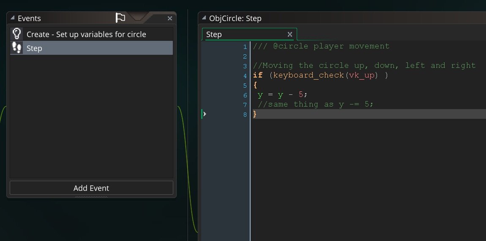
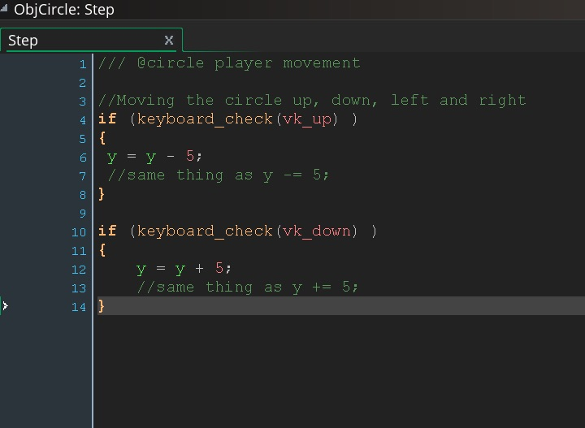
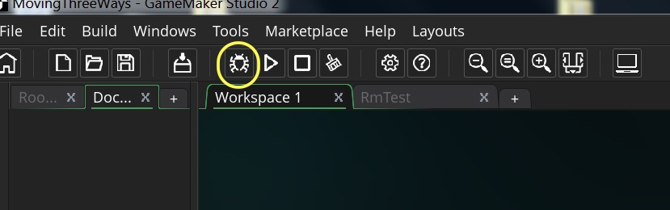
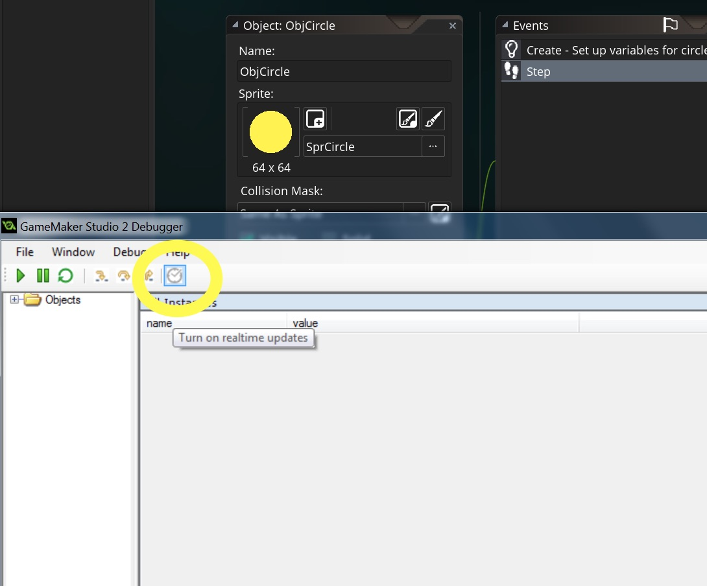
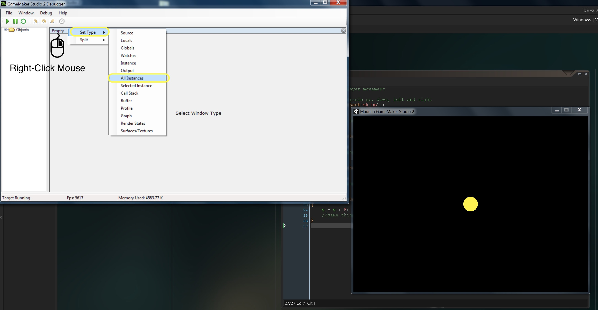
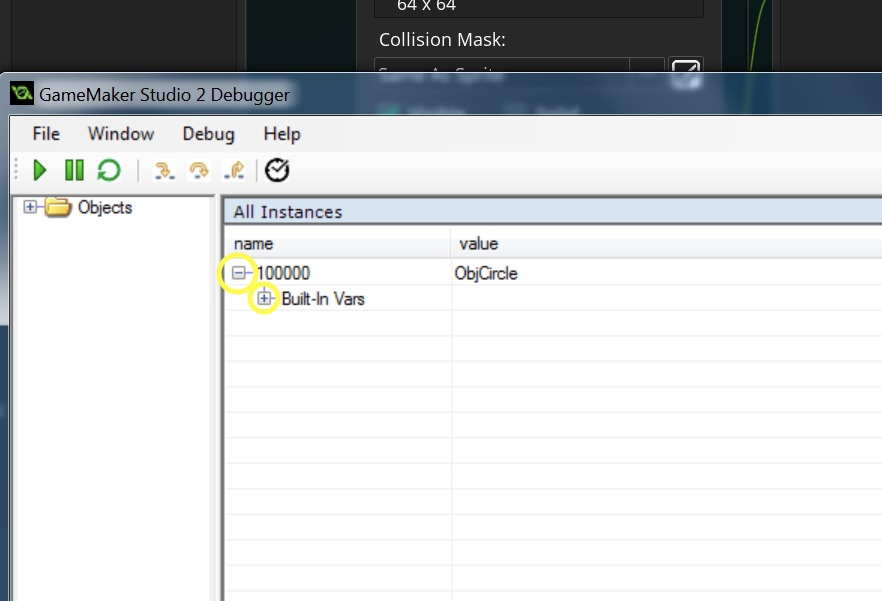
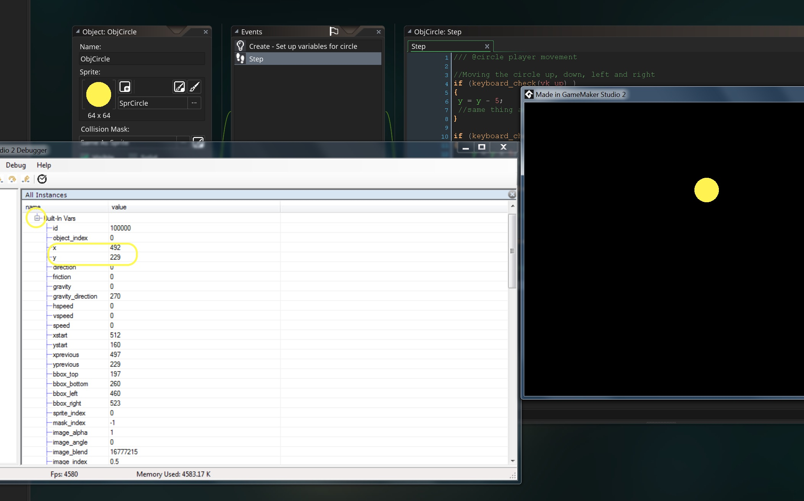

### Keyboard Check Function  
<div class = "row">
<div class="col-12 col-lg-6 col align-self-center">
<div markdown = "1">
1. Now lets look at the function **_keyboard_check(key)_** and see what it does.  We pass it one parameter, a key, and the function returns ``` true ``` or ``` false ``` on whether the button is being pressed.  For example **_vk\_down_** is the down arrow key on the keyboard.  If we pass it this **_vk\_down_** to the function, it will return ``` true ``` if the key is pressed and ``` false ``` if the key is not pressed.  Please remember that in most programs ``` 0 ``` is ``` false ``` and ``` 1 ``` is ``` true ```.  Erase previous code from the script **_ScrGameManagerDraw_** and add:  
</div>
</div>
<div class="col-12 col-lg-6">
<div markdown = "1">
```c
//Print text between " " to screen
	Print(keyboard_check(vk_down));
```
</div>
</div>
</div>

___ 
<div class = "row">
<div class="col-12 col-lg-4 col align-self-center">
<div markdown = "1">
{:start="2"}
2. run the game and press the down arrow key and let go.  See what happens.  Does this make sense?  See what `1` and `0` represent to the computer?  Now we can alter this and express it with an english response with an if statement.
</div>
</div>
<div class="col-12 col-lg-6">
<div markdown = "1">
```c
//Print text between " " to screen
if (keyboard_check(vk_down))
{
	Print ("You are pressing the down key");
}
else
{
	Print ("You are not pressing the down key");
}
```
</div>
</div>
</div>

___ 
<div class = "row">
<div class="col-12 col-lg-4 col align-self-center">
<div markdown = "1">
{:start="3"}
3. You can make a compound if statement:  
</div>
</div>
<div class="col-12 col-lg-6">
<div markdown = "1">
```c
//Print text between " " to screen
if (keyboard_check(vk_down))
{
	Print ("You are pressing down key");
}
else if (keyboard_check(vk_up))
{
	Print ("You are pressing the up key");
}
else
{
	Print ("You are not pressing the up or down key");
}
```
</div>
</div>
</div>

___ 
<div class="col-8">
<div markdown = "1">
{:start="4"}
4. Try pressing up and down when running the game in different order.  Observe that the order of if, else if matters and affects the logic of your program.  In this case I am not happy but we will stick with it for now. Each game type will take a different control methodology, so since we are not creating this for a specific game, we will deam this implementation as acceptable for now.
</div>
</div>
### Add Controls to Circle
<div class="col-8">
<div markdown = "1">
1. Close this project and let's go back to our previous game with the circle.  Open the **object** `ObjCircle` and click on the **step** event.  Delete the old code and we will start over.  We will:  
	&#9633; Check if up key is pressed and move player up
	
	&#9633; Check if down key is pressed and move player down
	
	&#9633; Check if left key is pressed and move player left
	
	&#9633; Check if right key is pressed and move player right  
</div>
</div>

___ 
<div class = "row">
<div class="col-12 col-lg-4 col align-self-center">
<div markdown = "1">
{:start="2"}
2. Lets start with a check if up key is pressed and move player up and press run game.  Replacde the old code in the step with:
	
	&#9633; Check if up key is pressed and move player up
</div>
</div>
<div class="col-12 col-lg-8">
<div markdown = "1">
```c
//Moving the circle up, down, left and right
if (keyboard_check(vk_up) )
{
	y = y - 5;
	//same thing as y -= 5;
}
```
</div>
</div>
</div>

 
<br />  

___ 
<div class = "row">
<div class="col-12 col-lg-6 col align-self-center">
<div markdown = "1">
{:start="3"}
3.  Run the game, test it.  Does the player move up when you press the **up** _button_?  Does it leave the screen if you go to high?  Now we will add to the **Step Script** to the bottom:  
	&#9635; ~~Check if up key is pressed and move player up~~
	
	&#9633; Check if down key is pressed and move player down  
</div>
</div>
<div class="col-12 col-lg-6">
<div markdown = "1">
```c
if (keyboard_check(vk_down) )
{
	y = y + 5;
	//same thing as y += 5;
}
```
</div>
</div>
</div>
 
<br />  

___ 
<div class = "row">
<div class="col-12 col-lg-6 col align-self-center">
<div markdown = "1">
{:start="4"}
4.  Run the game, test it.  Does the player move up and down when you press the **up** and **down** _button_?  Now we will add to the **Step Script** to the bottom:  

	&#9635; ~~Check if up key is pressed and move player up~~
	
	&#9635; ~~Check if down key is pressed and move player down~~  

	&#9633; Check if left key is pressed and move player left
</div>
</div>
<div class="col-12 col-lg-6">
<div markdown = "1">
```c
if (keyboard_check(vk_left) )
{
	x = x - 5;
	//same thing as x -= 5;
}
```
</div>
</div>
</div>

___ 
<div class = "row">
<div class="col-12 col-lg-7 col align-self-center">
<div markdown = "1">
{:start="5"}
5.  Run the game, test it.  Does the player move up, down and left when you press the **up**, **down** and **left** _button_?  Now we will add to the **Step Script** to the bottom:  

	&#9635; ~~Check if up key is pressed and move player up~~
	
	&#9635; ~~Check if down key is pressed and move player down~~  

	&#9635; ~~Check if left key is pressed and move player left~~

	&#9633; Check if right key is pressed and move player right 
</div>
</div>
<div class="col-12 col-lg-5">
<div markdown = "1">
```c
if (keyboard_check(vk_right) )
{
	x = x + 5;
	//same thing as x += 5;
}
```
</div>
</div>
</div>
___ 
<div class = "row">
<div class="col-12 col-lg-4 col align-self-center">
<div markdown = "1">
{:start="6"}
6. Test your work, you should be able to run in 8 directions as per the video below. 

	&#9635; Check if up key is pressed and move player up
	
	&#9635; Check if down key is pressed and move player down
	
	&#9635; Check if left key is pressed and move player left
	
	&#9635; Check if right key is pressed and move player right  

</div>
</div>
<div class="col-12 col-lg-8">
<div markdown = "1">
<div class="embed-responsive embed-responsive-16by9">
<iframe class = "embed-responsive-item" src="https://www.youtube.com/embed/RpHvQtiX0Hc?rel=0&amp;controls=0&amp&showinfo=0&autoplay=1&version=3&loop=1&playlist=RpHvQtiX0Hc" frameborder="0" allowfullscreen></iframe>
</div>
</div>
</div>
</div>

___ 

### Debug Menu  
___ 
<div class = "row">
<div class="col-12 col-lg-4 col align-self-center">
<div markdown = "1">
1. Now try running the game with the **_Debug_**(F6) button in debug mode.  
</div>
</div>
<div class="col-12 col-lg-8">
  
</div>
</div>

___ 
<div class = "row">
<div class="col-12 col-lg-4 col align-self-center">
<div markdown = "1">
{:start="2"}
2. This brings up both the game and debug menu (if you don't see debug menu look at your tool bar for it).  Click on the clock icon to **Turn on realtime updates**.  This means the debugger will update while you are playing the game and you don't need to pause it.
</div>
</div>
<div class="col-12 col-lg-8">
  
</div>
</div>

___ 
<div class = "row">
<div class="col-12 col-lg-4 col align-self-center">
<div markdown = "1">
{:start="3"}
3. Rightclick on the **Results**  _tab_in the debugger and select **Set Type -> All Instances**:  
</div>
</div>
<div class="col-12 col-lg-8">
  
</div>
</div>

___ 
<div class = "row">
<div class="col-12 col-lg-4 col align-self-center">
<div markdown = "1">
{:start="4"}
4. Click on the **+** symbol next to **ObjCircle**, then press the **+** sympbol next to **Build-In Vars**:
</div>
</div>
<div class="col-12 col-lg-8">
  
</div>
</div>

___ 
<div class = "row">
<div class="col-12 col-lg-4 col align-self-center">
<div markdown = "1">
{:start="5"}
5. Now look at the **_x_** and **_y_** value and see if it makes sense?  
</div>
</div>
<div class="col-12 col-lg-8">
  
</div>
</div>


[<- Previous](MovingThreeWays_3.html) &nbsp;&nbsp;&nbsp;[Home](../../index.html)&nbsp;&nbsp;&nbsp;  [Continue ->](MovingThreeWays_5.html)
<br />  
<br />  
<br />  
<br />  