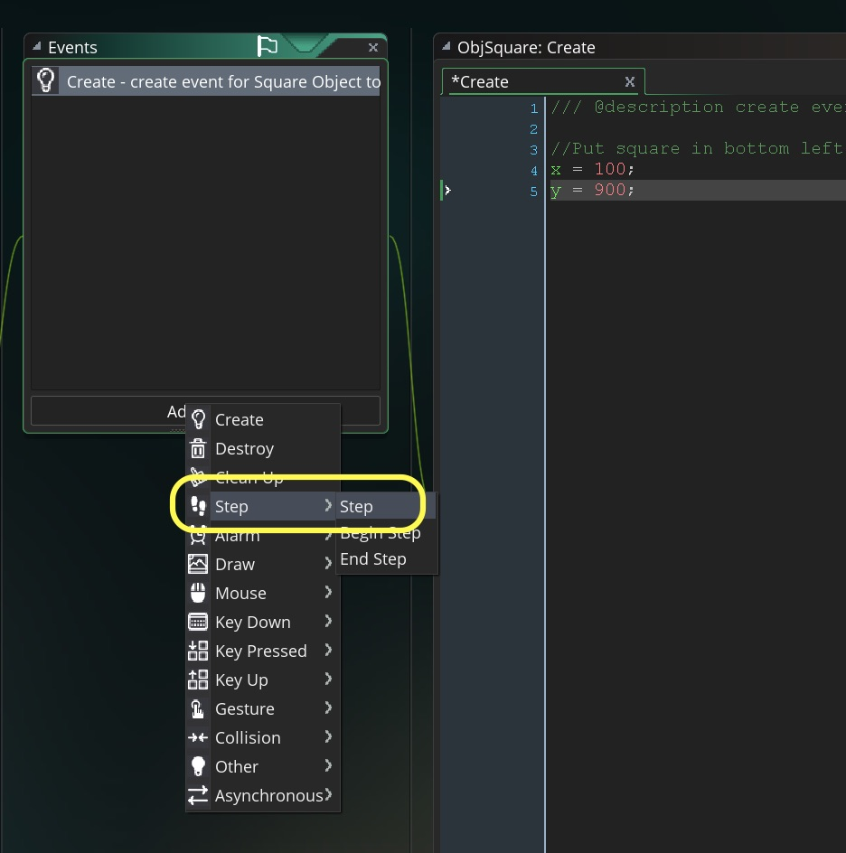
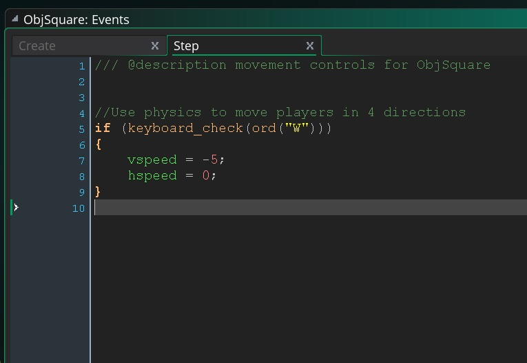

## Part 2 - Moving with Physics
### Create Square Sprite and Object
___ 
<div class="col-8">
<div markdown = "1">
1. Another way of moving is to set a movement with physics once and let the computer move it based on its horizontal and vertical movement.  There are two variables that gamemaker uses that tracks both movement types **_hspeed_** and **_vspeed_**.  It can be set once in a create event and it will continue running as GameMaker defaults to a frictionless environment. This means that if it gets set once, it continues in that direction for a while.  This is perfect for game objects like bullets, or dealing with constant forces such as gravity.
</div>
</div>

___ 
<div class = "row">
<div class="col-12 col-lg-4 col align-self-center">
<div markdown = "1">
{:start="2"}
2. Create a new **_sprite_** by right clicking on the **Sprites** heading in the **Resourrces** menu on the right.
</div>
</div>
<div class="col-12 col-lg-8">
  
</div>
</div>

___ 
<div class = "row">
<div class="col-12 col-lg-4 col align-self-center">
<div markdown = "1">
{:start="3"}
3. Press the **Edit Image** _button_.
</div>
</div>
<div class="col-12 col-lg-8">

</div>
</div>

___ 
<div class = "row">
<div class="col-12 col-lg-4 col align-self-center">
<div markdown = "1">
{:start="4"}
4. Select a different color from the circle and the press the **Fill Tool** _button_:
</div>
</div>
<div class="col-12 col-lg-8">
  
</div>
</div>

___ 
<div class = "row">
<div class="col-12 col-lg-4 col align-self-center">
<div markdown = "1">
{:start="5"}
5. Close all the **Sprite** tabs and go back to the Workspace.  Name the **Sprite** `SprSquare`.
</div>
</div>
<div class="col-12 col-lg-8">
  
</div>
</div>

___ 
<div class = "row">
<div class="col-12 col-lg-4 col align-self-center">
<div markdown = "1">
{:start="6"}
6. Create an new **_object_** by right clicking on the **Objects** heading in the **Resrouces Menu**.  Call is **_ObjSquare_**.  Assign the **_SprSquare_** to the object.
</div>
</div>
<div class="col-12 col-lg-8">
  
</div>
</div>

___ 
<div class = "row">
<div class="col-12 col-lg-6 col align-self-center">
<div markdown = "1">
{:start="7"}
7. Press the **Add Event** _button_ and select a **Create** event. This event only runs once when the object is first instantiated (in this case once we place it in the room, as soon as the game runs and loads it).  Now add to the script:
</div>
</div>

<div class="col-12 col-lg-6">
<div markdown = "1">
```c
//Set horizontal speed to 2 pixels per second
hspeed = 2;
```
</div>
</div>
</div>

  
<br />

___ 
<div class = "row">
<div class="col-12 col-lg-6 col align-self-center">
<div markdown = "1">
{:start="8"}
8. Open `RmLvl1` from the **Resources** tab on the right which opens up a room tab.  Drag with the left mouse button `ObjSquare` from the **Resources** menu and drag it into the bottom left of the room:
</div>
</div>
<div class="col-12 col-lg-8">
  
</div>
</div>

___ 
<div class = "row">
<div class="col-12 col-lg-6 col align-self-center">
<div markdown = "1">
{:start="9"}
9. Run the game and the square should move 2 pixels per frame to the right.
</div>
</div>
<div class="col-12 col-lg-8">
<div class="embed-responsive embed-responsive-16by9">
<iframe class = "embed-responsive-item" src="https://www.youtube.com/embed/zxfpmWPRL00?rel=0&amp;controls=0&amp&showinfo=0&autoplay=1&version=3&loop=1&playlist=zxfpmWPRL00" frameborder="0" allowfullscreen></iframe>
</div>
</div>
</div>

___ 
<div class="col-8">
<div markdown = "1">
{:start="10"}
10. Change the script and and try negative **_hspeed_** as well as positive and negative **_vspeed_** (vertical speed). Combine both **_hspeed_** and **_vspeed_**.  See if the results match our expectations.
</div>
</div>

___ 
<div class = "row">
<div class="col-12 col-lg-6 col align-self-center">
<div markdown = "1">
{:start="11"}
11. We are going to move movement to the **Step** event script as this is needed to poll for controllers.  So replace the code in **_ScrSquareCreate_** to:  
</div>
</div>
<div class="col-12 col-lg-6">
<div markdown = "1">
```c
//Put square in bottom left corner of room
x = 100;
y = 600;
```  
</div>
</div>
</div>

  
<br />

### Moving with Physics
___ 
1. It is almost the same steps as we did for the circle except for an important exception. Since we are moving with **hspeed** and **vspeed** the player does not stop when the player releases all of the buttons on the controller. So what we will do is take on an **if**, **else if** for the four directions and end with an **else** that stops the square from moving. We will now do the following:  
	
	&#9633; Create step event and script for `ObjSquare`
	
	&#9633;  Check if up key is pressed and apply negative vspeed
	
	&#9633;  Check if down key is pressed and apply positive vspeed 
	
	&#9633;  Check if left key is pressed and apply negative hspeed
	
	&#9633;  Check if right key is pressed and apply negative hspeed
	
	&#9633;  Check if no keys are pressed then stop player  

___ 
<div class = "row">
<div class="col-12 col-lg-4 col align-self-center">
<div markdown = "1">
{:start="2"}
2. Start by opening `ObjSquare` and press the **Add Event** button and select a **Step -> Step** event.
	
	&#9633; Create step event and script for `ObjSquare`
</div>
</div>
<div class="col-12 col-lg-4">
  
</div>
<div class="col-12 col-lg-4">
  
</div>
</div>

___ 
<div class = "row">
<div class="col-12 col-lg-4 col align-self-center">
<div markdown = "1">
{:start="3"}
3. Add to **_Step_** script in:  

	&#9635; ~~Create step event and script for `ObjSquare`~~
	
	&#9633;  Check if **up** key is pressed and apply negative vspeed
</div>
</div>
<div class="col-8">
<div markdown = "1">
```c
/// @description movement controls for ObjSquare


//Use physics to move players in 4 directions
if (keyboard_check(ord("W")))
{
	vspeed = -5;
}
```
</div>
</div>
</div>

  
<br />

___ 
<div class = "row">
<div class="col-12 col-lg-7 col align-self-center">
<div markdown = "1">
{:start="4"}
4.  Run the game and test it. Pressing the **W** key should move the player upwards (but the square won't stop moving when you let go as it is has inirtia in a frictionless environment.  Add to the bottom of the **_Step Event_**:  
	
	&#9635; ~~Create step event and script for `ObjSquare`~~
	
	&#9635;  ~~Check if up key is pressed and apply negative vspeed~~
	
	&#9633; Check if down key is pressed and apply positive vspeed 
</div>
</div>
<div class="col-lg-5">
<div markdown = "1">
```c
else if (keyboard_check(ord("S")))
{
	vspeed = 5;
}
```
</div>
</div>
</div>
  
<br />

___ 
<div class = "row">
<div class="col-12 col-lg-7 col align-self-center">
<div markdown = "1">
{:start="5"}
5.  Run the game and test it moving up and down using **W** and **S**. Add to the bottom of the **_Step Event_**:  
	
	&#9635; ~~Create step event and script for `ObjSquare`~~
	
	&#9635;  ~~Check if up key is pressed and apply negative vspeed~~
	
	&#9635; ~~Check if down key is pressed and apply positive vspeed~~

	&#9633; Check if left key is pressed and apply negative hspeed
</div>
</div>
<div class="col-lg-5">
<div markdown = "1">
```c
else if (keyboard_check(ord("A")))
{
	hspeed = -5;
	vspeed = 0;
}
```
</div>
</div>
</div>
 
<br />

___ 
<div class = "row">
<div class="col-12 col-lg-8 col align-self-center">
<div markdown = "1">
{:start="6"}
6. Run the game and test it moving up, down and left using **W**, **S** and **A**. Add to the bottom of the **_Step Event_**:   
	
	&#9635; ~~Create step event and script for `ObjSquare`~~
	
	&#9635;  ~~Check if up key is pressed and apply negative vspeed~~
	
	&#9635; ~~Check if down key is pressed and apply positive vspeed~~

	&#9635; ~~Check if left key is pressed and apply negative hspeed~~

	&#9633; Check if right key is pressed and apply negative hspeed
</div>
</div>
<div class="col-lg-4">
<div markdown = "1">
```c
else if (keyboard_check(ord("D")))
{
	hspeed = 5;
	vspeed = 0;
}

```
</div>
</div>
</div>

  
<br />

___ 
<div class = "row">
<div class="col-12 col-lg-8 col align-self-center">
<div markdown = "1">
{:start="7"}
7. Run the game and test it moving up, down, left and right using **W**, **A** and **S**, **D**. The only remaining issue is to deal with stopping the player when we let go of the movement keys.  Add to the bottom of the **_Step Event_**:   
		
	&#9635; ~~Create step event and script for `ObjSquare`~~
	
	&#9635;  ~~Check if up key is pressed and apply negative vspeed~~
	
	&#9635; ~~Check if down key is pressed and apply positive vspeed~~

	&#9635; ~~Check if left key is pressed and apply negative hspeed~~

	&#9635; ~~Check if right key is pressed and apply negative hspeed~~

	&#9633; Check if no keys are pressed then stop player
</div>
</div>
<div class="col-4">
<div markdown = "1">
```c
else 
{
	hspeed = 0;
	vspeed = 0;
}

```  
</div>
</div>
</div>

___ 
<div markdown = "1">
{:start="8"}
8. Now run and test the game.  I am not s huge fan of using **if** then **else if** for controls as it implies an order and if you have multiple keys pressed, the last key pressed is not the one chosen. It will be the last **else if** that gets picked. Test it and try it out.  For this demo, we will end here and focus on controls when we make a prototype for a specific genre.

	&#9635; Create step event and script for `ObjSquare`
	
	&#9635;  Check if up key is pressed and apply negative vspeed
	
	&#9635; Check if down key is pressed and apply positive vspeed

	&#9635; Check if left key is pressed and apply negative hspeed

	&#9635; Check if right key is pressed and apply negative hspeed

	&#9635; Check if no keys are pressed then stop player
</div>

[<- Previous](MovingThreeWays_4.html) &nbsp;&nbsp;&nbsp;[Home](../../index.html)&nbsp;&nbsp;&nbsp;  [Continue ->](MovingThreeWays_6.html)
<br />  
<br />  
<br />  
<br />  