## Part III - Moving with Polar Coordinates & Physics

### Moving with the Polar Coordinate System
___ 
<div class = "row">
<div class="col-12 col-lg-4 col align-self-center">
<div markdown = "1">
1. The [polar coordinate system](../CoordinateSystems/PolarCoordinateSystem.html) is used for moving at an angle.  The polar coordinate system uses degrees, and looks like a compass:    
</div>
</div>
<div class="col-12 col-lg-8">
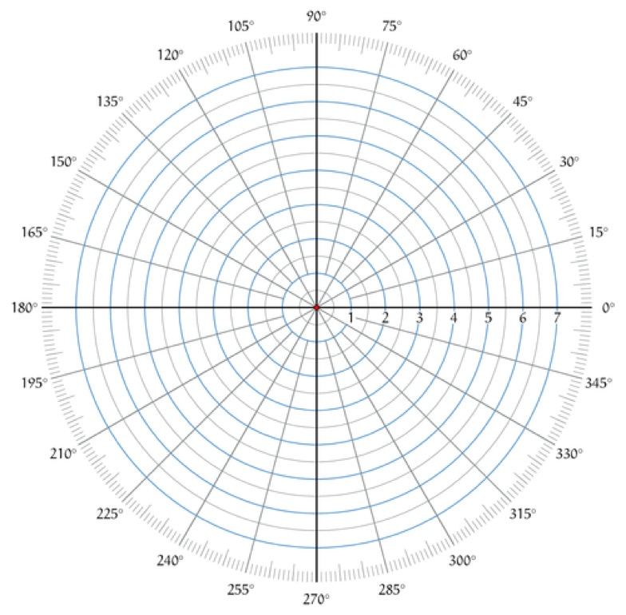 
</div>
</div>

___ 
<div class="col-8">
<div markdown = "1">
{:start="2"}
2. `0`&deg; is towards the right, `90`&deg; is towards the top, `180`&deg; is towards the left, `270`&deg; is towards the bottom.  
</div>
</div>

___ 
<div class="col-8">
<div markdown = "1">
{:start="3"}
3. There are three GameMaker variables that we will be using **_direction_**, **_image\_angle_**, and **_speed_** .  
</div>
</div>

___ 
<div class="col-8">
<div markdown = "1">
{:start="4"}
4. **_image\_angle_** is the angle that the sprite is pointing.  The default value is `0`.  If you want to rotate the sprite `15`&deg; you would need to add 15 to the variable **_image\_angle_**.
</div>
</div>
___ 
<div class = "row">
<div class="col-12 col-lg-4 col align-self-center">
<div markdown = "1">
{:start="5"}
5. Lets try this out.  Create a new **Sprite** by right clicking on **Sprites** in the right hand side **Resources** menu and press **Create**.  Draw with the polygon tool a triangle like shape where it is obvious that forward is pointing directly to the right.  Call the sprite `SprTriangle`:
</div>
</div>
<div class="col-12 col-lg-8">
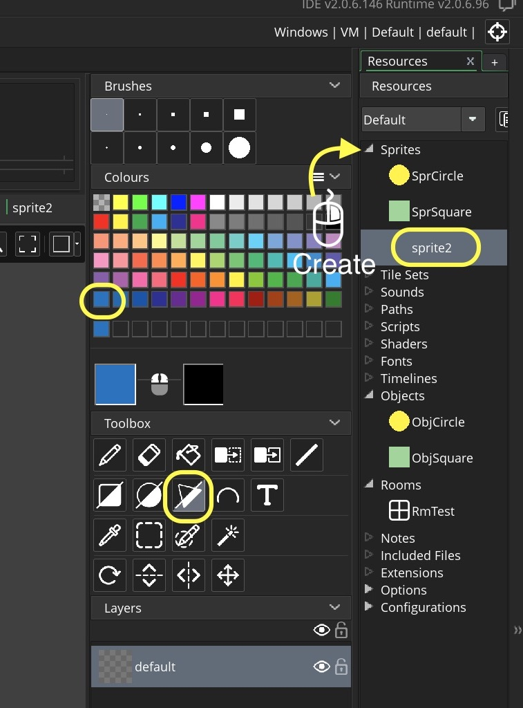 
</div>
</div>
<div class = "row">
<div class="col">
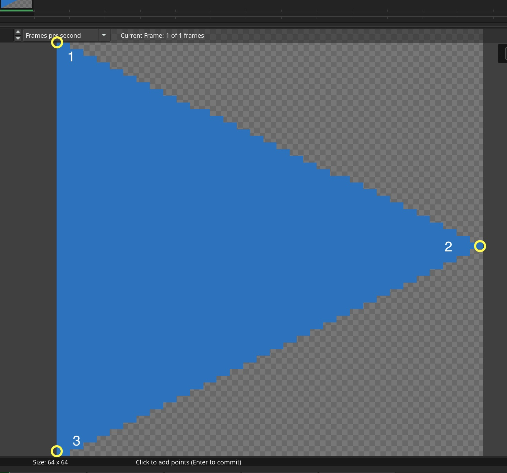 
</div>
<div class="col">
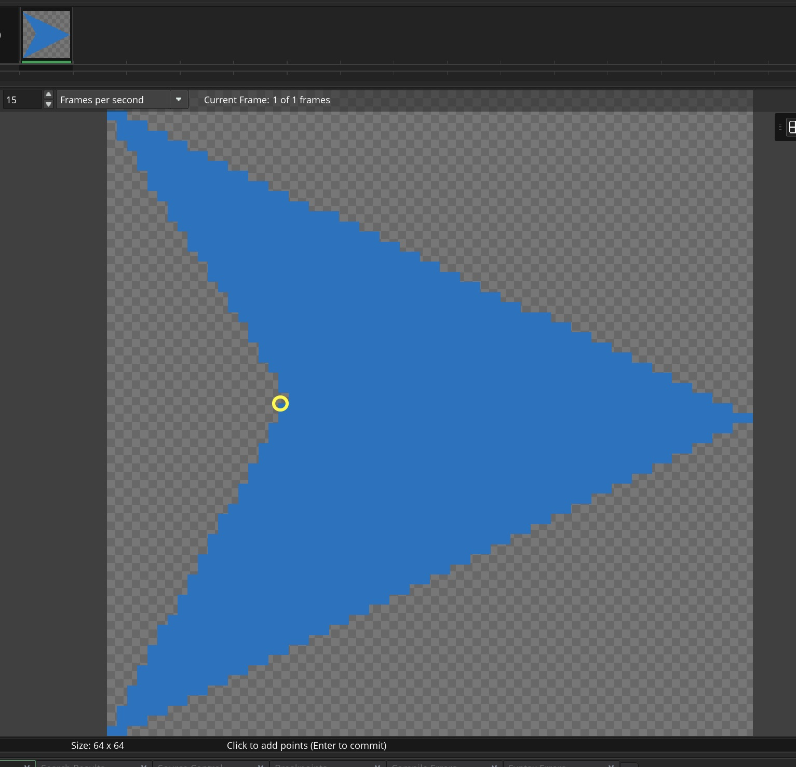 
</div>
<div class="col">
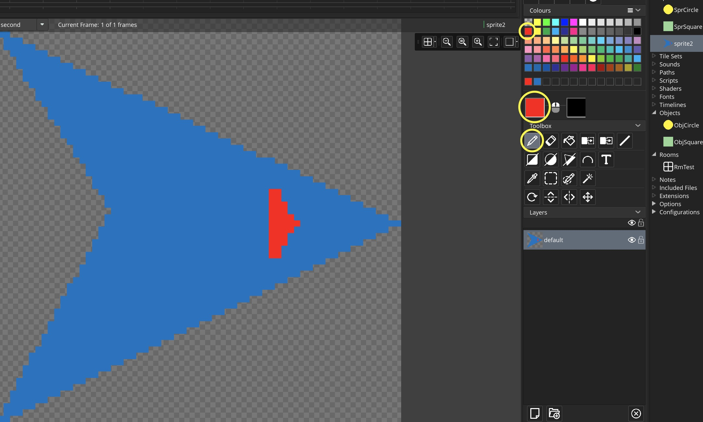 
</div>
</div>

___ 
<div class = "row">
<div class="col-12 col-lg-4 col align-self-center">
<div markdown = "1">
{:start="6"}
6.  Create an **Object** and call it `ObjTriangle` and assign the `SprTriangle` **sprite** to it:
</div>
</div>
<div class="col-12 col-lg-8">
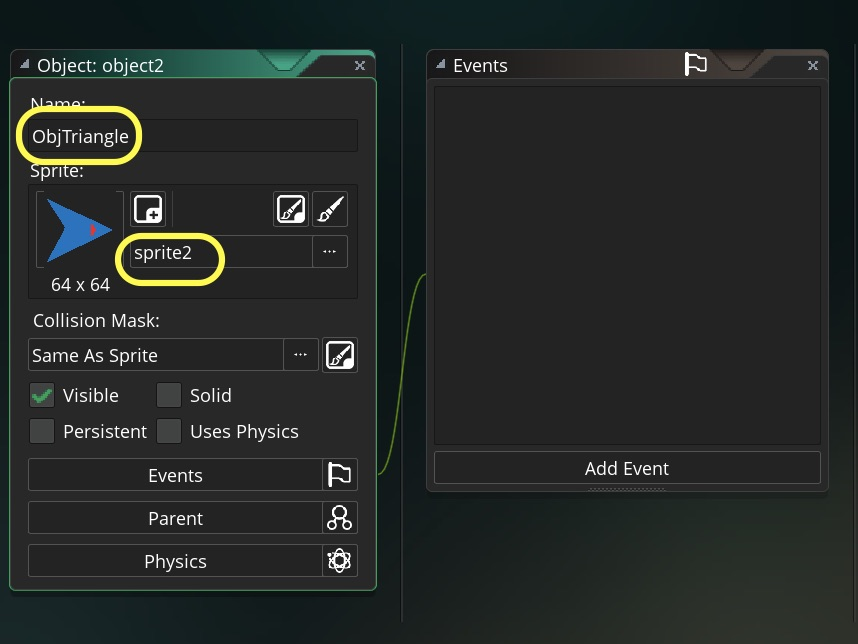 
<br />
</div>
</div>
___ 
<div class = "row">
<div class="col-12 col-lg-4 col align-self-center">
<div markdown = "1">
{:start="7"}
7.  Now drag the triangle into the room in a free spot.
</div>
</div>
<div class="col-12 col-lg-8">
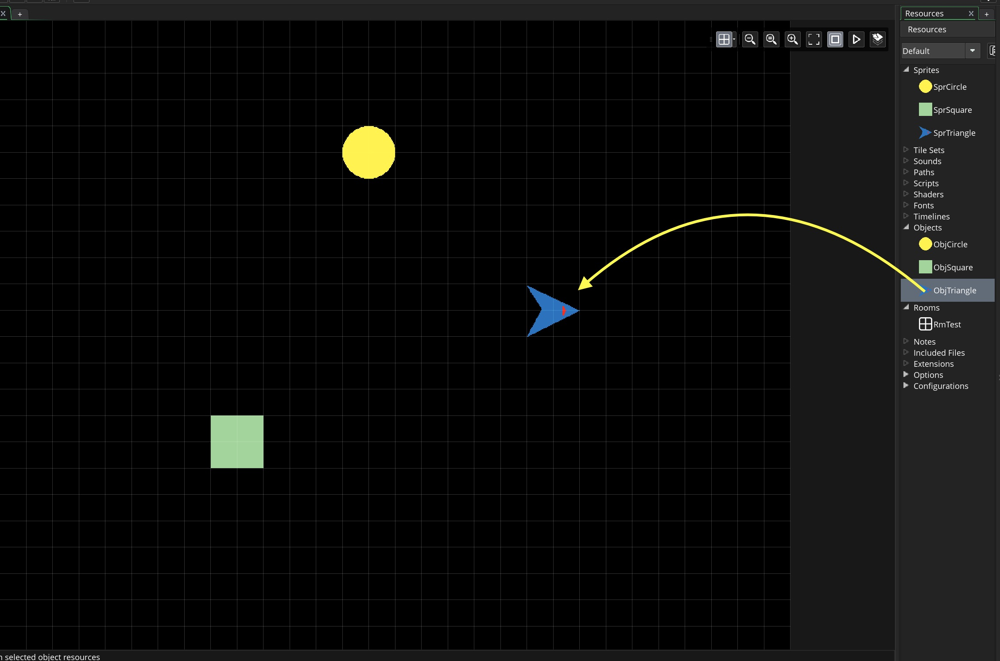 
</div>
</div>

___ 
<div class = "row">
<div class="col-12 col-lg-4 col align-self-center">
<div markdown = "1">
{:start="8"}
8.  Go to **Object** and press the **Add Event** and select **Create**.  Add the followign code to the script:
</div>
</div>
<div class="col-12 col-lg-8">
<div markdown = "1">
```c
/// @description set up variables in create event for triangle

//Rotates sprite by 15 degrees
image_angle = image_angle + 45;
```
</div>
</div>
</div>

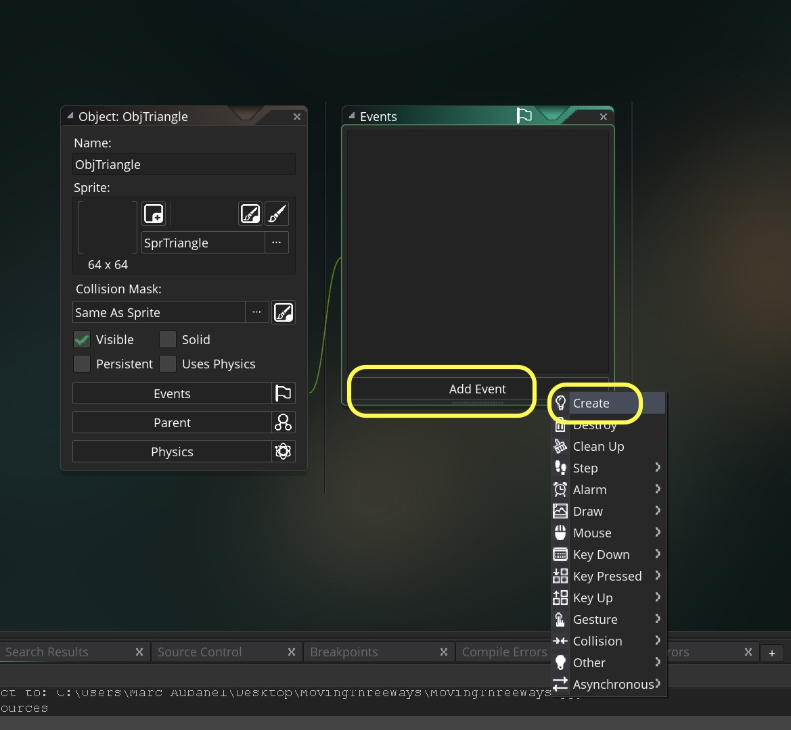 
<br />

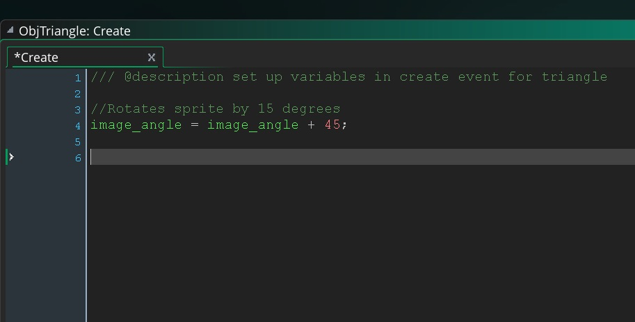 
<br />

___ 
<div class = "row">
<div class="col-12 col-lg-4 col align-self-center">
<div markdown = "1">
{:start="9"}
9. Here is a video of the above process:
</div>
</div>
<div class="col-12 col-lg-8">
<div class="embed-responsive embed-responsive-16by9">
<iframe class = "embed-responsive-item" src="https://www.youtube.com/embed/zxfpmWPRL00?rel=0&amp;controls=0&amp&showinfo=0&autoplay=1&version=3&loop=1&playlist=zxfpmWPRL00" frameborder="0" allowfullscreen></iframe>
</div>
</div>
</div>

___ 
<div class="col-8">
<div markdown = "1">
{:start="10"}
10. Run the game.  Notice that adding makes the ship go counter clockwise.  Change the `+` to a `-` and see if the ship moves counter-clockwise?  Is this what you expected?
</div>
</div>
<div class = "row">
<div class = "col">
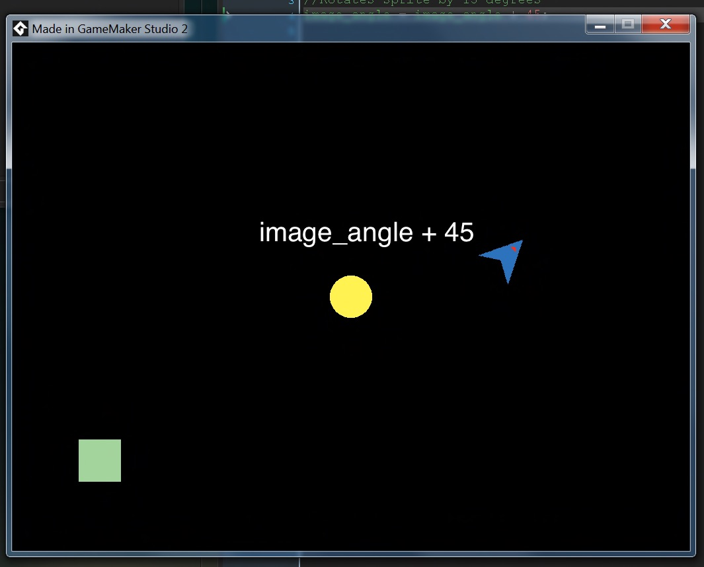 
</div>
<div class="col">
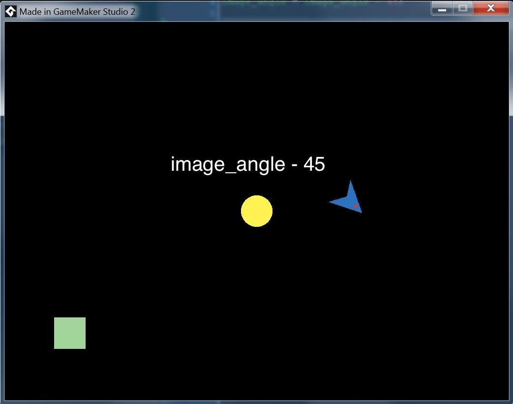 
</div>
</div>

___ 
<div class = "row">
<div class="col-12 col-lg-6 col align-self-center">
<div markdown = "1">
{:start="11"}
11. `direction` is the angle that the sprite is moving in.  A sprite can point in one direction (`image_angle`) and move in another (`direction`).  So the motion vector in the polar system is stored in the **_direction_** variable.  It defaults to 0.  There is no movement with this as we need to add momentum (pixels per frame) based on the `speed` variable that will go in the angle set by `direction`.  For example, A sprite at a `direction` of `90` and `speed` of `5` will move upwards at 5 pixels per second (the equivalent to `vspeed = -5;`). Replace the entire **Create** event script with:
</div>
</div>
<div class="col-12 col-lg-6">
<div markdown = "1">
```c
/// @description set up variables in create event for triangle

//Make ship go backwards up screen 2 pixels per second.  
image_angle = -90;
direction = 90;
speed = 2;
```
</div>
</div>
</div>
___ 
<div class = "row">
<div class="col-12 col-lg-4 col align-self-center">
<div markdown = "1">
{:start="12"}
12.  Run the game, and it should look something like:
</div>
</div>
<div class="col-12 col-lg-8">
<div class="embed-responsive embed-responsive-16by9">
<iframe class = "embed-responsive-item" src="https://www.youtube.com/embed/1B_eihx5LVE?rel=0&amp;controls=0&amp&showinfo=0&autoplay=1&version=3&loop=1&playlist=1B_eihx5LVE" frameborder="0" allowfullscreen></iframe>
</div>
</div>
</div>


[<- Previous](MovingThreeWays_5.html) &nbsp;&nbsp;&nbsp;[Home](../../index.html)&nbsp;&nbsp;&nbsp;  [Continue ->](MovingThreeWays_7.html)
<br />  
<br />  
<br />  
<br />  
