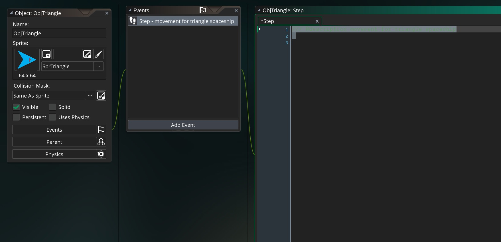
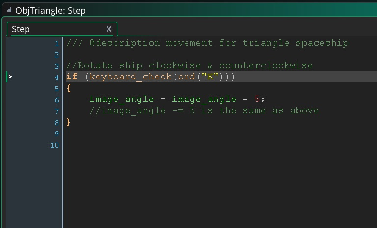
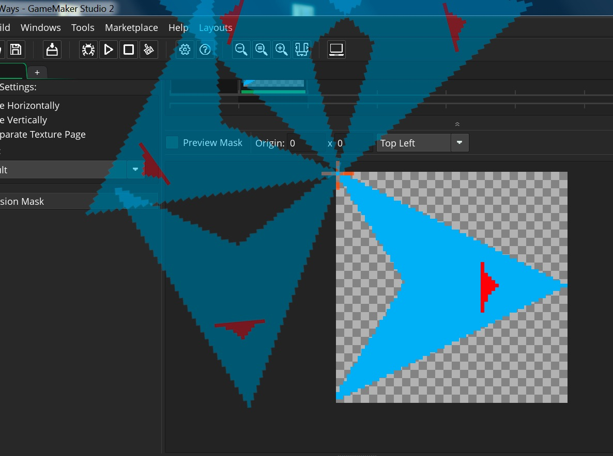
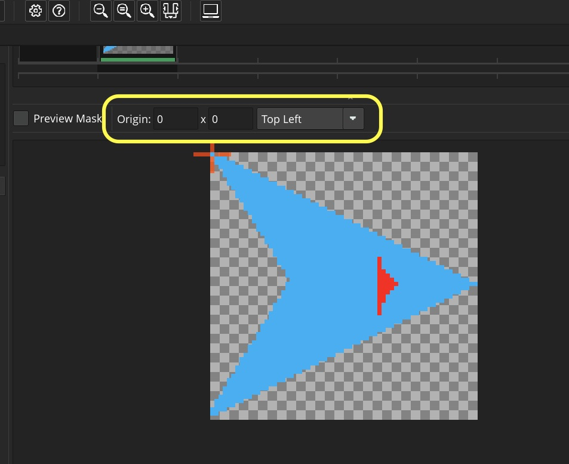
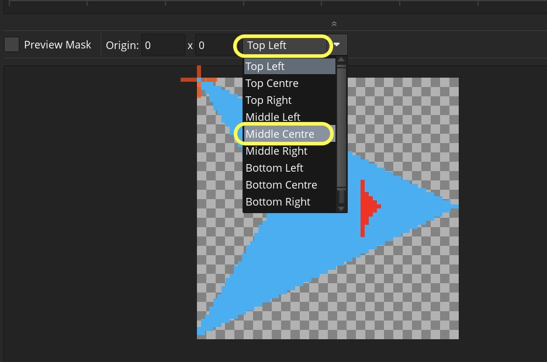
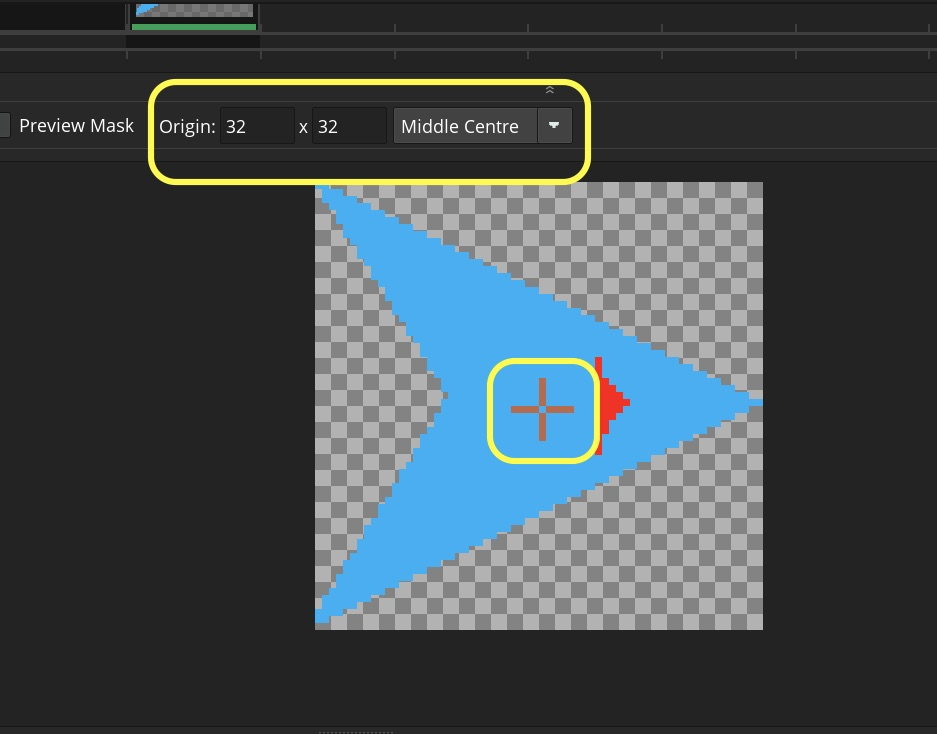
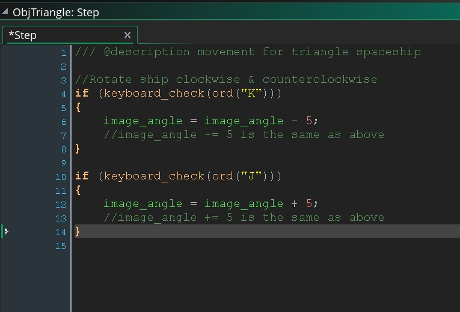

### Putting Movement all in a Step Event Script
___ 
1. We will now do the following:  
	
	&#9633; Create a **Step Event** for `ObjTriangle`
	
	&#9633; Check if 'K' key is pressed and rotate triangle clockwise
	
	&#9633; Check if 'J' key is pressed and rotate triangle counter-clockwise
	
	&#9633; Check if space key is pressed and give the triangle thrust in the direction that the sprite is pointing in
	
	&#9633; Apply friction to slow triangle to a stop

___ 
<div class = "row">
<div class="col-12 col-lg-4 col align-self-center">
<div markdown = "1">
{:start="2"}
2. Delete all the scripts in the **Create** event as we will be animating in in the step.  Press **Add Event** and select **Step -> Step**.
	
	&#9633; Create a **Step Event** for `ObjTriangle`
</div>
</div>
<div class="col-12 col-lg-8">
 
</div>
</div>

___ 
<div class = "row">
<div class="col-12 col-lg-4 col align-self-center">
<div markdown = "1">
{:start="3"}
3. Add to the **Step** script.  Remember that we subtract from `image_angle` to go clockwise:  

	&#9635; ~~Create a **Step Event** for ObjTriangle~~

	&#9633; Check if 'K' key is pressed and rotate triangle clockwise
</div>
</div>
<div class="col-12 col-lg-8">
<div markdown = "1">
```c
/// @description movement for triangle spaceship

//Rotate ship clockwise & counterclockwise
if (keyboard_check(ord("K")))
{
	image_angle = image_angle - 5;
	//image_angle -= 5 is the same as above
}
```
</div>
</div>
</div>

 
<br />

___ 
<div class = "row">
<div class="col-12 col-lg-4 col align-self-center">
<div markdown = "1">
{:start="4"}
4. Now run the game.  You should see something like:   
</div>
</div>
<div class="col-12 col-lg-8">
<div class="embed-responsive embed-responsive-16by9">
<iframe class = "embed-responsive-item" src="https://www.youtube.com/embed/TL7nESSv-5A?rel=0&amp;controls=0&amp&showinfo=0&autoplay=1&version=3&loop=1&playlist=TL7nESSv-5A" frameborder="0" allowfullscreen></iframe>
</div>
</div>
</div>

___ 
<div class = "row">
<div class="col-12 col-lg-4 col align-self-center">
<div markdown = "1">
{:start="5"}
5. Now we have a problem.  The ship is not rotating from its center, but from the top corner where its origin is located.
</div>
</div>
<div class="col-12 col-lg-8">
 
</div>
</div>

___ 
<div class = "row">
<div class="col-12 col-lg-4 col align-self-center">
<div markdown = "1">
{:start="6"}
6. Since the **Sprite** rotates from its **origin** lets adjust it.  The **Middle -> Center** is best for my ship but it might be different from yours.  You can manually select a point with your left mouse button if it is not symetrical.
</div>
</div>
<div class="col-12 col-lg-8">
 
</div>
</div>.
<div class = "row">
<div class = "col">
 
</div>
<div class = "col">
 
</div>
</div>

___ 
<div class = "row">
<div class="col-12 col-lg-3 col align-self-center">
<div markdown = "1">
{:start="7"}
7. Run simulation again and the ship should now be centered.
</div>
</div>
<div class="col-12 col-lg-9">
<div class="embed-responsive embed-responsive-16by9">
<iframe class = "embed-responsive-item" src="https://www.youtube.com/embed/YsnYcv7Y4fc?rel=0&amp;controls=0&amp&showinfo=0&autoplay=1&version=3&loop=1&playlist=YsnYcv7Y4fc" frameborder="0" allowfullscreen></iframe>
</div>
</div>
</div>

___ 
<div class = "row">
<div class="col-12 col-lg-4 col align-self-center">
<div markdown = "1">
{:start="8"}
8. Add counter-clockwise rotation to the triangle to the end of the **Step Event Script**.
	
	&#9635; ~~Create a **Step Event** for ObjTriangle~~

	&#9635; ~~Check if 'K' key is pressed and rotate triangle clockwise~~

	&#9633; Check if 'J' key is pressed and rotate triangle counter-clockwise
</div>
</div>
<div class="col-12 col-lg-8">
<div markdown = "1">
```c
if (keyboard_check(ord("J")))
{
	image_angle = image_angle + 5;
	//image_angle += 5 is the same as above
}
```
</div>
</div>
</div>

 
<br />

___ 
<div class = "row">
<div class="col-12 col-lg-7 col align-self-center">
<div markdown = "1">
{:start="9"}
9. We want the `direction` to be the same as `image_angle` so that the ship moves in the direction it is pointing.  We also want to add thrust by giving `5` pixels per frame when the `vk_space` button is pressed.  Add to the bottom of the **Step Event Script**.
	
	&#9635; ~~Create a **Step Event** for ObjTriangle~~

	&#9635; ~~Check if 'K' key is pressed and rotate triangle clockwise~~

	&#9635; ~~Check if 'J' key is pressed and rotate triangle counter-clockwise~~

	&#9633; Check if space key is pressed and give the triangle thrust in the direction that the sprite is pointing in
</div>
</div>
<div class="col-12 col-lg-5">
<div markdown = "1">
```c
//position ship's thrust in direction that ship is pointing and give it a boost when pressing space
if (keyboard_check(vk_space) )
{
	direction = image_angle;
	speed = 5;
	//image_angle += 5 is the same as above
}
```
</div>
</div>
</div>

___ 
<div class = "row">
<div class="col-12 col-lg-3 col align-self-center">
<div markdown = "1">
{:start="10"}
10. Your ship should look something like:
</div>
</div>
<div class="col-12 col-lg-9">
<div class="embed-responsive embed-responsive-16by9">
<iframe class = "embed-responsive-item" src="https://www.youtube.com/embed/4xsmrM6Hy2g?rel=0&amp;controls=0&amp&showinfo=0&autoplay=1&version=3&loop=1&playlist=4xsmrM6Hy2g" frameborder="0" allowfullscreen></iframe>
</div>
</div>
</div>

___ 
<div class = "row">
<div class="col-12 col-lg-8 col align-self-center">
<div markdown = "1">
{:start="11"}
11. Now we need to add friction.  A spaceship should not come to a halt right away like the Square.  Add to the bottom of the **Step Event Script**.
	
	&#9635; ~~Create a **Step Event** for ObjTriangle~~

	&#9635; ~~Check if 'K' key is pressed and rotate triangle clockwise~~

	&#9635; ~~Check if 'J' key is pressed and rotate triangle counter-clockwise~~

	&#9635; ~~Check if space key is pressed and give the triangle thrust in the direction that the sprite is pointing in~~

	&#9633; Apply friction to slow triangle to a stop
</div>
</div>	
<div class="col-12 col-lg-4">
<div markdown = "1">
```c
//friction that shows the ship down
if ( speed > 0 )
{
	speed = speed - .2;
}
else
{
    speed = 0;
}
```
</div>
</div>
</div>

___ 

{:start="12"}
12. Play the game.  Now you should have the ship slowing down nicely when letting go.  If you look at the algorithm above, first we make sure that the speed is greater than friction (`speed = speed -2;`) and if it is not we clamp it down to `0` by setting `speed = 0`.

	&#9635; Create a **Step Event** for ObjTriangle

	&#9635; Check if 'K' key is pressed and rotate triangle clockwise

	&#9635; Check if 'J' key is pressed and rotate triangle counter-clockwise

	&#9635; Check if space key is pressed and give the triangle thrust in the direction that the sprite is pointing in

	&#9635; Apply friction to slow triangle to a stop

___
<div markdown = "1">
{:start="13"}
13. That's it for this introduction to GameMaker. Go to the next page for a recap of new functions used.

</div>

[<- Previous](MovingThreeWays_6.html) &nbsp;&nbsp;&nbsp;[Home](../../index.html)&nbsp;&nbsp;&nbsp;  [Continue ->](MovingThreeWays_8.html)
<br />  
<br />  
<br />  
<br />  
