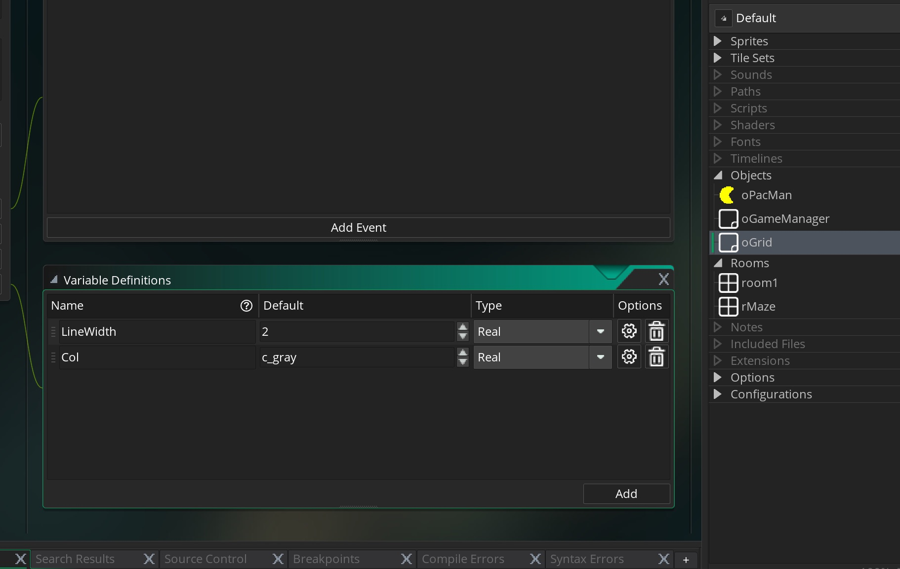

# Pac-Man Style Game Page 1

## Index
* Part 1 - Create The Player Sprite and Object then Place in Room
    1. [Creating a Sprite](#creating-a-sprite)  
    2. [Creating an Object](#creating-an-object)
    3. [Editing a Room](#edit-the-room)

* Part 2 - Movement on Grid
    1. [Draw Debug Grid](#draw-debug-grid)
    2. [Position and Move Along Center](PacManStyleGame_2.html#position-and-move-along-center)
    3. [Track Directions](PacManStyleGame_3.html#track-directions)
    4. [Move Left and Right](PacManStyleGame_3.html#move-left-and-right)
    5. [Collision Detection](PacManStyleGame_3.html#collision-detection)
    6. [Turning](PacManStyleGame_4.html#turning) 

* Part 3 - Background Tiles 
    1. [Drawing Tiles](PacManStyleGame_5.html#drawing-tiles)

* Part 4 - Dots and Speed
    1. [Dots](PacManStyleGame_6.html#dots) 
    2. [Speed](PacManStyleGame_6.html#speed) 
    3. [Eating Dots](PacManStyleGame_6.html#eating-dots)

* Part 5 - Ghosts
    1. [Blinky](PacManStyleGame_7.html#blinky) 
    2. [Pathfinding](PacManStyleGame_7.html#pathfinding) 
    3. [Timer](PacManStyleGame_8.html#timer) 
    4. [Chase ane Scatter](PacManStyleGame_8.html#chase-and-scatter) 
    5. [Ghost Killing Player](PacManStyleGame_8.html#ghost-killing-player) 
    6. [Restart Level After Dying](PacManStyleGame_9.html#restart-level-after-dying)
    7. [Chase Mode](PacManStyleGame_9.html#chase-mode)
    8. [Leave Hotel](PacManStyleGame_10.html#leave-hotel)
    9. [Pinky](PacManStyleGame_10.html#pinky)

    When the system forces the ghosts to reverse course, they do not necessarily change direction simultaneously; some ghosts may continue forward for a fraction of a second before turning around.
    4.  Ghosts being eaten

* Part 6 - Lives & Scoring
    1.  Scoring (240 regular dots, 10 points each.  Four large dots 50 points each, 200 for first ghost eaten then 400, 800 and 1600)
    
_____ 

## Part 1 | Create The Player Sprite and Object then Place in Room

We will introduce you to the Gamemaker 2 IDE and introduce you to creating a sprite, an object, some movement code and setting up a room based on the Pac Man Game.  

_____ 

### Creating a Sprite

_____ 



{:start="{{ num }}"}
{{ num }}. A [sprite](https://en.wikipedia.org/wiki/Sprite_(computer_graphics)) contains is just a 2-d pixel graphic representation of an object.  It is always square but can contain a pixel representation inside of that square including transparencies so it can look like any shape. Create a new sprite by _right-clicking_ in the right hand sided **Resource** tab on the **Sprites** pull down menu and selecting **Create**. Call it **sPacMan**.  Leave the size at 64 x 64 and press **Edit Image** to paint our character.

  

_____ 


{:start="{{ num }}"}
{{ num }}.  Pick the color you want to use for the main color of the sprite, I have picked yellow.  You have two color panes, the on the left is for the main color and the one on the right is for the stroke color.  Pick the smallest brush size.  Pick the circle fill (bottom right corner) tool and drag a circle in the editing window.

_____ 


{:start="{{ num }}"}
{{ num }}.  Right click the frame on the top row and copy and paste it to make a copy and we will start to open the mouth.

_____ 


{:start="{{ num }}"}
{{ num }}.  Select the black color and pick the polygon fill tool (looks like a triangle, bottom right).  Now go to the actual center of the sprite 32 x 32 and then select a narrow mouth opening.

_____ 


{:start="{{ num }}"}
{{ num }}.  Select the black color and pick the polygon fill tool (looks like a triangle, bottom right).  Now go to the actual center of the sprite 32 x 32 and then select a narrow mouth opening.

_____ 


{:start="{{ num }}"}
{{ num }}.  Select the black color with the Magic Wand tool and then press delete to make it transparent.

_____ 


{:start="{{ num }}"}
{{ num }}.  Repeat 5 more times then double up on the open and closed shape.  Change the framerate to 30 and preview.

_____ 

### Creating an Object
_____ 




{:start="{{ num }}"}
{{ num }}.  Right click on **Objects** and press **Creat Object**.  Now bind the new `spacMan` **sprite** to the new object and name it `oPacMan`.

_____ 

### Edit the Room
_____ 



{:start="{{ num }}"}
{{ num }}.  Look at dimensions of original game and adjust for higher resolution displays.

_____ 


{:start="{{ num }}"}
{{ num }}.  Open the room folder and there is a default one provided.  Rename it to rMaze and make the dimensions multiples of 32 with 896 x 1152.

_____ 


{:start="{{ num }}"}
{{ num }}.  We are going to control all aspects of the game with a **Game Object** and call it `oGameManager`:

_____ 


{:start="{{ num }}"}
{{ num }}.  Add a new **Create Event** and add:

_____ 


{:start="{{ num }}"}
{{ num }}.  Drag the `oGameManager` into the room.  Make sure there is ONLY ONE!

_____ 


{:start="{{ num }}"}
{{ num }}.  Pac should be placed right where we want him in the room:

_____ 

## Part 2 | Movement on Grid

We need to have the character move but his mouth needs to be centered on the 32 x 32 grid and the character is oversized.

_____ 

### Draw Debug Grid

_____ 


{:start="{{ num }}"}
{{ num }}.  We need to restrict movement on a 32 by 32 grid.  To do this we should draw a debug grid that we can use then discard when we draw the level properly.  Create a new Object and call it `oGrid`.


{:start="{{ num }}"}
{{ num }}.  We are going to be using two variables. Create a `LineWidth` and set the default to `2`. .  Create a `Col` for color and set it to `c_gray`.  

_____ 


{:start="{{ num }}"}
{{ num }}.  We are going to create a variable that we will access from multiple objects so we will place it in the `oGameManager`'s variables and create a `GridSize` and set it to `32`:

_____ 


{:start="{{ num }}"}
{{ num }}. We are going to create a new Event.  Press on the Event button and select `Draw | Draw`.    

_____ 


{:start="{{ num }}"}
{{ num }}. We are going to create the first script for the project.  What we are going to do is create a variable and use a while loop.  So we will start on the left side of the axis and at the point on the x-axis and 0 and the point on the x-axis and room_height on the y we will draw a line with a width set to a color.  Enter:

_____ 


{:start="{{ num }}"}
{{ num }}. Run the game, it should look like:

_____ 


{:start="{{ num }}"}
{{ num }}. Add horizontal logic to the code.

_____ 


{:start="{{ num }}"}
{{ num }}. Run the game, it should look like:

_____ 

___ 
  

[Home](../../index.html)&nbsp;&nbsp;&nbsp; [Continue ->](PacManStyleGame_2.html)
   
   
   
