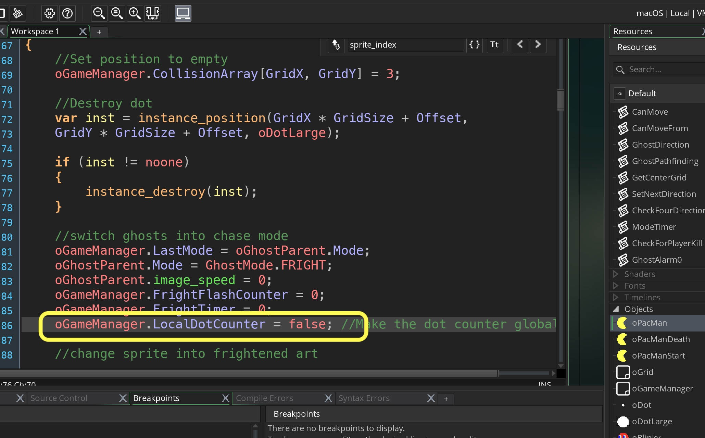

_____ 

### Leave Hotel

_____ 


{:start="{{ num }}"}
{{ num }}. Now we need to deal with the ghosts in Hotel.  We have the eyes coming back but it needs to change back to Blinky and then Blinky needs to leave hotel and go back to the state that the rest of the game is in. Add to the bottom of `oBlinky` **Step Event** a switch when arrived:

  

_____ 


{:start="{{ num }}"}
{{ num }}. We need to add a variable to the ghost that tracks if it is in jail or not.  Open the **Create Event** in `oBlinky` and add:

  

_____ 



{:start="{{ num }}"}
{{ num }}. In `oBlinky` **Step Event** in an else on InHotel Switch back to ghost, move back to start point go back to regular game mode.

  

_____ 

### Pinky
_____ 



{:start="{{ num }}"}
{{ num }}. Copy the `oBlinky` Object.  Change the sprite to Pinky (you will need to import it) and make the following changes to Blinky's Create event:

  



{:start="{{ num }}"}
{{ num }}. And:. 

  

_____ 



{:start="{{ num }}"}
{{ num }}. and: 

  

_____ 



{:start="{{ num }}"}
{{ num }}. and change the scatter target to top left: 

  

_____ 



{:start="{{ num }}"}
{{ num }}. Make changes to Pinky's **Step Event** and change `oBlinky` to `oPinky` in:

  

_____ 



{:start="{{ num }}"}
{{ num }}. and:

  

_____ 



{:start="{{ num }}"}
{{ num }}. Now comment out the entire hotel portion as we will be having a point system on when the ghost should leave the hotel.

  

_____ 



{:start="{{ num }}"}
{{ num }}. Put Pinky in the center of the hotel:

  

_____ 



{:start="{{ num }}"}
{{ num }}. We need add dot counters to the ghosts. Pinky's dot limit is always set to zero, causing him to leave home immediately when every level begins. For the first level, Inky has a limit of 30 dots, and Clyde has a limit of 60. This results in Pinky exiting immediately which, in turn, activates Inky's dot counter. His counter must then reach or exceed 30 dots before he can leave the house. Whenever a life is lost, the system disables (but does not reset) the ghosts' individual dot counters and uses a global dot counter instead. This counter is enabled and reset to zero after a life is lost, counting the number of dots eaten from that point forward.

The three ghosts inside the house must wait for this special counter to tell them when to leave. Pinky is released when the counter value is equal to 7 and Inky is released when it equals 17. The only way to deactivate the counter is for Clyde to be inside the house when the counter equals 32; otherwise, it will keep counting dots even after the ghost house is empty.

So lets create a switch in the **Create Event** for Pinky and a LocalDotLimit and GlobalDotLimit and a counter.

  

________ 



{:start="{{ num }}"}
{{ num }}. Add global varaibles and dot counter in `oGameManager`:

  

__ 



{:start="{{ num }}"}
{{ num }}. Now lets edit the step event and add the else back in:

  

_____ 



{:start="{{ num }}"}
{{ num }}. and:

  

_____ 



{:start="{{ num }}"}
{{ num }}. Pinky does not start in SCATTER mode.  Open `oGameManager` and edit the **Create Event**:

  

_____



{:start="{{ num }}"}
{{ num }}. Lets change Pinky's targeting to match his rules.

  

_____



{:start="{{ num }}"}
{{ num }}. Now lets have the counter switch to global when player dies.  Go to `oPacMan` and find out when we kill the player and make this one line addition:

  

_____



{:start="{{ num }}"}
{{ num }}. Play the game and die and it crashes.  Now edit Pinky's step script:

  

_____ 



{:start="{{ num }}"}
{{ num }}. Same thing for Blinky:

  

_____ 



{:start="{{ num }}"}
{{ num }}. Go to the `oPacManStart` script and add Pinky bakc into the level:

  

_____ 



{:start="{{ num }}"}
{{ num }}. Now go the alarm on the same object and add the game mode switch:

  

_____ 



{:start="{{ num }}"}
{{ num }}. Now the ghosts stay in Fright Mode for 6 seconds, then flash quickly 5 times before going back to normal. Lets add four variables to the `oGameManager`:

  

_____ 



{:start="{{ num }}"}
{{ num }}. Now we need to adjust the timer when in FRIGHT so go to `oGameManager` **Step Event**:

  

_____ 



{:start="{{ num }}"}
{{ num }}. Now we need to adjust the timer when in FRIGHT so go to `oGameManager` **Step Event**:

  

_____ 



{:start="{{ num }}"}
{{ num }}. Import the flashing sprite which should be called: `sGhostFrightFlash_strip12.png`.  Center the origin and change the framerate to 30 and call the sprite `sGhostFrightFlash`:

  

_____ 



{:start="{{ num }}"}
{{ num }}. Import the flashing sprite which should be called: `sGhostFrightFlash_strip12.png`.  Center the origin and change the framerate to 30 and call the sprite `sGhostFrightFlash`:

  

_____ 



{:start="{{ num }}"}
{{ num }}. Before we trigger the animation we need to not have it change animation frames.  Open `GhostDirection` and wrap in an if to only run if in CHASE or SCATTER modes:

  

_____ 



{:start="{{ num }}"}
{{ num }}. Add to the top of `oBlinky`'s step event a change to the flashing:

  

_____ 


{:start="{{ num }}"}
{{ num }}. Play the game and die.  The game crashes.  Open `CheckForPlayerKill` and add an else if which fixes one problem:

  

_____ 


{:start="{{ num }}"}
{{ num }}. Second problem lies in `oGameManager` **Step Event**.  You need to wrap the whole function in and if to check if oGhostParent exists:

  

_____ 

   
   
   
[<- Previous](PacManStyleGame_9.html)&nbsp;&nbsp;&nbsp;[Home](../../index.html)&nbsp;&nbsp;&nbsp; [Continue ->](PacManStyleGame_11.html)
   
   
   
   