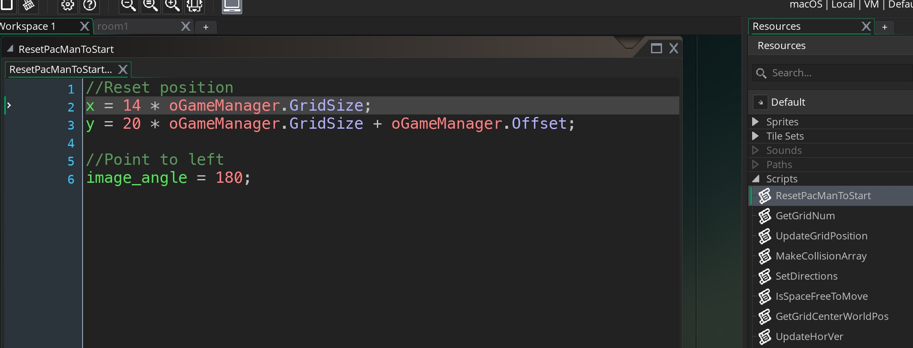

_____ 

### Track Directions
_____ 



{:start="{{ num }}"}
{{ num }}. Lets create 4 variables that tracks which direction we are moving in.  We create 4 booleans and default them all to false except left which is true and the default position.

  

_____ 

### Move Left and Right
_____ 



{:start="{{ num }}"}
{{ num }}. Lets add controls so we can move PacMan left and right.  We use the `keyboard_check(key)` function then change the `image_angle` and `direction` of the motion vector.

  

_____ 

### Collision Detection
_____ 



{:start="{{ num }}"}
{{ num }}. We need to add colision detection so if Pac-Man hits a maze piece it stops.  We will create a spreadsheet where 0 is non-traversable, 1 is a small dot, 2 is a large dot, and 3 is traversable with no dot.  You spreadsheet should look like:

  

_____ 


{:start="{{ num }}"}
{{ num }}.  You then need to save the file as a csv comma deliniated.  Cut and paste it into GameMaker into the **Create Event** of `oGameManager` and add commas at the end of each line.  Now you can't instantiate an array in a single line so we will have to create a function that will load this into a 2-dimensional array.  Use the function `MakeCollisionArray`.

_____ 


{:start="{{ num }}"}
{{ num }}.  Now lets create a new script that converts that single list into a 2 dimensional array that we can use:

_____ 


{:start="{{ num }}"}
{{ num }}.  We need to now show where the PacMan can move with debug.  So lets add to `oGrid` **Draw** event:

_____ 


{:start="{{ num }}"}
{{ num }}.  Run the game and you should see green squares where PacMan can move:

_____ 


{:start="{{ num }}"}
{{ num }}.  Now we need to keep track of whether the character can move into the next square, if not they will need to stop at the very begining of that square. Create a new script to set all directions to false except for the one we are moving in.  We will use the vk_left etc... as constants.  Create a script called `SetDirections` and add:

_____ 


{:start="{{ num }}"}
{{ num }}.  Call this script from `oPacMan` **Step Event**:

_____ 


{:start="{{ num }}"}
{{ num }}.  Now check to see if next left square is free when moving left and if not then place in middle of square.  Add a new script called `IsSpaceFreeToMove` and add:

_____ 


{:start="{{ num }}"}
{{ num }}.  Call the script from `oPacMan` step:

_____ 


{:start="{{ num }}"}
{{ num }}.  Run the game and you get stuck when you go to the left.  We need to give speed back to the player when they press the arrow keys to move in a different direction.

_____ 


{:start="{{ num }}"}
{{ num }}.  Lets add a check to only run the code if the player is changing diretions and add speed to the player when turning.

_____ 


{:start="{{ num }}"}
{{ num }}.  Test the game left and right.  OK, the player stops on the left, but not on the right.  Lets add the collision for moving right.

_____ 


{:start="{{ num }}"}
{{ num }}.  Lets clean up the code by adding a function for getting center position of grid.  Create a new **Script** called `GetGridCenterWorldPos` and add:

_____ 


{:start="{{ num }}"}
{{ num }}.  Lets go back to `IsSpaceFreeToMove` and change:

_____ 


{:start="{{ num }}"}
{{ num }}.  Now press and hold left then press right and do the opposite.  See how the controls are not consistent?  This is because of our if statement running is a specific order.  Lets not do that, lets check for the last key pressed, so changed the algorithm.  We are going to add last key checked but need to set it to left for the begining of the game.  Lets check for the last key pressed, so changed the algorithm:

_____ 


{:start="{{ num }}"}
{{ num }}.  Now we will have different movement for turning than moving laterally left to right and up to down.  So lets add two more variables to PacMan:

_____ 


{:start="{{ num }}"}
{{ num }}.  Create a new script called `UpdateHorVerScript` and add:

_____ 


{:start="{{ num }}"}
{{ num }}.  Now open `oPacMan` **Step Event** and call this at the top:

_____ 


{:start="{{ num }}"}
{{ num }}.  Create a new script called `PacManMoveLaterally` and copy and paste the movement cutting it out of the **Step Event**:

_____ 


{:start="{{ num }}"}
{{ num }}.  Call it again from the **Step Event**:

_____ 


{:start="{{ num }}"}
{{ num }}.  Play the game and you can now see that it works exaclty the same as previous.  Now lets add going up and down. First lets a horizontal check to `PacManCanMoveLaterally`:

_____ 


{:start="{{ num }}"}
{{ num }}.  Add the vertical checks for `PacManMoveLaterally`:

_____ 


{:start="{{ num }}"}
{{ num }}.  Add up and down to `IsSpaceFreeToMove`:

_____ 


{:start="{{ num }}"}
{{ num }}.  Edit `ResetPacManToStart` and change it to a square that is vertical and update variables:

_____ 


{:start="{{ num }}"}
{{ num }}.  Change the order in PacMan Create:


{:start="{{ num }}"}
{{ num }}.  Change the default direcxtion to up:

_____ 


{:start="{{ num }}"}
{{ num }}.  Reset back to previous position.  Start by returning the `ResetPacManToStart` back to the original position:

_____ 


{:start="{{ num }}"}
{{ num }}.  Change `oPacMan` **Creaet Event**:

_____ 


{:start="{{ num }}"}
{{ num }}.  Set IsMoveLeft back to true:

_____ 

   
   
[<- Previous](PacManStyleGame_2.html)&nbsp;&nbsp;&nbsp;[Home](../../index.html)&nbsp;&nbsp;&nbsp; [Continue ->](PacManStyleGame_4.html)
   
   
   
   