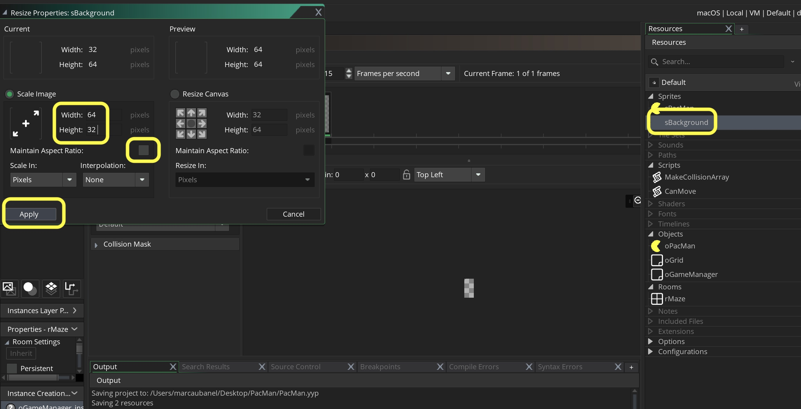
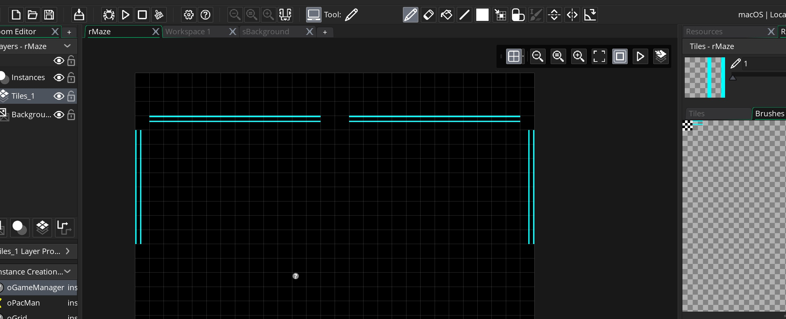
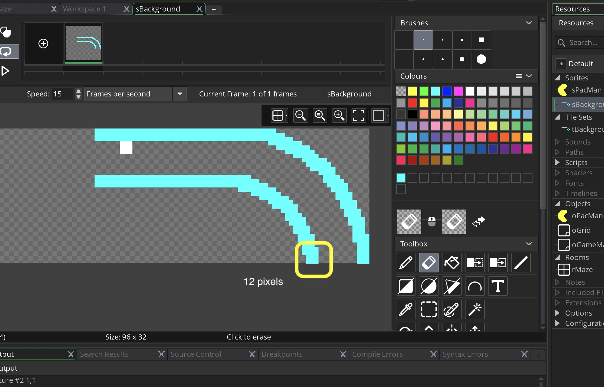
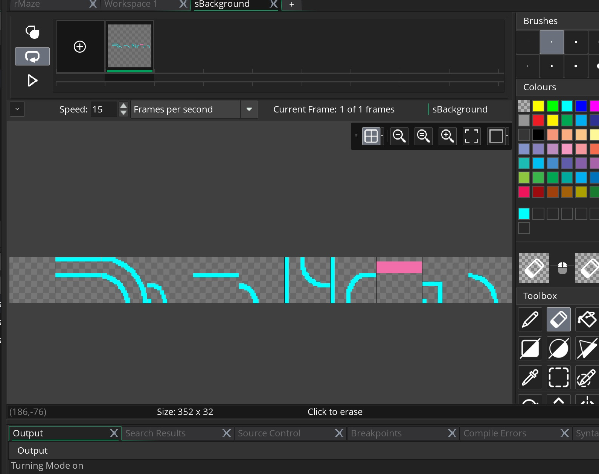

_____ 

## Part 3 - Background Tiles

_____ 

### Drawing Tiles
_____ 



{:start="{{ num }}"}
{{ num }}. Lets right click on **Sprite** and create a new one called `sBackground `.  Click on the size icon and set it to `64` wide by `32` high and make sure the Maintin Aspect Ratio is **unchecked**.  Press Apply.

  

_____ 


{:start="{{ num }}"}
{{ num }}.  Select the second brush size. Select a light blue color. Select the line tool.  Go to `32` on the `x` and start to draw a straight line across the top.

_____ 


{:start="{{ num }}"}
{{ num }}.  Tilesets require a single sprite that is blank.  So we leave a 32 by 32 blank piece.  Select the second brush size. Select a light blue color. Select the line tool.  Go to `32` on the `x` and  `1` on the `y` start to draw a straight line across the top.

_____ 


{:start="{{ num }}"}
{{ num }}.  Start drawing second line before the halfway point so that Pac-Man can fit.

_____ 


{:start="{{ num }}"}
{{ num }}.  Finish drawing second line before the halfway point so that Pac-Man can fit.

_____ 


{:start="{{ num }}"}
{{ num }}.  Right click **Tile Set** to create a new tile set.

_____ 


{:start="{{ num }}"}
{{ num }}.  Call **Tileset** `tBackground` and select the **Sprite** you just created.

_____ 


{:start="{{ num }}"}
{{ num }}.  Click **Tile Set Properties** button:

_____ 


{:start="{{ num }}"}
{{ num }}.  Set properties to `32` by `32` for width and height.

_____ 


{:start="{{ num }}"}
{{ num }}.  Set properties to `32` by `32` for width and height.

_____ 

_____ 


{:start="{{ num }}"}
{{ num }}.  Select the Tile Brush.  This is where we will place these pieces and rotate them without wasting more game space.  Press the shape on the left and place it on the right hand side.  Leave a blank tile between brushes so that it only picks up one at a time in the room.

_____ 


{:start="{{ num }}"}
{{ num }}.  Do this for all four angles and finish the brush.

_____ 


{:start="{{ num }}"}
{{ num }}.  Go into the room and place th elines along the fourth row on the top:

_____ 


{:start="{{ num }}"}
{{ num }}.  Test it in game and make sure it works!

_____ 


{:start="{{ num }}"}
{{ num }}.  Draw 8 vertical corner rows on each side.

_____ 


{:start="{{ num }}"}
{{ num }}.  Test it in game and make sure it lines up:

_____ 


{:start="{{ num }}"}
{{ num }}.  Draw the tunnel portion.

_____ 


{:start="{{ num }}"}
{{ num }}.  Test it in game:

_____ 


{:start="{{ num }}"}
{{ num }}.  Finish the rest of the edges.

_____ 


{:start="{{ num }}"}
{{ num }}.  Test it in game.

_____ 


{:start="{{ num }}"}
{{ num }}.  Click the sprite and add some more tiles.  Make it `96` x `32`.

_____ 


{:start="{{ num }}"}
{{ num }}.  Draw the corner turn in the Sprite.

_____ 


{:start="{{ num }}"}
{{ num }}.  Add it to the brush with all 4 rotations.

_____ 


{:start="{{ num }}"}
{{ num }}.  Place in the room to fill in edges.

_____ 


{:start="{{ num }}"}
{{ num }}.  Add another `32` pixels to sprite.  Make a near turn with pixel in corner.  

_____ 


{:start="{{ num }}"}
{{ num }}.  Use the circle tool to complete the turn.

_____ 


{:start="{{ num }}"}
{{ num }}.  Add four rotations to brush.

_____ 


{:start="{{ num }}"}
{{ num }}.  Fill them in room to complete the corners.

_____ 


{:start="{{ num }}"}
{{ num }}.  Make **Sprite** `128` wide to add more artwork.

_____ 


{:start="{{ num }}"}
{{ num }}.  Make straight line at 12 pixels.

_____ 


{:start="{{ num }}"}
{{ num }}.  Add to brush in 4 angles.

_____ 


{:start="{{ num }}"}
{{ num }}.  Draw the first row of lines in room.

_____ 


{:start="{{ num }}"}
{{ num }}.  Test in game:

_____ 


{:start="{{ num }}"}
{{ num }}.  Make **Sprite** width `256` pixels wide to add the final tiles.

_____ 


{:start="{{ num }}"}
{{ num }}.  Add 6 last remaining shapes to the **Sprite** sheet.

_____ 


{:start="{{ num }}"}
{{ num }}.  Make all of the brushes with 4 directions except for pink door.

_____ 


{:start="{{ num }}"}
{{ num }}.  This is the final room layout.

_____ 


{:start="{{ num }}"}
{{ num }}.  This is the final layout in game.

_____ 


{:start="{{ num }}"}
{{ num }}.  We no longer need the debug so we can comment it out.  Go to `oGrid` and comment out the code in the draw script.

_____ 


{:start="{{ num }}"}
{{ num }}.  Go to `oPacMan` draw event and comment out the square but keep the `draw_self()`.

_____ 


{:start="{{ num }}"}
{{ num }}.  Play the game and move around the maze, this should be the final layout.

_____ 

   
   
[<- Previous](PacManStyleGame_4.html)&nbsp;&nbsp;&nbsp;[Home](../../index.html)&nbsp;&nbsp;&nbsp; [Continue ->](PacManStyleGame_6.html)
   
   
   
   