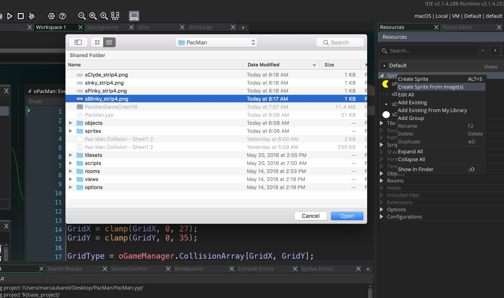

_____ 

## Part 5 - Ghosts

_____ 

### Blinky
_____ 



{:start="{{ num }}"}
{{ num }}. Right click on **Sprite** and select **Create Sprite from Images".  Select the Blinky sprite provided.  

  

_____ 



{:start="{{ num }}"}
{{ num }}. Call it `sBlinky` and center the origin:

  

_____ 



{:start="{{ num }}"}
{{ num }}. Create a new **Object** and call it `oBlinky`:

  

_____ 



{:start="{{ num }}"}
{{ num }}.  Spawn Blinky in the `oGameManager` in its correct position:

  

_____ 



{:start="{{ num }}"}
{{ num }}. Since the ghost never cuts corners and always stays in the middle of lanes, lets make sure in its step event that it never leaves the center of the square.  Lets start by putting the grid size and offset in the game manager as we will use it for all the ghosts.  Open oGameManager and add `GridXNumColumns` and `GridYNumRows` to the variables:

  

_____ 



{:start="{{ num }}"}
{{ num }}. We do not want the eyes changing unless Blinky turns.  Lets turn off animation in the create event:

  

_____ 

### Pathfinding
_____ 



{:start="{{ num }}"}
{{ num }}. The ghosts have three speeds.  Now lets make it chase Pac-Man and at the right speed by creating three new variables in `oGameManager`:

  



{:start="{{ num }}"}
{{ num }}. Lets add two more variables to the Ghosts which is their last square.  Add:

  

_____ 



{:start="{{ num }}"}
{{ num }}. Lets add the last grid position so we can implement the aforementioned Pathfinding logic.  We can call the `UpdateGridPosition()` that we wrote for Pac-Man on the Ghosts.  This gives us Grid, LastGrid and current grid positoin:

  

_____ 



{:start="{{ num }}"}
{{ num }}. Create a new script called `oGetCenterGrid` and add:

  

_____ 



{:start="{{ num }}"}
{{ num }}. Since Ghosts pathfind from the grid in front of them we need to keep track of it.  Add to Blinky's variables:

  

_____ 



{:start="{{ num }}"}
{{ num }}. Now add its inital direction and speed to `oBlinky`'s **Create Event**.

  

_____ 


{:start="{{ num }}"}
{{ num }}. Run the game and Blinky just goes off screen to the left:

  

_____ 


{:start="{{ num }}"}
{{ num }}. We need the horizontal and vertical for the ghost and will write a custom function:

  

_____ 


{:start="{{ num }}"}
{{ num }}. Add a **Step Event** to the ghost and calculate its current position.  Then check whether it is Vertical or Horizontal.  This will let us know whether to check the x or y value for the center of the grid.  Stub in a comment for a function call:

  

_____ 



{:start="{{ num }}"}
{{ num }}. Create a new **Script** called GhostPathfinding.  It will have three parameters an x & y target as well as a speed.  Copy and paste our comments into it. Fill in the first section:

  

_____ 



{:start="{{ num }}"}
{{ num }}. Now we have got to check the space from the next square.  `CanMove` won't work as it is from the current square.  We will have to duplicate it and call it `CanMoveFrom` and make the following change:

  

_____ 



{:start="{{ num }}"}
{{ num }}. Now go back to `GhostPathfinding` and add after the turn to check the regular next spaces:

  

_____ 



{:start="{{ num }}"}
{{ num }}. Create a new **Script** called `SetNextDirection` and add the checks in order that Pac-Man wants:

  

_____ 



{:start="{{ num }}"}
{{ num }}. Lets make Blinky's eyes look in the right direction.  Createa a new **Script** called `GhostDirection` and add:

  

_____ 



{:start="{{ num }}"}
{{ num }}. Call this script at the end of the `oBlinky` Step Event:

  

_____ 



{:start="{{ num }}"}
{{ num }}. Run the game and basic pathfinding should work.  Ghost should be going to space 0,0 at the correct speed.  We need to add a check to pick the turn with the shortest distance to the target.  Add a call to a new script to `GhostPathfinding` script:

  

_____ 



{:start="{{ num }}"}
{{ num }}. Create a new script called `CheckFourDirections` and add:

  

_____ 



{:start="{{ num }}"}
{{ num }}. and:

  

_____ 



{:start="{{ num }}"}
{{ num }}. and:

  

_____ 



{:start="{{ num }}"}
{{ num }}. and:

  

_____ 



{:start="{{ num }}"}
{{ num }}.Run the game and he should stay out of the red zone.  Add to the `GhostPathfinding`:

  

_____ 



{:start="{{ num }}"}
{{ num }}.Run the game and he should stay out of the red zone.  Now lets make it chase Pac-Man:

  

_____ 



{:start="{{ num }}"}
{{ num }}. Run the game and have Blinky chase you.  Over dots he should catch up, in open spaces you should be able to outrun the ghost.  Now go through the tunnel.  The Ghost doesn't wrap and it doesn't slow down.  Lets fix both those things. First the wrapping in `oBlinky`:

  

_____ 



{:start="{{ num }}"}
{{ num }}. Make Blinky go slow when in tunnel:

  

_____ 



{:start="{{ num }}"}
{{ num }}. Play the game and the player should be chased.  Run around, you should gain slightly on clear path, he should catch up to you on dotted path. He should not go up in red zone and he shouldn't go through tunnel at full speed.

  

_____ 

   
   
[<- Previous](PacManStyleGame_6.html)&nbsp;&nbsp;&nbsp;[Home](../../index.html)&nbsp;&nbsp;&nbsp; [Continue ->](PacManStyleGame_8.html)
   
   
   
   