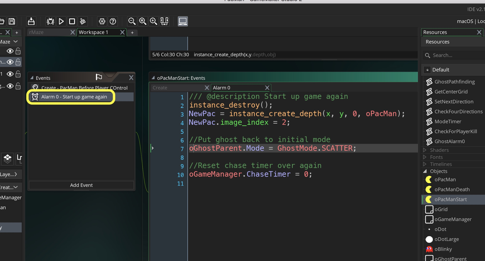
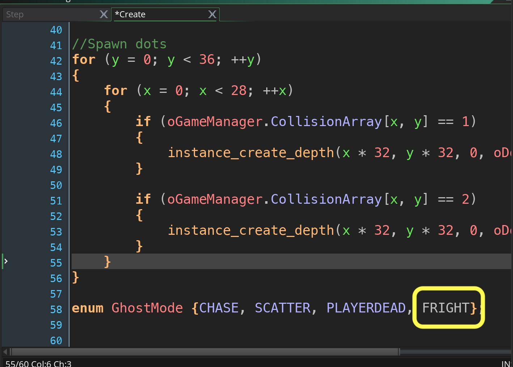
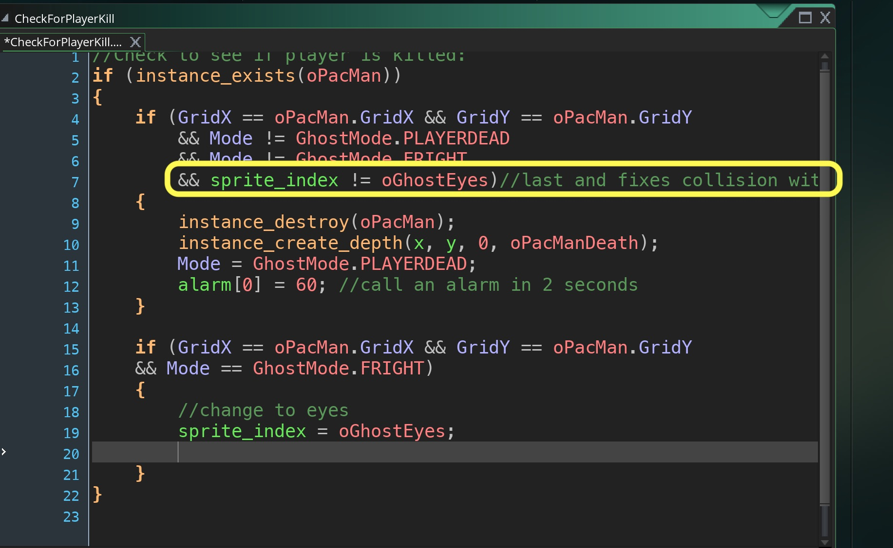
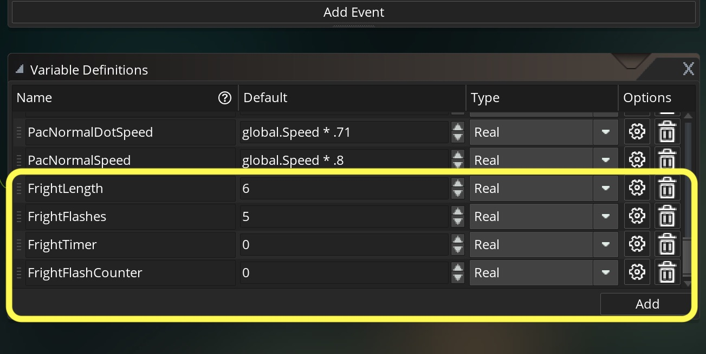
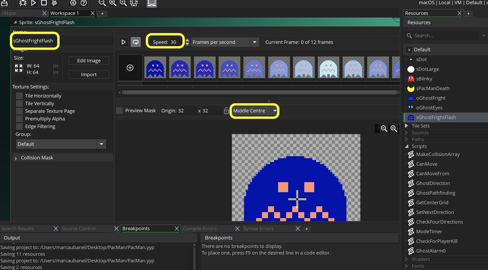
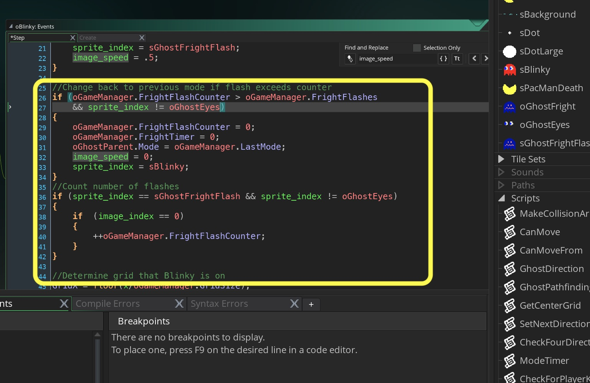
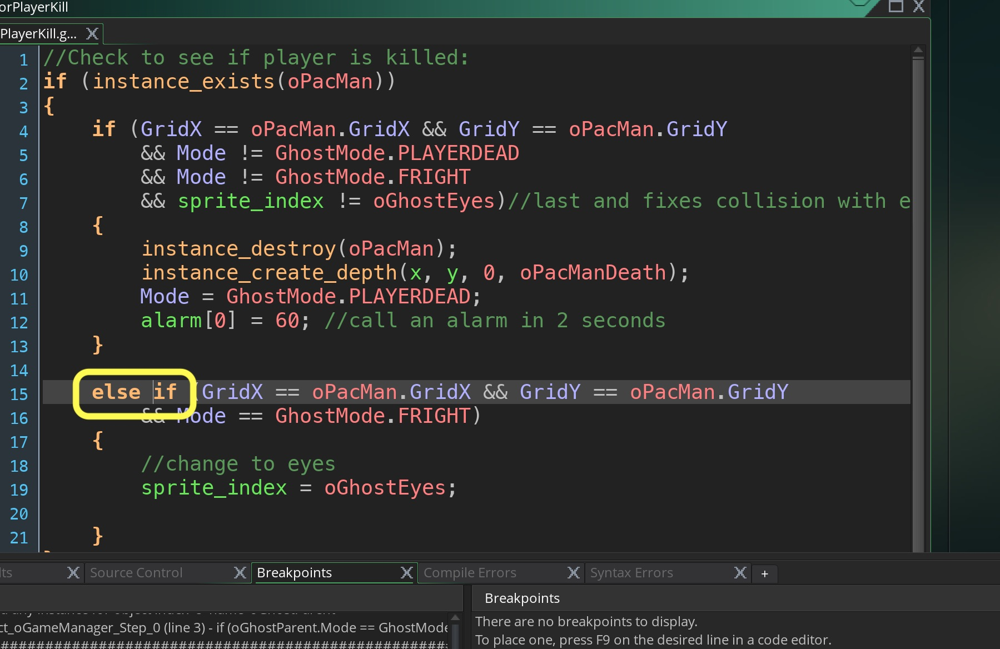

_____ 

### Restart Level After Dying

_____ 


{:start="{{ num }}"}
{{ num }}. Now when you play the game the animation just loops over and over in the death state.  We need to trigger a new pac-man that just stays there and doesn't animate as well as the ghosts.  A timer will then chnage it to the regular pac-man.  Create a new **Game Object** and call it `oPacManStart`.  Assign the Pac-Man Sprite to it.  Add a **Create Event** andd add:

  

_____ 


{:start="{{ num }}"}
{{ num }}. Add an **Alarm0 Event** and add:

  

_____ 



{:start="{{ num }}"}
{{ num }}. We need to trigger this at the end of this current animation.  There is an **Event** in **Other** called animation end which will call the script after it completes the animation.  This will do the trick and we can create the newly created `oPacManStart`.  Add an **Other Animation End** event to the `oPacManDeathAnimation`:

  

_____ 



{:start="{{ num }}"}
{{ num }}. Destroy this object and spawn the newly created player start:

  

_____ 

### Chase Mode
_____ 



{:start="{{ num }}"}
{{ num }}. Now we will deal with Pac-Man eating the large dot and changing the ghost to ?? mode.  Import the sprite called `oGhostFright.png` and call it 'oGhostFright`. Make sure you center the sprite origin. 

  

_____ 



{:start="{{ num }}"}
{{ num }}. Do the same thing for when the ghost is eaten and it is just eyes.  Import `sGhostEyes_strip4.png` and call it `oGhostEyes`. Make sure you center the sprite origin. 

  



{:start="{{ num }}"}
{{ num }}. Add FRIGHT to our `GhostMode` enumerator in `oGameManager`:

  

_____ 



{:start="{{ num }}"}
{{ num }}. Now we need to have pac man consume the large dot and change the ghost mode of all ghosts to chase and their sprites to the blue chase sprite.  Go to `oPacMan` **Step Event** and add in if statement:

  

_____ 



{:start="{{ num }}"}
{{ num }}. Run the game and eat a big dot and chase Blinky. If you eat blinky you still die instead of killing blinky.  Lets fix this.  Open the **Script** `CheckForPlayerKill` and don't kill the player if the game is in CHASE mode and consumer the ghost and change it sprite to just eyes.

  

_____ 



{:start="{{ num }}"}
{{ num }}. Now play the game and test it.  We is a big problem.  The eyes are not returning to the hotel and you can eat the eyes again and cause a crash.  Lets fix this by checking to see what sprite_index it is at:

  

_____ 



{:start="{{ num }}"}
{{ num }}. Now the ghost and pac-man speeds do change in firght mode.  Lets fix both the ghost and pac-man's speeds for these modes.  Lets start with Pac-Man and add two more
speed variables to `oGameManager`'s list of variables:  

  

_____ 



{:start="{{ num }}"}
{{ num }}. Open `oPacMan` and add a switch for the two areas where we set the speed:

  

_____ 



{:start="{{ num }}"}
{{ num }}. Do the same thing for `oBlinky`:

  

_____ 



{:start="{{ num }}"}
{{ num }}. Now lets change the target for the eyes when Blinky is eaten to go to the hotel.  Open `oBlinky` and edit the horizontal and vertical speed settings:

  

_____



{:start="{{ num }}"}
{{ num }}. Also, we need to adjust the speed of when the speed is 0 on a turn.  Edit:

  

_____



{:start="{{ num }}"}
{{ num }}. Play the game and eat another big dot.  You will notice that it changes the eyes back to a ghost.  Lets edit `oPacMan`'s **Step Event** and edit:

  

_____



{:start="{{ num }}"}
{{ num }}. Now lets make the eyes go into the hotel. Edith the `GhostPathfinding` script:

  

_____ 



{:start="{{ num }}"}
{{ num }}. Lets save the last state before moving into FRIGHT mode.  This way when we leave we move back to our previous state.  Edit the *Create Event** in `oGameManager` and add:

  

_____ 



{:start="{{ num }}"}
{{ num }}. Lets save the last mode in `oPacMan` **Step Event** before changing to FRIGHT mode:

  

_____ 



{:start="{{ num }}"}
{{ num }}. Lets stop the clock when it is not in CHASE or SCATTER so it doesn't keep changing states which would create bugs:

  

_____ 



{:start="{{ num }}"}
{{ num }}. Now the ghosts stay in Fright Mode for 6 seconds, then flash quickly 5 times before going back to normal. Lets add four variables to the `oGameManager`:

  

_____ 



{:start="{{ num }}"}
{{ num }}. Now we need to adjust the timer when in FRIGHT so go to `oGameManager` **Step Event**:

  

_____ 



{:start="{{ num }}"}
{{ num }}. Now we need to adjust the timer when in FRIGHT so go to `oGameManager` **Step Event**:

  

_____ 



{:start="{{ num }}"}
{{ num }}. Import the flashing sprite which should be called: `sGhostFrightFlash_strip12.png`.  Center the origin and change the framerate to 30 and call the sprite `sGhostFrightFlash`:

  

_____ 



{:start="{{ num }}"}
{{ num }}. Import the flashing sprite which should be called: `sGhostFrightFlash_strip12.png`.  Center the origin and change the framerate to 30 and call the sprite `sGhostFrightFlash`:

  

_____ 



{:start="{{ num }}"}
{{ num }}. Before we trigger the animation we need to not have it change animation frames.  Open `GhostDirection` and wrap in an if to only run if in CHASE or SCATTER modes:

  

_____ 



{:start="{{ num }}"}
{{ num }}. Add to the top of `oBlinky`'s step event a change to the flashing:

  

_____ 


{:start="{{ num }}"}
{{ num }}. Play the game and die.  The game crashes.  Open `CheckForPlayerKill` and add an else if which fixes one problem:

  

_____ 


{:start="{{ num }}"}
{{ num }}. Second problem lies in `oGameManager` **Step Event**.  You need to wrap the whole function in and if to check if oGhostParent exists:

  

_____ 

   
   
   
[<- Previous](PacManStyleGame_8.html)&nbsp;&nbsp;&nbsp;[Home](../../index.html)&nbsp;&nbsp;&nbsp; [Continue ->](PacManStyleGame_10.html)
   
   
   
   