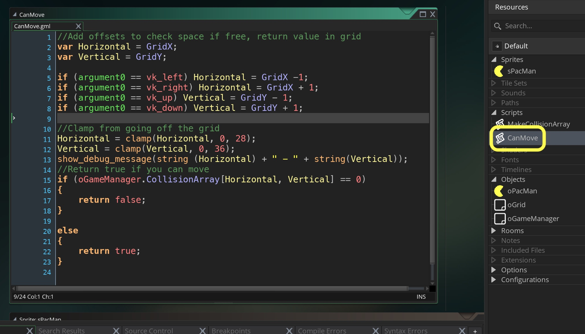
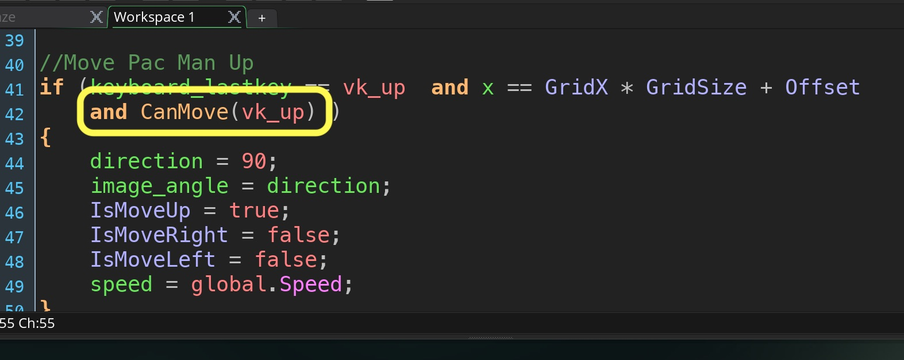
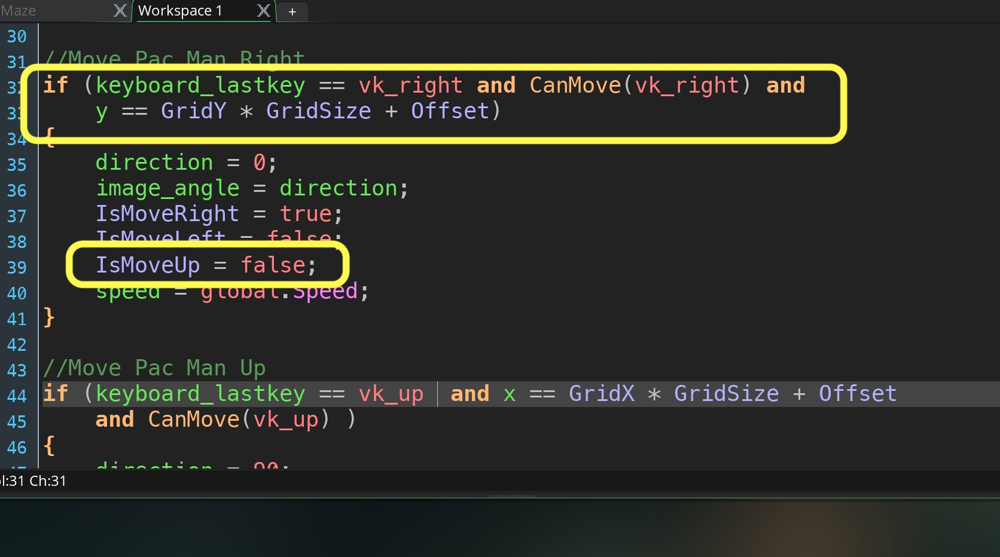
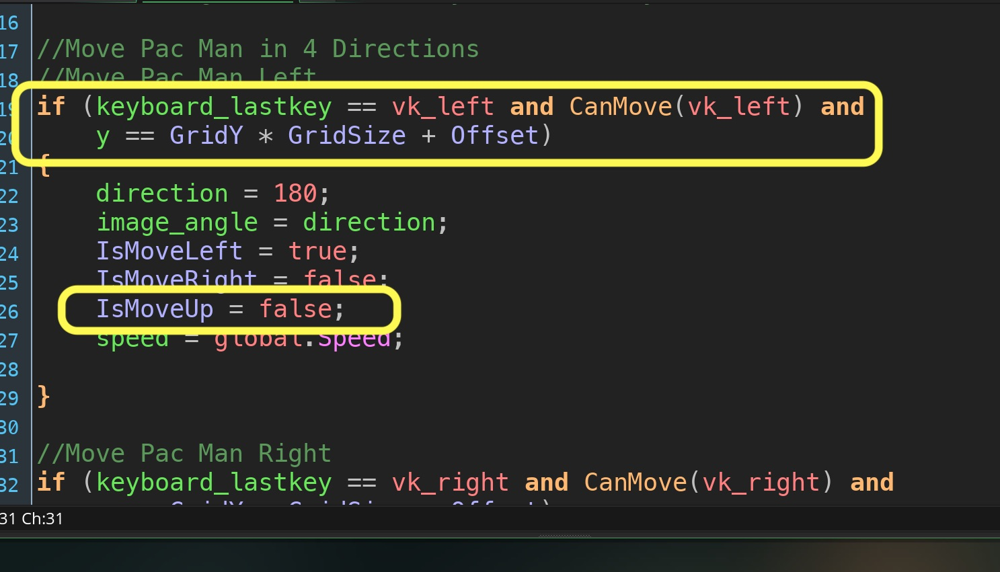
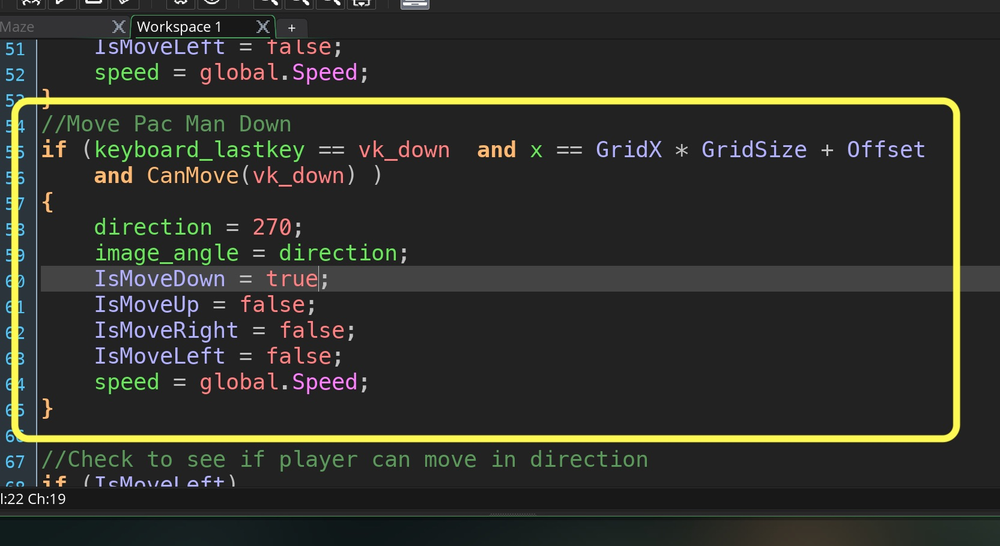
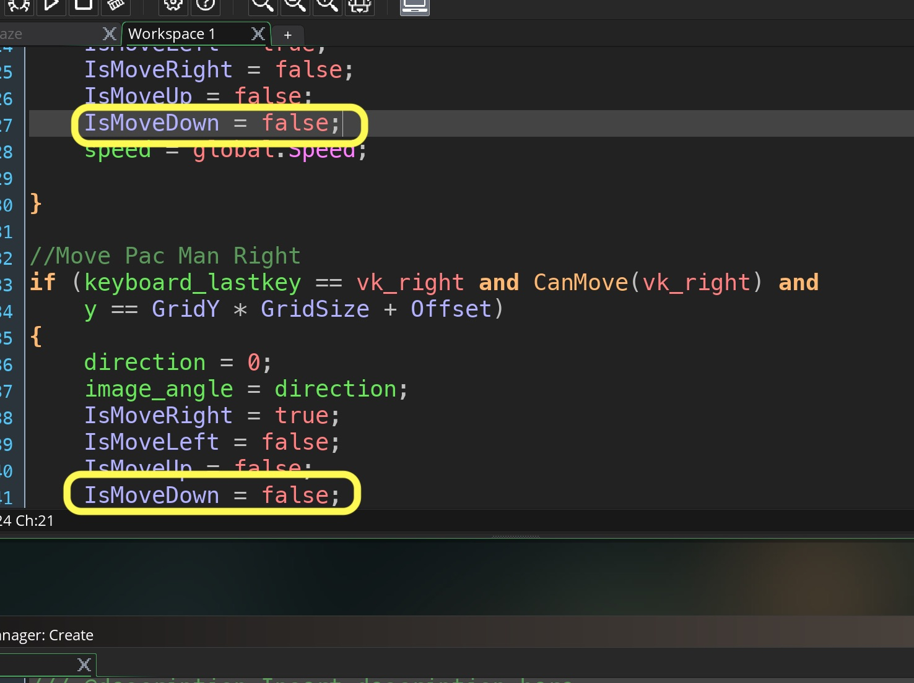
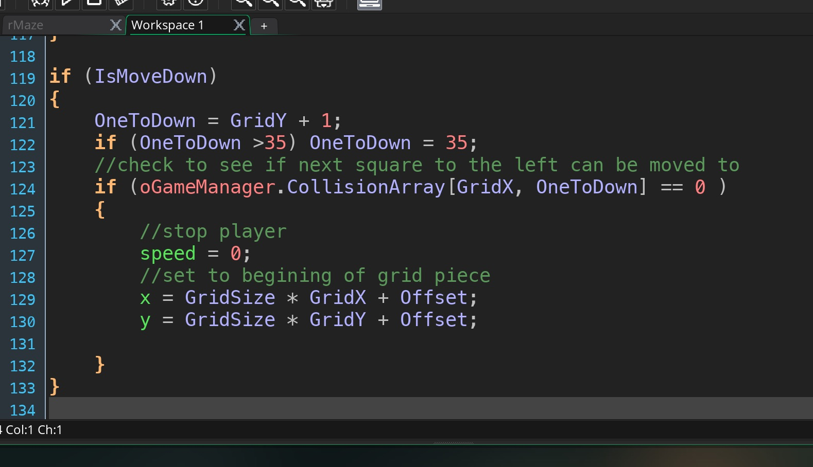
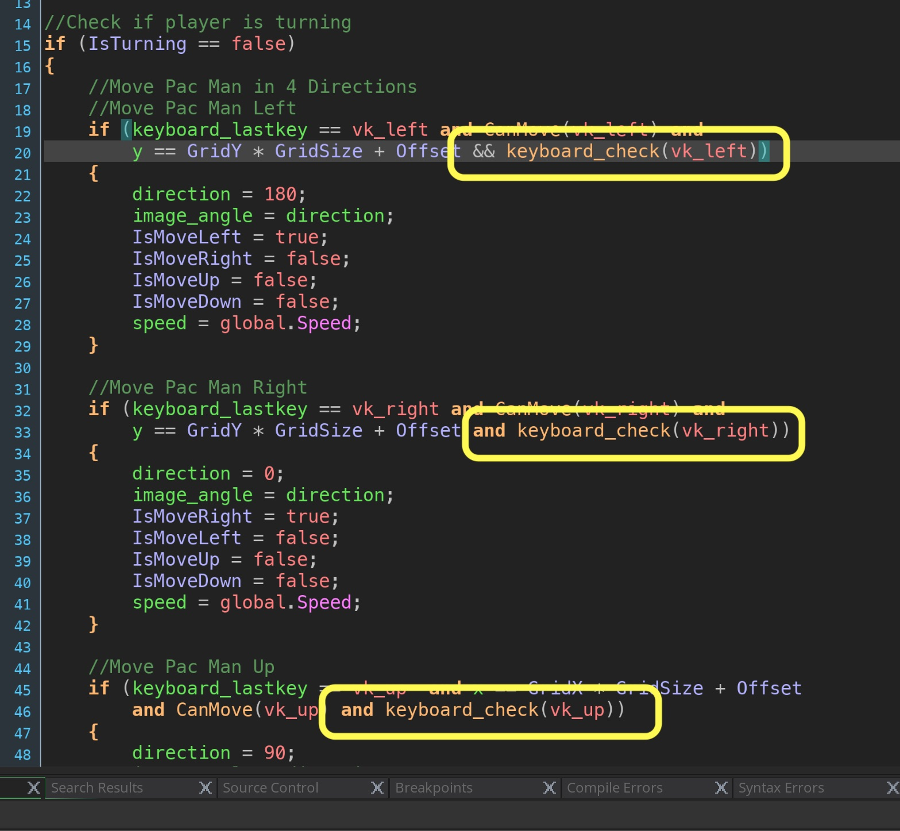
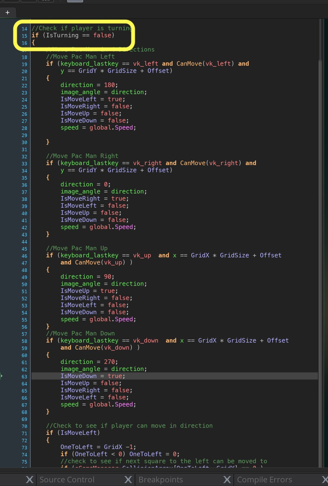


{:start="{{ num }}"}
{{ num }}.  Lets fix the first issue.  Lets check before moving that there is a valid space to move into.  Lets add a function called `CanMove`.

_____ 


{:start="{{ num }}"}
{{ num }}.  Lets call it when moving up:

_____ 


{:start="{{ num }}"}
{{ num }}.  Now this doesn't fix the not moving up when missing the center.  But it works sometimes and always at the corners.  Lets add collision checks for moving up:

_____ 


{:start="{{ num }}"}
{{ num }}.  Now Lets add the checks to right:

_____ 


{:start="{{ num }}"}
{{ num }}.  Now Lets add the checks to left:

_____ 


{:start="{{ num }}"}
{{ num }}.  Before we finish up lets add controls for going down:

_____ 


{:start="{{ num }}"}
{{ num }}.  Add down as false to all other directions:

_____ 


{:start="{{ num }}"}
{{ num }}.  Add collision detection for moving down:

_____ 


{:start="{{ num }}"}
{{ num }}.  One small problem, the game remembers the last key but when it is lifted it records it.  We want to negate the turn.  Add to all four direcitons an extra check that you are still pressing the key:

_____ 

_____ 


{:start="{{ num }}"}
{{ num }}.  Go back to **Step Event** and wrap all the movement in an if statement.

