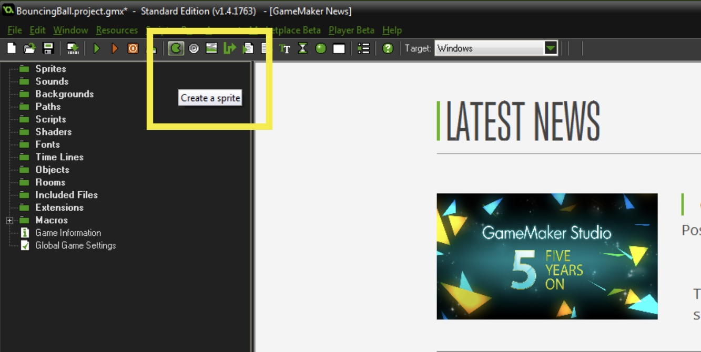
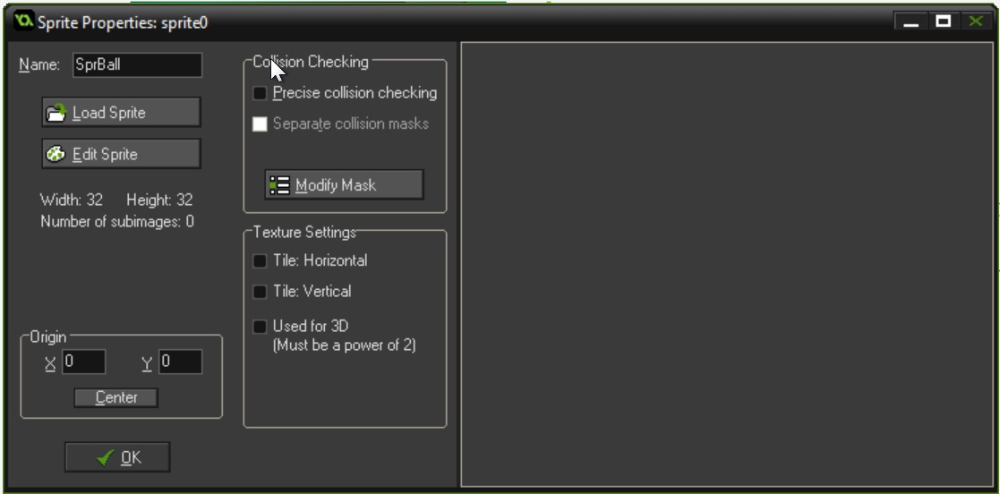
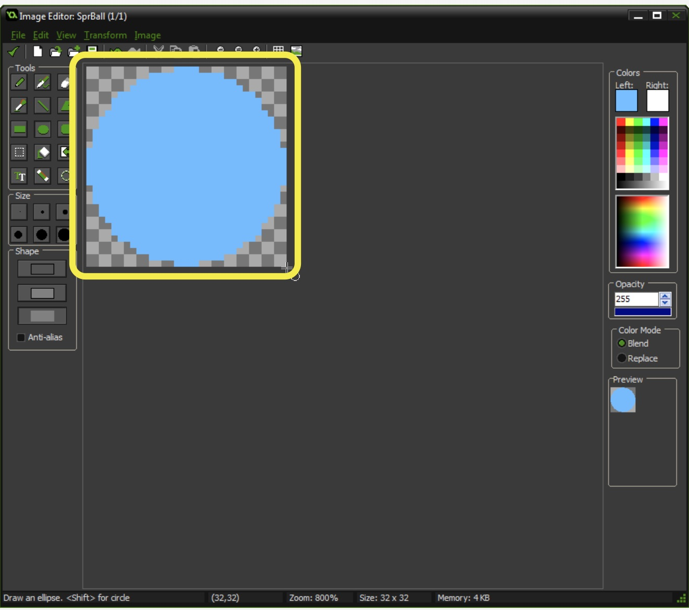

# Simple Mechanic Prototype

## Index
1. [Walk Through](#walk-through)
2. [Create a Ball in a Room](#create_a_ball_in_a_room)
3. [Make Ball Fall Due to Gravity](SimpleMechanic_2.html#make_ball_fall_due_to_gravity)
4. [Make Ball Bounce](SimpleMechanic_3.html#make_ball_bounce)
5. [Player Control](SimpleMechanic_4.html#player_control)
6. [Spawn Other Ball](SimpleMechanic_6.html#spawn_other_ball)
7. [Die Ball Die](SimpleMechanic_7.html#die_ball_die)
8. [Win](SimpleMechanic_7.html#win)
9. [Motion Blur](SimpleMechanic_8.html#motion_blur)
10. [Make it Personal](SimpleMechanic_8.html#make_it_personal)
11. [Make it Sound Good](SimpleMechanic_8.html#make_it_sound_good)

We are going to create a simple mechanic.  Most games focus on refining a few simple mechanics that it then exploits in many ways in level design and implementation.  Lets go through the thought process of what level of quality we need to prototype a very simple idea.

## Walk Through
We are going to prototype the following game rules:
1.  We will spawn a ball that only bounces.  Everytime it bounces it loses height.
2.  We will allow the player to bounce the ball higher with the space bar by timing the press of the spacebar to as soon as the ball connects with the ground.  If the timing is perfect or close the ball will increase in it's bounce height and will get worse the further you are away from timing the button press.
3.  The ball will spawn another ball when it reaches a certain screen height
4.  The ball will "die" when it no longer bounces.  
5.  If the last ball dies, the player will die
6.  If you spawn the ball 10 times, the player will win

### Create a Ball in a Room

1.  Lets create a new project.  Start by running Gamemaker Studio and selecting the **new** tab.  Then pick a **folder** in the **Project Directory** to save the project to, and name the project **Bouncing Ball**, then press **Create**.

	  
	 
2.  Press the **Create a Sprite** icon at the top of the screen to generate a new Sprite.
	  
	 
3.  Name the **sprite** `SprBall`
	  
	 

4.  Press the **Edit Sprite** button which brings up the **Sprite Editor** window.  Press the **Create new Sprite** icon to create a new sprite:

	  
	 

5.  This brings up the **Create a new sprite** window.  We will keep the defaults at 32 x 32 pixels.  Press the **OK** button.

	 
	 	

6.  This loads up a new blank **sprite** in the **Sprite Editor**.  You now double click on the checker board empty sprite.

	 
	 	

7.  Pick a color by clicking on a preset color on the color swatch.  For the **Shape** pick the interior only as we will not have a stroke around the edge.  Then select the **Ellipse** tool and start dragging from the top left to the bottom right to draw a circle which will be our ball.

	
	 	

	 
	 	

8.  Confirm you named the **sprite** `SprBall` and close all the sprite windows.

	 
	 	

9. Now you cannot put a **sprite** in the room, it needs to be bound to an **Object**.  Press the **Create New Object** button in the top menu.

	 
	 	
10.  Press the paper icon next to the **Sprite** form and select `SprBall1` from the drop down menu.
	 
	 
	 	

11.  Now we need a level to place this ball in.  Lets create a new **room** by pressing the **room** icon on the top menu bar to create a new level.
	   	

12.  Go to the **Settings** tab in the room and name the room `RmLvl1`
	 
	 
	 	

13.  Go to the **Objects** tab and select the `ObjBall` that you created
	 
	 
	 	

14.  Now zoom out to see the whole room (middle scroll wheel) and click with the **Left Mouse Button** to place to ball roughly in the middle of the room
	 
	 
	 	

15.  Now we can press the **green play button** in the top menu to test our work.  You should see a ball that does nothing in the middle of the room.
	 
	 
	  
	 
	 	

&nbsp;&nbsp;&nbsp;[Home](../../index.html)&nbsp;&nbsp;&nbsp; [Continue ->](SimpleMechanic_2.html)
   
   
   
   

