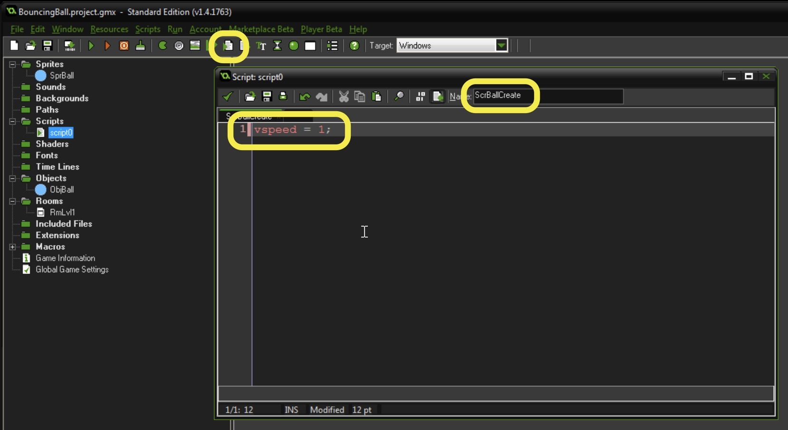
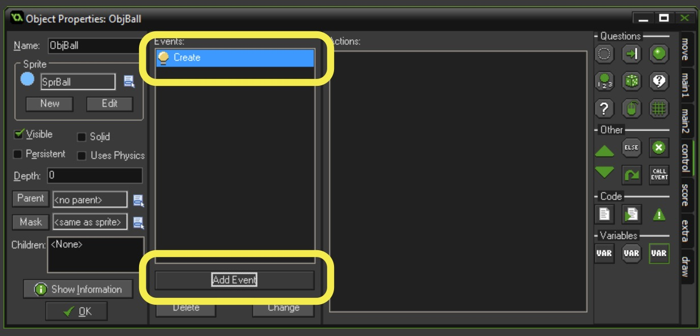
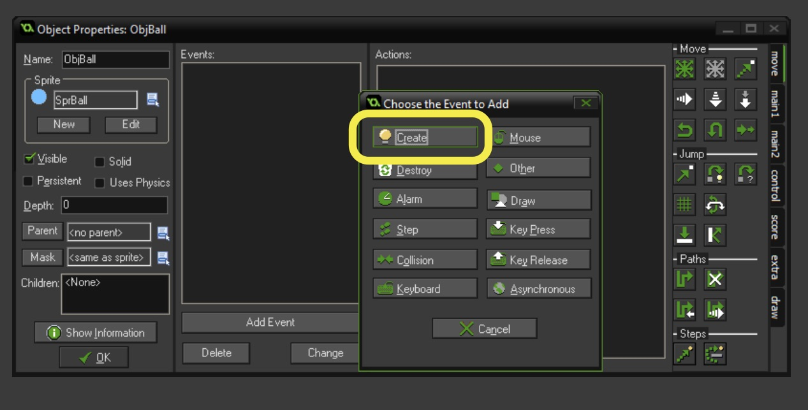
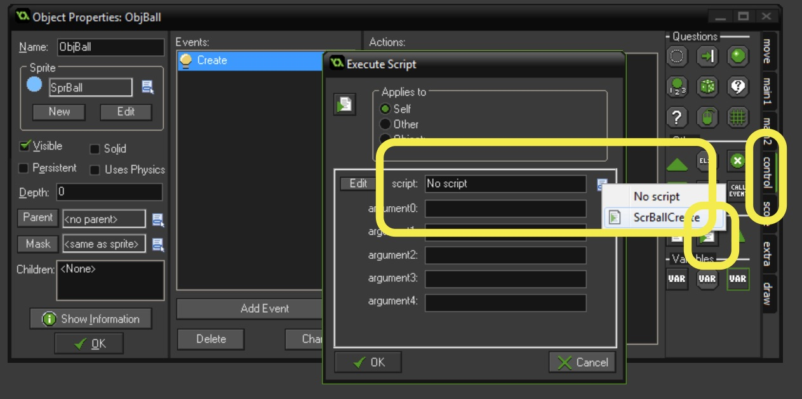
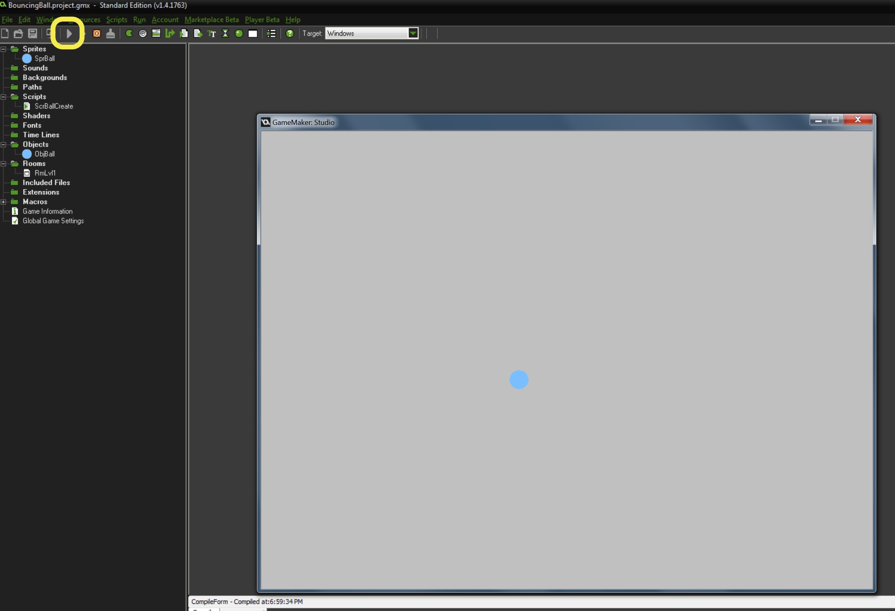
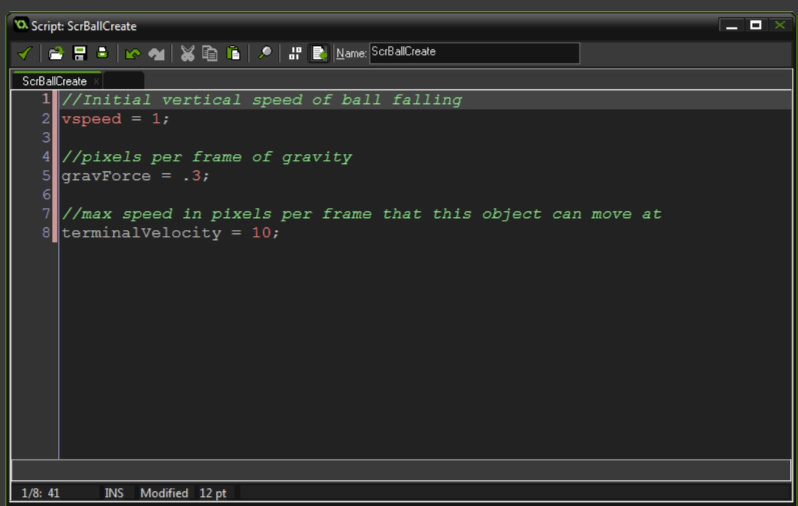

### Make Ball Fall Due to Gravity

{:start="1"}
1.  Now we need to make the ball fall due to gravity.  We can simply use momentum and give the vspeed a positive number.  So let's create a new **script** and call it ``ScrBallCreate``. Add the following code to the script:
	
``` c
//Initial vertical speed of ball falling
vspeed = 1;
```

  
<br />

{:start="17"}
2. This **script** will do nothing unless bound to an **object**.  Double click **ObjBall** and click **New Event** button and select the **Create Event**.
	  
	<br />
	  
	<br />


3. Now press the **control** tab and drag from the **script** icon and drag and release in the **action** window.  Then press and select `ScrBallCreate` script.
	  
	<br />

4.  Now press the **green play button** and see what happens.  The ball falls at a consistent speed of 1 pixel per frame.  
	  
	<br />

5.  Is this how [gravity](https://en.wikipedia.org/wiki/Gravity) is supposed to behave.  It should be putting a consistent accelaration every frame until it hits [terminal velocity](https://en.wikipedia.org/wiki/Terminal_velocity).  Terminal velocity "It occurs when the sum of the drag force (Fd) and the buoyancy is equal to the downward force of gravity (FG) acting on the object. Since the net force on the object is zero, the object has zero acceleration." - Wikipedia.  Earth gravity is ~9.8 meters per second.  This is hard to transfer into pixels per 30th of a second.  Lets just double click on the left menu our existing ```ScrBallCreate``` **script** to set the rate of gravitational force per frame as well as the terminal velocity of 10 pixels per frame.  Add the below script to the bottom of the existing **script**:

``` c
//pixels per frame of gravity
gravForce = .3;

//max speed in pixels per frame that this object can move at
terminalVelocity = 10;
```
  
<br />

6.  Now run the game.  Hey nothing happens, why?  

[<- Previous](SimpleMechanic_1.html) &nbsp;&nbsp;&nbsp;[Home](../../index.html)&nbsp;&nbsp;&nbsp;  [Continue ->](SimpleMechanic_3.html)
<br />  
<br />  
<br />  
<br />  
