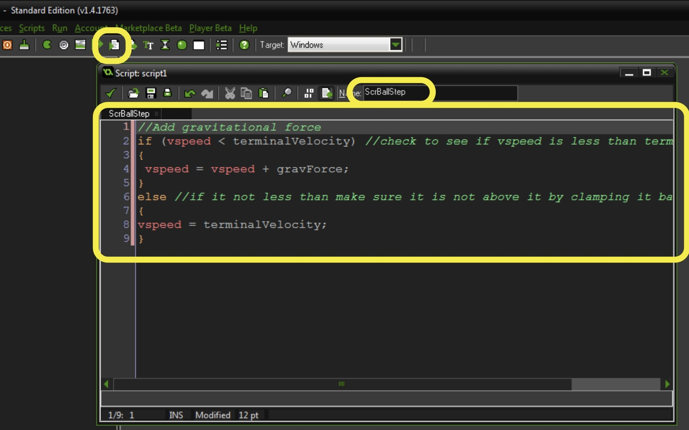
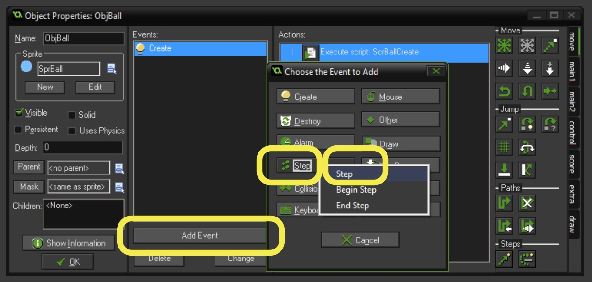
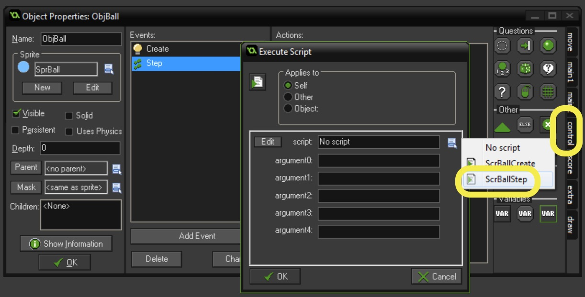
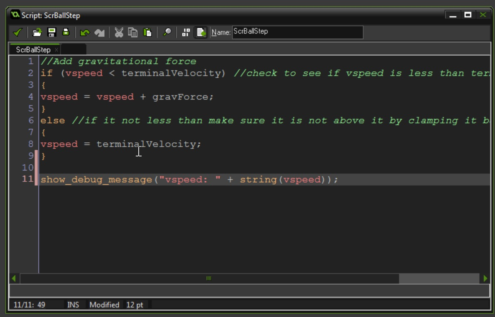
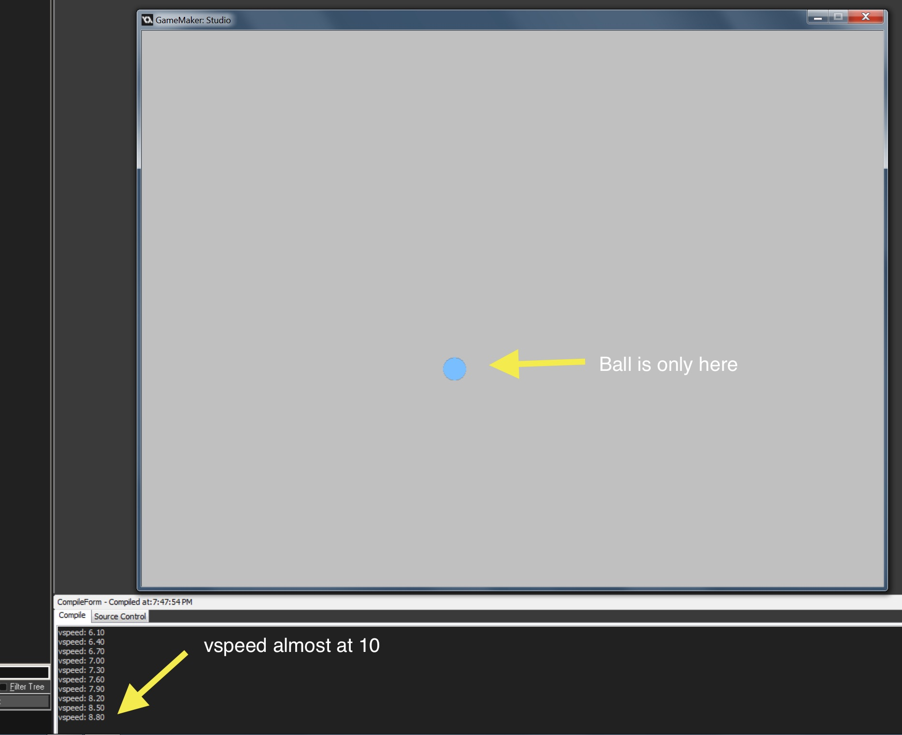
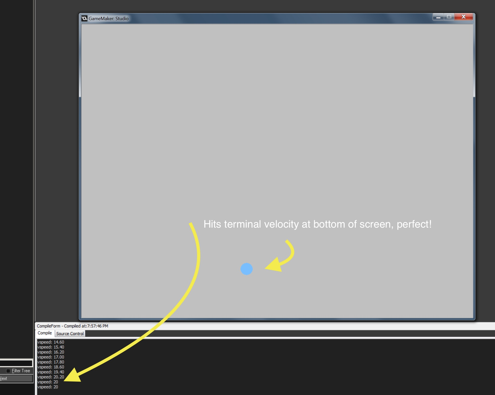
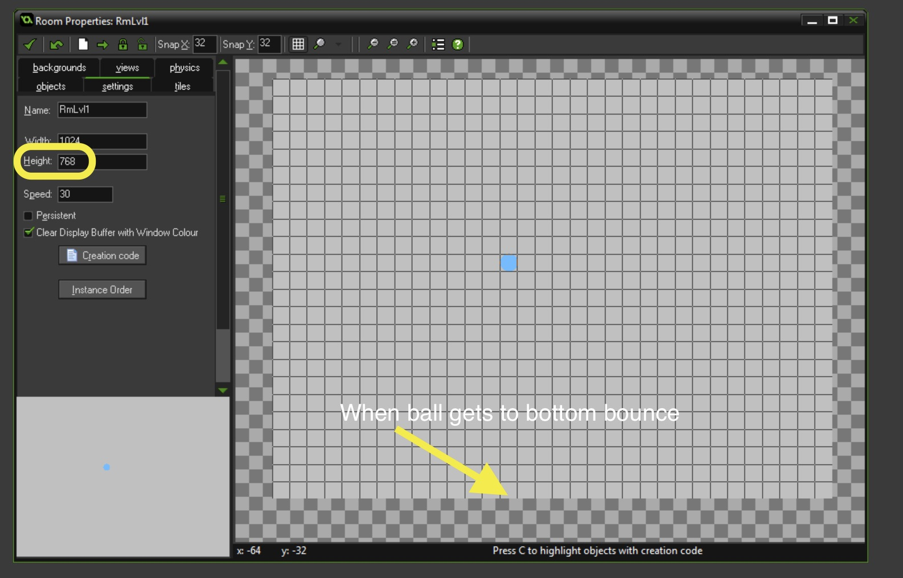
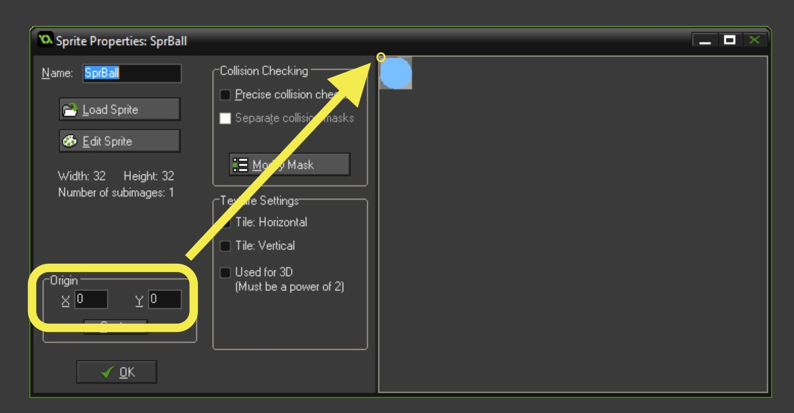
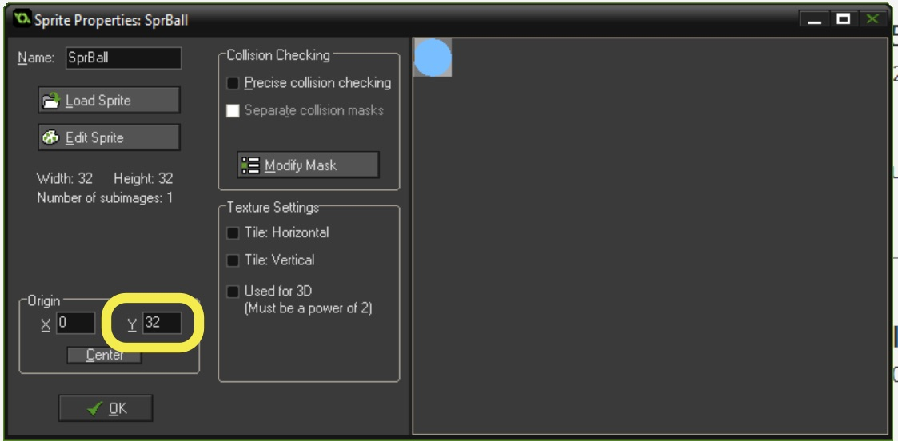
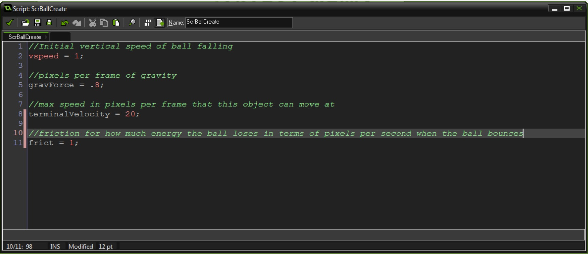

{:start="7"}
7.  This was just a **create** event so it just sets the initial value of the variable but we need to change it every frame.  We need to create a new **Script** and call it `ScrBallStep` and add:

``` c
//Add gravitational force
if (vspeed < terminalVelocity) //check to see if vspeed is less than terminal velocity
{
	vspeed = vspeed + gravForce;
} 
else //if it not less than make sure it is not above it by clamping it back down
{
vspeed = terminalVelocity;
}
```
  
<br />

{:start="8"}
8.  Now we need to bind this script to the **Obj Ball Object**.  Double click `ObjBall` and press the **Add Event** button.  Press the **Step** button and select the regular **Step** event from the drop down menu.

  
<br />

{:start="9"}
9.  Press the **control** tab on the right and drag the **script** icon and let go in the **action** window.  Now select the ```ScrBallStep``` and bind it to this event.


<br />

{:start="10"}
10. Now run the game and you should see the ball accelerate.  It is not very satisfying.  Are we accelerating enough?  Is the terminal velocity too low?  I am not sure so lets start printing to the debugger and looking at the results.  Double click the **ScrBallStep** and add to the bottom:
``` c
show_debug_message("vspeed: " + string(vspeed));
```


<br />


{:start="11"}
11. Now run the game and look at the debugger.  I feel it is going up too slowly and getting to terminal velocity too quickly.


<br />

{:start="12"}
12.  Play around with adjust in the `ScrBallCreate` script the `gravForce` and `terminalVelocity` and look at the screen below the game to get a sense of what looks and feels right to you. I am happy with a `gravForce = .8;` and a `terminalVelocity = 20;`


<br />

### Make Ball Bounce

1.  Now how do we get the ball to bounce.  What logic do we need to have here.  Full blown collision detection is unessary adn slow.  Since the ground is flat we can just look at the `y` component of the ball.  First we need to see if it at the floor.  Lets call the floor the bottom of the room:

	
	<br />

2.  So looking at the above when the `y` value of the ball is at or past `768` then it has bounced on the floor.  But the problem is the game only sees the **object** as a two dimensional point.  The point of origin on `SprBall` is at `0,0` or the top left corner:


<br />

{:start="3"}
3.  So since we care mostly about the bottom of the ball we should move the bottom `y Origin` to `32`

	
	<br />

4.  Ok so since the room is `768` pixels tall (check your room size to confirm), to **bounce the ball** we will look to see if the `y` component is great than 768 then reverse the **sign** of the `vspeed`.  Open `ScrBallStep` and add to the bottom.  Comment out the `show_debug_message()` line as we do not need it anymore (but might want to tune this later, so we'll keep it).  Then add the bounce logic:

``` c
//show_debug_message("vspeed: " + string(vspeed));

//Add bounce when ball hits floor
if (y > 768) 
{
    vspeed = -vspeed;
    y = 768;
}
```

5.  Run the game, Now the ball should be bouncing to the same height with no losses and shouldn't be bouncing higher or lower.  It doesn't bounce back to the original height as it is the terminal velocity that determines with how much force the ball bounces back up.

6.  Ok, now the final step is that we wanted to _1.  We will spawn a ball that only bounces.  Everytime it bounces it loses height_.  We now need to add friction to the bounce.  In reality a ball is never perfectly elastic and some energy is discipated to heat, some dissipated to the floor etc...  Open `ScrBallCreate` and add:

``` c
//friction for how much energy the ball loses in terms of pixels per second when the ball bounces
frict = 2;
```


<br />

7.  Now double click `ScrBallStep` and add inside the bounce the friction.  Since the number iw positive 1, when we reverse the speed it turns negative, so we need to add to it to have friction:

//Add bounce when ball hits floor
if (y > 768) 
{
    vspeed = -vspeed + frict;
    y = 768;

8.  Now play the game.  What do you notice? 

[<- Previous](SimpleMechanic_2.html) &nbsp;&nbsp;&nbsp;[Home](../../index.html)&nbsp;&nbsp;&nbsp;  [Continue ->](SimpleMechanic_4.html)
<br />  
<br />  
<br />  
<br />  
