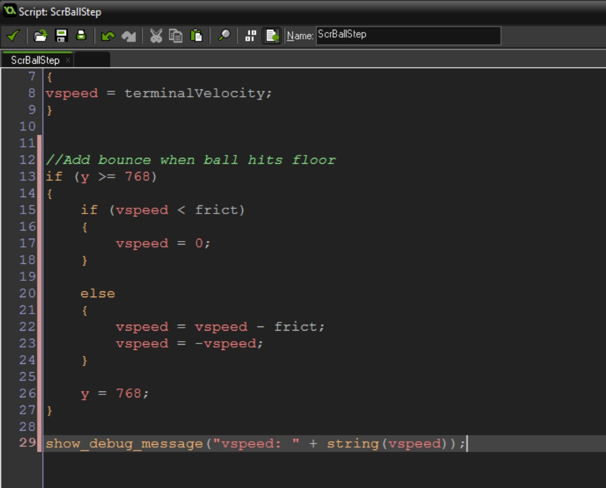
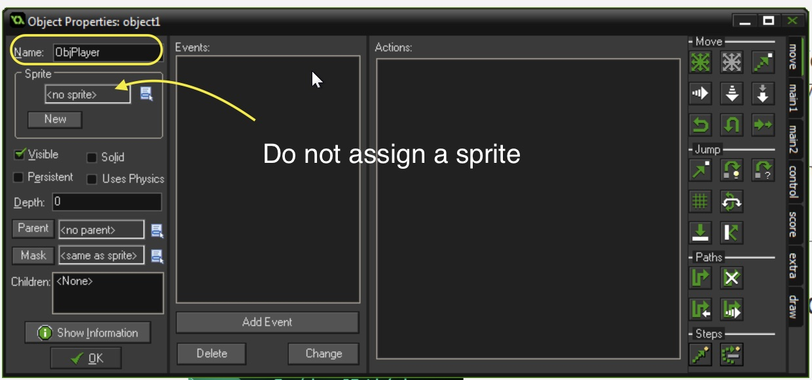
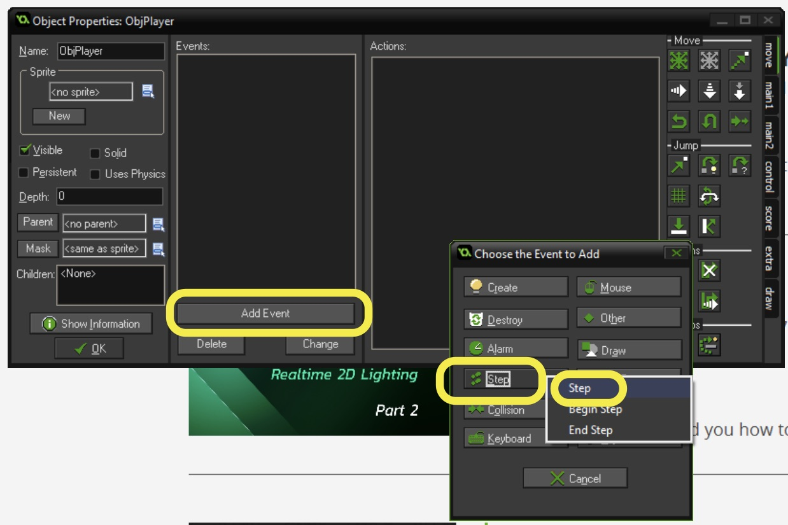
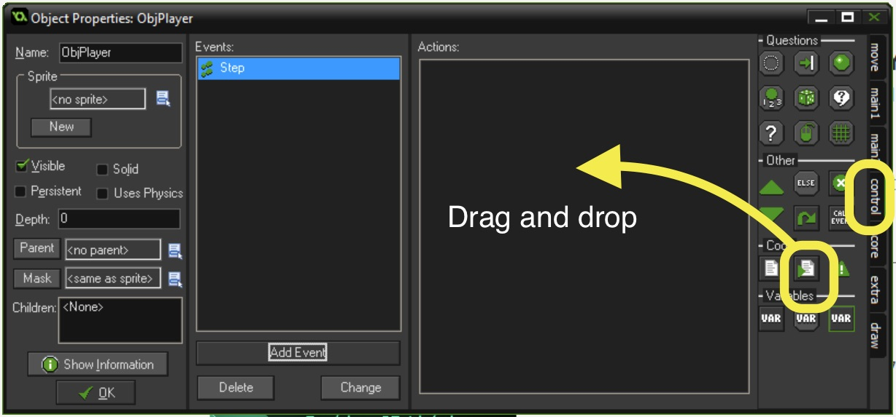
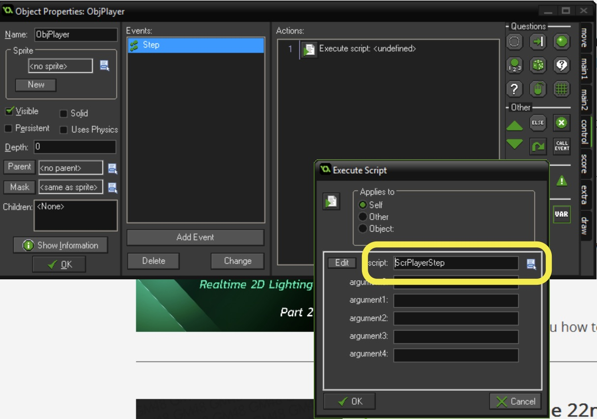

{:start="9"}
9.  In my version the ball loses friction too slowly as well as loses too much on the first bounce due to terminal velocity.  Play around with the values for `terminalVelocity` and `frict`.  I have settled on `terminalVelocity` of `50` and `frict` of `5`.  There is a problem though.  When the ball is less than 5 it vibrates instead of coming to a stop.  What we need to do is after we add friction see if the `vspeed` is less than `frict` and if so make `vspeed` 0.  So we need to change the logic and move the `show_debug_message()` to the bottom to confirm the ball stops at 0.

```c
//Add bounce when ball hits floor
if (y >= 768) 
{
    if (vspeed < frict)
    {
        vspeed = 0;
    }
    
    else
    {
        vspeed = vspeed - frict;
        vspeed = -vspeed;
    }
    
    y = 768;
}

show_debug_message("vspeed: " + string(vspeed));
```

<br />

{:start="10"}
10.  Run the game and confirm that it is working correctly.  In my case it is running fine so I will comment out `show_debug_message()`.

### Player Control
1.  Now we want to do part II of the walk through:  _We will allow the player to bounce the ball higher with the space bar by timing the press of the spacebar to as soon as the ball connects with the ground.  If the timing is perfect or close the ball will increase in it's bounce height and will get worse the further you are away from timing the button press._

2. So our first step is that we need a new object.  The player is not a single ball as multiple balls will be spawned.  The player has no sprite, so we will create a new object called `ObjPlayer`:

	
	<br />
{:start="3"}
3.  Create a new **script** and call it `ScrPlayerStep` and add:
```c
//Check if player presses the space bar
if (keyboard_check_pressed(vk_space))
{
    show_debug_message("Space Bar Pressed");
}
```
{:start="4"}
4.  The his script needs to run every frame so it will be put in a **step event**.  Double click and open `ObjPlayer` and press the **Add Event** button, then press the **Step** button, then from the drop down menu select the regular **Step** event. 

	
	<br />


5.  Press the **control** tab on the right and drag the **script** icon with the mouse and drop it in the **action** window.
	
	<br />

6.  Assign the newly created `ScrPlayerStep` script.
	
	<br />
 
 7.  Run the game.  Do you see the message every time you press the space bar?  If not why?

[<- Previous](SimpleMechanic_3.html) &nbsp;&nbsp;&nbsp;[Home](../../index.html)&nbsp;&nbsp;&nbsp;  [Continue ->](SimpleMechanic_5.html)


<br />  
<br />  
<br />  
<br />  