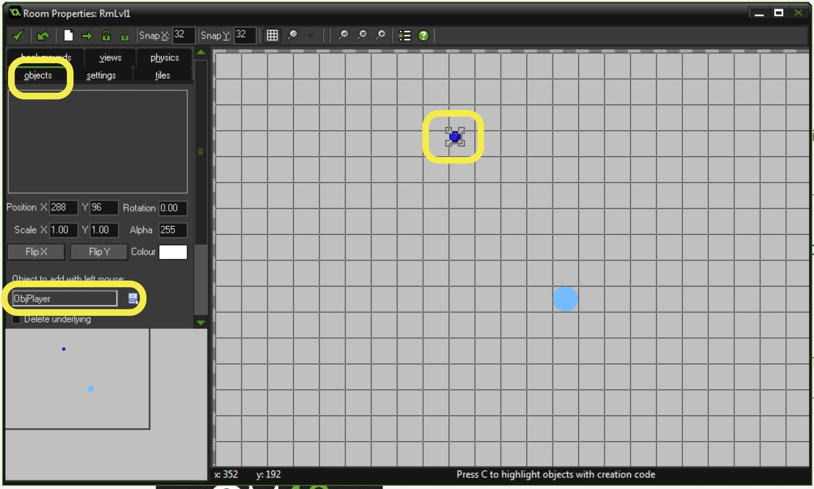
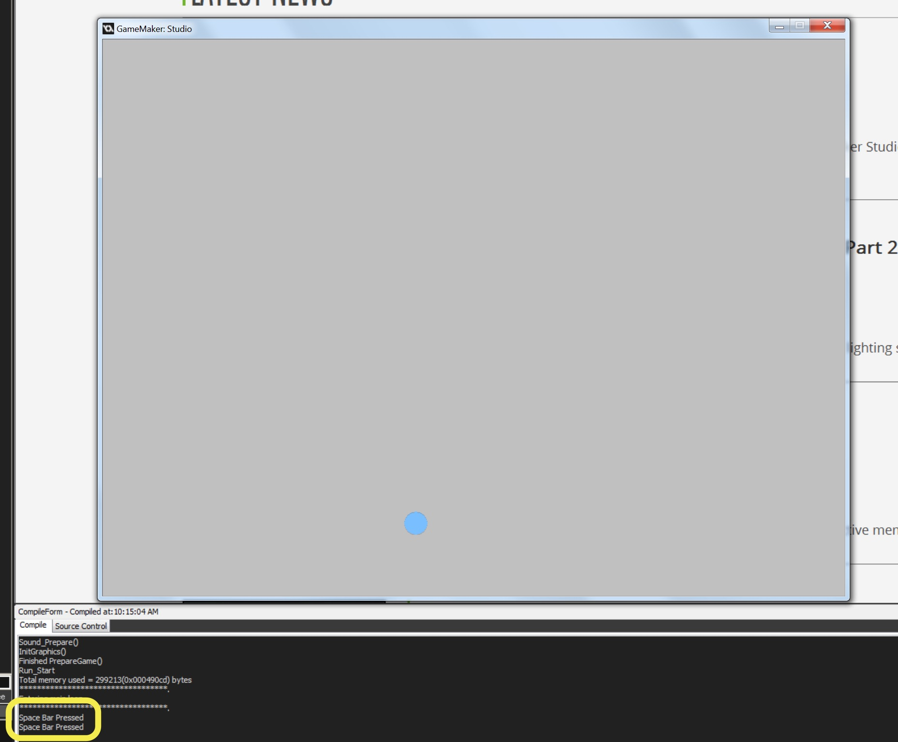
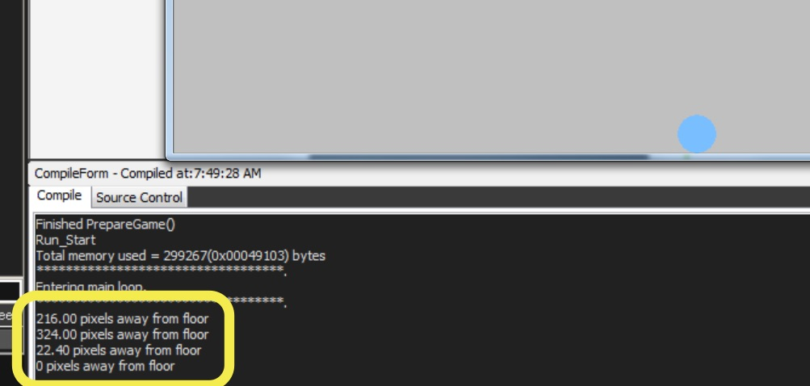
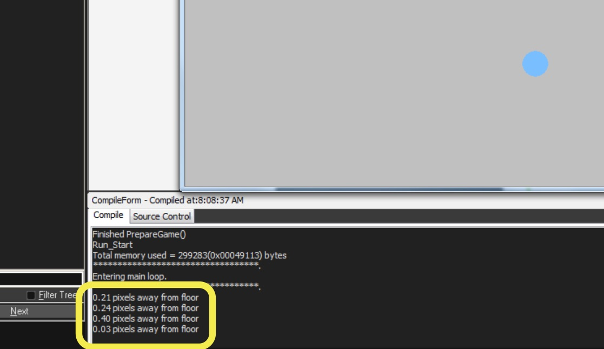
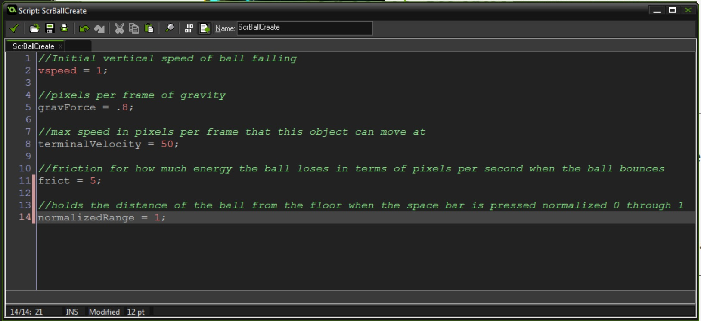
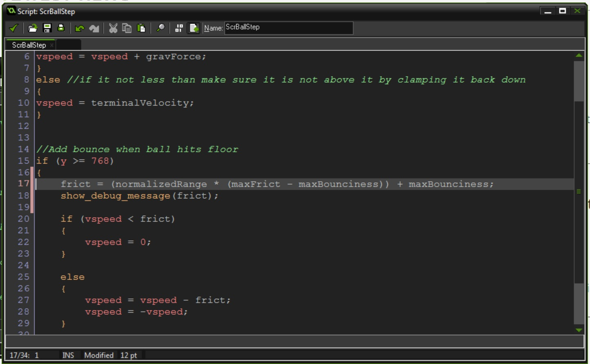

{:start="8"}
8.  The script doesn't run because the player is not in the room.  Even though there is no **sprite** we still need to add the player to the room.  Double click `RmLevel1`, select the **objects** tab.  Select `ObjPlayer` from the drop down list and add it to the room (make sure you only have 1 player in the room).  It will show up as a blue question mark.

	
	<br />

9.  Now run the game.  Every time you press space you should see the message in the message window at the bottom of your screen:

	
	<br />

10.  So we want to know how close we are to the bottom of the screen when the button is pressed.  All we need to do is subtract the screen height by the current ball position.  So double click `ScrPlayer` and let's change the debug message to:

```c
//Check if player presses the space bar
if (keyboard_check_pressed(vk_space))
{
    show_debug_message(string(768 - ObjBall.y) + " pixels away from floor");
}
```


<br />

{:start="11"}
11.  Now we want to make the ball bounce heigher when the number is smaller.  How can we accomplish this?  It would be easier to change the range of numbers from 0 (good - add bounce, or negative `frict`) to 1 (bad - take away from bounce or higher `frict`).  What we can do is simply divide this number by the height and we will get this range.

```c
//Check if player presses the space bar
if (keyboard_check_pressed(vk_space))
{
    show_debug_message(string( (768 - ObjBall.y)/768 ) + " pixels away from floor");
}
```


<br />


{:start="12"}
12.  So now we want to change the range of 0 to 1 to a range of maxBounciness to maxFrict.  OK, lets calculate the `normalizedDistance` inside the ball driven by the player.  Lets open `ScrBallCreate` and add a variable to the bottom.

``` c
//holds the distance of the ball from the floor when the space bar is pressed normalized 0 through 1
normalizedRange = 1;
```


<br />

{:start="13"}
13. Now we need to change the normalized range on the space bar from `ObjPlayer` to `ObjBall`. We can do this with the `with` operator.  We do this by accessing the variable from the ball inside the player.

``` c
//Check if player presses the space bar
if (keyboard_check_pressed(vk_space))
{
    with (ObjBall)
    {
        normalizedRange = (768 - y)/768;
        show_debug_message(string( normalizedRange) + " pixels away from floor");
    }
}
```
{:start="14"}
14. Play the game and it should be the same as before except that you are affecting the `normalizedRange` inside the ball object.  This will be important when we have multipe balls as they will each hold their own variable.


{:start="15"}
15. Lets now add two variable 'maxBounciness' (needs to be negative frict) and 'maxFrict' to the bottom of `ScrBallCreate`.

``` c
//How much the ball can bounce, negative friction
maxBounciness = -5;

//Maximum friction for the worst timing pressed
maxFrict = 10;
```

{:start="16"}
16. How do we apply one range to another.  There is a shorthand using a normalized range.  We multiply the (normalizedRange * (maxFrict - maxBounciness) ) + maxBounciness).  Remove `show_debug_message()` from `ScrPlayerStep` and `Open ScrBallStep` to recalculate frict inside the bounce:

```c
//Add bounce when ball hits floor
if (y >= 768) 
{
    frict = (normalizedRange * (maxFrict - maxBounciness)) + maxBounciness;
    show_debug_message(frict);
    
    if (vspeed < frict)
    {
        vspeed = 0;
    }
```

{:start="17"}
17.  Now play the game.  Can you cheat?  What happens if you press space multiple times quickly?  


<br />


[<- Previous](SimpleMechanic_4.html) &nbsp;&nbsp;&nbsp;[Home](../../index.html)&nbsp;&nbsp;&nbsp;  [Continue ->](SimpleMechanic_6.html)
<br />  
<br />  
<br />  