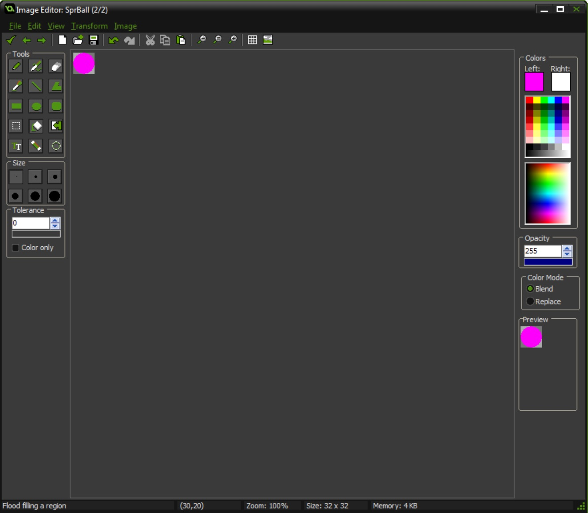

{:start="18"}
18. Let's add a switch in the ball to let us know if the space bar has been pressed.  Open ScrBallCreate and add:

``` c
//Switch to stop player from spamming the space bar
canPressSpace = true;  
```

{:start="19"}
19. Open `ScrPlayerStep` and turn the switch on and off.

``` c
//Check if player presses the space bar
if (keyboard_check_pressed(vk_space))
{
    with (ObjBall)
    {
        if (canPressSpace == true)
        {
            normalizedRange = (768 - y)/768;
            canPressSpace = false;
        }
    }
}
```
{:start="20"}
20.  Now when you play it two things happen.  You can only ever press it once and it retains the value.  So when do we want to reset `normalizedRange` to `1` and to set `canPressSpace = true`?


<br />
{:start="21"}
21.  That works a lot better but I have no way of knowing that I have pressed the space key with the player. So lets change the color of the sprite when the player presses the space bar.  We can use the `canPressSpace` state to visually represent this.  Open up `SprBall` and go to **edit** and press **copy** then **paste**.  Now you should have two balls:

<br />
 

{:start="22"}
22. Now double click the second ball to bring up the editor.  Pick another color and press the **fill** icon and fill in the ball with the new color:


<br />

<br />

{:start="23"}
22. Now we have two colors.   Close the **Sprite Editor** window and play the game.  The sprite flashes.  Oh no, lets add some logic.  Open `ScrBallStep` and add to bottom of script:

``` c
//switch between bounced and not bounced frame
if (canPressSpace == true)
{
    image_index = 0;
}

else
{
    image_index = 1;
}
```


<br />

### Spawn Other Ball

1.  Now lets add a line to the level.  Lets create a heads up display object and draw a single line.  Create an **objectx** and call it `ObjLevel1Hud`.  Let create a script called `ScrLevel1Draw' and add:

``` c
draw_set_color(c_yellow);
draw_line(0, 100, 1024, 102);
```

2.  Now attach this to a plain **draw** event on the `ObjLevel1Hud` and drop this object in our current room.


<br />


<br />

3.  Now play it and you should see a horizontal yellow line at the top of the screen.  Cool.  Now lets spawn another player if you jump passed that line.  Open `ScrBallStep` and add:

``` c
//Spawn new ball if above line
if (y < 100)
{
instance_create(random(1024), 105, ObjBall);
}
```
{:start="4"}
4.  Look at what happens:


<br />

{:start="5"}
5.  As long as the ball is above the line it keeps spawning new balls. Lets add a switch to only spawn one ball and reset the switch when the ball bounces.  Open `ScrBallCreate` and add to the bottom:
``` c
//Switch to control only a single spawning player when above the line
canSpawnPlayer = true;
```

<br />
{:start="6"}
6. Then add switch to spawning ball by changing in `ScrBallStep`:

<br />

{:start="7"}
7. Reset 'canSpawnPlayer' back to true when bouncing:

<br />

{:start="8"}
8. Now play the game. WHat happens when you press space once?


<br />

9.  This is a problem with the `with (ObjBall)` function within `ObjPlayer`.  It affects all instances.  But we want the button press to affect only the ball closest to the ground. So we need to find what ball is closest to the ground.  Open `ScrPlayerStep` and add at the top:

```c 
    //keep track of player closest to ground
    lowestPlayerY = 0;
    lowestPlayerId = -1;
```


<br />

{:start="9"}
9.  Now loop through each player and see which is closest to the ground that is falling (positive `vspeed` and the button has not already been pressed)

``` c
     with (ObjBall) //find player closest to ground
    {
        if (y > ObjPlayer.lowestPlayerY && vspeed > 0 && canPressSpace == true)
        {
            ObjPlayer.lowestPlayerY = y;
            ObjPlayer.lowestPlayerId = id;
        }
    }
```

<br />

{:start="10"}
10.  Now we check to ensure that we have a player on the screen (`lowestPlayerId` should a positive number) then set the single instance to the correct values:

``` c
   if (lowestPlayerId > 0)
    {
        with (lowestPlayerId)
        {
            if (canPressSpace == true)
            {
                normalizedRange = (768 - y)/768;
                canPressSpace = false;
            }
        }
    }
``` 

<br />

{:start="11"}
11. Now play the game and you should only be affecting a single instance of the player! 


[<- Previous](SimpleMechanic_5.html) &nbsp;&nbsp;&nbsp;[Home](../../index.html)&nbsp;&nbsp;&nbsp;  [Continue ->](SimpleMechanic_7.html)
<br />  
<br />  
<br />  