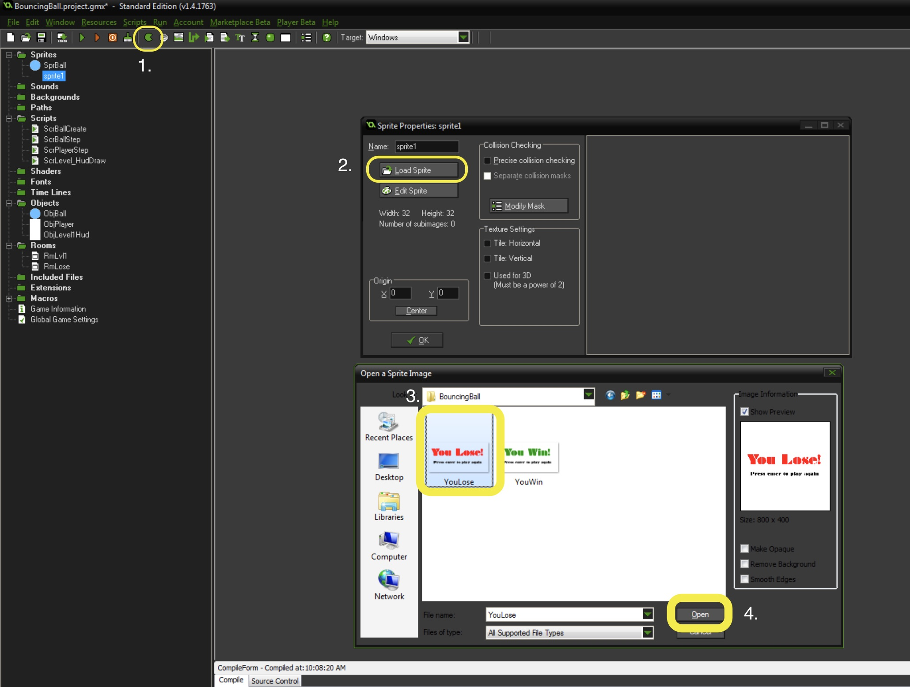

### Die Ball Die

1.  Now we need to _The ball will "die" when it no longer bounces_.  So how do we do this?  Inside our bounce logic in `ScrBallStep` we do have some logic that determines when a ball stops.  We didn't comment it so lets add that as well as an `instance_destroy()` function to kill the ball.


<br />

{:start="2"}
2.  Test your work and make sure it is correct.  The ball should now die when it stops moving.  Let's move to the next step and _If the last ball dies, the player will die_.  So we need to do two things.  Create a You Lose room and then check to see if when a ball dies it is the last ball?  Lets start by creating a new **Room** and calling it `RmLose`.


<br />

{:start="3"}
3.  Create a new **Sprite** and then press the **Load** button.  Go to the folder and select the **YouLose** graphic.  Press the **Open** button.  Name the **Sprite** `SprYouLose`.


<br />


<br />

{:start="4"}
4.  Create a new **Object** and assign the `SprYouLose` **Sprite** to it and name it `ObjYouLose`.


<br />

{:start="5"}
5. Create a new room and call it `RmLose` and go to the **Objects** tab and place `ObjYouLose` in the center of the room.


<br />

{:start="6"}
6. We need logic to send you to the Lose Screen when you have no balls left.  What is the best way of doing this?  We can count how many instances when we delete a ball that dies and if there is 1 or less then we know there are no more balls and you die.  Open up `ScrBallStep` and look for where we `instance_destroy()`.


<br />

{:start="7"}
7. Test the game and make sure it goes to the screen.  Once you are there we need a small script that we will share with the **Win** screen to restart the game.  Create a new **script** called `ScrEndScreenStep` and add:

``` c
//Restart game if enter is pressed

if (keyboard_check_pressed(vk_enter))
{
    game_restart();
}
```

<br />

### Win

1.  Now we need to do the final step to get the broad strokes in:  _If you spawn the ball 10 times, the player will win_.  Lets import the sprite and create an object calling them `SprYouWin` and `ObjYouWin`:


<br />


<br />

{:start="2"}
2. Bind the `ScrEndEndStep` to a **Step** event on `ObjYouWin`.


<br />

{:start="3"}
3.  Create a new **Room** called `RmWin` and add the `ObjYouWin` to it.


<br />

4.  Let's go to the part of the code where we spawn players and check to see if there are 10 of them?


<br />

5.  Test the game by playing and make sure you can go to the **You Win!** screen and restart the game.  If you can let's continue and add a few tasks to give this game a bit of polish.


[<- Previous](SimpleMechanic_6.html) &nbsp;&nbsp;&nbsp;[Home](../../index.html)&nbsp;&nbsp;&nbsp;  [Continue ->](SimpleMechanic_8.html)
<br />  
<br />  
<br />  