### Motion Blur

1.  Lets add some simple motion blur to accentuate the movement of the player.  We will keep drawing him dropping the alpha giving the player a trail.  We will begin by creating an instance of the player and it will just fade to nothing.  Lets create a new object and call it `ObjPlayerTrail` and bind the `SprBall` to it.

	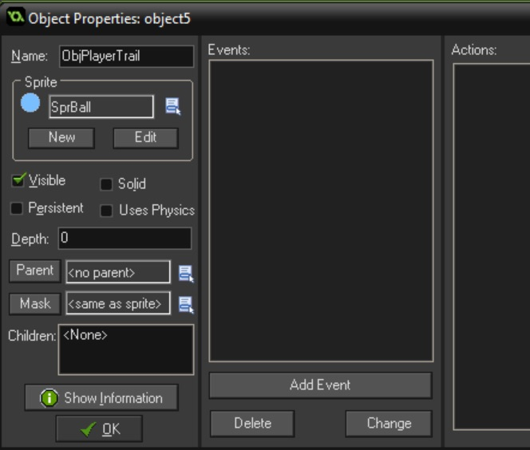 
	<br />	


2.  Open up `ScrPlayerStep` and add to the bottom:

``` c
//Spawn player trail, just for looks
instance_create(xprevious, yprevious, ObjPlayerTrail);
```
	 
	<br />	

{:start="3"}
3.  Now we get a very colorful result as our spawned player alternates between the two colors:

	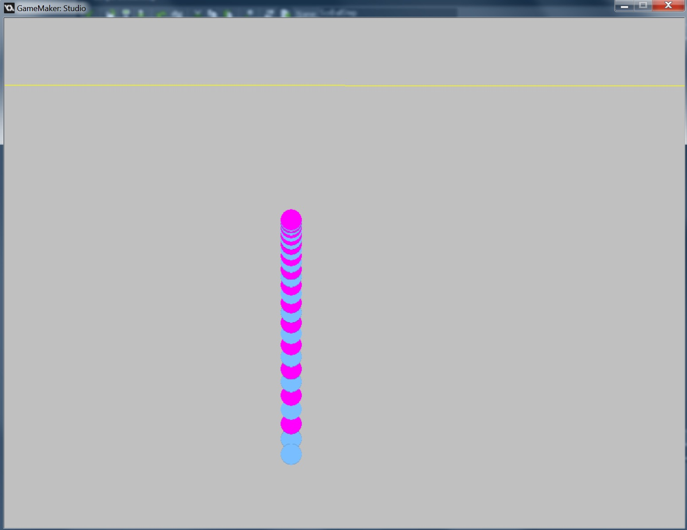 
	<br />	

4.  We need to pass along the correct image_index. Here is how we do it:
``` c
//Spawn player trail, just for looks
trail = instance_create(xprevious, yprevious, ObjPlayerTrail);
trail.image_index = image_index;
```

{:start="5"}
5.  This is not complete as we need to turn off the animation.  Create a new Script called `ScrPlayerTrailCreate` and add and bind to a **Create** event on `ObjPlayerTrail`:

``` c
//neutralize animation
image_speed = 0;
```

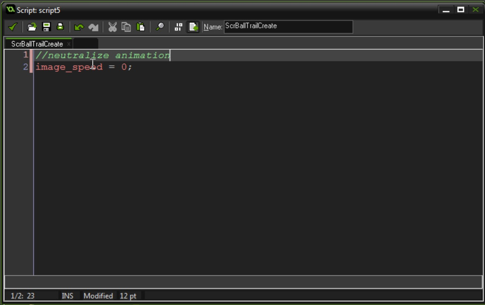 
<br />	

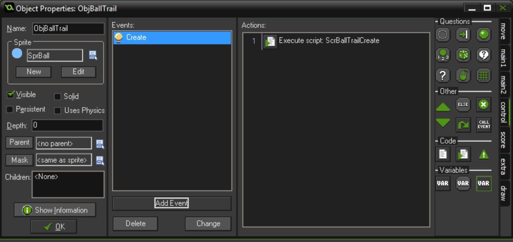 
<br />	

{:start="6"}
6.  Play and test.  OK, that works but now we need the trail to just fade away and be subtle.  Add to the bottom of `ScrBallTrailCreate`
``` c
//Starting alpha
image_alpha = .3;
```
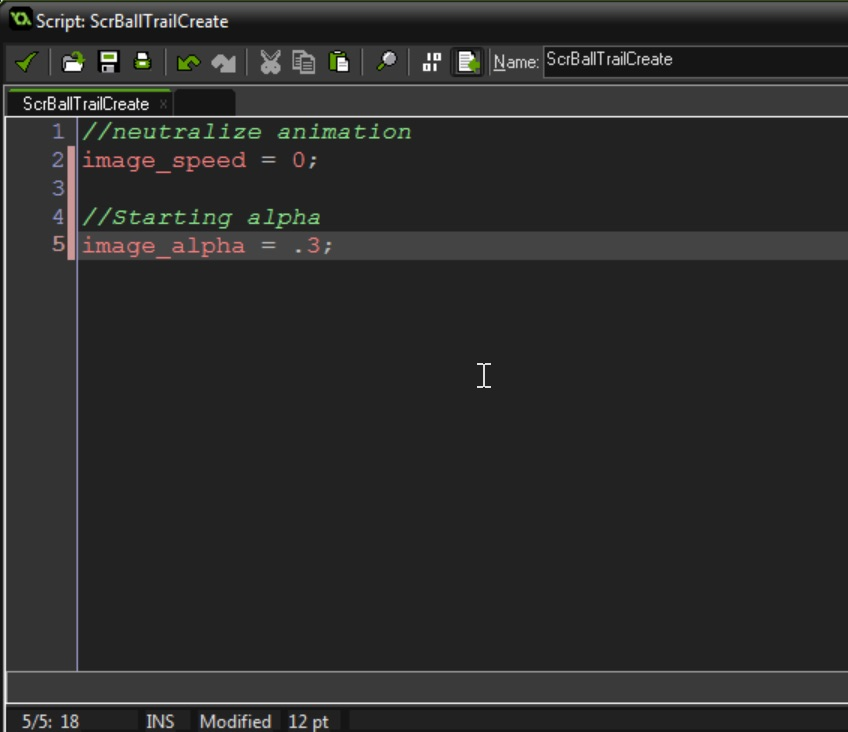 
<br />	

{:start="7"}
7.  Now create a new script called `ScrBallTrailStep` and add:

//Fade alpha out then destroy
image_alpha -= .1;
if (image_alpha <= 0) 
{
    instance_destroy();
}

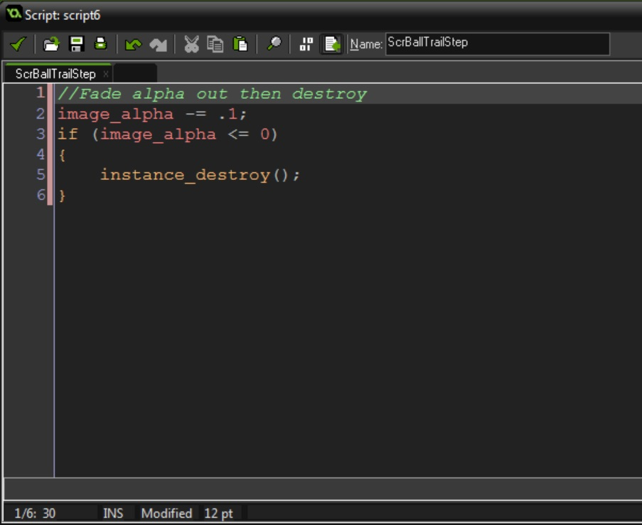 
<br />	

{:start="8"}
8. Bind the `ScrBallTrailStep` to a **Step** event on `ObjBallTrail`:
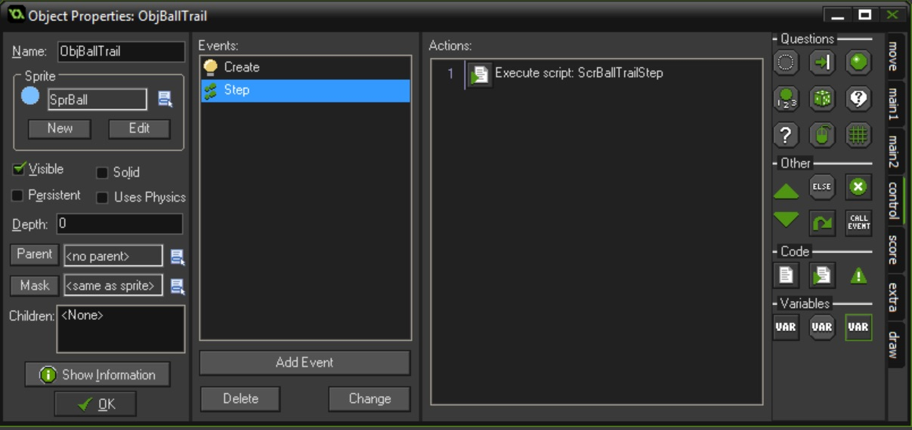 
<br />	

9.  Run and test it.  Tune the values to your liking.

### Make it Personal

1.  A simple trick to make something more personal and human.  Add eyes:

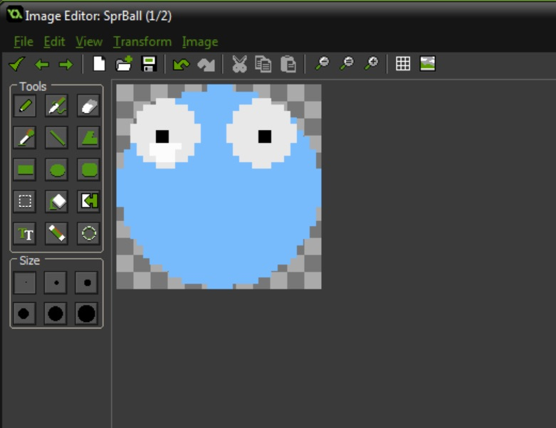 
<br />	

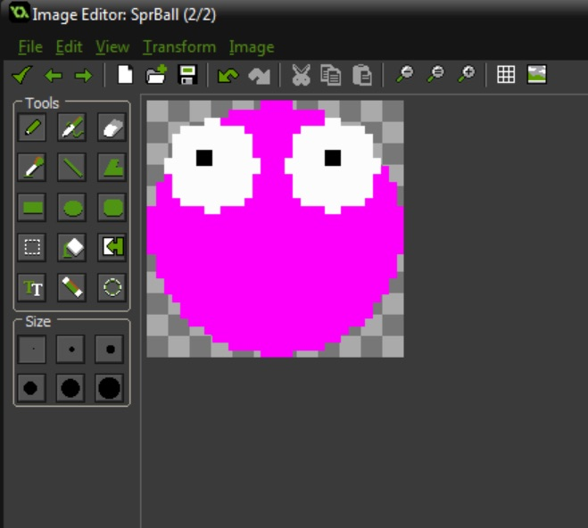 
<br />	

{:start="2"}
2.  Play the game.  Now doesn't that make them cuter?

### Make it Sound Good

1.  Now lets add some audio.  Create a new **Sound** and load:

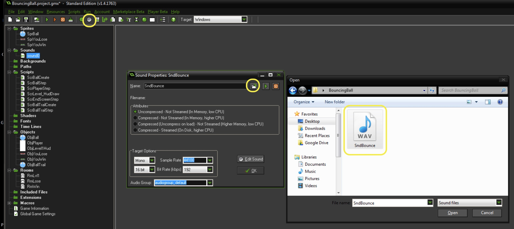 
<br />	

{:start="2"}
2.  Go into `ScrBallStep` and find the bounce section of the code and add the bounce sound at the bottom:

``` c
 // Play bounce sound
    audio_play_sound(SndBounce, 1, false);
```

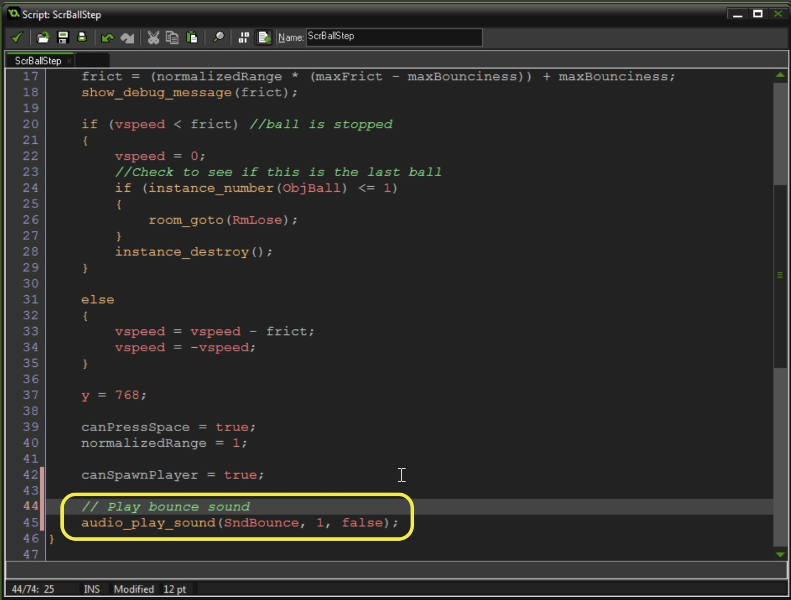 
<br />	

{:start="3"}
3.  Now test and play it.  Having a sound over and over again will get tiring.  A quick trick instead of recording more sounds is to alter the pitch:

``` c
    // Play bounce sound
    audio_sound_pitch(SndBounce, random_range(1, 1.5));
    audio_play_sound(SndBounce, 1, false);
```

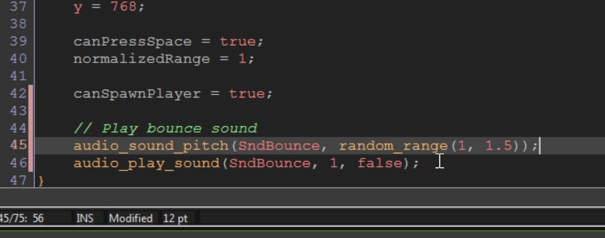 
<br />	

## --- That's All Folks! ---

<br />


[<- Previous](SimpleMechanic_7.html) &nbsp;&nbsp;&nbsp;[Home](../../index.html)&nbsp;&nbsp;&nbsp;
<br />  
<br />  
<br />  