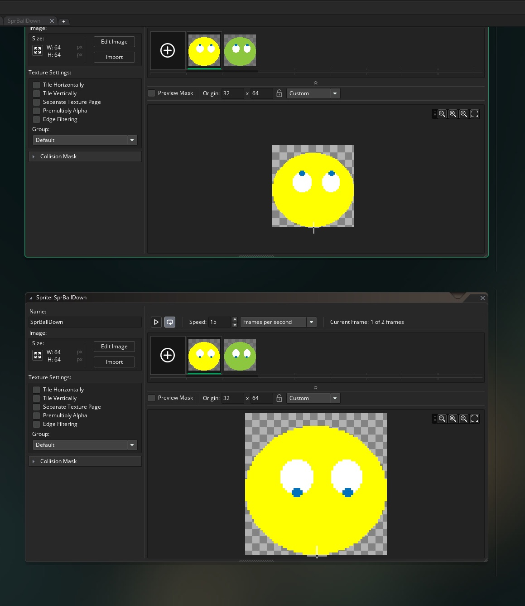

___ 
## Introduction  
We will be finishing what we started in class.  It won't be long.  You can use the file you have or if it is not working can download what did [in class](BouncingBall.yyp.zip).  Lets start where we left off.

___ 
## Fix Core Mechanic

<div class = "row">
<div class="col-12">
<div markdown = "1">

{:start="{{ num }}"}
1.  There is a flaw in our algorithm.  We are basing the normalized range at a fixed point on the screen in Y.  Right now it is `normalizedRange = (room_height - y)/250;` in my version.  Now we don't want the worst performance to be based on a fixed number.  We want this to the top of the apex of the bounce when the ball starts falling (and switches back to its origina frame).  So lets create a new variable.  Open `ObjBallCreate` and add at the bottom:
</div>
</div>
<div class="col-12 col-lg-8">
<div markdown = "1">
```c
//top apex of the ball when it hits its peak
ballTopApex = y;
```
</div>
</div>
</div>


___ 
<div class = "row">
<div class="col-12 col-lg-4 align-self-center">
<div markdown = "1">

{:start="{{ num }}"}
{{ num }}. Now lets calculate every time the ball hits the top of its apex.  We already have this in our 'ObjBallStep'.  Add to it:
</div>
</div>
<div class="col-12 col-lg-8">
<div markdown = "1">
```
 //if ball hits apex at top of bounce
 if (temp2 > 0 && temp <= 0)
 {
	canPressSpace = true;
	normalizedRange = 1;
	ballTopApex = room_height - y; //sets the current apex of the ball bounce
 }
```
</div>
</div>
</div>


___ 
<div class = "row">
<div class="col-12 col-lg-4 align-self-center">
<div markdown = "1">

{:start="{{ num }}"}
{{ num }}. Now lets fix it so that we use this variable to determine the range.  Open `ObjPlayerStep` and alter the line that contains `normalizdeRange` to devide by `ballToApex`:
</div>
</div>
<div class="col-12 col-lg-8">
<div markdown = "1">
```c
normalizedRange = (room_height - y)/ballTopApex;
```
</div>
</div>
</div>


___ 
<div class = "row">
<div class="col-12 col-lg-4 align-self-center">
<div markdown = "1">

{:start="{{ num }}"}
{{ num }}. Now fool around with your default values.  I changed my `terminalVel`, `maxBounce` and `maxFrict` to play better in my estimation.  Please pick your own values:
</div>
</div>
<div class="col-12 col-lg-8">
<div markdown = "1">
```c
/// @description set up ball variables
// 
//pixels per frame of gravity
gravForce = .3;

//max speed in pixels per frame
terminalVel = 15;

//friction loss in pixels per bounce
frict = 1;

//maximum bounciness of ball
maxBounce = -5;
//maxBounce = -15; //this is for testing
//maximum friction to be applied
maxFrict = 5;

//range between 1(max bounciness) and 0 (max friction)
normalizedRange = 0;

//Swtich to sop player from spamming space bar
canPressSpace = true;

//allows ball to reproduce
canSpawnBall = false;

//top apex of the ball when it hits its peak
ballTopApex = y;
```
</div>
</div>
</div>

___ 
<div class = "row">
<div class="col-12 col-lg-4 align-self-center">
<div markdown = "1">

{:start="{{ num }}"}
{{ num }}. Now lets add a lose text when you lose the game.  We will check for when there are no more balls left and put up some lose text.  Create two sprites that say "You Win! Press r to restart" and "You Lose! Press r to restart" and call them SprWin and SprLose:
</div>
</div>
<div class="col-12 col-lg-8">

</div>
</div>

___ 
<div class = "row">
<div class="col-12 col-lg-4 align-self-center">
<div markdown = "1">

{:start="{{ num }}"}
{{ num }}. Create two **Game Objects** and call them `ObjWin` and `ObjLose` and bind the related sprite:
</div>
</div>
<div class="col-12 col-lg-8">

</div>
</div>

___ 
<div class = "row">
<div class="col-12 col-lg-4 align-self-center">
<div markdown = "1">

{:start="{{ num }}"}
{{ num }}. Add the below game restart script to BOTH `ObjWin` and `ObjLose`:
</div>
</div>
<div class="col-12 col-lg-8">
<div markdown = "1">
```c
/// @description end restart game
if (keyboard_check(ord("R")))
{
	game_restart();	
}
```
</div>
</div>
</div>

___ 
<div class = "row">
<div class="col-12 col-lg-4 align-self-center">
<div markdown = "1">

{:start="{{ num }}"}
{{ num }}. Lets make a simple state machine and give the game two states.  Create an `ObjPlayer` **Create Event** script and add:
</div>
</div>
<div class="col-12 col-lg-8">
<div markdown = "1">
```c
/// @description player object variables
#macro INGAME 0
#macro OUTGAME 1

state = INGAME;
```
</div>
</div>
</div>


___ 
<div class = "row">
<div class="col-12 col-lg-4 align-self-center">
<div markdown = "1">

{:start="{{ num }}"}
{{ num }}. We are going to add a state check to the **Step Event** in `ObjPlayer`.  First add it to the check for pressing space:
</div>
</div>
<div class="col-12 col-lg-8">
<div markdown = "1">
```c
if (keyboard_check_pressed(vk_space) && state == INGAME)
```
</div>
</div>
</div>

___ 
<div class = "row">
<div class="col-12 col-lg-4 align-self-center">
<div markdown = "1">

{:start="{{ num }}"}
{{ num }}. Now add just above that a check to see if you are in INGAME state and if there are no more instances of `ObjBall` in the room.  If there are not lets create the `ObjLose` and change the state to `OUTGAME` so you don't keep respawning more ObjLoses every frame.  Add before everything:
</div>
</div>
<div class="col-12 col-lg-8">
<div markdown = "1">
```c
if (!instance_exists (ObjBall) && state == INGAME)
{
	instance_create_depth(250, 200, 50, ObjLose);
	state = OUTGAME;
}
```
</div>
</div>
</div>


___ 
<div class = "row">
<div class="col-12 col-lg-4 align-self-center">
<div markdown = "1">

{:start="{{ num }}"}
{{ num }}. Play the game and lose on purpose.  Now you get the You Lose message and you can restart the game by pressing r.  That all works for my version.  Now lets move on to winning.First to test change the `maxBounce` to `-15` in your `ObjBall` **create** for testing.  We can move it back after.  After checking for losing lets do an `elseif` on `ObjPlayer` **step event** and check to see if we have 10 balls.  
</div>
</div>
<div class="col-12 col-lg-8">
<div markdown = "1">
```c
else if (state == INGAME)
{
	if (instance_number(ObjBall) >= 10)
	{
		instance_create_depth(250, 200, -50, ObjWin);
		state = OUTGAME;
	}
}
```
</div>
</div>
</div>


___ 
<div class = "row">
<div class="col-12 col-lg-4 align-self-center">
<div markdown = "1">

{:start="{{ num }}"}
{{ num }}. That's cool, play the game and when you get to 10 balls you should see it:
</div>
</div>
<div class="col-12 col-lg-8">

</div>
</div>

___ 
<div class = "row">
<div class="col-12 col-lg-4 align-self-center">
<div markdown = "1">

{:start="{{ num }}"}
{{ num }}. One improvement I can make is to have the balls be elastic when I win so that they don't all stop and die. In `ObjBall` **step** add just after setting `frict`:
</div>
</div>
<div class="col-12 col-lg-8">
<div markdown = "1">
```c
	 //Have perfectly elastic bounce if player wins
	 if (ObjPlayer.state == OUTGAME)
	 {
		frict = 0;
	 }
```
</div>
</div>
</div>


___ 
<div class = "row">
<div class="col-12 col-lg-4 align-self-center">
<div markdown = "1">

{:start="{{ num }}"}
{{ num }}. That's better, lets create two more frames of animation.  Copy your orinal SprBall twice and move the eyes to look up in one and call it `SprBallUp` and look down in the other and call it `SprBallDown`. 
</div>
</div>
<div class="col-12 col-lg-8">

</div>
</div>

___ 
<div class = "row">
<div class="col-12 col-lg-4 align-self-center">
<div markdown = "1">

{:start="{{ num }}"}
{{ num }}. Now add to `SprBallStep` at the end an animation picker:
</div>
</div>
<div class="col-12 col-lg-8">
<div markdown = "1">
```c

//pick between three animations based on vspeed
if (vspeed < -9)
{
	sprite_index = SprBallUp;	
}

else if (vspeed > 9)
{
	sprite_index = SprBallDown;
}

else
{
	sprite_index = SprBall;	
}
```
</div>
</div>
</div>

___ 
<div class = "row">
<div class="col-12 col-lg-4 align-self-center">
<div markdown = "1">

{:start="{{ num }}"}
{{ num }}. Run the game and test it and now you should have the eyes looking in different directions. Now that the win testing is done return `maxBounce = -5;`. Now download three [sound files](Sounds.zip) to create new audio.  Unzip the folder and import all three sounds calling them: `SndJump`, `SndBadJump` and `SndDie`.
</div>
</div>
<div class="col-12 col-lg-8">

</div>
</div>

___ 
<div class = "row">
<div class="col-12 col-lg-4 align-self-center">
<div markdown = "1">

{:start="{{ num }}"}
{{ num }}. Now add the bounce sound to the bottom of the bounce statement:
</div>
</div>
<div class="col-12 col-lg-8">
<div markdown = "1">
```c
// Play bounce sound
    audio_play_sound(SndJump, 1, false);
```
</div>
</div>
</div>


___ 
<div class = "row">
<div class="col-12 col-lg-4 align-self-center">
<div markdown = "1">

{:start="{{ num }}"}
{{ num }}. Play the game and listen.  It will get annoying fast.  We could add a variation of sounds and randomly choose them or more quickly can just adjust the pitch:
</div>
</div>
<div class="col-12 col-lg-8">
<div markdown = "1">
```c
	// Play bounce sound
    audio_sound_pitch(SndJump, random_range(1, 1.5));
    audio_play_sound(SndJump, 1, false);
```
</div>
</div>
</div>

<div class = "row">
<div class="col-12 col-lg-4 align-self-center">
<div markdown = "1">

{:start="{{ num }}"}
{{ num }}. Play the game and now you will have different pitch sounds.  Lets add the bad jump when the player doesn't press the button or presses it too early.  Change to above and look at the `frict` value as an indication of success:
</div>
</div>
<div class="col-12 col-lg-8">
<div markdown = "1">
```c
	if (frict <= -1)
	{
		// Play bounce sound
	    audio_sound_pitch(SndJump, random_range(1, 1.5));
	    audio_play_sound(SndJump, 1, false);
	}
	else
	{
				// Play bounce sound
	    audio_sound_pitch(SndBadJump, random_range(1, 1.5));
	    audio_play_sound(SndBadJump, 1, false);
	}
```
</div>
</div>
</div>

<div class = "row">
<div class="col-12 col-lg-4 align-self-center">
<div markdown = "1">

{:start="{{ num }}"}
{{ num }}. Finally lets add the dying sound:
</div>
</div>
<div class="col-12 col-lg-8">
<div markdown = "1">
```c
	 if (vspeed > 0 && vspeed > frict)
	 {
		vspeed = -vspeed + frict; //adding friction
	 }
	 else 
	 {
		//vspeed = 0;
		instance_destroy();
		audio_sound_pitch(SndDie, random_range(1, 1.5));
	    audio_play_sound(SndDie, 1, false);
	 }
```
</div>
</div>
</div>

<div class = "row">
<div class="col-12 col-lg-4 align-self-center">
<div markdown = "1">

{:start="{{ num }}"}
{{ num }}. That's it for this for this prototype.  Yours should now look like:
</div>
</div>
<div class="col-12 col-lg-8">
<div class="embed-responsive embed-responsive-16by9">
<iframe class = "embed-responsive-item" src="https://www.youtube.com/embed/KOONDfRySOs?rel=0&amp;controls=0&amp&showinfo=0&version=3&loop=1&playlist=KOONDfRySOs" frameborder="0" allowfullscreen></iframe>
</div>
</div>
</div>
<br>
<br>
<br>


