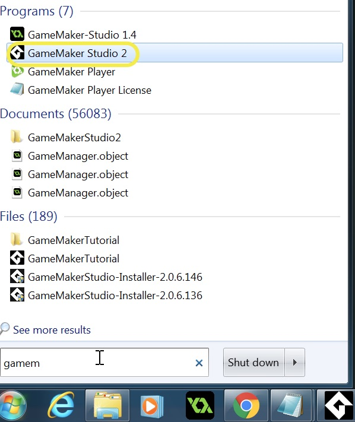
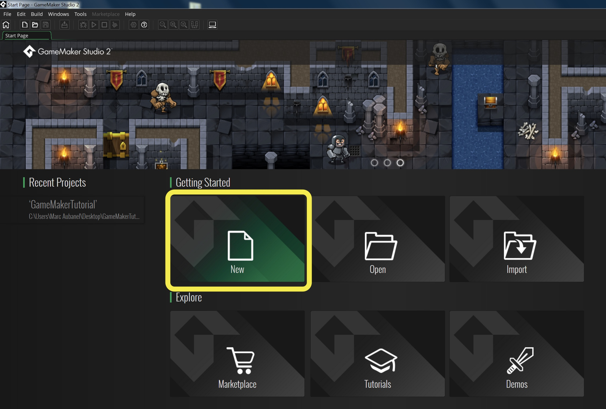
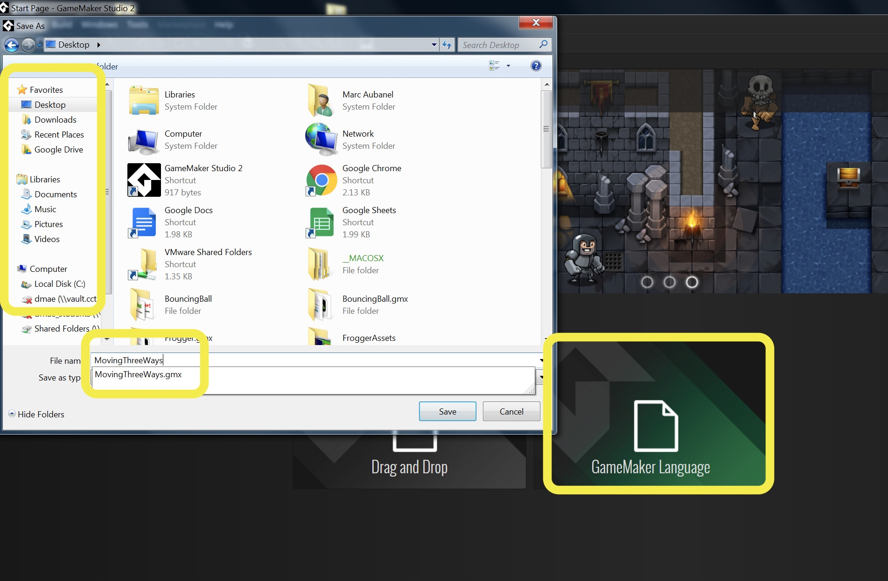
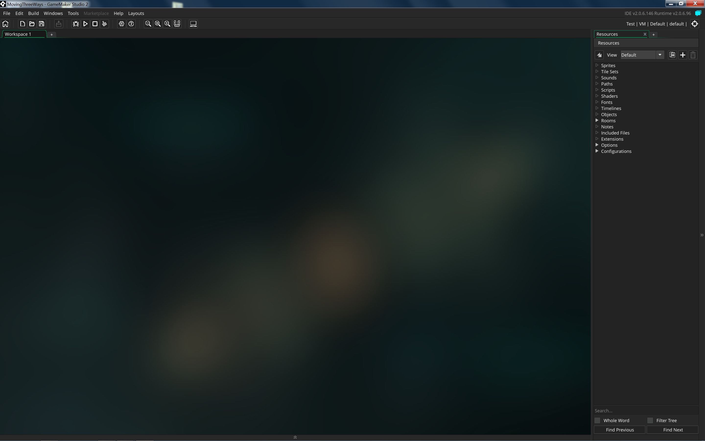

# Starting a GameMaker Studio II project

## Logging in

1. When starting GameMaker Studio 2 you need to make sure you are loading the program called **GameMaker Studio 2**.

  
 

{:start="2"}
2.  If you are not using a school computer, login as you normally do.  If you are using a school computer login using the username and password that were provided to you.  Remember that those passwords are tied to a single computer.

  
 

{:start="3"}
3.  Click on the **New Project** _button_ to start a new project.  

  
 

{:start="4"}
4. Click on the **GameMaker Language** _button_ as we do not want to use the drag and drop features.  There is so much more flexibility to make more sophisticated games and prototypes using scripts than using the drag-and-drop interface.  The learning curve for a high school student or older is roughly the same.  Select a folder and a name to call your project.  This will create a folder and all the files you need.  Please remember to **save** your project on a regular basis.  All video game development environments tend to crash and we want to minimize work lost.

  
 
 
{:start="5"}
5.  You should go to a blank project that looks like:

  
 

{:start="6"}
6.  Now you are ready to start making your game!

 
[Home](../../index.html) 
   
   
   
   
