# Adventure Game

___ 

## Index
1. [Cameras](#cameras)
1. [Collision](#collision)
3. [Switching Rooms](AdventureGame_3.html#switching-rooms)
4. [Dialogue Boxes](AdventureGame_7.html#dialogue-boxes)
5. [NPC B](AdventureGame_8.html#npc-b)
6. [NPC C](AdventureGame_8.html#npc-c)
7. [Collectibles](AdventureGame_9.html#collectibles)
8. [Front End](AdventureGame_11.html#front-end)

___ 
## Cameras

<div class = "row">
<div class="col-12 col-lg-4 align-self-center">
<div markdown = "1"> 

{:start="{{ num }}"}
{{ num }}. If you haven't built two levels and three characters go do the walk throughs on [tiles](http://marcaubanel.com/gamemaker/GMS2Intermediate/ArtOverview/ArtOverview_1.html) and [animations](http://marcaubanel.com/gamemaker/GMS2Intermediate/ArtOverview/SpritesAndAnimation_1.html).  After that you should have something that looks like:
</div>
</div>
<div class="col-12 col-lg-8">
<div class="embed-responsive embed-responsive-16by9">
<iframe class="embed-responsive-item" src="https://www.youtube.com/embed/ktQgmZq9X9U?autoplay=1&rel=0&controls=0&amp&showinfo=0&version=3&loop=1&playlist=ktQgmZq9X9U" frameborder="0" allowfullscreen></iframe>
</div>
</div>
</div>

___ 
<div class = "row">
<div class="col-12 col-lg-4 align-self-center">
<div markdown = "1"> 

{:start="{{ num }}"}
{{ num }}. Now the problem is that our room is 4032 x 2304.  We want it to be the standard default 1024 by 768.  How do we create a camera in the level that follows our character so we can navigate this level?  Double click your first room and look at the bottom left for Viewports and Cameras.  
</div>
</div>
<div class="col-12 col-lg-8">
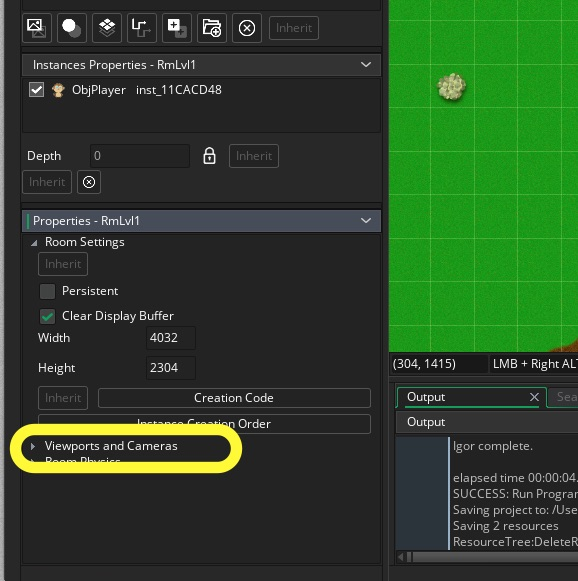
</div>
</div>

___ 
<div class = "row">
<div class="col-12 col-lg-4 align-self-center">
<div markdown = "1"> 

{:start="{{ num }}"}
{{ num }}. Click on the arrow to open the menu.  Click the tab to Enable Viewports and open the triangle for Viewport 0. Click on the radio button for **Enable Viewports** and have it render by cliking on the **Visible**
radio button.  Then keep the Camera and Vieport properties at their defualt settings and select your `ObjPlayer` in the **Objects Following** drop down menu.
</div>
</div>
<div class="col-12 col-lg-8">
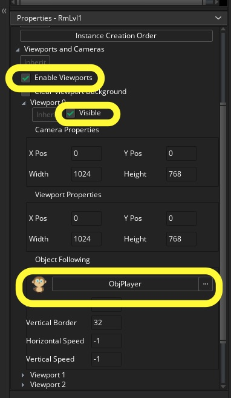
</div>
</div>

___ 
<div class = "row">
<div class="col-12 col-lg-4 align-self-center">
<div markdown = "1"> 

{:start="{{ num }}"}
{{ num }}. 
Run the game and walk around the room.  The camera shoudl follow the player along in a smaller viewport as we specified.
</div>
</div>
<div class="col-12 col-lg-8">
<div class="embed-responsive embed-responsive-16by9">
<iframe class="embed-responsive-item" src="https://www.youtube.com/embed/U4fGmjc4oOs?autoplay=1&rel=0&controls=0&amp&showinfo=0&version=3&loop=1&playlist=U4fGmjc4oOs" frameborder="0" allowfullscreen></iframe>
</div>
</div>
</div>

___ 
<div class = "row">
<div class="col-12 col-lg-4 align-self-center">
<div markdown = "1"> 

{:start="{{ num }}"}
{{ num }}. 
Now the problem is that the player only triggers the camera follows at the very edge of the screen. Change the **Horizontal Border** to `350` and the **Vertical Border** to `300`.  These can be round in the **Room Properties** on the left hand side under the **Object Following**.
</div>
</div>
<div class="col-12 col-lg-8">
<div class="embed-responsive embed-responsive-16by9">
<iframe class="embed-responsive-item" src="https://www.youtube.com/embed/UOykuyLZ07k?autoplay=1&rel=0&controls=0&amp&showinfo=0&version=3&loop=1&playlist=UOykuyLZ07k" frameborder="0" allowfullscreen></iframe>
</div>
</div>
</div>

___ 
## Collision  

<div class = "row">
<div class="col-12r">
<div markdown = "1"> 

{:start="{{ num }}"}
{{ num }}. Now we use sprites for backgrounds and non-moving objects because they render faster than game objects (which include Sprites).  Objects have a lot of overhead that make them more "expensive".  We used to have to use an object to do collision detection but with GameMaker Studio 2 there is a way that doesn't use objects and the very expensive collision checks.  
</div>
</div>
</div>

___ 
<div class = "row">
<div class="col-12 col-lg-4 align-self-center">
<div markdown = "1"> 

{:start="{{ num }}"}
{{ num }}. Now we don't know what tiles in our layer we should collide with.  We are going to create a layer for collisions that will be hidden in the final game.  Lets start by creating a new **_sprite_** and call it `SprCollision`.  Change the size to `32` by `32`. Click the **_Edit Image** button.  We will create a 32 by 32 block with a solid color.  Use the bucket tool to fill in with a pink color (or any other color that is not being used in your level currently).  Double click on the layer and change the **Opacity** to 35%. 
</div>
</div>
<div class="col-12 col-lg-8">
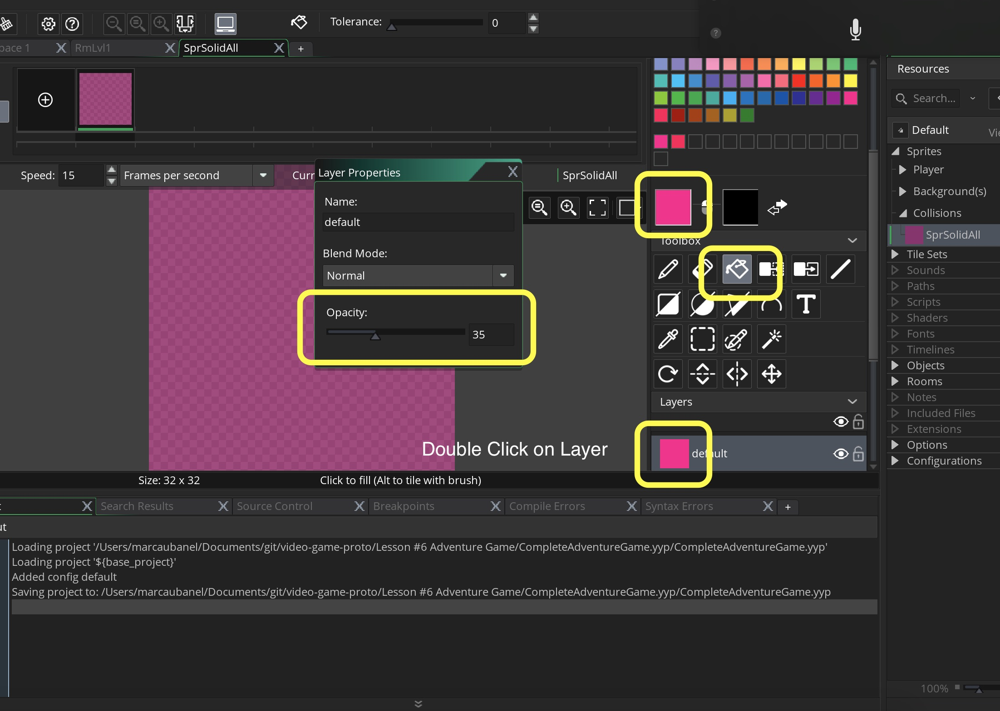
</div>
</div>

___ 
<div class = "row">
<div class="col-12 col-lg-4 align-self-center">
<div markdown = "1"> 

{:start="{{ num }}"}
{{ num }}. This needs to be assigned to a tileset.  Before we do this we need the first tile to be empty.  Go to the **Resize Properties** and resize canvas **Width** to `64`.  Also, click on the right arrow so the blank space is on the left hand side.
</div>
</div>
<div class="col-12 col-lg-8">
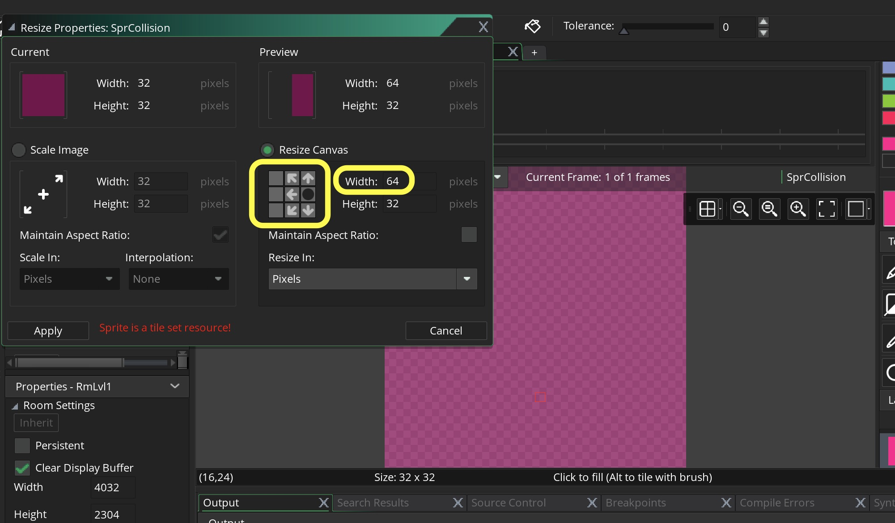
</div>
</div>

___ 
<div class = "row">
<div class="col-12 col-lg-4 align-self-center">
<div markdown = "1"> 

{:start="{{ num }}"}
{{ num }}. Now your sprite should look like:
</div>
</div>
<div class="col-12 col-lg-8">
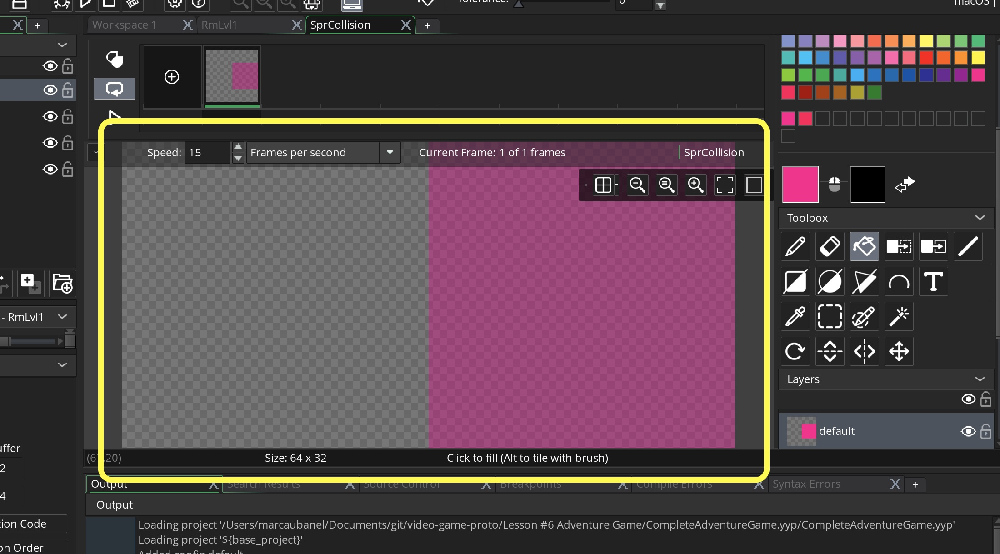
</div>
</div>

___ 
<div class = "row">
<div class="col-12 col-lg-4 align-self-center">
<div markdown = "1"> 

{:start="{{ num }}"}
{{ num }}. Create a new **Tileset** and call it `TileCollision`.  Assign the `SprCollision` sprite we just prepared to the tileset.
</div>
</div>
<div class="col-12 col-lg-8">
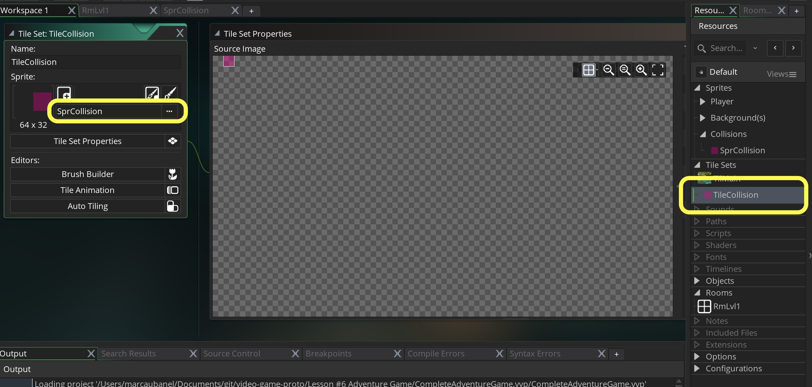
</div>
</div>

___ 
<div class = "row">
<div class="col-12 col-lg-4 align-self-center">
<div markdown = "1"> 

{:start="{{ num }}"}
{{ num }}. Click on **Tileset Properties** button and set the **Tile Width** and **Tile Height** to `32`:
</div>
</div>
<div class="col-12 col-lg-8">
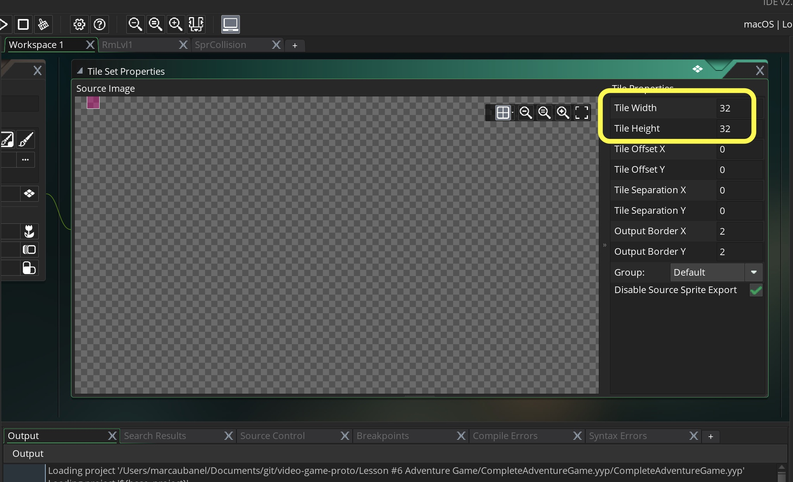
</div>
</div>

___ 
<div class = "row">
<div class="col-12 col-lg-4 align-self-center">
<div markdown = "1"> 

{:start="{{ num }}"}
{{ num }}. Open the room (mine is called RmLvl1).  Create a new **Tile Layer** on top and call it `Collision`.  
</div>
</div>
<div class="col-12 col-lg-8">
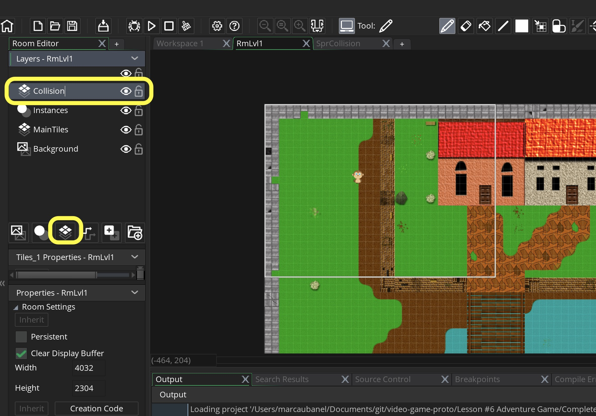  
</div>
</div>

___ 
<div class = "row">
<div class="col-12 col-lg-4 align-self-center">
<div markdown = "1"> 

{:start="{{ num }}"}
{{ num }}. Select the `Collision` layer and the newly created tileset and paint every tile that you want the player to not be able to walk on.  Make sure that you block the outside of the entire level and all areas you don't want the player to walk on.
</div>
</div>
<div class="col-12 col-lg-8">
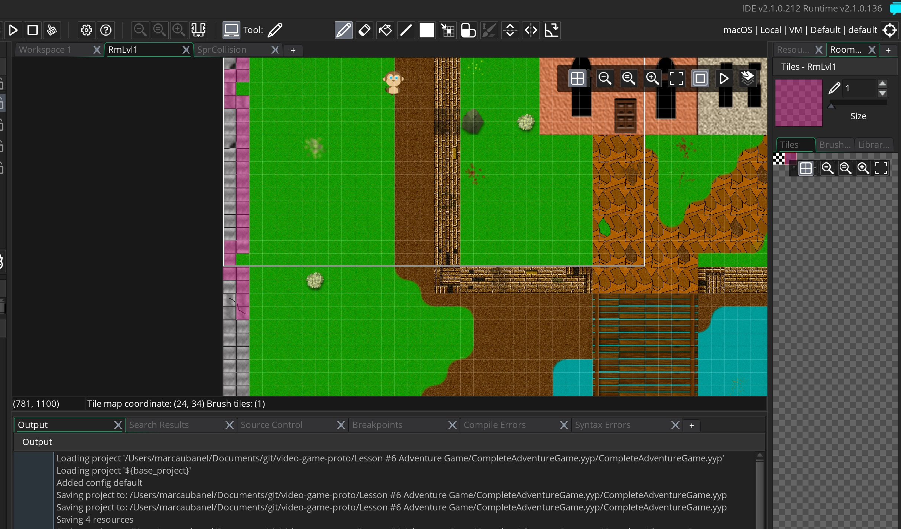  
</div>
</div>

___ 
<div class = "row">
<div class="col-12">
<div markdown = "1"> 

{:start="{{ num }}"}
{{ num }}. You can double check your work by turning layer visibity on and off to make sure that you block out all unwanted areas to walk on.  
</div>
</div>
</div>

___ 
<div class = "row">
<div class="col-12 col-lg-6">
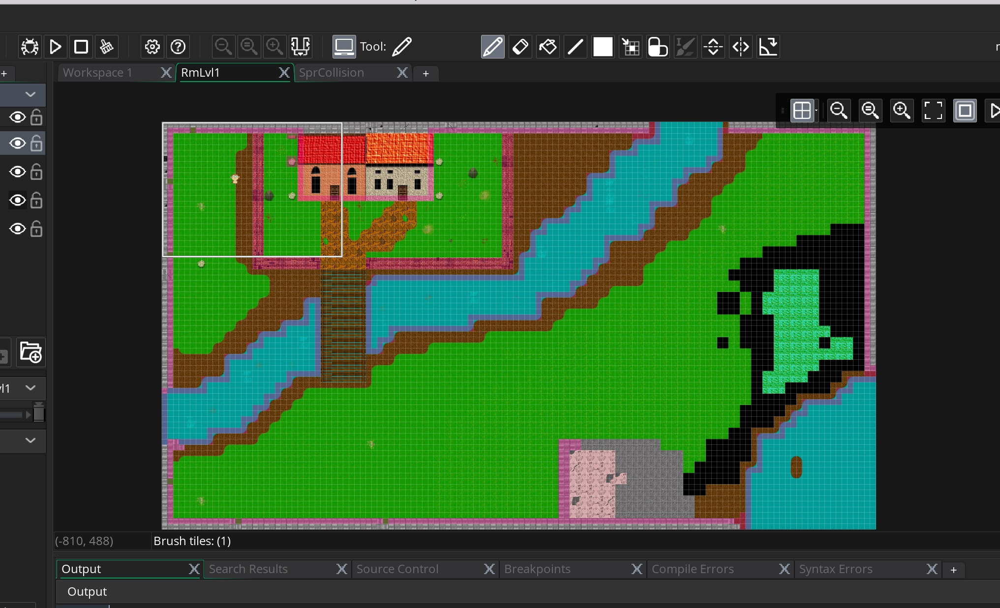  
</div>
<div class="col-12 col-lg-6">
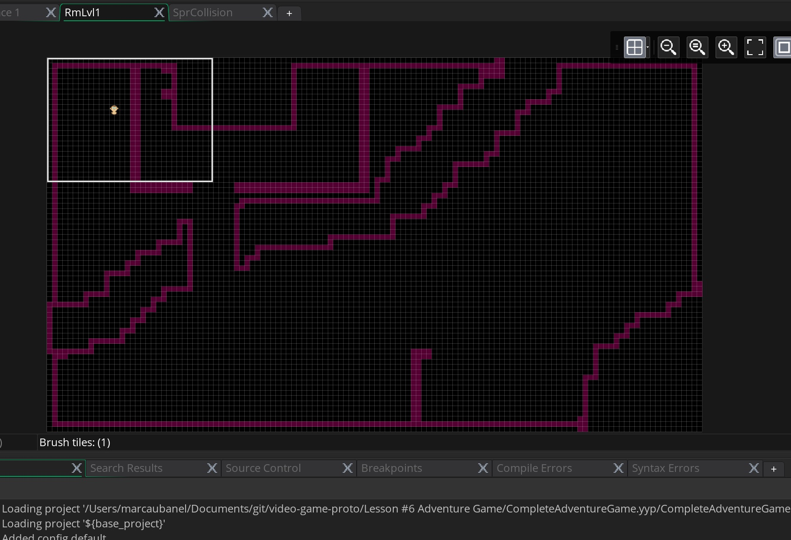  
</div>
</div>

___ 
<div class = "row">
<div class="col-12 col-lg-4 align-self-center">
<div markdown = "1"> 

{:start="{{ num }}"}
{{ num }}. Now double click on `ObjPlayer` and edit the **Create Event** and add get a reference to the **id** of the `Collision` layer we created in the room:
</div>
</div>
<div class="col-12 col-lg-8">
<div markdown = "1"> 
```c
//get id of collision layer in room
layerId = layer_get_id("Collision");
```
</div>
</div>
</div>
<div class = "row">
<div class="col-12">
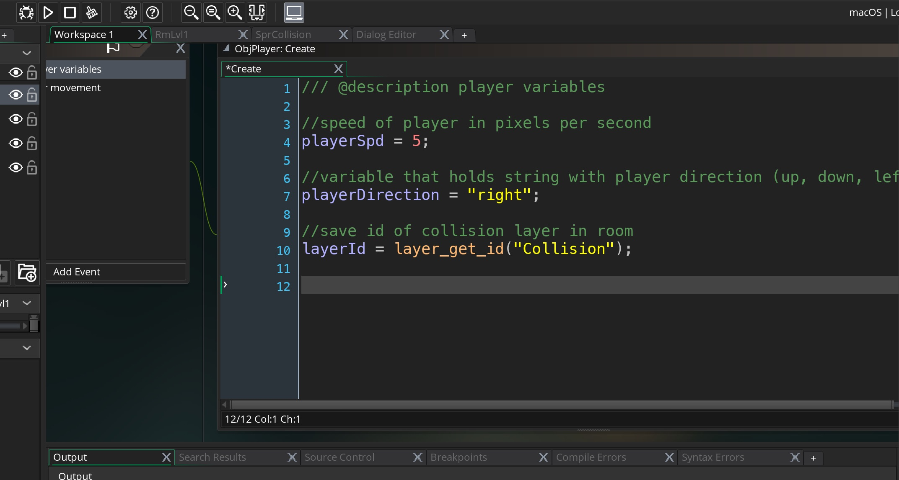  
</div>
</div>

___ 
<div class = "row">
<div class="col-12 col-lg-4 align-self-center">
<div markdown = "1"> 

{:start="{{ num }}"}
{{ num }}. Now with that ID, lets get the reference to the tilemap that is used on that layer:
</div>
</div>
<div class="col-12 col-lg-8">
<div markdown = "1"> 
```c
//Get tilemap for collision layer
tilemap = layer_tilemap_get_id(layerId);
```
</div>
</div>
</div>
<div class = "row">
<div class="col-12">
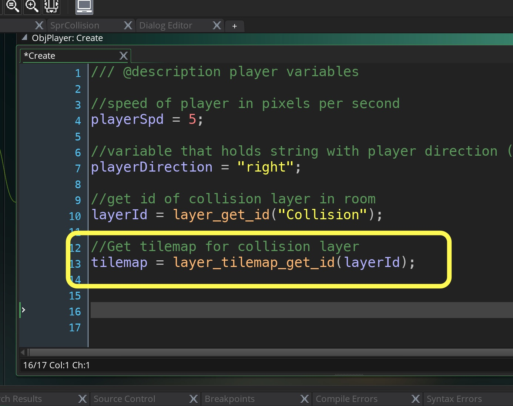  
</div>
</div>

___ 
<div class = "row">
<div class="col-12 col-lg-4 align-self-center">
<div markdown = "1"> 

{:start="{{ num }}"}
{{ num }}. We also need to check the four corners of the bounding box of the player collision.  To do this we need to know the offset of the origin relative to the four sides of the bounding box.  To check the left side of the player collision bounding box add to the `ObjPlayer` **Create Event**:
</div>
</div>
<div class="col-12 col-lg-8">
<div markdown = "1"> 
```c
//Get the boundbox information of the sprite relative to its origin
sprite_bbox_left = sprite_get_bbox_left(sprite_index) - sprite_get_xoffset(sprite_index);
```
</div>
</div>
</div>
<div class = "row">
<div class="col-12">
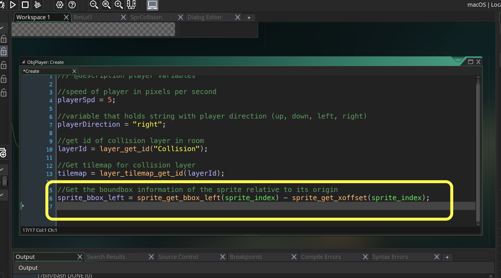  
</div>
</div>

___ 
<div class = "row">
<div class="col-12 col-lg-4 align-self-center">
<div markdown = "1"> 

{:start="{{ num }}"}
{{ num }}. Do the smae thing for the right, bottom and top side of the player sprite.
</div>
</div>
<div class="col-12 col-lg-8">
<div markdown = "1"> 
```c
sprite_bbox_right = sprite_get_bbox_right(sprite_index) - sprite_get_xoffset(sprite_index);
sprite_bbox_bottom = sprite_get_bbox_bottom(sprite_index) - sprite_get_yoffset(sprite_index);
sprite_bbox_top = sprite_get_bbox_top(sprite_index) - sprite_get_yoffset(sprite_index);
```
</div>
</div>
</div>
<div class = "row">
<div class="col-12">
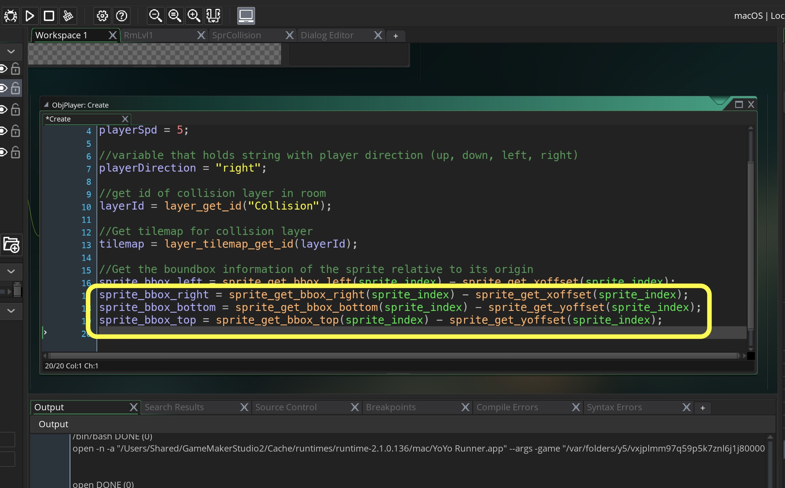  
</div>
</div>

___ 
<div class = "row">
<div class="col-12 col-lg-4 align-self-center">
<div markdown = "1"> 

{:start="{{ num }}"}
{{ num }}. Open `ObjPlayer` **Step Event** script and lets look at moving down first.  Inside the check for keyboard down add at the bottom.  This check will return a 1 if the player's bottom left or bottom right bounding box overlaps one of the collision tiles (it will return 0 if it doesn't):
</div>
</div>
<div class="col-12 col-lg-8">
<div markdown = "1"> 
```c
//gets location of pixel if collision layer is overlapping with player bottom
t1 = tilemap_get_at_pixel(tilemap,bbox_left, bbox_bottom) & tile_index_mask;
t2 = tilemap_get_at_pixel(tilemap,bbox_right, bbox_bottom) & tile_index_mask;
```
</div>
</div>
</div>
<div class = "row">
<div class = "col">
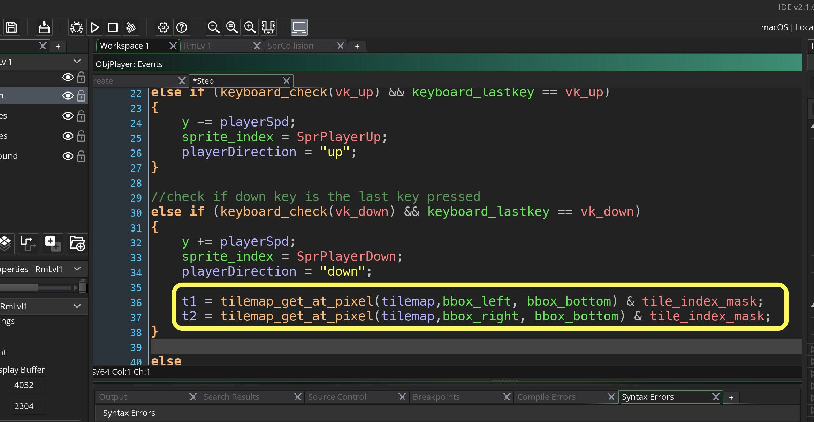  
</div>
</div>


___ 
<div class = "row">
<div class="col-12 col-lg-4 align-self-center">
<div markdown = "1"> 

{:start="{{ num }}"}
{{ num }}. Check to see if there is a colision on variable `t1` or variable `t2`.  If one of those returns true then you need to move the player back out of the bounding box.  This is done by subtracing from the bounding box to the closest 32 pixel boundary.  This is done by performing a binary `&` and binary not `~` on the bottom of the bbbox and compensating for the origin. 
</div>
</div>
<div class="col-12 col-lg-8">
<div markdown = "1"> 
```c
	//checks for collsiion 
	if (t1 != 0 || t2 != 0)
	{
		//blips player back to 32 pixel boundary above collision
		y = ((bbox_bottom & ~31)-1) - sprite_bbox_bottom;
	}
```
</div>
</div>
</div>
<div class = "row">
<div class = "col">
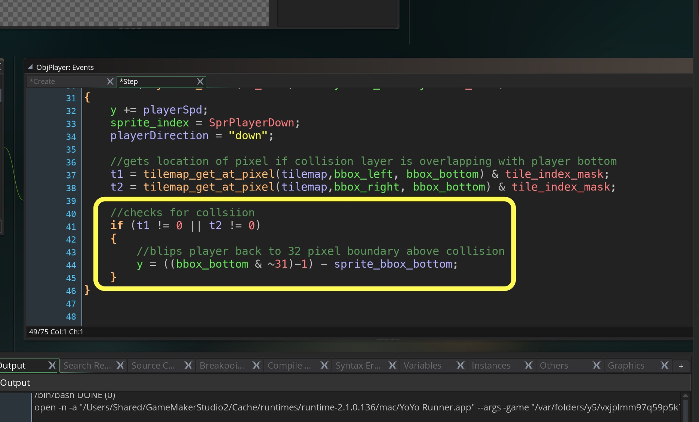  
</div>
</div>

___ 
<div class = "row">
<div class="col-12 col-lg-4 align-self-center">
<div markdown = "1"> 

{:start="{{ num }}"}
{{ num }}. Run the game and when you walk down onto one of your collision blocks you should basically just run on the spot like:
</div>
</div>
<div class="col-12 col-lg-8">
<div class="embed-responsive embed-responsive-16by9">
<iframe class="embed-responsive-item" src="https://www.youtube.com/embed/Mhtj625n0QY?autoplay=1&rel=0&controls=0&amp&showinfo=0&version=3&loop=1&playlist=Mhtj625n0QY" frameborder="0" allowfullscreen></iframe>
</div>
</div>
</div>

___ 
<br><br>

[Home](../../index.html)&nbsp;&nbsp;&nbsp; [Continue ->](AdventureGame_2.html)
<br />  
<br />  
<br />  

