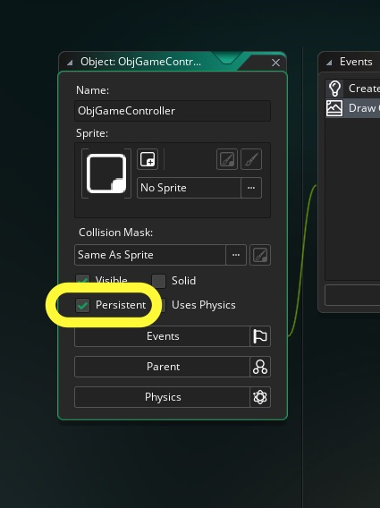
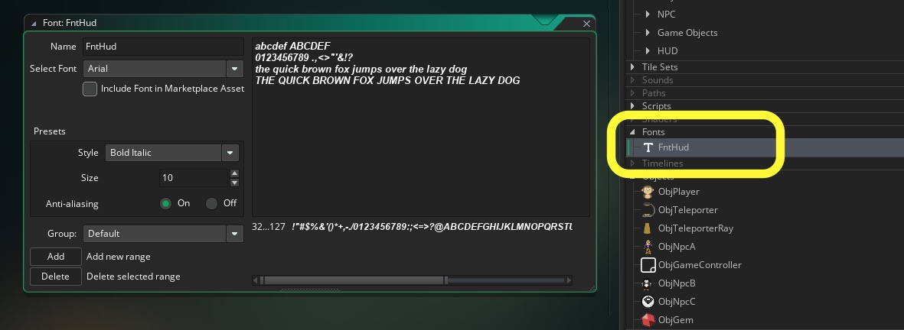
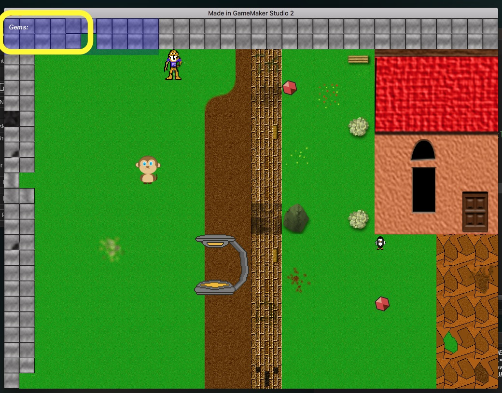
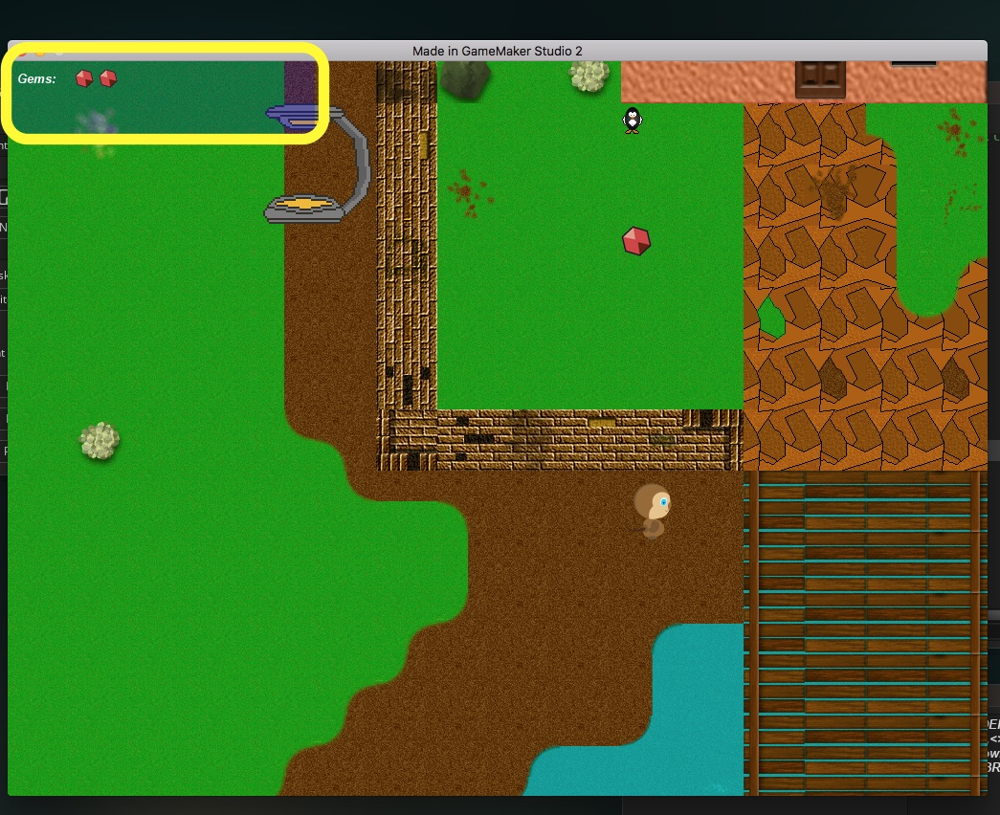

___ 
<div class = "row">
<div class="col-12 col-lg-4 align-self-center">
<div markdown = "1"> 

{:start="{{ num }}"}
{{ num }}. Now go between levels y entering the teleporter to see what happens.  Notice the HUD appears only in **_LvlOne_** and then disappears.  We need the controller to persist just like the player so it carries to all levels.  Open `ObjGameController` and click on the **persistent** radio button:
</div>
</div>
<div class="col-12 col-lg-8">

</div>
</div>

___ 
<div class = "row">
<div class="col-12 col-lg-4 align-self-center">
<div markdown = "1"> 

{:start="{{ num }}"}
{{ num }}. Now test the game again and voila, the HUD stays active on all rooms no matter how many times you go back and forth.  Now onto drawing the HUD again.  Lets make a Font for the HUD.  Create a new **Font** and pick one you like with a size of roughly 10pt and call it `FntHud`:
</div>
</div>
<div class="col-12 col-lg-8">

</div>
</div>

___ 
<div class = "row">
<div class="col-12 col-lg-4 align-self-center">
<div markdown = "1"> 

{:start="{{ num }}"}
{{ num }}. Lets draw the title "Gems:" to go on the HUD.  Open **DrawGUI Event** in `ObjGameController` and add to the end and run the game:  
</div>
</div>
<div class="col-12 col-lg-8">
<div markdown = "1"> 
```c
draw_set_font(FntHud);

draw_set_halign(fa_left);

//set the font color to white:
draw_set_color(c_white);

//draw HUD text
draw_text(10, 10, "Gems: ");
```
</div>
</div>
</div>
<div class = "row">
<div class="col-12">
 
</div>
</div>

___ 
<div class = "row">
<div class="col-12 col-lg-4 align-self-center">
<div markdown = "1"> 

{:start="{{ num }}"}
{{ num }}.  Test the game, and you should see the text.  Adjust the text size and/or position to your liking.  Now lets add the actual icon of the gem that we want to show on the screen how many you have collected.  Add to the end of the **Draw GUI** event on `ObjGameController`:
</div>
</div>
<div class="col-12 col-lg-8">
<div markdown = "1"> 
```c
//draw gems collected
i = 70;
repeat (gemScore)
{
	draw_sprite(SprHudGem, 0, i, 8);
	i += 25;
}
```
</div>
</div>
</div>

___ 
<div class = "row">
<div class="col-12 col-lg-4 align-self-center">
<div markdown = "1"> 

{:start="{{ num }}"}
{{ num }}. Now try running the game and collect Gems.  Do you see gems adding up in the menu?  
</div>
</div>
<div class="col-12 col-lg-8">
 
</div>
</div> 

___ 
<div class = "row">
<div class="col-12">
<div markdown = "1"> 

{:start="{{ num }}"}
{{ num }}. Now test the game by going back between **_LvlOne_** and **_LvlTwo_**.  What is the problem? Before you move on, go back and forth and see what problem we are having?
</div>
</div>
</div>

___ 
<br><br>
[<- Previous](AdventureGame_9.html)&nbsp;&nbsp;&nbsp;[Home](../../index.html)&nbsp;&nbsp;&nbsp;[Continue ->](AdventureGame_11.html)
<br />  
<br />  
<br />  
<br /> 
<br />  
<br />  
<br /> 