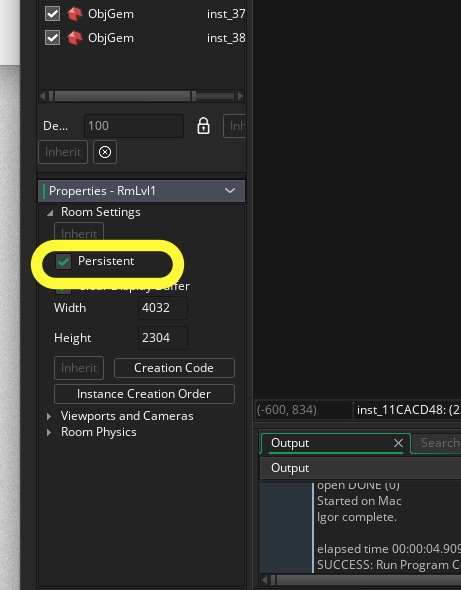
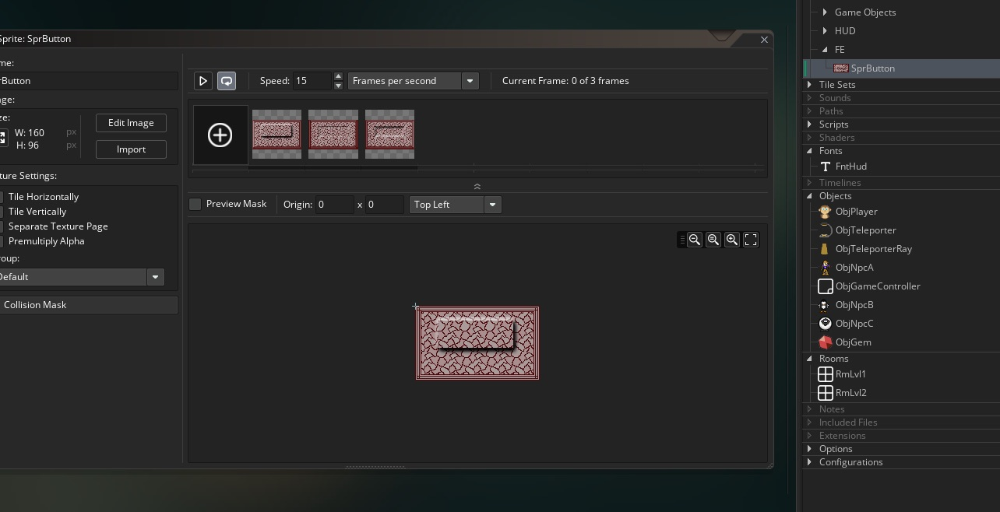
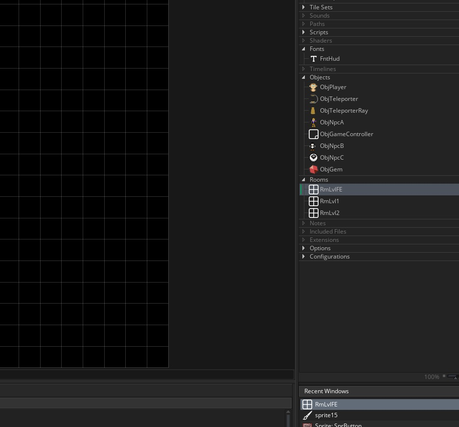
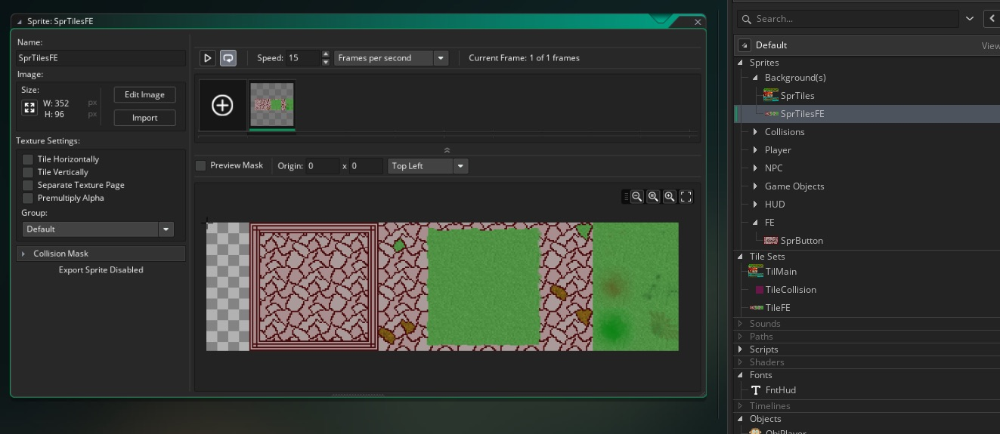
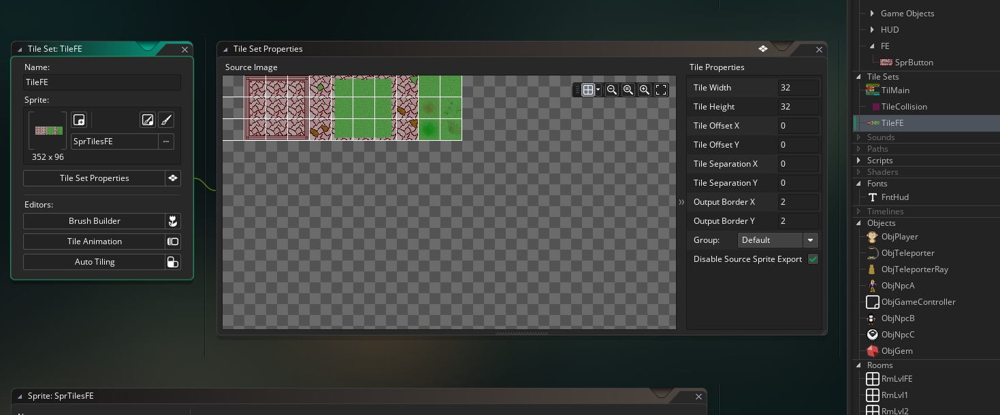
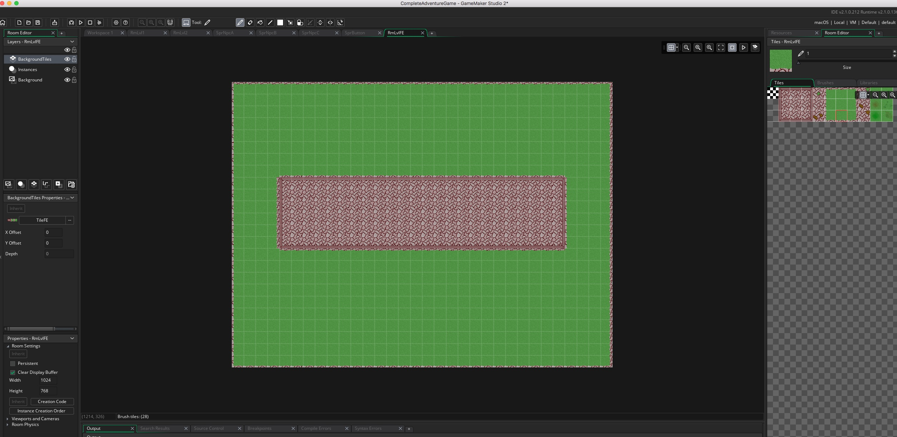
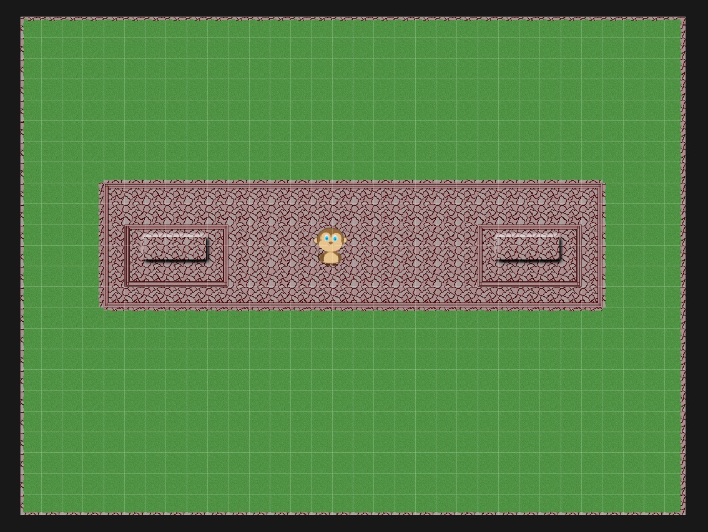
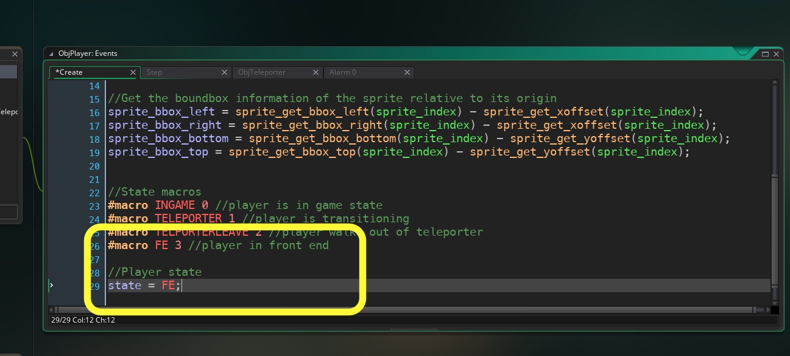
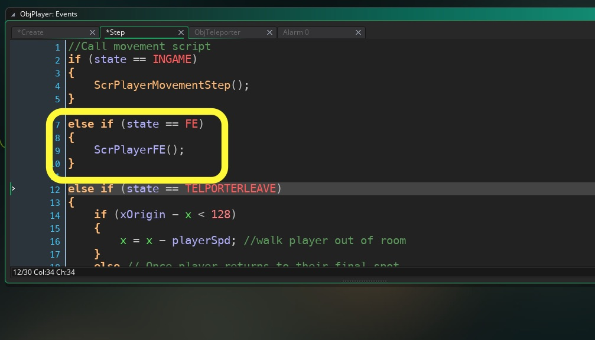

___ 
<div class = "row">
<div class="col-12 col-lg-4 align-self-center">
<div markdown = "1"> 

{:start="{{ num }}"}
{{ num }}. Each time you return to the room the gems reappear, their status is not saved. The rooms are set back to their original settings. What we need to do is make the rooms persistent.  Go to the game and make `RmLvl2` and `RmLvl2` and clic the radio button called **Persistent**.  Test the game and this should now remember the gems taken and not respawn them.  
</div>
</div>
<div class="col-12 col-lg-8">
 
</div>
</div>

___ 
## Front End

<div class = "row">
<div class="col-12 col-lg-4 align-self-center">
<div markdown = "1"> 

{:start="{{ num }}"}
{{ num }}. Lets create a nice start screen for our adventure game.  It will use the player as our UI selection device.  The player will just be able to move left and right over two buttons, one for Credits and one for Game.  The button you will import has 3 states Press, Hover and Selected.  Create a new **Sprite** and press the **Edit Image** button then select **Image => Import Strip Image** and select **FrontEndMenuButton.png** and set the **Number of Frames** to `3`, **Frame Width** to `160` and **Frame Height** to `96`.  Call the sprite `SprButton`.  I added this to a new group called **FE**:
</div>
</div>
<div class="col-12 col-lg-8">
 
</div>
</div>

___ 
<div class = "row">
<div class="col-12 col-lg-4 align-self-center">
<div markdown = "1"> 

{:start="{{ num }}"}
{{ num }}. Create a new **_room_** and call it **_roomFE_** and leave it at `1024` x `768` wide. Place it atg the top of your room list:  
</div>
</div>
<div class="col-12 col-lg-8">
 
</div>
</div>

___ 
<div class = "row">
<div class="col-12 col-lg-4 align-self-center">
<div markdown = "1"> 

{:start="{{ num }}"}
{{ num }}. Redownload the [assets](AdventureGameSpritesAudio.zip) for the adventure game as my last copy was mssing some art. Create a new **Sprite** and call it `SprTilesFE`.  Press the Import button and select the **BackAdvTiles.png** file.
</div>
</div>
<div class="col-12 col-lg-8">
 
</div>
</div>

___ 
<div class = "row">
<div class="col-12 col-lg-4 align-self-center">
<div markdown = "1"> 

{:start="{{ num }}"}
{{ num }}. Create a new Tileset called `TileFE`, assign the sprite `SprTilesFE` and change **Tile Width** and **Tile Height** to `32`:
</div>
</div>
<div class="col-12 col-lg-8">
 
</div>
</div> 

<div class = "row">
<div class="col-12 col-lg-4 align-self-center">
<div markdown = "1"> 

{:start="{{ num }}"}
{{ num }}. Now open `RmLvlFE` and add a new **Tile Layer** called `BackgroundTiles` and add a tiled section in the middle with `4` by `4` of grass on either side and `8` rows above and `10` below.  It should look like: 
</div>
</div>
<div class="col-12 col-lg-8">
 
</div>
</div> 

___ 
<div class = "row">
<div class="col-12 col-lg-4 align-self-center">
<div markdown = "1"> 

{:start="{{ num }}"}
{{ num }}. Now create a new **Game Object** called `ObjButton` and bind the **SprButton** to it.  Go to **RmLvlFE** and add an **_ObjButton_** to each side of the center tiles like so:  
</div>
</div>
<div class="col-12 col-lg-8">
 
</div>
</div>

___ 
<div class = "row">
<div class="col-12 col-lg-4 align-self-center">
<div markdown = "1"> 

{:start="{{ num }}"}
{{ num }}. Now we could create a unique player object for the Front End or we could reuse the game one and add an FE state.  Lets do the latter.  Add `ObjPlayer` to the very center of the FE screen:  
</div>
</div>
<div class="col-12 col-lg-8">
 
</div>
</div>

___ 
<div class = "row">
<div class="col-12 col-lg-4 align-self-center">
<div markdown = "1"> 

{:start="{{ num }}"}
{{ num }}. Open **Create Event** script for `ObjPlayer` and a new **FE** state macro as well as change the default start state to `FE`:  
</div>
</div>
<div class="col-12 col-lg-8">
<div markdown = "1"> 
```c
#macro FE 3 //player in front end

//Player state
state = FE;
```
</div>
</div>
</div>
<div class = "row">
<div class="col-12">
 
</div>
</div>

___ 
<div class = "row">
<div class="col-12 col-lg-4 align-self-center">
<div markdown = "1"> 

{:start="{{ num }}"}
{{ num }}. Open up **Step Event** in `ObjPlayer` and add tan `else if` after `(state == INGAME)`:  
</div>
</div>
<div class="col-12 col-lg-8">
<div markdown = "1"> 
```c
 else if (state == FE)
{
	ScrPlayerFE();
}
```
</div>
</div>
</div>
<div class = "row">
<div class="col-12">
 
</div>
</div>
 
___ 
<div class = "row">
<div class="col-12 col-lg-4 align-self-center">
<div markdown = "1"> 

{:start="{{ num }}"}
{{ num }}. Add a new script tab called `ScrPlayerFE` and add:  
</div>
</div>
<div class="col-12 col-lg-8">
<div markdown = "1"> 
```c
if (keyboard_check(vk_right) && keyboard_lastkey == vk_right )
{
	x += playerSpd;
	sprite_index = SprPlayerLeftRight;
	image_xscale = 1;
}

else if (keyboard_check(vk_left) && keyboard_lastkey == vk_left )
{
	x -= playerSpd;
	sprite_index = SprPlayerLeftRight;
	image_xscale = -1;
}

else
{
	 sprite_index = SprPlayerLeftRightIdle;
}
```
</div>
</div>
</div>

___ 
<div class = "row">
<div class="col-12 col-lg-4 align-self-center">
<div markdown = "1"> 

{:start="{{ num }}"}
{{ num }}. Make **RmLvlFE** the first room in your list and run the front end.  It should look like:
</div>
</div>
<div class="col-12 col-lg-8">
<div class="embed-responsive embed-responsive-16by9">
<iframe class="embed-responsive-item" src="https://www.youtube.com/embed/3GbvxyRgJzQ?autoplay=1&rel=0&controls=0&amp&showinfo=0&version=3&loop=1&playlist=3GbvxyRgJzQ" frameborder="0" allowfullscreen></iframe>
</div>
</div>
</div>

___ 
<div class = "row">
<div class="col-12">
<div markdown = "1"> 

{:start="{{ num }}"}
{{ num }}.  Go to next page for next part of the Front End.
</div>
</div>
</div>
___ 
<br><br>
[<- Previous](AdventureGame_10.html)&nbsp;&nbsp;&nbsp;[Home](../../index.html)&nbsp;&nbsp;&nbsp;[Continue ->](AdventureGame_12.html)
<br />  
<br />  
<br />  
<br /> 
<br />  
<br />  
