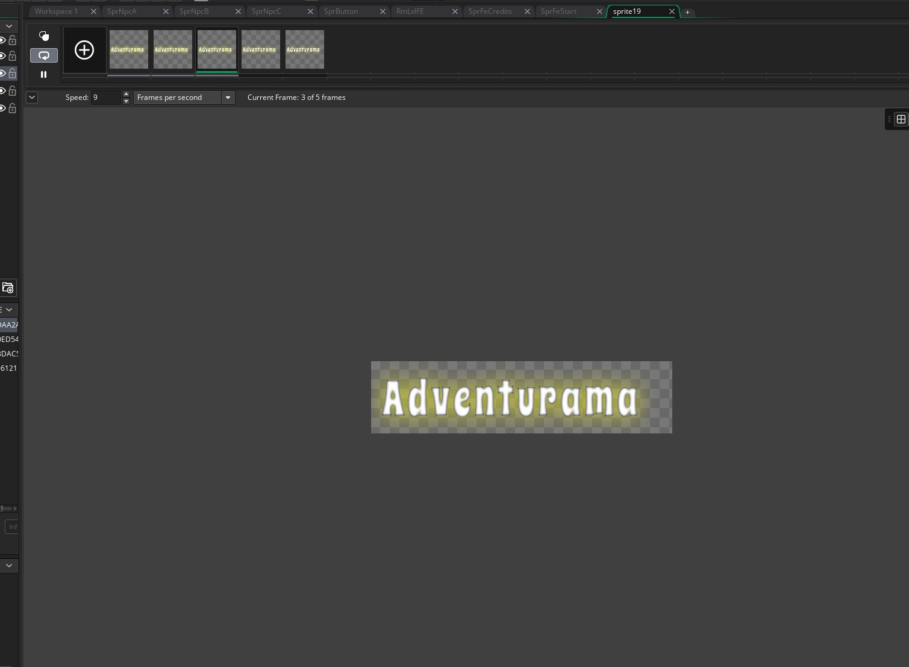

___ 
<div class = "row">
<div class="col-12">
<div markdown = "1"> 

{:start="{{ num }}"}
{{ num }}. Run the game and look at what happens.  Three problems I spot immediately
    1. The buttons are flashing and animating
    2. The player can run off the left hand and right hand side of the screen
</div>
</div>
</div>

___ 
<div class = "row">
<div class="col-12 col-lg-4 align-self-center">
<div markdown = "1"> 

{:start="{{ num }}"}
{{ num }}. Now lts fix the flashing buttons.  Create a new **Create Event** on `ObjButton` and add:  
</div>
</div>
<div class="col-12 col-lg-8">
<div markdown = "1"> 
```c
/// @description Button setup
image_speed = 0;
```
</div>
</div>
</div>

___ 
<div class = "row">
<div class="col-12 col-lg-4 align-self-center">
<div markdown = "1"> 

{:start="{{ num }}"}
{{ num }}. Run the game and test it.  Now there are `9` squares to the left and right of the player.  Since our grid is a 32 x 32 grid each square is 32 pixels wide.  So to calculate in pixels what 5 squares of movement is we would go 9 x 32 = 288 pixels.  So we want to restrict movement to 288 pixels to the left and right of his original position.  
</div>
</div>
<div class="col-12 col-lg-8">
  
</div>
</div>

___ 
<div class = "row">
<div class="col-12 col-lg-4 align-self-center">
<div markdown = "1"> 

{:start="{{ num }}"}
{{ num }}. So we will create a new variable in `ObjPlayer` **Create Event** and add to  it ```feBuffer = 288;```:  
</div>
</div>
<div class="col-12 col-lg-8">
  
</div>
</div>

___ 
<div class = "row">
<div class="col-12">
<div markdown = "1"> 

{:start="{{ num }}"}
{{ num }}. Now we want it to be 288 pixels to the left and right of the player's starting position.  Now we could store that but there is a GameMaker variable called `xstart` that stores the `x` position that the **Game Object** is in the room at game start. 

> **xstart**<br><br>**Holds**: Real<br><br>**Description**: This function stores the initial ```x``` position of the instance when it is first created in the room. You can also set this in code to the value that you wish. - GamemakerManual

___ 
<div class = "row">
<div class="col-12 col-lg-4 align-self-center">
<div markdown = "1"> 

{:start="{{ num }}"}
{{ num }}. Reopen `ScrPlayerFE` and add to the if conditions limiting the `x` on the left and right side of `xstart`:  
</div>
</div>
<div class="col-12 col-lg-8">
<div markdown = "1"> 
```c
if (keyboard_check(vk_right) && keyboard_lastkey == vk_right && x < (xstart + feBuffer) )
{
x += playerSpeed;
sprite_index = SprPlayerRight;
}

else if (keyboard_check(vk_left) && keyboard_lastkey == vk_left && x > (xstart - feBuffer) )
{
x -= playerSpeed;
sprite_index = SprPlayerLeft;
}
```
</div>
</div>
</div>

___ 
<div class = "row">
<div class="col-12 col-lg-4 align-self-center">
<div markdown = "1"> 

{:start="{{ num }}"}
{{ num }}. Now test it and the player should be restricted, the buttons no longer flash and the player is in front of both buttons.  Ok, now it is time to import the font for the two buttons, they also have 3 states, a Press, Hover and Selected.  These are seperate files and not on a sprite sheet, so we have to add each frame at a time.  Create a new **_sprite_** and call it `SprFeCredits` and press the **Import** and select **CreditsWhiteUp.png**.
</div>
</div>
<div class="col-12 col-lg-8">
  
</div>
</div>

___ 
<div class = "row">
<div class="col-12 col-lg-4 align-self-center">
<div markdown = "1"> 

{:start="{{ num }}"}
{{ num }}. Now you press **Edit Image** and select **Image => Import Images(s)**and pick **CreditsYellowMiddle.png**.  
</div>
</div>
<div class="col-12 col-lg-8">
  
</div>
</div>

___ 
<div class = "row">
<div class="col-12 col-lg-4 align-self-center">
<div markdown = "1"> 

{:start="{{ num }}"}
{{ num }}. Repeat and select **Image => Import Images(s)**and pick **CreditsYellowDown.png**.  
</div>
</div>
<div class="col-12 col-lg-8">
  
</div>
</div>

___ 
<div class = "row">
<div class="col-12 col-lg-4 align-self-center">
<div markdown = "1"> 

{:start="{{ num }}"}
{{ num }}. Now you should have a **_SprFeCredits_** sprite with the three states:  
</div>
</div>
<div class="col-12 col-lg-8">
  
</div>
</div>

___ 
<div class = "row">
<div class="col-12 col-lg-4 align-self-center">
<div markdown = "1">

{:start="{{ num }}"}
{{ num }}. Repeat the same thing by creating a new sprite called `SprFeStart` and import the 
**StartWhiteUp.png, StartYellowMiddle.png, StartYellowDown.png** and you should have a sprite with three start states:  
</div>
</div>
<div class="col-12 col-lg-8">
  
</div>
</div>

___ 
<div class = "row">
<div class="col-12 col-lg-4 align-self-center">
<div markdown = "1">

{:start="{{ num }}"}
{{ num }}. Now create two new **Game Objects** and call them `ObjFeStart` and `ObjFeCredits` and bind the correct font to it so they shoud look like:  
</div>
</div>
<div class="col-12 col-lg-8">
 
</div>
</div>

___ 
<div class = "row">
<div class="col-12 col-lg-4 align-self-center">
<div markdown = "1">

{:start="{{ num }}"}
{{ num }}. Now open **_RoomFE_** and add the **_ObjFeStart_** to the button on the right and **_ObjFeCredits_** to the button on the left.  The room should look like:  
</div>
</div>
<div class="col-12 col-lg-8">
  
</div>
</div>

___ 
<div class = "row">
<div class="col-12 col-lg-4 align-self-center">
<div markdown = "1">

{:start="{{ num }}"}
{{ num }}. Now since the buttons and font share the same states, we will create separate scripts and execute them from their events. Create a new script called `ScrButtonStep` and call it from the **Step Event** from both buttons in `ObjFeStart` and `ObjFeCredits`:  
</div>
</div>
<div class="col-12 col-lg-8">
 
</div>
</div>


___ 
<div class = "row">
<div class="col-12">
<div markdown = "1">

{:start="{{ num }}"}
{{ num }}. We will be creating a little system to keep track of the state of the button.
    1. If the player is on top of the buttonswitch to hover image_index = 1 (second frame).
    2. Else if the player is not on top of the button and not pressed the button then move to no hover image_index = 0 (first frame).
    3.  Trigger the appropriate start or credit font change to match based on which button is pressed.
</div>
</div>
</div>

___ 
<div class = "row">
<div class="col-12 col-lg-4 align-self-center">
<div markdown = "1">

{:start="{{ num }}"}
{{ num }}. Open `ScrButtonStep` and add:
</div>
</div>
<div class="col-12 col-lg-8">
<div markdown = "1">
```c
if (image_index != 2 && place_meeting (x, y, ObjPlayer))
{
    image_index = 1;
    
}

else if (image_index != 2 && !place_meeting (x, y, ObjPlayer))
{
    image_index = 0;
}
```
</div>
</div>
</div>

___ 
<div class = "row">
<div class="col-12 col-lg-4 align-self-center">
<div markdown = "1">

{:start="{{ num }}"}
{{ num }}. Run the game and the font changes, but the button doesn't.  Also the player is behind the font in my version.  Lets fix both these things.  First open `ObjButton` and create a new **Step Event** and call the same script:
</div>
</div>
<div class="col-12 col-lg-8">

</div>
</div>

___ 
<div class = "row">
<div class="col-12 col-lg-4 align-self-center">
<div markdown = "1">

{:start="{{ num }}"}
{{ num }}. Now open `RmLvlFE` and delete the player from the **Instances** layer.  Create a new **Instance Layer** on top of it and add just the player back into it.  Your room should look like:
</div>
</div>
<div class="col-12 col-lg-8">

</div>
</div>

___ 
<div class = "row">
<div class="col-12 col-lg-4 align-self-center">
<div markdown = "1">

{:start="{{ num }}"}
{{ num }}. Play the game.  That is better but the font isn't even and the collision boxes don't line up.  I go into `SprCredits` and adjust the `x` value in its origin to `15` and adjust the same value in `SprStart` to `-15`
</div>
</div>
<div class="col-12 col-lg-8">

</div>
</div>

___ 
<div class = "row">
<div class="col-12 col-lg-4 align-self-center">
<div markdown = "1">

{:start="{{ num }}"}
{{ num }}. Now lets add a nice title for our game before we implement activating the buttons. Create a new **Sprite** call it `SprTitle`.  Press the **Edit Image** button and select **Image => Import Strip Image**. Select **_AdventuramaTitle.png_**. Set **Number of Frames** to `5`.  Set **Image Width** to `500`. Set **Image Height to `120`.  Hit play and set a speed that works for you. 
</div>
</div>
<div class="col-12 col-lg-8">

</div>
</div>

___ 
<div class = "row">
<div class="col-12 col-lg-4 align-self-center">
<div markdown = "1">

{:start="{{ num }}"}
{{ num }}. Now create a new **Game Object_** and call it `ObjTitle` and bind the **SprTitle** sprite to it.  Open room `RmLvlFE` and add the **_ObjTitle_** on top of the menu as so:    
</div>
</div>
<div class="col-12 col-lg-8">

</div>
</div>

___ 
<br><br>
[<- Previous](AdventureGame_11.html)&nbsp;&nbsp;&nbsp;[Home](../../index.html)&nbsp;&nbsp;&nbsp;[Continue ->](AdventureGame_13.html)
<br />  
<br />  
<br />  
<br /> 
<br />  
<br />   