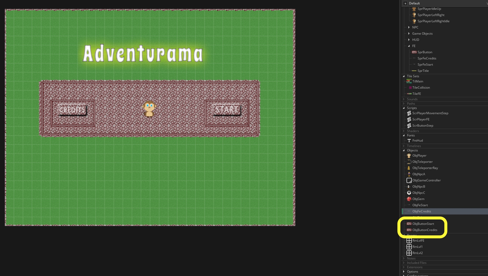
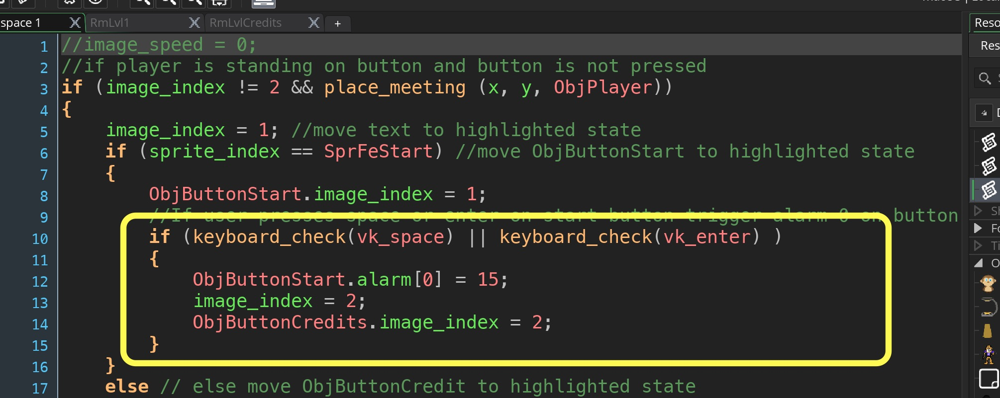
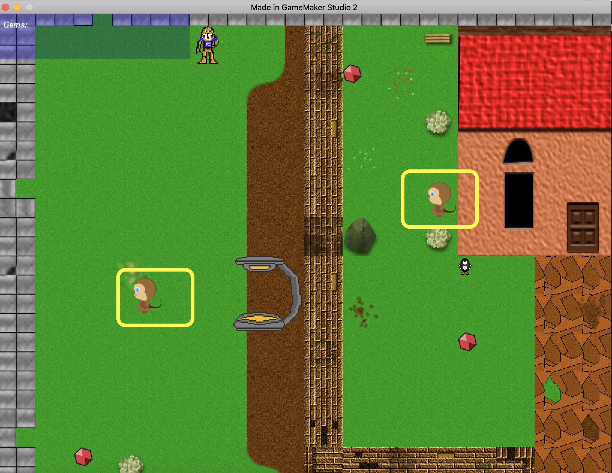
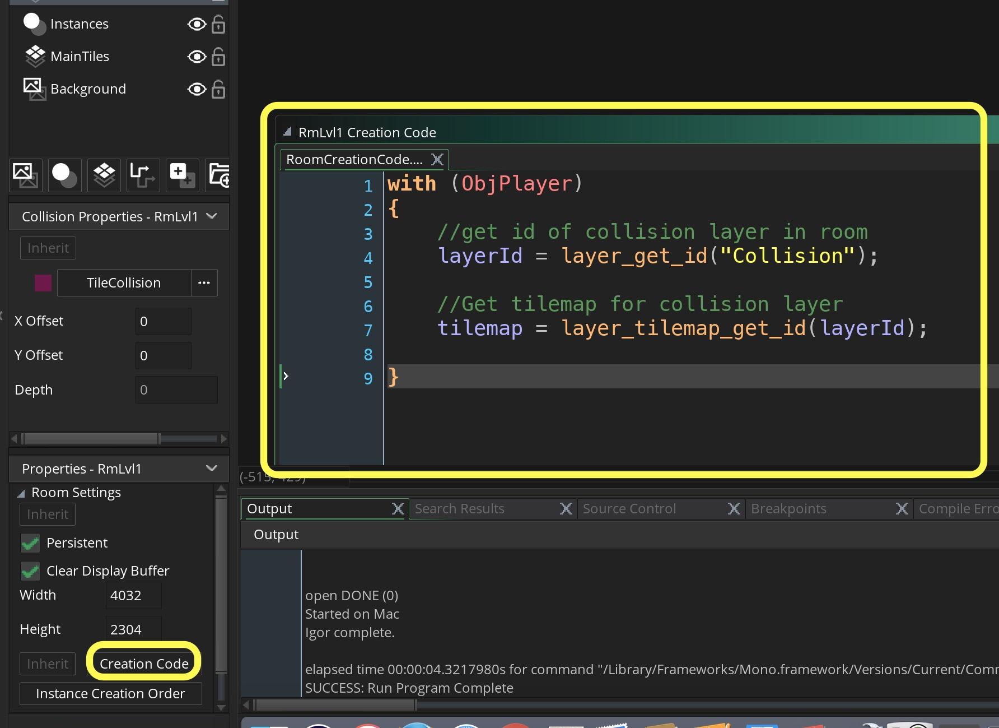
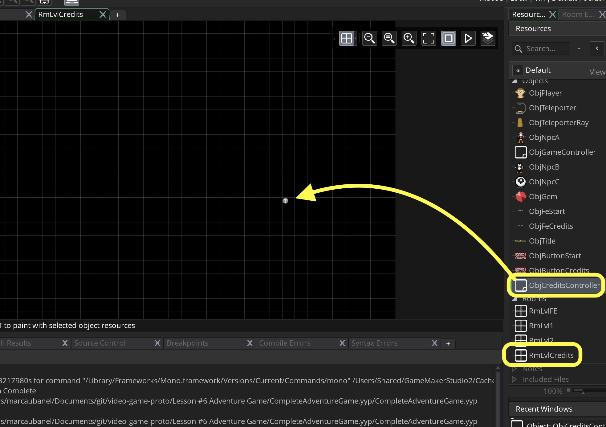
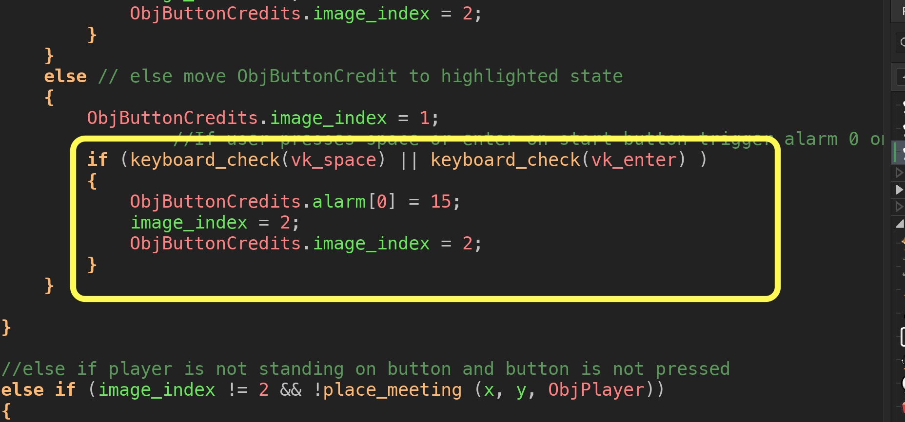
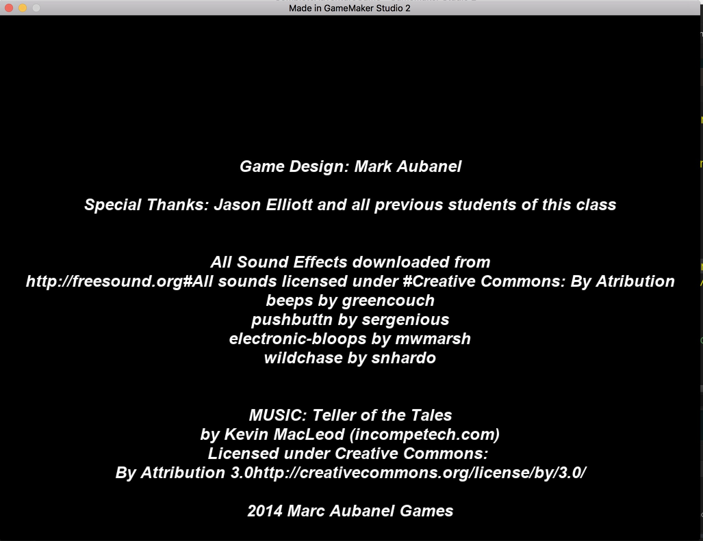
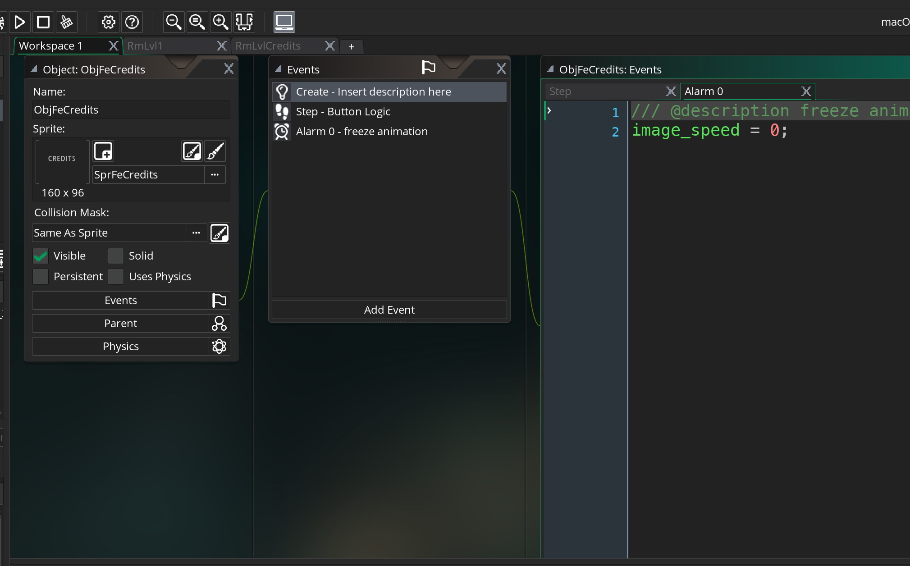

___ 
<div class = "row">
<div class="col-12 col-lg-4 align-self-center">
<div markdown = "1">

{:start="{{ num }}"}
{{ num }}. Lets add starting the game.  So we are going to look for the Start button being pressed while the player is over the Start Button then trigger an alarm to go to the next game screen.  Also, we are going to change the script a bit.  We want to have two objects an `ObjButtonStart` and an `ObjButtonCredits`.  Duplicate your **ObjButton** and change the names.  Remove the **Step Event** entirely.  Replace them in your `RmLvlFE`:
</div>
</div>
<div class="col-12 col-lg-8">

</div>
</div>

___ 
<div class = "row">
<div class="col-12 col-lg-4 align-self-center">
<div markdown = "1">

{:start="{{ num }}"}
{{ num }}. Now we will switch how we press the object buttons.  We will drive them from the script used on the ObjFeStart and ObjFeCredits button.  Open `ScrButtonStep` and change it to:
</div>
</div>
<div class="col-12 col-lg-8">
<div markdown = "1">
```c
//if player is standing on button and button is not pressed
if (image_index != 2 && place_meeting (x, y, ObjPlayer))
{
    image_index = 1; //move text to highlighted state
    if (sprite_index == SprFeStart) //move ObjButtonStart to highlighted state
    {
        ObjButtonStart.image_index = 1;
    }
    else // else move ObjButtonCredit to highlighted state
    {
        ObjButtonCredits.image_index = 1;
    }
    
}

//else if player is not standing on button and button is not pressed
else if (image_index != 2 && !place_meeting (x, y, ObjPlayer))
{
    image_index = 0;
    if (sprite_index == SprFeStart) //Move start back to non highlighted
    {
        ObjButtonStart.image_index = 0;
    }
    else //Move credit button back to non highlithed
    {
        ObjButtonCredits.image_index = 0;
    }
}
```
</div>
</div>
</div>

___ 
<div class = "row">
<div class="col-12 col-lg-4 align-self-center">
<div markdown = "1">

{:start="{{ num }}"}
{{ num }}. Run the game and test it.  It should behave the same way as it did before but we are ready to handle the transitions.  Lets start by triggering an alarm and starting the game if a player presses the **space** or **enter** button while on top of **Start**.  Open `ScrButtonStep` and add after you set the ObjButtonStart.image_index to 1:
</div>
</div>
<div class="col-12 col-lg-8">
<div markdown = "1">
```c
//If user presses space or enter on start button trigger alarm 0 on button objecxt
if (keyboard_check(vk_space) || keyboard_check(vk_enter) )
{
    ObjButtonStart.alarm[0] = 15;
    image_index = 2;
    ObjButtonStart.image_index = 2;
}
```
</div>
</div>
</div>
<div class = "row">
<div class="col-12">
 
</div>
</div>

___ 
<div class = "row">
<div class="col-12 col-lg-4 align-self-center">
<div markdown = "1">

{:start="{{ num }}"}
{{ num }}. Open `ObjButtonStart` and add an **Alarm0** event type with:
</div>
</div>
<div class="col-12 col-lg-8">
<div markdown = "1">
```c
/// @description Start game 
room_goto(RmLvl1);
```
</div>
</div>
</div>

___ 
<div class = "row">
<div class="col-12 col-lg-4 align-self-center">
<div markdown = "1">

{:start="{{ num }}"}
{{ num }}. Run the game and test it.  What do you notice.  You have to players in the first level and they are stuck in the FE state.  
</div>
</div>
<div class="col-12 col-lg-8">

</div>
</div>


___ 
<div class = "row">
<div class="col-12 col-lg-4 align-self-center">
<div markdown = "1">

{:start="{{ num }}"}
{{ num }}. Lets fix that by destroying **removing** the player from the game and adding to the bottom of **Alarm0** state on `ObjButtonStart` back to **INGAME** and put them in the right starting `x` and `y` coordinate in that room (you can see it before you delete it in  `RmLvl1`:
</div>
</div>
<div class="col-12 col-lg-8">
<div markdown = "1">
```c
with (ObjPlayer)
{
    //change player to ingame state:
    state = INGAME;
    //place in starting point in room
    x = 252;
    y = 512;
}
```
</div>
</div>
</div>

___ 
<div class = "row">
<div class="col-12 col-lg-4 align-self-center">
<div markdown = "1">

{:start="{{ num }}"}
{{ num }}. Now run and test the game.  Ok, in my copy there is one player and you can move in all 4 directions but the collisions are all messed up.  Oh right, we need to make sure that when they move to `RmLvl1` that they refer to the right collision layers.  We can't put this in the alarm as we are not in room level 1 yet.  What can we do?  Gamemaker adds an event type in each room that runs on creation.  Press the **Creation Code** button in `RmLvl1` and add:
</div>
</div>
<div class="col-12 col-lg-8">
<div markdown = "1">
```c
with (ObjPlayer)
{
    //get id of collision layer in room
    layerId = layer_get_id("Collision");

    //Get tilemap for collision layer
    tilemap = layer_tilemap_get_id(layerId);    
}
```
</div>
</div>
</div>
<div class = "row">
<div class="col-12">
 
</div>
</div>

___ 
<div class = "row">
<div class="col-12 col-lg-4 align-self-center">
<div markdown = "1">

{:start="{{ num }}"}
{{ num }}. Much better.  Lets get the credits working. Create a new room and call it `RmLvlCredits`. Create a new **Game Object** and leave it blank calling it `ObjCreditsController`.  Place in room creating a question mark:  
</div>
</div>
<div class="col-12 col-lg-8">
  
</div>
</div>

___ 
<div class = "row">
<div class="col-12 col-lg-4 align-self-center">
<div markdown = "1">

{:start="{{ num }}"}
{{ num }}. Lets trigger the change to the credits room.  Open `ScrButtonStep` and change the `else` condition to:
</div>
</div>
<div class="col-12 col-lg-8">
<div markdown = "1">
```c
    if (keyboard_check(vk_space) || keyboard_check(vk_enter) )
        {
            ObjButtonCredits.alarm[0] = 15;
            image_index = 2;
            ObjButtonCredits.image_index = 2;
        }
```
</div>
</div>
</div>
<div class = "row">
<div class="col-12">
 
</div>
</div>

___ 
<div class = "row">
<div class="col-12 col-lg-4 align-self-center">
<div markdown = "1">

{:start="{{ num }}"}
{{ num }}. Now we need to go to the **Credits Room** and make the player transparent so that you can't see it.  Open `ObjButtonCredits` and create an **Alarm0** event type with:
</div>
</div>
<div class="col-12 col-lg-8">
<div markdown = "1">
```c
/// @description Player goes to credits
room_goto(RmLvlCredits);

with (ObjPlayer)
{
    image_alpha = 0;
}
```
</div>
</div>
</div>

___ 
<div class = "row">
<div class="col-12 col-lg-4 align-self-center">
<div markdown = "1">

{:start="{{ num }}"}
{{ num }}. Test the game, you should to to a blank credits screen.  To create credits we will include a string variable called **credits** that will hold all of the credits.  In GameMaker the character \n (newline) has a special meaning and stands for carriage return or new line.  We will set the object off the bottom of the screen and centered horizontally.  We will have it scroll upwards and when it leaves the screen go back to the front menu.  Create a new **Create Event** script on `ObjCreditsController` and add:
</div>
</div>
<div class="col-12 col-lg-8">
<div markdown = "1">
```c
credits = "Game Design: Mark Aubanel\n";
credits += "\nSpecial Thanks: Jason Elliott and all previous students of this class\n";
credits += "\n\nAll Sound Effects downloaded from\n";
credits += "http://freesound.org#";
credits += "All sounds licensed under #Creative Commons: By Atribution\n";
credits += "beeps by greencouch\n";
credits += "pushbuttn by sergenious\n";
credits += "electronic-bloops by mwmarsh\n";
credits += "wildchase by snhardo\n";
credits += "\n\nMUSIC: Teller of the Tales\n";
credits += "by Kevin MacLeod (incompetech.com)\n";
credits += "Licensed under Creative Commons: \nBy Attribution 3.0";
credits += "http://creativecommons.org/license/by/3.0/\n";
credits += "\n2014 Marc Aubanel Games";

//set the start of the scroll off the bottom of the screen
y = room_height;

//set the text in the center of the level
x = room_width/2

//scroll up at 5 pixels per second
vspeed = -3;
``` 
</div>
</div>
</div>

___ 
<div class = "row">
<div class="col-12">
<div markdown = "1">

{:start="{{ num }}"}
{{ num }}. To test the credit roll walk on the credit button and press return or enter.  What happens?  Oh yeah, nothing we are not drawing the **_credits_** variable yet.  
</div>
</div>
</div>

___ 
<div class = "row">
<div class="col-12 col-lg-4 align-self-center">
<div markdown = "1">

{:start="{{ num }}"}
{{ num }}. Lets create a new **Font** and pick a size that you think might work best as well as a font and call it 'FntCredits'.  Now we don't need to use the **DrawGUI** event type as this is not an overlay.  We can just use the regular **Draw** event type.  Open `ObjCreditsController` and add a **Draw => Draw Event** script with:
</div>
</div>
<div class="col-12 col-lg-8">
<div markdown = "1">
```c
/// @description Draw Credits
//changes font color to white
draw_set_color(c_white);

//centers the text
draw_set_halign(fa_center);


//selects the font
draw_set_font(FntCredits);

//draws text to screen
draw_text(x, y, credits);
```
</div>
</div>
</div>

___ 
<div class = "row">
<div class="col-12 col-lg-4 align-self-center">
<div markdown = "1">

{:start="{{ num }}"}
{{ num }}. Run the game.  Adjust the font size and type until it fits and you like it.  It should look something like:
</div>
</div>
<div class="col-12 col-lg-8">

</div>
</div>

___ 
<div class = "row">
<div class="col-12 col-lg-4 align-self-center">
<div markdown = "1">

{:start="{{ num }}"}
{{ num }}. But, how do you get back?  I think we should use the enter/spacebar or escape key to get back and automatically get back when the credit scroll ends.  Also we have a player that appears on the credits screen.  First with getting back to the front end, set the alpha back to 100% and return the player to its starting position.  Open`ObjCreditsController` and add a **Step => Step Event** script with:
</div>
</div>
<div class="col-12 col-lg-8">
<div markdown = "1">
```c
/// @description exiting credit screen
if (y < -600 || keyboard_check(vk_escape) || keyboard_check(vk_space) || keyboard_check(vk_enter) ) //this depends on the font and length of credits
{
    room_goto(RmLvlFE);
    keyboard_key_release(vk_escape);
    with (ObjPlayer)
    {
        image_alpha = 1;
        x = xstart;
        y = ystart;
    }
}
```
</div>
</div>
</div>

___ 
<div class = "row">
<div class="col-12 col-lg-4 align-self-center">
<div markdown = "1">

{:start="{{ num }}"}
{{ num }}. Now what about getting back from the game to the Front End.  Lets add a check for the escape key by creating a new **Step Event** in `ObjGameController` and add:
</div>
</div>
<div class="col-12 col-lg-8">
<div markdown = "1">
```c
/// @description quit game
if (keyboard_check(vk_escape))
{
    game_restart(); 
}
```
</div>
</div>
</div>

___ 
<div class = "row">
<div class="col-12 col-lg-4 align-self-center">
<div markdown = "1">

{:start="{{ num }}"}
{{ num }}. There is a bug in my algorithm.  I am expecting the buttons to stay in their current frame but they are still set to animate.  We need to set the `image_speed` to `0` in both the `ObjFeCredits` and `ObjTitle`.  Make a new **Create Event** for both those objects and add this script:
</div>
</div>
<div class="col-12 col-lg-8">
<div markdown = "1">
```c
/// @description freeze animation
image_speed = 0;
```
</div>
</div>
</div>
<div class = "row">
<div class="col-12">
 
</div>
</div>

<div class = "row">
<div class="col-12 col-lg-4 align-self-center">
<div markdown = "1">

{:start="{{ num }}"}
{{ num }}. Go to the next page to start Enemy Pathdinding.


___ 
<br><br>
[<- Previous](AdventureGame_12.html)&nbsp;&nbsp;&nbsp;[Home](../../index.html)&nbsp;&nbsp;&nbsp;[Continue ->](AdventureGame_14.html)
<br />  
<br />  
<br />  
<br /> 
<br />  
<br />   
