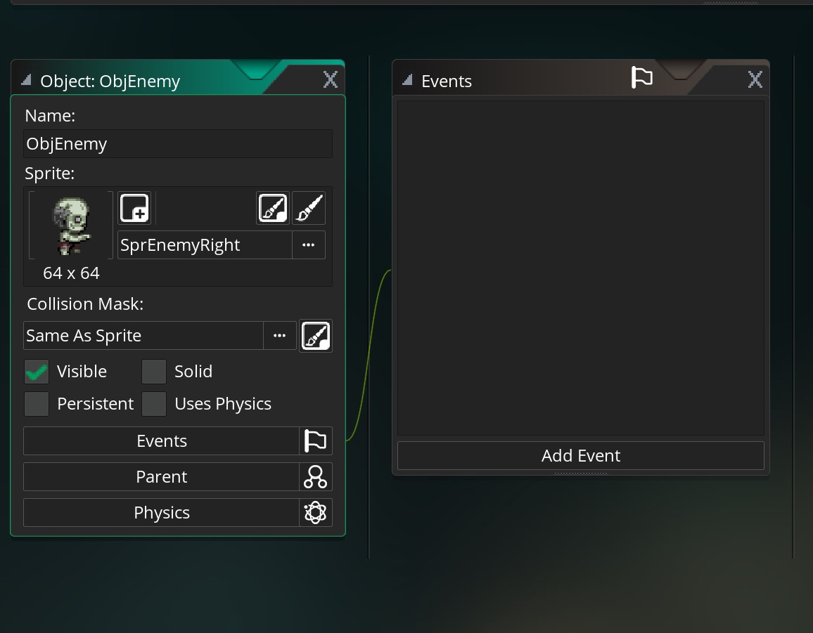

___ 
## Enemy Pathfinding

<div class = "row">
<div class="col-12 col-lg-4 align-self-center">
<div markdown = "1">

{:start="{{ num }}"}
{{ num }}. Take the second enemy sprite you have animated (or you can link to the zombie sprite provided). You should have an enemy facing four directions.  For this demo I have used `SprEnemyDown`, `SprEnemyUp`, `SprEnemyLeft` and `SprEnemyRight` as their names.
</div>
</div>
<div class="col-12 col-lg-8">

</div>
</div>

___ 
<div class = "row">
<div class="col-12 col-lg-4 align-self-center">
<div markdown = "1">

{:start="{{ num }}"}
{{ num }}. If you have not done so already, create a new **Game Object** called `ObjEnemy` and bind any of the above animations to it:
</div>
</div>
<div class="col-12 col-lg-8">

</div>
</div>
  

___ 
<div class = "row">
<div class="col-12 col-lg-4 align-self-center">
<div markdown = "1">

{:start="{{ num }}"}
{{ num }}. Now the Zombie will have its own finite state machine.  The first state we will create is a patrol state.  So create a new **Create Event** on `ObjEnemy` and add:
</div>
</div>
<div class="col-12 col-lg-8">
<div markdown = "1">
```c
/// @description set up enemy variables
#macro PATROL 0
state = PATROL;
```
</div>
</div>
</div>

___ 
<div class = "row">
<div class="col-12 col-lg-4 align-self-center">
<div markdown = "1">

{:start="{{ num }}"}
{{ num }}. Now we are going to create a path for the zombie to roam.  Lets do it in room 1.  Now I am cautioning  you that this mode is VERY slow and often crashes.  Save your work now before starting.  We will be using paths for the Zombie to walk around the room with.  This requires no logic and we just lay out a track to where the Zombie will roam.  Create a new **Path** and call it `PathEnemy`:
</div>
</div>
<div class="col-12 col-lg-8">

</div>
</div>

___ 
<div class = "row">
<div class="col-12 col-lg-4 align-self-center">
<div markdown = "1">

{:start="{{ num }}"}
{{ num }}. Now we open `RmLvl1` and add a **Path Layer** and place it under the `Instances` **Path Layer**.  Press the **Smooth Curve** radio button in the path:
</div>
</div>
<div class="col-12 col-lg-8">

</div>
</div>

___ 
<div class = "row">
<div class="col-12 col-lg-4 align-self-center">
<div markdown = "1">

{:start="{{ num }}"}
{{ num }}. Press points to give it a path and make sure it doesn't go through anything solid such as walls.  There is no collision detection in this mode we will just follow the path. Create a looping path so get your last point close to your first then press the closed radio button. So your path could end up looking like:
</div>
</div>
<div class="col-12 col-lg-8">

</div>
</div>

___ 
<div class = "row">
<div class="col-12">
<div markdown = "1">

{:start="{{ num }}"}
{{ num }}. Now we need to trigger the **_ObjZombie_** to follow this path.  We will be using a new function that GameMaker provides:

> **path_start(path, speed, endaction, absolute)**<br><br>**Returns**: N/A (void)<br><br>**Description**: A path is created from a series of defining points that are linked together and then used to plan the movements of an instance. They can be created with code, or in the Path Editor and they are assigned to an instance to use in the game. You would then use this function to tell your instance which path to follow, what speed to follow the path (measured in pixels per step), how to behave when it reaches the end of the path, and whether to follow the absolute or relative path position. This last part means that it either starts and follows the path exactly as you designed and placed it in the Path Editor (absolute), or it starts and follows the path from the position at which the instance was created (relative). -GameMaker Manual
</div>
</div>
</div>

___ 
<div class = "row">
<div class="col-12 col-lg-4 align-self-center">
<div markdown = "1">

{:start="{{ num }}"}
{{ num }}. Place `ObjEnemy` into `RmLvl1` and put him close to the start of your path.  To start the enemy down the path add to its **Create Event** at the bottom: 
</div>
</div>
<div class="col-12 col-lg-8">
<div markdown = "1">
```c
//start zombie on path
path_start(PathEnemy, 1.5, 3, true);
```
</div>
</div>
</div>

<div class = "row">
<div class="col-12 col-lg-4 align-self-center">
<div markdown = "1">

{:start="{{ num }}"}
{{ num }}. Run the game and you will see the zombie, running around the room at a speed of 1.5 pixels per frame.  Make any adjustments to the path of the zombie in the **_path editor_**.  Once you are happy we now need to have the zombie pick the correct animation based on the direction of his motion vector.  Paths use **direction** and **speed** to move the enemy, so we will use the direction to pick the appropriate angle.  Now open `ObjEnemy` and add a new **Step Event** script and add a call to a script that we will call when the enemy is in its PATROL state:
</div>
</div>
<div class="col-12 col-lg-8">
<div markdown = "1">
```c
/// @description enemy logic

//Patrol State
if (state == PATROL)
{
	ScrEnemyMovementStep();
}
```
</div>
</div>
</div>

<div class = "row">
<div class="col-12 col-lg-4 align-self-center">
<div markdown = "1">

{:start="{{ num }}"}
{{ num }}. Create a new **Script** and call it `ScrEnemyMovementStep`.  We will add logic for the player to pick the correct facing angle of animation:
</div>
</div>
<div class="col-12 col-lg-8">
<div markdown = "1">
```c
if (direction > 315 || direction <= 45)
{
    sprite_index = SprEnemyRight;
}

else if (direction > 45 && direction <= 135)
{
    sprite_index = SprEnemyUp;
}

else if (direction > 135 && direction <= 210)
{
    sprite_index = SprEnemyLeft;
}

else if (direction > 210 && direction <= 315)
{
    sprite_index = SprEnemyDown;
}
```
</div>
</div>
</div>

<div class = "row">
<div class="col-12">
<div markdown = "1">

{:start="{{ num }}"}
{{ num }}.  Now test the game and follow the Zombie around.  It should now be facing the correct angle based on its movement.  On the next page we will be implementing the CHASE state.
</div>
</div>
</div>

___ 
<br><br>
[<- Previous](AdventureGame_13.html)&nbsp;&nbsp;&nbsp;[Home](../../index.html)&nbsp;&nbsp;&nbsp;[Continue ->](AdventureGame_15.html)
<br />  
<br />  
<br />  
<br /> 
<br />  
<br />   
