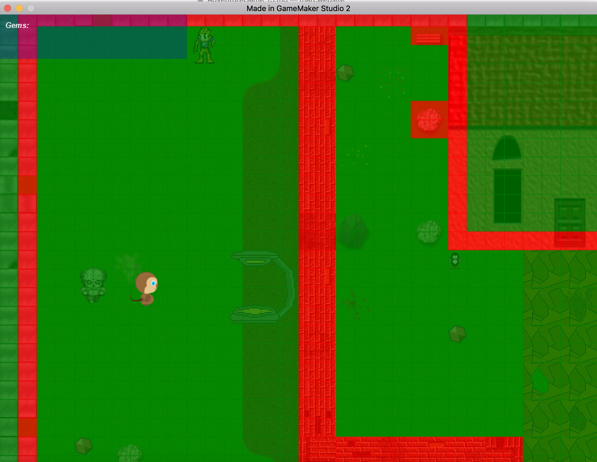

___ 
## Enemy Chasing Part II

<div class = "row">
<div class="col-12 col-lg-4 align-self-center">
<div markdown = "1">

{:start="{{ num }}"}
{{ num }}. We want the zombie to chase the player when he gets a certain distance away and can see the player (and can't see through walls).  Open `ObjEnemy` and add another marcro state called `CHASE` right after the previous macro and assign it a value of 1:
</div>
</div>
<div class="col-12 col-lg-8">
<div markdown = "1">
```c
#macro CHASE 1
}
```
</div>
</div>
</div>

___ 
<div class = "row">
<div class="col-12 col-lg-4 align-self-center">
<div markdown = "1">

{:start="{{ num }}"}
{{ num }}. We also want to know the range that triggers the zombie to chase the player.  Lets start with a small number, so you almost have to touch the enemy to get it to switch to CHASE.  Add to the end of **Create Event** on `ObjEnemy`:
</div>
</div>
<div class="col-12 col-lg-8">
<div markdown = "1">
```c
//number of pixels from player to activate CHASE mode
enemyRange = 30;
```
</div>
</div>
</div>
 
___ 
<div class = "row">
<div class="col-12 col-lg-4 align-self-center">
<div markdown = "1">

{:start="{{ num }}"}
{{ num }}. So we will add to the **Step Event** script and check to see if there is a collision with `ObjCollision` between the enemy and the player, and that the distance between the enemy and the player is less than the `enemyRange` variable and that the zombie is in the PATROL state then switch to CHASE state.  Create a new `ScrEnemyPatrolStep` script and add:
</div>
</div>
<div class="col-12 col-lg-8">
<div markdown = "1">
```c
if (distance_to_point(ObjPlayer.x, ObjPlayer.y) < enemyRange)
{
	state = CHASE;
	path_end();
}
```
</div>
</div>
</div>

___ 
<div class = "row">
<div class="col-12 col-lg-4 align-self-center">
<div markdown = "1">

{:start="{{ num }}"}
{{ num }}. Now add a call to this new script by opening the **Step Event** in `ObjEnemy` and add this call:
</div>
</div>
<div class="col-12 col-lg-8">
<div markdown = "1">
```c
//Patrol State
if (state == PATROL)
{
	ScrEnemyMovementStep();
	ScrEnemyPatrolStep();
}
```
</div>
</div>
</div>

___
<div class = "row">
<div class="col-12">
<div markdown = "1">

{:start="{{ num }}"}
{{ num }}. Now we can test if this works running the game and going close to the enemy.  The enemy should stop patrolling once you get very close to it.
</div>
</div>
</div>

___ 
<div class = "row">
<div class="col-12">
<div markdown = "1">

{:start="{{ num }}"}
{{ num }}. We will now use GameMaker's pathfinding to create a path to chase the player.  Take a look at these two new GameMaker functions:

> **mp_grid_create(xstart, ystart, hcells, vcells, cellwidth, cellheight)**<br><br>**Returns**: Real. <br>**Description**: With this function you can create an mp_grid for the motion planning functions. It returns an index that must be used in all other mp_grid function calls. The x and y coordinates indicate the position of the top-left corner of the grid, hcells and vcells indicate the number of horizontal and vertical cells to be created within the grid, and cell width and cell height indicate the size of the cells in pixels. You can create and maintain multiple grid structures at the same moment if you need them for different things, but be aware that these are complex functions and the more you use and the higher the cell resolution then the slower your game could be. - GameMaker Manual
</div>
</div>
</div>

___ 
<div class = "row">
<div class="col-12">
<div markdown = "1">

{:start="{{ num }}"}
{{ num }}. Lets then populate the above grid with areas that have a collision volume on our tilemap.  :  

> **mp_grid_add_cell(id, h, v);**<br><br>As you can see the mp_grid is numbered as a series of cells (starting at 0,0 in the upper left corner), and when you place this grid over the room there is a direct correlation between the room coordinates (which also start at 0,0 in the top left) and the cells within the grid. In the image you can see that an instance at the position 260,130 falls on the grid cell 8,4. You can calculate mathematically the exact cell that a position lands on easily by either dividing the number by the grid resolution and then rounding down or (if you are using power of 2 grid resolutions like 8, 16, 32 etc...) you can use the bitwise operators. It should be noted that the bitwise operation is faster. The example below shows both methods.
- GameMaker Manual 
</div>
</div>
</div>

___ 
<div class = "row">
<div class="col-12 col-lg-4 align-self-center">
<div markdown = "1">

{:start="{{ num }}"}
{{ num }}. So you can open **Create Event** in `ObjEnemy` and add at the end:  
</div>
</div>
<div class="col-12 col-lg-8">
<div markdown = "1">
```c
//get id of collision layer in room
layerId = layer_get_id("Collision");
//Get tilemap for collision layer
tilemap = layer_tilemap_get_id(layerId);

//Create a grid for pathfinding of enemy that is 32 by 32
enemyGrid = mp_grid_create(0, 0, room_width/32, room_height/32, 32, 32);

//Go through every 32 pixels on an the level and see if there is a collision there
//if there is place a cell
for (x = 0; x < room_width; x+=32)
{
	for (y = 0; y < room_height; y+=32)
	{
		if (tilemap_get_at_pixel(tilemap,x, y) & tile_index_mask)
		{
			mp_grid_add_cell(enemyGrid, x/32, y/32);
		}
	}
}
```
</div>
</div>
</div>

___ 
<div class = "row">
<div class="col-12 col-lg-4 align-self-center">
<div markdown = "1">

{:start="{{ num }}"}
{{ num }}. How do we test to know if we have done it correctly? We can't just start using it as we don't know if this has no bugs.  What we want to do is overlay this grid to see if the red parts match where our collision volumes lie. We can create a temporary script and use the function mp_grid_draw (grid) which you can look up in help but should be pretty self explanatory.  Add a new **Draw Event** to `ObjEnemy` and add the following:  
</div>
</div>
<div class="col-12 col-lg-8">
<div markdown = "1">
```c
/// @description Insert description here
// You can write your code in this editor
//draw zombie
draw_self();

//sets a translucent overlay
draw_set_alpha(.75);

//draws grid for debugging
mp_grid_draw(enemyGrid);

draw_set_alpha(1);
```
</div>
</div>
</div>

___ 
<div class = "row">
<div class="col-12 col-lg-4 align-self-center">
<div markdown = "1">

{:start="{{ num }}"}
{{ num }}.  Now run the game and you should see a green transparent overlay over empty areas and red ones over areas that have collisions.  On my level it looks like:
</div>
</div>
<div class="col-12 col-lg-8">

</div>
</div>

___ 
<div class = "row">
<div class="col-12">
<div markdown = "1">

{:start="{{ num }}"}
{{ num }}. Run around the room and make sure that all the walls have the red block.  This will stop the game from running the zombie through a wall when chasing the player. Delete the **_draw event_** once you have it working.  Now we need to create and trigger a path for the player.
</div>
</div>
</div>

___ 
<div class = "row">
<div class="col-12">
<div markdown = "1">

{:start="{{ num }}"}
{{ num }}. On the next page we will look at some new GameMaker functions.
</div>
</div>
</div>

___ 
<br><br>
[<- Previous](AdventureGame_14.html)&nbsp;&nbsp;&nbsp;[Home](../../index.html)&nbsp;&nbsp;&nbsp;[Continue ->](AdventureGame_16.html)
<br />  
<br />  
<br />  
<br /> 
<br />  
<br />   